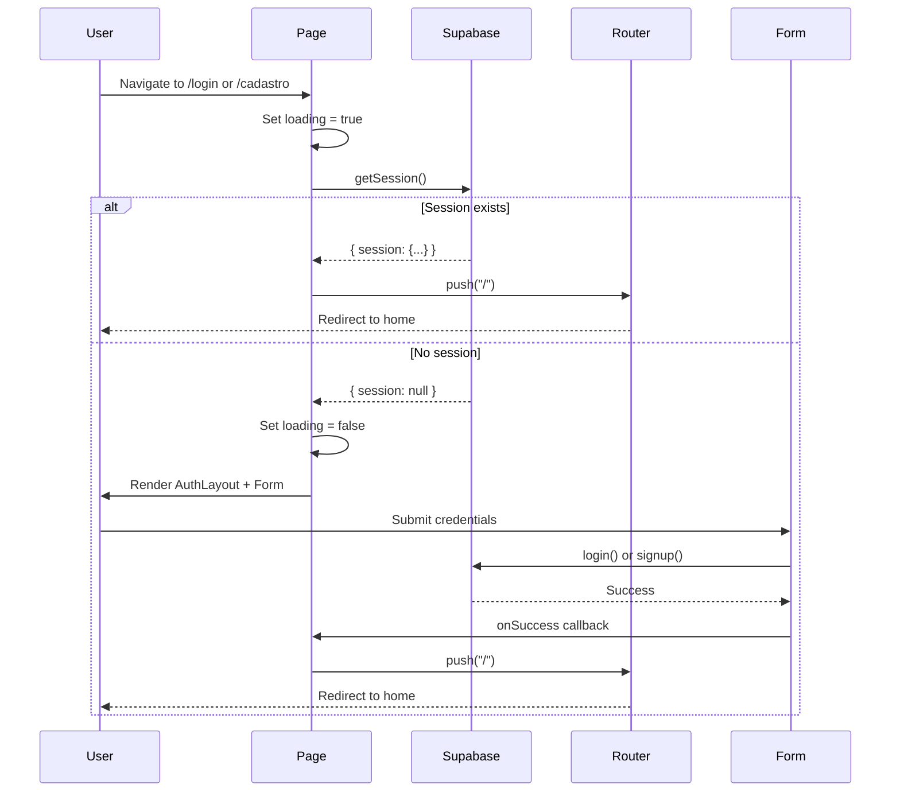
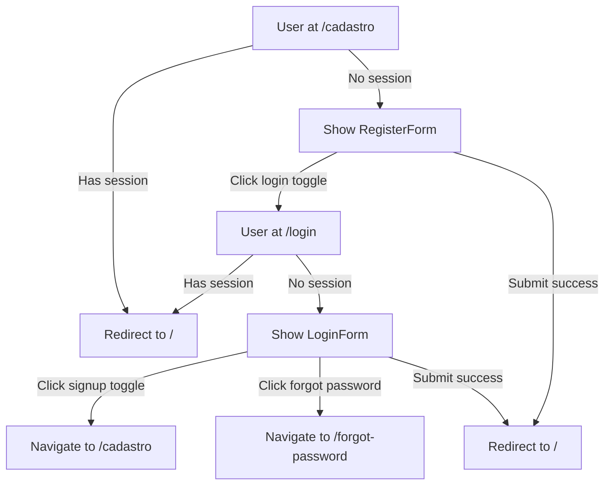

# Software Design Document: Auth Pages UI

## Overview

This document specifies the technical design for implementing production-ready authentication page components (`/login` and `/cadastro`) in the Agon e-commerce platform. The implementation focuses on creating minimal, client-side page components that compose existing authentication components (AuthLayout, LoginForm, RegisterForm) while ensuring proper session verification, loading states, and navigation flows.

### Purpose

The auth pages serve as the entry points for user authentication, providing a seamless experience for both new and returning users. The design prioritizes:
- **Session-aware rendering**: Preventing authenticated users from accessing auth forms
- **Zero-flicker UX**: Loading states during session verification
- **Explicit navigation**: Client-side routing for all transitions
- **Production readiness**: Handling edge cases and network conditions gracefully

### Scope

**In Scope:**
- Login page component at `/apps/web/src/app/(auth)/login/page.tsx`
- Signup page component at `/apps/web/src/app/(auth)/cadastro/page.tsx`
- Client-side session verification logic
- Loading state UI during session checks
- Navigation callbacks for form components
- Post-authentication redirect logic
- Forgot password flow handling

**Out of Scope:**
- Modifications to existing AuthLayout, LoginForm, or RegisterForm components
- Changes to Supabase authentication logic or AuthContext
- Server-side rendering or middleware-based auth checks
- Implementation of forgot password page (future enhancement)
- Custom authentication flows beyond existing Supabase integration

### Key Design Decisions

1. **Client-Side Only**: All pages use "use client" directive to avoid hydration mismatches and leverage client-side Supabase session API
2. **Session-First Rendering**: Check session before rendering forms to prevent authenticated users from seeing auth UI
3. **Explicit Redirects**: Use router.push() for all navigation instead of relying on implicit Supabase behavior
4. **Minimal Code**: Keep page components under 50 lines by delegating all logic to existing components and hooks
5. **Loading States**: Display simple loading indicator during session verification to prevent flicker

## Architecture

### Component Hierarchy

```
Page Component (login/cadastro)
├── Session Verification Logic (useEffect)
├── Loading State (conditional render)
└── AuthLayout
    └── Form Component (LoginForm/RegisterForm)
        ├── Form Fields (from existing components)
        ├── Submit Handler (from existing components)
        └── Navigation Callbacks (passed from page)
```

### Data Flow



### Session Verification Flow

The session verification follows this pattern for both login and signup pages:

1. **Mount**: Component mounts, loading state set to `true`
2. **Check**: Call `supabase.auth.getSession()` to verify current session
3. **Decision**:
   - If session exists → redirect to "/" immediately
   - If no session → set loading to `false`, render form
4. **Render**: Display loading indicator or form based on loading state

### Navigation Flow



## Components and Interfaces

### Login Page Component

**File**: `apps/web/src/app/(auth)/login/page.tsx`

**Responsibilities:**
- Check Supabase session on mount
- Redirect authenticated users to "/"
- Display loading state during session check
- Render AuthLayout with LoginForm
- Provide navigation callbacks to LoginForm
- Handle post-authentication redirect

**Interface:**
```typescript
// No props - Next.js page component
export default function LoginPage(): JSX.Element

// Internal state
interface LoginPageState {
  loading: boolean  // Session verification in progress
}

// Callbacks passed to LoginForm
interface LoginFormCallbacks {
  onToggleToRegister: () => void  // Navigate to /cadastro
  onToggleToForgot: () => void    // Navigate to /forgot-password (or no-op)
  onSuccess: () => void           // Redirect to / after login
}
```

**Dependencies:**
- `next/navigation` (useRouter)
- `@/lib/supabase/client` (createClient)
- `@/components/auth/AuthLayout`
- `@/components/auth/LoginForm`
- `react` (useState, useEffect)

### Signup Page Component

**File**: `apps/web/src/app/(auth)/cadastro/page.tsx`

**Responsibilities:**
- Check Supabase session on mount
- Redirect authenticated users to "/"
- Display loading state during session check
- Render AuthLayout with RegisterForm
- Provide navigation callbacks to RegisterForm
- Handle post-authentication redirect

**Interface:**
```typescript
// No props - Next.js page component
export default function SignupPage(): JSX.Element

// Internal state
interface SignupPageState {
  loading: boolean  // Session verification in progress
}

// Callbacks passed to RegisterForm
interface RegisterFormCallbacks {
  onToggleToLogin: () => void  // Navigate to /login
  onSuccess: () => void        // Redirect to / after signup
}
```

**Dependencies:**
- `next/navigation` (useRouter)
- `@/lib/supabase/client` (createClient)
- `@/components/auth/AuthLayout`
- `@/components/auth/RegisterForm`
- `react` (useState, useEffect)

### Loading State Component

**Inline Implementation** (not a separate component)

The loading state is a simple centered div with a spinner or text:

```typescript
if (loading) {
  return (
    <div className="flex min-h-screen items-center justify-center">
      <p className="text-muted-foreground">Carregando...</p>
    </div>
  )
}
```

**Design Rationale:**
- Minimal implementation to stay under 50-line limit
- Consistent with platform design system
- Prevents flicker during session check
- Accessible with semantic HTML

## Data Models

### Session Verification Response

```typescript
// From Supabase getSession()
interface SessionResponse {
  data: {
    session: Session | null
  }
  error: AuthError | null
}

interface Session {
  access_token: string
  refresh_token: string
  user: User
  expires_at?: number
}
```

### Router Navigation

```typescript
// From next/navigation
interface NextRouter {
  push: (href: string) => void
  refresh: () => void
  // ... other methods not used
}
```

### Form Callback Signatures

```typescript
// Callbacks passed to forms
type NavigationCallback = () => void

// LoginForm expects
interface LoginFormProps {
  onToggleToRegister: NavigationCallback
  onToggleToForgot: NavigationCallback
}

// RegisterForm expects
interface RegisterFormProps {
  onToggleToLogin: NavigationCallback
}
```

## Error Handling

### Session Check Errors

**Scenario**: Supabase session check fails due to network error or service unavailability

**Handling Strategy**:
- Catch error in try-catch block
- Log error to console for debugging
- Assume no session (fail open) and render form
- User can still attempt authentication

**Implementation**:
```typescript
useEffect(() => {
  let isMounted = true
  const supabase = createClient()

  const checkSession = async () => {
    try {
      const { data: { session } } = await supabase.auth.getSession()
      
      if (!isMounted) return
      
      if (session) {
        router.replace("/")
        return
      }
    } catch (error) {
      console.error("[Auth][SessionCheck]", error)
    }
    
    if (isMounted) {
      setLoading(false)
    }
  }

  checkSession()

  const timeout = setTimeout(() => {
    if (isMounted) {
      setLoading(false)
    }
  }, 3000)

  return () => {
    isMounted = false
    clearTimeout(timeout)
  }
}, [router])
```

**Rationale**: Failing open ensures users can still access authentication even if session check fails. The `isMounted` flag prevents memory leaks, timeout prevents infinite loading, and `router.replace()` improves navigation UX.

### Navigation Errors

**Scenario**: router.push() fails or route doesn't exist

**Handling Strategy**:
- No explicit error handling needed
- Next.js router handles invalid routes with 404
- For forgot password, use no-op if route doesn't exist

**Implementation**:
```typescript
const handleForgotPassword = () => {
  router.push("/forgot-password")
  // Note: Route implementation is future enhancement
  // If route doesn't exist, Next.js will show 404
}
```

### Form Submission Errors

**Scenario**: Login or signup fails

**Handling Strategy**:
- Delegated to existing LoginForm and RegisterForm components
- Forms handle Supabase errors and display toast notifications
- Page component doesn't need to handle these errors

**Rationale**: Separation of concerns - forms own their submission logic and error states.

### Edge Cases

1. **Slow Network During Session Check**
   - Loading state remains visible until check completes
   - Safety timeout (3s) ensures UI never gets stuck
   - If timeout triggers, fail open and render form

2. **Session Expires During Form Interaction**
   - User fills form while session expires
   - Submission will succeed (creates new session)
   - No special handling needed

3. **Rapid Navigation Between Pages**
   - Each page independently checks session
   - `isMounted` flag prevents state updates on unmounted components
   - No race conditions due to independent checks and cleanup

4. **Browser Back Button After Auth**
   - User authenticates, then clicks back
   - `router.replace()` prevents returning to auth pages
   - History stack doesn't include auth pages after successful login

5. **Component Unmounts During Session Check**
   - `isMounted` flag prevents state updates after unmount
   - Cleanup function properly cancels timeout
   - No memory leaks or React warnings

## Testing Strategy

This feature involves UI rendering, client-side navigation, and React component composition - areas not suitable for property-based testing. The testing strategy focuses on example-based unit tests, integration tests, and end-to-end tests.

### Unit Tests

**Focus**: Individual page component behavior with mocked dependencies

**Test Cases**:

1. **Session Verification**
   - Mock Supabase getSession() to return active session
   - Verify router.push("/") is called
   - Verify form is not rendered

2. **No Session Rendering**
   - Mock Supabase getSession() to return null session
   - Verify loading state transitions to false
   - Verify AuthLayout and form are rendered

3. **Loading State Display**
   - Verify loading indicator is shown initially
   - Verify loading indicator is hidden after session check

4. **Navigation Callbacks**
   - Verify onToggleToRegister calls router.push("/cadastro")
   - Verify onToggleToLogin calls router.push("/login")
   - Verify onToggleToForgot logs message (until route exists)

5. **Post-Auth Redirect**
   - Mock successful form submission
   - Verify router.push("/") is called after success

6. **Error Handling**
   - Mock Supabase getSession() to throw error
   - Verify form is still rendered (fail open)
   - Verify error is logged to console

**Tools**: Jest, React Testing Library, Supabase mocks

### Integration Tests

**Focus**: Page components with real AuthContext and form components

**Test Cases**:

1. **Full Login Flow**
   - Render login page with no session
   - Fill and submit login form
   - Verify redirect to home page

2. **Full Signup Flow**
   - Render signup page with no session
   - Fill and submit registration form
   - Verify redirect to home page

3. **Navigation Between Pages**
   - Render login page
   - Click signup toggle
   - Verify navigation to signup page
   - Click login toggle
   - Verify navigation back to login page

4. **Authenticated User Redirect**
   - Set up authenticated session in AuthContext
   - Attempt to render login page
   - Verify immediate redirect to home

**Tools**: Jest, React Testing Library, Supabase test client

### End-to-End Tests

**Focus**: Real browser interactions with actual Supabase instance

**Test Cases**:

1. **Complete Authentication Journey**
   - Navigate to /login
   - Verify loading state appears briefly
   - Verify login form renders
   - Submit valid credentials
   - Verify redirect to home page
   - Navigate back to /login
   - Verify immediate redirect to home (session active)

2. **Registration and Login**
   - Navigate to /cadastro
   - Fill registration form
   - Submit and verify redirect
   - Logout
   - Navigate to /login
   - Login with new credentials
   - Verify successful authentication

3. **Navigation Flow**
   - Navigate to /login
   - Click "Cadastre-se Aqui"
   - Verify URL changes to /cadastro
   - Click "Entrar Agora"
   - Verify URL changes to /login

4. **Slow Network Simulation**
   - Throttle network to 3G
   - Navigate to /login
   - Verify loading state persists
   - Verify form eventually renders

**Tools**: Playwright or Cypress, Supabase test project

### Test Coverage Goals

- **Unit Tests**: 90%+ coverage of page component logic
- **Integration Tests**: All navigation flows and callbacks
- **E2E Tests**: Critical user journeys (login, signup, navigation)

### Testing Constraints

- Tests must not modify existing AuthLayout, LoginForm, or RegisterForm components
- Tests must use Supabase test client or mocks, not production instance
- E2E tests must clean up test users after execution
- Tests must handle async session checks with appropriate timeouts

## Implementation Notes

### Code Organization

Both page components follow identical patterns with production-ready safeguards:

```typescript
"use client"

import { useState, useEffect } from "react"
import { useRouter } from "next/navigation"
import { createClient } from "@/lib/supabase/client"
import { AuthLayout } from "@/components/auth/AuthLayout"
import { LoginForm } from "@/components/auth/LoginForm"

export default function LoginPage() {
  const [loading, setLoading] = useState(true)
  const router = useRouter()

  // Session verification on mount with production safeguards
  useEffect(() => {
    let isMounted = true // Prevent state updates after unmount
    const supabase = createClient() // Create client inside effect

    const checkSession = async () => {
      try {
        const { data: { session } } = await supabase.auth.getSession()
        
        if (!isMounted) return // Guard against unmounted component
        
        if (session) {
          router.replace("/") // Use replace to prevent back navigation
          return
        }
      } catch (error) {
        console.error("[Auth][SessionCheck]", error) // Structured logging
      }
      
      if (isMounted) {
        setLoading(false)
      }
    }

    checkSession()

    // Safety timeout to prevent infinite loading
    const timeout = setTimeout(() => {
      if (isMounted) {
        setLoading(false)
      }
    }, 3000)

    return () => {
      isMounted = false
      clearTimeout(timeout)
    }
  }, [router]) // Only router in dependencies

  // Loading state
  if (loading) {
    return (
      <div className="flex min-h-screen items-center justify-center">
        <p className="text-muted-foreground">Carregando...</p>
      </div>
    )
  }

  // Render form
  return (
    <AuthLayout title="Entrar" subtitle="Acesse sua conta para continuar sua jornada">
      <LoginForm
        onToggleToRegister={() => router.push("/cadastro")}
        onToggleToForgot={() => router.push("/forgot-password")}
      />
    </AuthLayout>
  )
}
```

**Key Production Safeguards:**

1. **Memory Leak Prevention**: `isMounted` flag prevents state updates after component unmounts
2. **Stable Dependencies**: Supabase client created inside effect to avoid unnecessary re-runs
3. **Better Navigation UX**: `router.replace()` prevents back button returning to auth pages
4. **Infinite Loading Protection**: 3-second timeout ensures UI never gets stuck
5. **Structured Logging**: `[Auth][SessionCheck]` prefix for easier production debugging
6. **Cleanup**: Proper cleanup function clears timeout and sets unmount flag

### Performance Considerations

1. **Session Check Speed**
   - Supabase getSession() reads from local storage (fast)
   - Expected completion: <100ms on normal connections
   - Loading state prevents visual flicker
   - 3-second timeout ensures UI never hangs

2. **Component Mounting**
   - AuthLayout and forms are only mounted after session check
   - Prevents unnecessary rendering of heavy components
   - Reduces initial bundle evaluation time
   - Proper cleanup prevents memory leaks

3. **Navigation Performance**
   - router.push() uses client-side navigation (no full reload)
   - router.replace() for auth redirects prevents back button issues
   - AuthLayout state preserved during transitions
   - Smooth UX between login and signup pages

4. **Effect Dependencies**
   - Supabase client created inside effect (not in dependencies)
   - Prevents unnecessary effect re-runs
   - Only router in dependency array (stable reference)

### Accessibility

1. **Loading State**
   - Use semantic HTML (`<p>` tag with descriptive text)
   - Consider adding `role="status"` and `aria-live="polite"` for screen readers

2. **Form Components**
   - Accessibility handled by existing LoginForm and RegisterForm
   - Page components don't introduce accessibility barriers

3. **Navigation**
   - All navigation uses standard Next.js router (accessible)
   - No custom navigation logic that could break assistive technologies

### Security Considerations

1. **Session Verification**
   - Uses official Supabase client methods only
   - No custom JWT parsing or validation
   - Complies with "Segurança Isolada do Roteiro" domain rule

2. **Client-Side Only**
   - No sensitive data exposed in page components
   - Authentication logic delegated to Supabase and AuthContext
   - No custom authentication implementation

3. **Redirect Behavior**
   - Prevents authenticated users from accessing auth forms
   - Reduces attack surface for session fixation
   - Explicit redirects prevent URL manipulation

### Future Enhancements

1. **Forgot Password Page**
   - Implement `/forgot-password` route
   - Update onToggleToForgot to navigate to new route
   - Add ForgotPasswordForm component integration

2. **Email Verification Flow**
   - Handle email confirmation redirects
   - Display verification status messages
   - Integrate with Supabase email templates

3. **Social Authentication**
   - Add OAuth provider buttons to forms
   - Handle OAuth callback routes
   - Maintain session verification logic

4. **Loading State Enhancement**
   - Replace text with animated spinner component
   - Match platform design system
   - Add subtle animations for better UX

5. **Analytics Integration**
   - Track page views and navigation flows
   - Monitor session check performance
   - Measure authentication success rates

## Dependencies

### External Libraries

- **next**: ^14.x (App Router, useRouter hook)
- **react**: ^18.x (useState, useEffect hooks)
- **@supabase/supabase-js**: ^2.x (session management)
- **@supabase/ssr**: ^0.x (createBrowserClient)

### Internal Dependencies

- **@/lib/supabase/client**: Supabase client factory
- **@/components/auth/AuthLayout**: Layout component for auth pages
- **@/components/auth/LoginForm**: Login form with Supabase integration
- **@/components/auth/RegisterForm**: Registration form with Supabase integration
- **@/context/AuthContext**: Global auth state (indirect via forms)

### Dependency Constraints

- Must not modify any existing components
- Must use existing Supabase client configuration
- Must work with current AuthContext implementation
- Must be compatible with Next.js 14 App Router

## Deployment Considerations

### Environment Variables

Required environment variables (already configured):
- `NEXT_PUBLIC_SUPABASE_URL`: Supabase project URL
- `NEXT_PUBLIC_SUPABASE_ANON_KEY`: Supabase anonymous key

### Build Configuration

- Pages are client components ("use client")
- No server-side rendering required
- No special build configuration needed
- Compatible with static export if needed

### Monitoring

Recommended monitoring points:
- Session check duration (performance)
- Session check failure rate (reliability)
- Authentication success rate (user experience)
- Navigation flow completion (funnel analysis)

### Rollback Strategy

If issues arise post-deployment:
1. Pages are minimal and self-contained
2. Can revert to previous version without affecting other features
3. Existing AuthContext and forms remain unchanged
4. No database migrations or API changes required

## Conclusion

This design provides a production-ready implementation of authentication pages that:
- Prevents authenticated users from accessing auth forms through session verification
- Provides smooth UX with loading states and explicit navigation
- Maintains minimal code footprint (<50 lines per page)
- Delegates all complex logic to existing, tested components
- Handles edge cases and errors gracefully
- Complies with domain rules and architectural constraints

The implementation is ready for development and can be extended with future enhancements (forgot password, email verification, social auth) without major refactoring.
