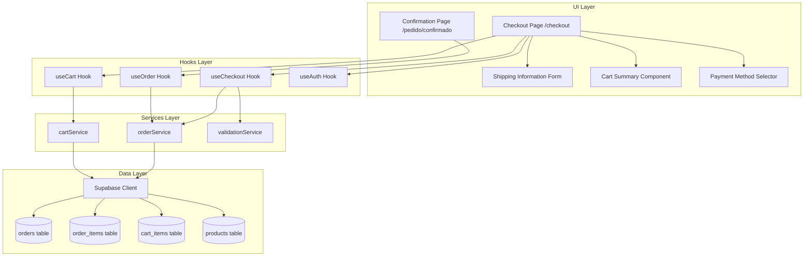
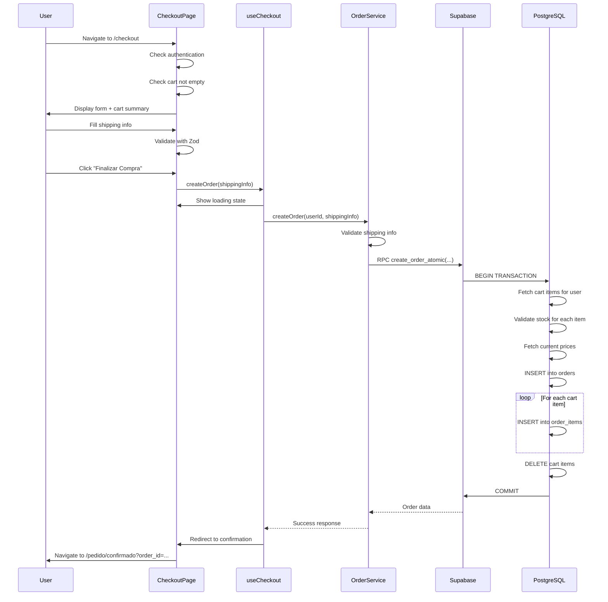
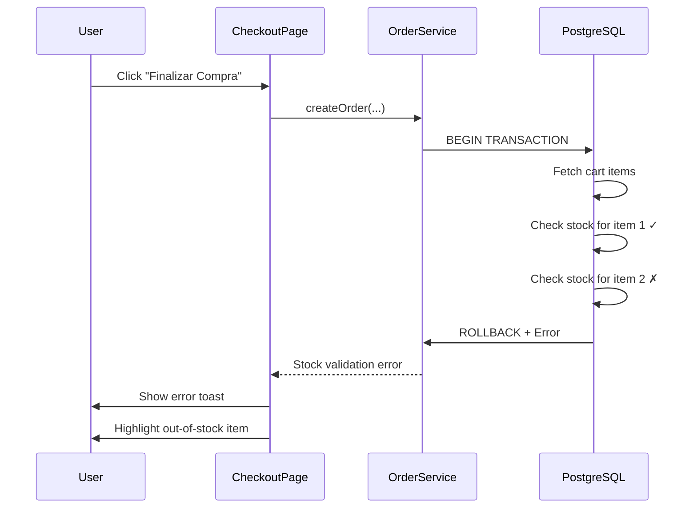
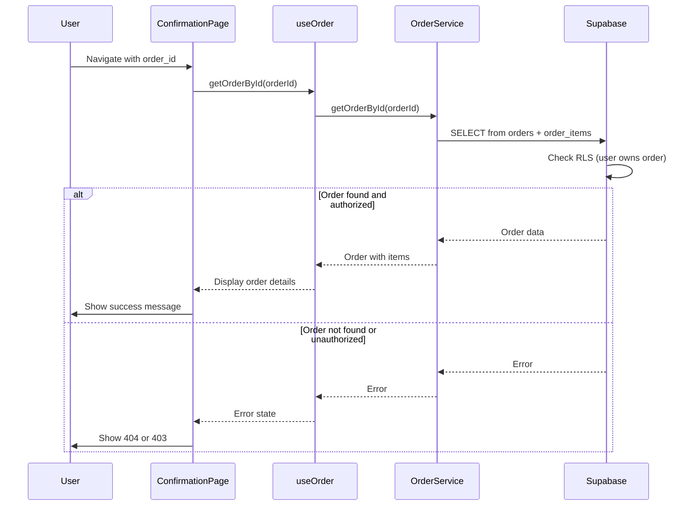

# Design Document: Basic Checkout

## Overview

The Basic Checkout feature enables authenticated users to complete purchases by creating orders in the database with shipping information and payment method selection (Cash on Delivery only for MVP). The system validates stock availability, captures current product prices as snapshots, and atomically creates orders while clearing the cart.

This design follows a three-layer architecture consistent with the Product Catalog and Cart/Wishlist features:
- **Data Layer**: Supabase tables (orders, order_items) with RLS policies and database constraints
- **Services Layer**: TypeScript services for order creation, validation, and atomic transactions
- **UI Layer**: React components with form validation, optimistic feedback, and error handling

Key design principles:
- **Atomic Transactions**: Order creation is all-or-nothing using Supabase RPC functions
- **Price Snapshots**: Capture product prices at order time for historical accuracy
- **Stock Validation**: Verify availability within transaction to prevent race conditions
- **Security First**: RLS policies ensure users only access their own orders
- **Idempotent Operations**: Safe retry on failure without duplicate orders
- **Graceful Degradation**: Clear error messages and fallback strategies
- **Validation Layers**: Client (Zod) → Service → Database constraints
- **Audit Trail**: Immutable order records with timestamps

### Purpose

This feature enables:
- Authenticated users to complete purchases with shipping information
- Order creation with product price snapshots for historical accuracy
- Stock validation before order confirmation
- Atomic cart clearing after successful order
- Order confirmation page with complete order details
- Foundation for future order management and tracking features

### Scope

**In Scope:**
- Database schema for orders and order_items with RLS policies
- Checkout page at `/checkout` with shipping form and cart summary
- Order confirmation page at `/pedido/confirmado?order_id={id}`
- Order service with atomic transaction support
- Stock validation before order creation
- Price snapshot capture at order time
- Cart clearing after successful order
- Shipping information validation (Brazilian format)
- Payment method selection (Cash on Delivery only for MVP)
- Authentication and authorization checks
- Error handling and user feedback
- Integration with existing cart and product systems

**Out of Scope:**
- Online payment processing (Stripe, PayPal, etc.)
- Shipping cost calculation (free shipping for MVP)
- Discount codes and promotions
- Order editing after creation
- Order cancellation by users
- Order tracking and status updates
- Email notifications
- Invoice generation
- Admin order management interface (separate feature)
- Multiple shipping addresses per order
- Gift wrapping or special instructions
- Inventory decrement (future enhancement)

### Key Design Decisions

1. **Supabase RPC for Atomicity**: Use PostgreSQL functions for atomic order creation
2. **Price Snapshots**: Store product prices at order time to preserve historical data
3. **Stock Validation in Transaction**: Check stock within RPC to prevent race conditions
4. **Soft Delete Compatibility**: Orders reference products that may be soft-deleted
5. **Cash on Delivery Only**: MVP supports only one payment method
6. **Free Shipping**: No shipping cost calculation for MVP
7. **Brazilian Address Format**: Validate CEP, state codes, and phone formats
8. **Zod Validation**: Client and service layer validation with Brazilian-specific rules
9. **Optimistic UI**: Show loading states but don't optimistically create orders
10. **Idempotent Migration**: Use unique constraints to prevent duplicate orders
11. **Cascade Deletes**: Order items cascade delete when order is deleted
12. **Restrict Product Deletes**: Prevent product deletion if referenced by orders
13. **Server-Side Rendering**: Checkout page uses SSR for authentication check
14. **React Query**: Data fetching and mutation management
15. **Error Recovery**: Clear error messages with actionable guidance


## Architecture

### High-Level Architecture



### Component Hierarchy

```mermaid
graph TD
    A[App Router] --> B[/checkout - Checkout Page]
    A --> C[/pedido/confirmado - Confirmation Page]
    
    B --> D[Auth Check Middleware]
    B --> E[Cart Empty Check]
    B --> F[Shipping Form]
    B --> G[Cart Summary]
    B --> H[Payment Selector]
    B --> I[Submit Button]
    
    F --> J[Address Fields]
    F --> K[Validation Errors]
    
    G --> L[Cart Items List]
    G --> M[Total Calculation]
    
    C --> N[Order Details]
    C --> O[Order Items List]
    C --> P[Action Buttons]
```

### Data Flow

**Checkout Flow (Happy Path)**:


**Stock Validation Failure Flow**:


**Order Confirmation Flow**:



## Database Schema

### Orders Table

```sql
-- Orders table for storing customer orders
CREATE TABLE orders (
  id UUID PRIMARY KEY DEFAULT gen_random_uuid(),
  user_id UUID NOT NULL REFERENCES auth.users(id) ON DELETE RESTRICT,
  
  -- Order status
  status TEXT NOT NULL DEFAULT 'pending' CHECK (status IN ('pending', 'processing', 'shipped', 'delivered', 'cancelled')),
  
  -- Financial information
  total_amount DECIMAL(10, 2) NOT NULL CHECK (total_amount >= 0),
  
  -- Shipping information
  shipping_name TEXT NOT NULL CHECK (char_length(shipping_name) > 0 AND char_length(shipping_name) <= 200),
  shipping_address TEXT NOT NULL CHECK (char_length(shipping_address) > 0 AND char_length(shipping_address) <= 500),
  shipping_city TEXT NOT NULL CHECK (char_length(shipping_city) > 0 AND char_length(shipping_city) <= 100),
  shipping_state TEXT NOT NULL CHECK (shipping_state IN ('AC', 'AL', 'AP', 'AM', 'BA', 'CE', 'DF', 'ES', 'GO', 'MA', 'MT', 'MS', 'MG', 'PA', 'PB', 'PR', 'PE', 'PI', 'RJ', 'RN', 'RS', 'RO', 'RR', 'SC', 'SP', 'SE', 'TO')),
  shipping_zip TEXT NOT NULL CHECK (shipping_zip ~ '^\d{5}-\d{3}$'),
  shipping_phone TEXT NOT NULL CHECK (shipping_phone ~ '^\(\d{2}\) \d{4,5}-\d{4}$'),
  shipping_email TEXT NOT NULL CHECK (shipping_email ~ '^[^@]+@[^@]+\.[^@]+$'),
  
  -- Payment information
  payment_method TEXT NOT NULL DEFAULT 'cash_on_delivery' CHECK (payment_method IN ('cash_on_delivery')),
  
  -- Timestamps
  created_at TIMESTAMPTZ DEFAULT NOW() NOT NULL,
  updated_at TIMESTAMPTZ DEFAULT NOW() NOT NULL
);

-- Indexes for performance
CREATE INDEX idx_orders_user_id ON orders(user_id);
CREATE INDEX idx_orders_status ON orders(status);
CREATE INDEX idx_orders_created_at ON orders(created_at DESC);

-- Trigger to update updated_at timestamp
CREATE TRIGGER update_orders_updated_at
  BEFORE UPDATE ON orders
  FOR EACH ROW
  EXECUTE FUNCTION update_updated_at_column();

-- RLS Policies
ALTER TABLE orders ENABLE ROW LEVEL SECURITY;

-- Users can only read their own orders
CREATE POLICY "orders_select_own"
  ON orders FOR SELECT
  USING (auth.uid() = user_id);

-- Users can only insert their own orders
CREATE POLICY "orders_insert_own"
  ON orders FOR INSERT
  WITH CHECK (auth.uid() = user_id);

-- Users can update their own orders (limited fields)
-- Admins can update any order
CREATE POLICY "orders_update_own_or_admin"
  ON orders FOR UPDATE
  USING (
    auth.uid() = user_id 
    OR EXISTS (
      SELECT 1 FROM profiles
      WHERE profiles.id = auth.uid()
      AND profiles.role = 'admin'
    )
  );

-- Only admins can delete orders
CREATE POLICY "orders_delete_admin"
  ON orders FOR DELETE
  USING (
    EXISTS (
      SELECT 1 FROM profiles
      WHERE profiles.id = auth.uid()
      AND profiles.role = 'admin'
    )
  );
```

### Order Items Table

```sql
-- Order items table for storing products in each order
CREATE TABLE order_items (
  id UUID PRIMARY KEY DEFAULT gen_random_uuid(),
  order_id UUID NOT NULL REFERENCES orders(id) ON DELETE CASCADE,
  product_id UUID NOT NULL REFERENCES products(id) ON DELETE RESTRICT,
  
  -- Product snapshot (immutable historical data)
  product_name TEXT NOT NULL CHECK (char_length(product_name) > 0),
  product_price DECIMAL(10, 2) NOT NULL CHECK (product_price >= 0),
  
  -- Order details
  quantity INTEGER NOT NULL CHECK (quantity > 0 AND quantity <= 99),
  size TEXT CHECK (char_length(size) <= 10),
  subtotal DECIMAL(10, 2) NOT NULL CHECK (subtotal >= 0),
  
  -- Timestamp
  created_at TIMESTAMPTZ DEFAULT NOW() NOT NULL
);

-- Indexes for performance
CREATE INDEX idx_order_items_order_id ON order_items(order_id);
CREATE INDEX idx_order_items_product_id ON order_items(product_id);

-- RLS Policies
ALTER TABLE order_items ENABLE ROW LEVEL SECURITY;

-- Users can only read order items for their own orders
CREATE POLICY "order_items_select_own"
  ON order_items FOR SELECT
  USING (
    EXISTS (
      SELECT 1 FROM orders
      WHERE orders.id = order_items.order_id
      AND orders.user_id = auth.uid()
    )
  );

-- Users can only insert order items for their own orders
CREATE POLICY "order_items_insert_own"
  ON order_items FOR INSERT
  WITH CHECK (
    EXISTS (
      SELECT 1 FROM orders
      WHERE orders.id = order_items.order_id
      AND orders.user_id = auth.uid()
    )
  );

-- Only admins can update or delete order items
CREATE POLICY "order_items_update_admin"
  ON order_items FOR UPDATE
  USING (
    EXISTS (
      SELECT 1 FROM profiles
      WHERE profiles.id = auth.uid()
      AND profiles.role = 'admin'
    )
  );

CREATE POLICY "order_items_delete_admin"
  ON order_items FOR DELETE
  USING (
    EXISTS (
      SELECT 1 FROM profiles
      WHERE profiles.id = auth.uid()
      AND profiles.role = 'admin'
    )
  );
```

### Atomic Order Creation RPC Function

```sql
-- Atomic function to create order with items and clear cart
-- This ensures all operations succeed or all fail (no partial state)
CREATE OR REPLACE FUNCTION create_order_atomic(
  p_user_id UUID,
  p_shipping_name TEXT,
  p_shipping_address TEXT,
  p_shipping_city TEXT,
  p_shipping_state TEXT,
  p_shipping_zip TEXT,
  p_shipping_phone TEXT,
  p_shipping_email TEXT,
  p_payment_method TEXT
)
RETURNS JSONB AS $$
DECLARE
  v_order_id UUID;
  v_cart_item RECORD;
  v_product RECORD;
  v_total_amount DECIMAL(10, 2) := 0;
  v_item_count INTEGER := 0;
BEGIN
  -- Validate cart is not empty
  SELECT COUNT(*) INTO v_item_count
  FROM cart_items
  WHERE user_id = p_user_id;
  
  IF v_item_count = 0 THEN
    RETURN jsonb_build_object(
      'success', false,
      'error', 'Cart is empty'
    );
  END IF;
  
  -- Create order record
  INSERT INTO orders (
    user_id,
    status,
    total_amount,
    shipping_name,
    shipping_address,
    shipping_city,
    shipping_state,
    shipping_zip,
    shipping_phone,
    shipping_email,
    payment_method
  )
  VALUES (
    p_user_id,
    'pending',
    0, -- Will be updated after calculating items
    p_shipping_name,
    p_shipping_address,
    p_shipping_city,
    p_shipping_state,
    p_shipping_zip,
    p_shipping_phone,
    p_shipping_email,
    p_payment_method
  )
  RETURNING id INTO v_order_id;
  
  -- Process each cart item
  FOR v_cart_item IN
    SELECT * FROM cart_items WHERE user_id = p_user_id
  LOOP
    -- Fetch current product data
    SELECT id, name, price, stock INTO v_product
    FROM products
    WHERE id = v_cart_item.product_id
    AND deleted_at IS NULL;
    
    -- Validate product exists
    IF NOT FOUND THEN
      RAISE EXCEPTION 'Product % not found', v_cart_item.product_id;
    END IF;
    
    -- Validate stock availability
    IF v_product.stock < v_cart_item.quantity THEN
      RAISE EXCEPTION 'Product % has insufficient stock (available: %, requested: %)',
        v_product.name, v_product.stock, v_cart_item.quantity;
    END IF;
    
    -- Calculate subtotal
    DECLARE
      v_subtotal DECIMAL(10, 2);
    BEGIN
      v_subtotal := v_product.price * v_cart_item.quantity;
      v_total_amount := v_total_amount + v_subtotal;
      
      -- Insert order item with price snapshot
      INSERT INTO order_items (
        order_id,
        product_id,
        product_name,
        product_price,
        quantity,
        size,
        subtotal
      )
      VALUES (
        v_order_id,
        v_product.id,
        v_product.name,
        v_product.price,
        v_cart_item.quantity,
        v_cart_item.size,
        v_subtotal
      );
    END;
  END LOOP;
  
  -- Update order total
  UPDATE orders
  SET total_amount = v_total_amount
  WHERE id = v_order_id;
  
  -- Clear cart
  DELETE FROM cart_items WHERE user_id = p_user_id;
  
  -- Return success with order data
  RETURN jsonb_build_object(
    'success', true,
    'order_id', v_order_id,
    'total_amount', v_total_amount,
    'item_count', v_item_count
  );
  
EXCEPTION
  WHEN OTHERS THEN
    -- Rollback happens automatically
    RETURN jsonb_build_object(
      'success', false,
      'error', SQLERRM
    );
END;
$$ LANGUAGE plpgsql SECURITY DEFINER;
```

### Database Constraints Summary

| Constraint | Table | Purpose |
|------------|-------|---------|
| `status CHECK` | orders | Ensures valid order status values |
| `total_amount CHECK` | orders | Ensures non-negative total |
| `shipping_state CHECK` | orders | Validates Brazilian state codes |
| `shipping_zip CHECK` | orders | Validates Brazilian CEP format (XXXXX-XXX) |
| `shipping_phone CHECK` | orders | Validates Brazilian phone format |
| `shipping_email CHECK` | orders | Basic email format validation |
| `payment_method CHECK` | orders | Ensures valid payment method |
| `quantity CHECK` | order_items | Ensures quantity between 1 and 99 |
| `subtotal CHECK` | order_items | Ensures non-negative subtotal |
| `user_id FK RESTRICT` | orders | Prevents user deletion with orders |
| `order_id FK CASCADE` | order_items | Auto-deletes items when order deleted |
| `product_id FK RESTRICT` | order_items | Prevents product deletion with order history |


## Data Models

### TypeScript Interfaces

```typescript
// Order entity
interface Order {
  id: string;
  userId: string;
  status: 'pending' | 'processing' | 'shipped' | 'delivered' | 'cancelled';
  totalAmount: number;
  shippingName: string;
  shippingAddress: string;
  shippingCity: string;
  shippingState: string;
  shippingZip: string;
  shippingPhone: string;
  shippingEmail: string;
  paymentMethod: 'cash_on_delivery';
  createdAt: string;
  updatedAt: string;
  items?: OrderItem[]; // Joined data
}

// Order item entity
interface OrderItem {
  id: string;
  orderId: string;
  productId: string;
  productName: string;
  productPrice: number;
  quantity: number;
  size: string | null;
  subtotal: number;
  createdAt: string;
}

// Shipping information form values
interface ShippingFormValues {
  shippingName: string;
  shippingAddress: string;
  shippingCity: string;
  shippingState: string;
  shippingZip: string;
  shippingPhone: string;
  shippingEmail: string;
}

// Order creation request
interface CreateOrderRequest {
  userId: string;
  shippingInfo: ShippingFormValues;
  paymentMethod: 'cash_on_delivery';
}

// Order creation response
interface CreateOrderResponse {
  success: boolean;
  orderId?: string;
  totalAmount?: number;
  itemCount?: number;
  error?: string;
}

// Database row types (snake_case from Supabase)
interface OrderRow {
  id: string;
  user_id: string;
  status: string;
  total_amount: number;
  shipping_name: string;
  shipping_address: string;
  shipping_city: string;
  shipping_state: string;
  shipping_zip: string;
  shipping_phone: string;
  shipping_email: string;
  payment_method: string;
  created_at: string;
  updated_at: string;
}

interface OrderItemRow {
  id: string;
  order_id: string;
  product_id: string;
  product_name: string;
  product_price: number;
  quantity: number;
  size: string | null;
  subtotal: number;
  created_at: string;
}
```

### Zod Validation Schemas

```typescript
import { z } from 'zod';

// Brazilian state codes
const BRAZILIAN_STATES = [
  'AC', 'AL', 'AP', 'AM', 'BA', 'CE', 'DF', 'ES', 'GO', 'MA',
  'MT', 'MS', 'MG', 'PA', 'PB', 'PR', 'PE', 'PI', 'RJ', 'RN',
  'RS', 'RO', 'RR', 'SC', 'SP', 'SE', 'TO'
] as const;

// Shipping information validation schema
export const shippingFormSchema = z.object({
  shippingName: z.string()
    .min(1, 'Nome é obrigatório')
    .max(200, 'Nome deve ter no máximo 200 caracteres')
    .regex(/^[a-zA-ZÀ-ÿ\s]+$/, 'Nome deve conter apenas letras'),
  
  shippingAddress: z.string()
    .min(1, 'Endereço é obrigatório')
    .max(500, 'Endereço deve ter no máximo 500 caracteres'),
  
  shippingCity: z.string()
    .min(1, 'Cidade é obrigatória')
    .max(100, 'Cidade deve ter no máximo 100 caracteres')
    .regex(/^[a-zA-ZÀ-ÿ\s]+$/, 'Cidade deve conter apenas letras'),
  
  shippingState: z.enum(BRAZILIAN_STATES, {
    errorMap: () => ({ message: 'Estado inválido' })
  }),
  
  shippingZip: z.string()
    .regex(/^\d{5}-\d{3}$/, 'CEP deve estar no formato XXXXX-XXX'),
  
  shippingPhone: z.string()
    .regex(/^\(\d{2}\) \d{4,5}-\d{4}$/, 'Telefone deve estar no formato (XX) XXXXX-XXXX'),
  
  shippingEmail: z.string()
    .email('Email inválido')
    .max(200, 'Email deve ter no máximo 200 caracteres'),
});

// Payment method validation
export const paymentMethodSchema = z.enum(['cash_on_delivery'], {
  errorMap: () => ({ message: 'Método de pagamento inválido' })
});

// Order creation validation
export const createOrderSchema = z.object({
  shippingInfo: shippingFormSchema,
  paymentMethod: paymentMethodSchema,
});
```


## Services Layer

### Order Service

**Location**: `apps/web/src/modules/checkout/services/orderService.ts`

**Responsibilities:**
- Order creation via atomic RPC function
- Order retrieval with authorization checks
- Data transformation (snake_case ↔ camelCase)
- Business logic validation
- Error handling and retry logic

**Interface:**
```typescript
export const orderService = {
  // Create order atomically
  async createOrder(request: CreateOrderRequest): Promise<CreateOrderResponse> {
    const supabase = createClient();
    
    // Validate request
    const validated = createOrderSchema.parse({
      shippingInfo: request.shippingInfo,
      paymentMethod: request.paymentMethod,
    });
    
    // Call atomic RPC function
    const { data, error } = await supabase.rpc('create_order_atomic', {
      p_user_id: request.userId,
      p_shipping_name: validated.shippingInfo.shippingName,
      p_shipping_address: validated.shippingInfo.shippingAddress,
      p_shipping_city: validated.shippingInfo.shippingCity,
      p_shipping_state: validated.shippingInfo.shippingState,
      p_shipping_zip: validated.shippingInfo.shippingZip,
      p_shipping_phone: validated.shippingInfo.shippingPhone,
      p_shipping_email: validated.shippingInfo.shippingEmail,
      p_payment_method: validated.paymentMethod,
    });
    
    if (error) {
      throw new Error(`Failed to create order: ${error.message}`);
    }
    
    // Parse RPC response
    const result = data as CreateOrderResponse;
    
    if (!result.success) {
      throw new Error(result.error || 'Failed to create order');
    }
    
    return result;
  },
  
  // Get order by ID with authorization check
  async getOrderById(orderId: string, userId: string): Promise<Order | null> {
    const supabase = createClient();
    
    // Fetch order with items (RLS enforces user ownership)
    const { data: orderData, error: orderError } = await supabase
      .from('orders')
      .select('*')
      .eq('id', orderId)
      .eq('user_id', userId)
      .single();
    
    if (orderError) {
      if (orderError.code === 'PGRST116') return null; // Not found
      throw orderError;
    }
    
    // Fetch order items
    const { data: itemsData, error: itemsError } = await supabase
      .from('order_items')
      .select('*')
      .eq('order_id', orderId)
      .order('created_at', { ascending: true });
    
    if (itemsError) throw itemsError;
    
    // Transform and combine
    return {
      ...transformOrderRow(orderData),
      items: itemsData.map(transformOrderItemRow),
    };
  },
  
  // Get user's orders (paginated)
  async getUserOrders(
    userId: string,
    page: number = 1,
    limit: number = 10
  ): Promise<{ orders: Order[]; total: number }> {
    const supabase = createClient();
    
    const from = (page - 1) * limit;
    const to = from + limit - 1;
    
    const { data, error, count } = await supabase
      .from('orders')
      .select('*', { count: 'exact' })
      .eq('user_id', userId)
      .order('created_at', { ascending: false })
      .range(from, to);
    
    if (error) throw error;
    
    return {
      orders: data.map(transformOrderRow),
      total: count || 0,
    };
  },
  
  // Update order status (admin only)
  async updateOrderStatus(
    orderId: string,
    status: Order['status']
  ): Promise<Order> {
    const supabase = createClient();
    
    const { data, error } = await supabase
      .from('orders')
      .update({ status })
      .eq('id', orderId)
      .select()
      .single();
    
    if (error) throw error;
    
    return transformOrderRow(data);
  },
};

// Helper function to transform database row to Order
function transformOrderRow(row: OrderRow): Order {
  return {
    id: row.id,
    userId: row.user_id,
    status: row.status as Order['status'],
    totalAmount: parseFloat(row.total_amount.toString()),
    shippingName: row.shipping_name,
    shippingAddress: row.shipping_address,
    shippingCity: row.shipping_city,
    shippingState: row.shipping_state,
    shippingZip: row.shipping_zip,
    shippingPhone: row.shipping_phone,
    shippingEmail: row.shipping_email,
    paymentMethod: row.payment_method as Order['paymentMethod'],
    createdAt: row.created_at,
    updatedAt: row.updated_at,
  };
}

// Helper function to transform database row to OrderItem
function transformOrderItemRow(row: OrderItemRow): OrderItem {
  return {
    id: row.id,
    orderId: row.order_id,
    productId: row.product_id,
    productName: row.product_name,
    productPrice: parseFloat(row.product_price.toString()),
    quantity: row.quantity,
    size: row.size,
    subtotal: parseFloat(row.subtotal.toString()),
    createdAt: row.created_at,
  };
}
```

### Validation Service

**Location**: `apps/web/src/modules/checkout/services/validationService.ts`

**Responsibilities:**
- Brazilian-specific validation (CEP, phone, CPF)
- Format masking and unmasking
- Address validation via ViaCEP API

**Interface:**
```typescript
export const validationService = {
  // Validate and format CEP
  validateCEP(cep: string): { valid: boolean; formatted: string } {
    const cleaned = cep.replace(/\D/g, '');
    
    if (cleaned.length !== 8) {
      return { valid: false, formatted: cep };
    }
    
    const formatted = `${cleaned.slice(0, 5)}-${cleaned.slice(5)}`;
    return { valid: true, formatted };
  },
  
  // Validate and format phone
  validatePhone(phone: string): { valid: boolean; formatted: string } {
    const cleaned = phone.replace(/\D/g, '');
    
    if (cleaned.length < 10 || cleaned.length > 11) {
      return { valid: false, formatted: phone };
    }
    
    const ddd = cleaned.slice(0, 2);
    const number = cleaned.slice(2);
    
    if (number.length === 8) {
      // Landline: (XX) XXXX-XXXX
      const formatted = `(${ddd}) ${number.slice(0, 4)}-${number.slice(4)}`;
      return { valid: true, formatted };
    } else {
      // Mobile: (XX) XXXXX-XXXX
      const formatted = `(${ddd}) ${number.slice(0, 5)}-${number.slice(5)}`;
      return { valid: true, formatted };
    }
  },
  
  // Fetch address data from ViaCEP
  async fetchAddressByCEP(cep: string): Promise<{
    street: string;
    neighborhood: string;
    city: string;
    state: string;
  } | null> {
    const cleaned = cep.replace(/\D/g, '');
    
    if (cleaned.length !== 8) {
      return null;
    }
    
    try {
      const response = await fetch(`https://viacep.com.br/ws/${cleaned}/json/`);
      const data = await response.json();
      
      if (data.erro) {
        return null;
      }
      
      return {
        street: data.logradouro || '',
        neighborhood: data.bairro || '',
        city: data.localidade || '',
        state: data.uf || '',
      };
    } catch (error) {
      console.error('Failed to fetch CEP data:', error);
      return null;
    }
  },
  
  // Validate Brazilian state code
  validateState(state: string): boolean {
    return BRAZILIAN_STATES.includes(state as any);
  },
};
```


## Components and Interfaces

### Checkout Page

**Location**: `apps/web/src/app/checkout/page.tsx`

**Responsibilities:**
- Authentication check (redirect to login if not authenticated)
- Cart empty check (redirect to cart if empty)
- Render shipping form and cart summary
- Handle form submission
- Navigate to confirmation page on success

**Implementation:**
```typescript
// Server Component for authentication check
export default async function CheckoutPage() {
  const supabase = createClient();
  
  // Check authentication
  const { data: { user } } = await supabase.auth.getUser();
  
  if (!user) {
    redirect('/login?redirect=/checkout');
  }
  
  // Fetch cart items
  const { data: cartItems } = await supabase
    .from('cart_items')
    .select('*, product:products(*)')
    .eq('user_id', user.id);
  
  // Check cart not empty
  if (!cartItems || cartItems.length === 0) {
    redirect('/cart?message=empty');
  }
  
  return <CheckoutPageClient cartItems={cartItems} user={user} />;
}
```

### Checkout Page Client Component

**Location**: `apps/web/src/app/checkout/CheckoutPageClient.tsx`

**Responsibilities:**
- Manage form state
- Handle form validation
- Submit order
- Display loading and error states

**Key Features:**
- Zod validation with react-hook-form
- Optimistic UI feedback (loading states)
- Error handling with toast notifications
- CEP auto-fill via ViaCEP API
- Pre-fill email from user profile

### Shipping Form Component

**Location**: `apps/web/src/components/checkout/ShippingForm.tsx`

**Responsibilities:**
- Render shipping information fields
- Display validation errors
- Handle CEP auto-fill
- Format inputs (CEP, phone)

**Props:**
```typescript
interface ShippingFormProps {
  values: ShippingFormValues;
  errors: Record<string, string>;
  onChange: (field: keyof ShippingFormValues, value: string) => void;
  onCEPChange: (cep: string) => void;
  isLoadingCEP: boolean;
}
```

### Cart Summary Component

**Location**: `apps/web/src/components/checkout/CartSummary.tsx`

**Responsibilities:**
- Display cart items with images, names, quantities, prices
- Calculate and display subtotal
- Display shipping cost (free for MVP)
- Calculate and display total
- Show item count

**Props:**
```typescript
interface CartSummaryProps {
  items: CartItem[];
  subtotal: number;
  shippingCost: number;
  total: number;
}
```

### Payment Method Selector Component

**Location**: `apps/web/src/components/checkout/PaymentMethodSelector.tsx`

**Responsibilities:**
- Display payment method options
- Handle selection (Cash on Delivery only for MVP)
- Show payment method description

**Props:**
```typescript
interface PaymentMethodSelectorProps {
  selectedMethod: 'cash_on_delivery';
  onSelect: (method: 'cash_on_delivery') => void;
}
```

### Order Confirmation Page

**Location**: `apps/web/src/app/pedido/confirmado/page.tsx`

**Responsibilities:**
- Fetch order by ID from query params
- Verify user authorization
- Display order details
- Display order items
- Show success message
- Provide navigation buttons

**Implementation:**
```typescript
// Server Component for authorization check
export default async function OrderConfirmationPage({
  searchParams,
}: {
  searchParams: { order_id?: string };
}) {
  const supabase = createClient();
  
  // Check authentication
  const { data: { user } } = await supabase.auth.getUser();
  
  if (!user) {
    redirect('/login');
  }
  
  const orderId = searchParams.order_id;
  
  if (!orderId) {
    notFound();
  }
  
  // Fetch order (RLS enforces ownership)
  const { data: order, error } = await supabase
    .from('orders')
    .select('*, items:order_items(*)')
    .eq('id', orderId)
    .eq('user_id', user.id)
    .single();
  
  if (error || !order) {
    notFound();
  }
  
  return <OrderConfirmationClient order={order} />;
}
```

### Custom Hooks

#### useCheckout Hook

**Location**: `apps/web/src/modules/checkout/hooks/useCheckout.ts`

**Responsibilities:**
- Manage checkout form state
- Handle form submission
- Call order service
- Handle success and error states

**Interface:**
```typescript
export function useCheckout() {
  const router = useRouter();
  const { user } = useAuth();
  
  const createOrderMutation = useMutation({
    mutationFn: (request: CreateOrderRequest) => 
      orderService.createOrder(request),
    onSuccess: (response) => {
      toast.success('Pedido realizado com sucesso!');
      router.push(`/pedido/confirmado?order_id=${response.orderId}`);
    },
    onError: (error: Error) => {
      // Parse error message for specific cases
      if (error.message.includes('insufficient stock')) {
        toast.error('Produto sem estoque suficiente');
      } else if (error.message.includes('Cart is empty')) {
        toast.error('Carrinho vazio');
        router.push('/cart');
      } else {
        toast.error('Erro ao processar pedido. Tente novamente.');
      }
    },
  });
  
  const submitOrder = (shippingInfo: ShippingFormValues) => {
    if (!user) {
      toast.error('Você precisa estar logado');
      router.push('/login?redirect=/checkout');
      return;
    }
    
    createOrderMutation.mutate({
      userId: user.id,
      shippingInfo,
      paymentMethod: 'cash_on_delivery',
    });
  };
  
  return {
    submitOrder,
    isSubmitting: createOrderMutation.isPending,
    error: createOrderMutation.error,
  };
}
```

#### useOrder Hook

**Location**: `apps/web/src/modules/checkout/hooks/useOrder.ts`

**Responsibilities:**
- Fetch order by ID
- Cache order data
- Handle loading and error states

**Interface:**
```typescript
export function useOrder(orderId: string) {
  const { user } = useAuth();
  
  return useQuery({
    queryKey: ['order', orderId],
    queryFn: () => {
      if (!user) throw new Error('Not authenticated');
      return orderService.getOrderById(orderId, user.id);
    },
    enabled: !!user && !!orderId,
    staleTime: 5 * 60 * 1000, // 5 minutes
  });
}
```


## Error Handling

### Error Categories

1. **Authentication Errors**
   - User not logged in → Redirect to `/login?redirect=/checkout`
   - Session expired → Redirect to login with message

2. **Validation Errors**
   - Invalid shipping information → Display inline field errors
   - Invalid CEP format → Show format hint
   - Invalid phone format → Show format hint
   - Invalid state code → Show dropdown with valid options

3. **Business Logic Errors**
   - Empty cart → Redirect to `/cart` with message
   - Insufficient stock → Display error toast with product name and available quantity
   - Product not found → Display error toast
   - Product deleted → Display error toast

4. **Network Errors**
   - Connection timeout → Display retry button
   - Server error → Display generic error message
   - RPC function error → Parse and display specific error

5. **Authorization Errors**
   - Accessing another user's order → Display 403 error page
   - Order not found → Display 404 error page

### Error Handling Strategy

**Client-Side Validation:**
- Use Zod schemas for immediate feedback
- Display inline errors below fields
- Disable submit button while errors exist
- Show field-specific error messages

**Server-Side Validation:**
- Validate in service layer before RPC call
- Validate in RPC function with database constraints
- Return structured error responses
- Log errors for debugging

**User Feedback:**
- Toast notifications for transient errors
- Inline errors for form validation
- Error pages for authorization/not found
- Loading states during async operations
- Success confirmation after order creation

**Retry Strategy:**
- No automatic retry for order creation (prevent duplicates)
- Manual retry via "Try Again" button
- Preserve form data on error
- Clear error state on retry

**Error Messages:**
```typescript
const ERROR_MESSAGES = {
  // Authentication
  NOT_AUTHENTICATED: 'Você precisa estar logado para finalizar a compra',
  SESSION_EXPIRED: 'Sua sessão expirou. Faça login novamente',
  
  // Validation
  INVALID_CEP: 'CEP deve estar no formato XXXXX-XXX',
  INVALID_PHONE: 'Telefone deve estar no formato (XX) XXXXX-XXXX',
  INVALID_STATE: 'Selecione um estado válido',
  REQUIRED_FIELD: 'Este campo é obrigatório',
  
  // Business Logic
  EMPTY_CART: 'Seu carrinho está vazio. Adicione produtos antes de finalizar.',
  INSUFFICIENT_STOCK: (product: string, available: number) =>
    `${product} não tem estoque suficiente (disponível: ${available})`,
  PRODUCT_NOT_FOUND: 'Produto não encontrado',
  PRODUCT_DELETED: 'Este produto não está mais disponível',
  
  // Network
  NETWORK_ERROR: 'Erro de conexão. Verifique sua internet e tente novamente.',
  SERVER_ERROR: 'Erro no servidor. Tente novamente em alguns instantes.',
  TIMEOUT: 'A operação demorou muito. Tente novamente.',
  
  // Generic
  UNKNOWN_ERROR: 'Erro ao processar pedido. Tente novamente.',
};
```


## Testing Strategy

### Testing Approach

Property-based testing is NOT appropriate for this feature because:
- Order creation is a side-effect operation involving database transactions
- The feature tests infrastructure (Supabase RPC, database state)
- Validation is format-based (CEP, phone, email) better suited for example tests
- Core operations are transactional (all-or-nothing) not properties that vary with input

Instead, we will use:
1. **Unit Tests**: Validation functions, data transformations, error handling
2. **Integration Tests**: Order creation flow, RPC functions, database operations
3. **E2E Tests**: Complete checkout flow from cart to confirmation

### Unit Tests

**Validation Service Tests:**
```typescript
describe('validationService', () => {
  describe('validateCEP', () => {
    it('should validate correct CEP format', () => {
      expect(validationService.validateCEP('12345-678')).toEqual({
        valid: true,
        formatted: '12345-678',
      });
    });
    
    it('should format CEP without hyphen', () => {
      expect(validationService.validateCEP('12345678')).toEqual({
        valid: true,
        formatted: '12345-678',
      });
    });
    
    it('should reject invalid CEP length', () => {
      expect(validationService.validateCEP('1234')).toEqual({
        valid: false,
        formatted: '1234',
      });
    });
  });
  
  describe('validatePhone', () => {
    it('should validate mobile phone', () => {
      expect(validationService.validatePhone('11987654321')).toEqual({
        valid: true,
        formatted: '(11) 98765-4321',
      });
    });
    
    it('should validate landline phone', () => {
      expect(validationService.validatePhone('1133334444')).toEqual({
        valid: true,
        formatted: '(11) 3333-4444',
      });
    });
    
    it('should reject invalid phone length', () => {
      expect(validationService.validatePhone('123')).toEqual({
        valid: false,
        formatted: '123',
      });
    });
  });
  
  describe('validateState', () => {
    it('should validate correct state codes', () => {
      expect(validationService.validateState('SP')).toBe(true);
      expect(validationService.validateState('RJ')).toBe(true);
    });
    
    it('should reject invalid state codes', () => {
      expect(validationService.validateState('XX')).toBe(false);
      expect(validationService.validateState('sp')).toBe(false);
    });
  });
});
```

**Data Transformation Tests:**
```typescript
describe('orderService transformations', () => {
  it('should transform OrderRow to Order', () => {
    const row: OrderRow = {
      id: 'order-123',
      user_id: 'user-456',
      status: 'pending',
      total_amount: 199.99,
      shipping_name: 'João Silva',
      shipping_address: 'Rua Brasil, 100',
      shipping_city: 'São Paulo',
      shipping_state: 'SP',
      shipping_zip: '01234-567',
      shipping_phone: '(11) 98765-4321',
      shipping_email: 'joao@example.com',
      payment_method: 'cash_on_delivery',
      created_at: '2024-01-01T00:00:00Z',
      updated_at: '2024-01-01T00:00:00Z',
    };
    
    const order = transformOrderRow(row);
    
    expect(order).toEqual({
      id: 'order-123',
      userId: 'user-456',
      status: 'pending',
      totalAmount: 199.99,
      shippingName: 'João Silva',
      shippingAddress: 'Rua Brasil, 100',
      shippingCity: 'São Paulo',
      shippingState: 'SP',
      shippingZip: '01234-567',
      shippingPhone: '(11) 98765-4321',
      shippingEmail: 'joao@example.com',
      paymentMethod: 'cash_on_delivery',
      createdAt: '2024-01-01T00:00:00Z',
      updatedAt: '2024-01-01T00:00:00Z',
    });
  });
});
```

**Zod Schema Tests:**
```typescript
describe('shippingFormSchema', () => {
  it('should validate correct shipping info', () => {
    const validData = {
      shippingName: 'João Silva',
      shippingAddress: 'Rua Brasil, 100',
      shippingCity: 'São Paulo',
      shippingState: 'SP',
      shippingZip: '01234-567',
      shippingPhone: '(11) 98765-4321',
      shippingEmail: 'joao@example.com',
    };
    
    expect(() => shippingFormSchema.parse(validData)).not.toThrow();
  });
  
  it('should reject invalid CEP format', () => {
    const invalidData = {
      shippingName: 'João Silva',
      shippingAddress: 'Rua Brasil, 100',
      shippingCity: 'São Paulo',
      shippingState: 'SP',
      shippingZip: '12345678', // Missing hyphen
      shippingPhone: '(11) 98765-4321',
      shippingEmail: 'joao@example.com',
    };
    
    expect(() => shippingFormSchema.parse(invalidData)).toThrow();
  });
  
  it('should reject invalid state code', () => {
    const invalidData = {
      shippingName: 'João Silva',
      shippingAddress: 'Rua Brasil, 100',
      shippingCity: 'São Paulo',
      shippingState: 'XX', // Invalid state
      shippingZip: '01234-567',
      shippingPhone: '(11) 98765-4321',
      shippingEmail: 'joao@example.com',
    };
    
    expect(() => shippingFormSchema.parse(invalidData)).toThrow();
  });
});
```

### Integration Tests

**Order Creation Flow:**
```typescript
describe('orderService.createOrder', () => {
  let testUser: User;
  let testProduct: Product;
  
  beforeEach(async () => {
    // Setup test user and product
    testUser = await createTestUser();
    testProduct = await createTestProduct({ stock: 10 });
    
    // Add item to cart
    await addToCart(testUser.id, testProduct.id, 2, 'M');
  });
  
  afterEach(async () => {
    // Cleanup
    await cleanupTestData();
  });
  
  it('should create order successfully', async () => {
    const request: CreateOrderRequest = {
      userId: testUser.id,
      shippingInfo: {
        shippingName: 'João Silva',
        shippingAddress: 'Rua Brasil, 100',
        shippingCity: 'São Paulo',
        shippingState: 'SP',
        shippingZip: '01234-567',
        shippingPhone: '(11) 98765-4321',
        shippingEmail: 'joao@example.com',
      },
      paymentMethod: 'cash_on_delivery',
    };
    
    const response = await orderService.createOrder(request);
    
    expect(response.success).toBe(true);
    expect(response.orderId).toBeDefined();
    expect(response.totalAmount).toBeGreaterThan(0);
    expect(response.itemCount).toBe(1);
  });
  
  it('should clear cart after order creation', async () => {
    const request: CreateOrderRequest = {
      userId: testUser.id,
      shippingInfo: validShippingInfo,
      paymentMethod: 'cash_on_delivery',
    };
    
    await orderService.createOrder(request);
    
    const cartItems = await getCartItems(testUser.id);
    expect(cartItems).toHaveLength(0);
  });
  
  it('should fail if cart is empty', async () => {
    // Clear cart first
    await clearCart(testUser.id);
    
    const request: CreateOrderRequest = {
      userId: testUser.id,
      shippingInfo: validShippingInfo,
      paymentMethod: 'cash_on_delivery',
    };
    
    await expect(orderService.createOrder(request)).rejects.toThrow('Cart is empty');
  });
  
  it('should fail if product has insufficient stock', async () => {
    // Update product stock to 1
    await updateProductStock(testProduct.id, 1);
    
    // Try to order 2 items
    const request: CreateOrderRequest = {
      userId: testUser.id,
      shippingInfo: validShippingInfo,
      paymentMethod: 'cash_on_delivery',
    };
    
    await expect(orderService.createOrder(request)).rejects.toThrow('insufficient stock');
  });
  
  it('should capture price snapshot at order time', async () => {
    const originalPrice = testProduct.price;
    
    const response = await orderService.createOrder({
      userId: testUser.id,
      shippingInfo: validShippingInfo,
      paymentMethod: 'cash_on_delivery',
    });
    
    // Update product price
    await updateProductPrice(testProduct.id, originalPrice + 50);
    
    // Fetch order and verify price snapshot
    const order = await orderService.getOrderById(response.orderId!, testUser.id);
    expect(order?.items?.[0].productPrice).toBe(originalPrice);
  });
  
  it('should rollback on failure', async () => {
    // Force failure by deleting product mid-transaction
    await deleteProduct(testProduct.id);
    
    const request: CreateOrderRequest = {
      userId: testUser.id,
      shippingInfo: validShippingInfo,
      paymentMethod: 'cash_on_delivery',
    };
    
    await expect(orderService.createOrder(request)).rejects.toThrow();
    
    // Verify cart was not cleared
    const cartItems = await getCartItems(testUser.id);
    expect(cartItems).toHaveLength(1);
    
    // Verify no order was created
    const orders = await getUserOrders(testUser.id);
    expect(orders.orders).toHaveLength(0);
  });
});
```

**RLS Policy Tests:**
```typescript
describe('Order RLS policies', () => {
  it('should allow user to read own orders', async () => {
    const order = await createTestOrder(testUser.id);
    
    const fetched = await orderService.getOrderById(order.id, testUser.id);
    expect(fetched).toBeDefined();
  });
  
  it('should prevent user from reading other user orders', async () => {
    const otherUser = await createTestUser();
    const order = await createTestOrder(otherUser.id);
    
    const fetched = await orderService.getOrderById(order.id, testUser.id);
    expect(fetched).toBeNull();
  });
  
  it('should allow user to create own orders', async () => {
    const request: CreateOrderRequest = {
      userId: testUser.id,
      shippingInfo: validShippingInfo,
      paymentMethod: 'cash_on_delivery',
    };
    
    await expect(orderService.createOrder(request)).resolves.toBeDefined();
  });
});
```

### E2E Tests

**Complete Checkout Flow:**
```typescript
describe('Checkout E2E', () => {
  it('should complete full checkout flow', async () => {
    // 1. Login
    await page.goto('/login');
    await page.fill('[name="email"]', 'test@example.com');
    await page.fill('[name="password"]', 'password123');
    await page.click('button[type="submit"]');
    
    // 2. Add product to cart
    await page.goto('/products');
    await page.click('[data-testid="product-card"]:first-child');
    await page.click('[data-testid="add-to-cart"]');
    
    // 3. Navigate to checkout
    await page.goto('/checkout');
    
    // 4. Fill shipping form
    await page.fill('[name="shippingName"]', 'João Silva');
    await page.fill('[name="shippingZip"]', '01234-567');
    await page.fill('[name="shippingAddress"]', 'Rua Brasil, 100');
    await page.fill('[name="shippingCity"]', 'São Paulo');
    await page.selectOption('[name="shippingState"]', 'SP');
    await page.fill('[name="shippingPhone"]', '(11) 98765-4321');
    await page.fill('[name="shippingEmail"]', 'joao@example.com');
    
    // 5. Submit order
    await page.click('[data-testid="submit-order"]');
    
    // 6. Verify redirect to confirmation
    await page.waitForURL(/\/pedido\/confirmado/);
    
    // 7. Verify order details displayed
    await expect(page.locator('[data-testid="order-success"]')).toBeVisible();
    await expect(page.locator('[data-testid="order-number"]')).toBeVisible();
    await expect(page.locator('[data-testid="order-total"]')).toBeVisible();
  });
  
  it('should redirect to login if not authenticated', async () => {
    await page.goto('/checkout');
    await page.waitForURL(/\/login/);
  });
  
  it('should redirect to cart if cart is empty', async () => {
    await loginAsTestUser();
    await clearCart();
    await page.goto('/checkout');
    await page.waitForURL(/\/cart/);
  });
});
```

### Test Coverage Goals

- **Unit Tests**: 90%+ coverage for services and utilities
- **Integration Tests**: Cover all critical paths (order creation, validation, RLS)
- **E2E Tests**: Cover happy path and major error scenarios

### Testing Tools

- **Unit/Integration**: Jest + Testing Library
- **E2E**: Playwright
- **Database**: Supabase test instance with seed data
- **Mocking**: MSW for external APIs (ViaCEP)


## Implementation Plan

### Phase 1: Database Setup

1. Create orders table with constraints and indexes
2. Create order_items table with constraints and indexes
3. Create RLS policies for both tables
4. Create atomic RPC function `create_order_atomic`
5. Test RPC function with sample data
6. Verify RLS policies work correctly

### Phase 2: Services Layer

1. Create orderService with:
   - `createOrder()` method
   - `getOrderById()` method
   - `getUserOrders()` method
   - Data transformation helpers
2. Create validationService with:
   - CEP validation and formatting
   - Phone validation and formatting
   - ViaCEP integration
   - State validation
3. Create Zod schemas for validation
4. Write unit tests for services

### Phase 3: Hooks and State Management

1. Create useCheckout hook
2. Create useOrder hook
3. Integrate with React Query
4. Handle loading and error states
5. Write hook tests

### Phase 4: UI Components

1. Update checkout page with authentication check
2. Create ShippingForm component
3. Update CartSummary component for checkout
4. Create PaymentMethodSelector component
5. Add form validation with react-hook-form
6. Add loading states and error handling
7. Style components with Tailwind

### Phase 5: Order Confirmation

1. Create order confirmation page
2. Fetch order data with authorization
3. Display order details and items
4. Add navigation buttons
5. Handle 404 and 403 errors

### Phase 6: Integration and Testing

1. Write integration tests for order creation flow
2. Write E2E tests for complete checkout
3. Test error scenarios (stock validation, empty cart, etc.)
4. Test RLS policies
5. Performance testing for RPC function

### Phase 7: Polish and Documentation

1. Add loading skeletons
2. Improve error messages
3. Add success animations
4. Update README with checkout flow
5. Document API endpoints
6. Create admin documentation for order management

## File Structure

```
apps/web/src/
├── app/
│   ├── checkout/
│   │   ├── page.tsx                    # Server component with auth check
│   │   └── CheckoutPageClient.tsx      # Client component with form
│   └── pedido/
│       └── confirmado/
│           ├── page.tsx                # Server component with order fetch
│           └── OrderConfirmationClient.tsx
│
├── modules/
│   └── checkout/
│       ├── services/
│       │   ├── orderService.ts         # Order CRUD operations
│       │   └── validationService.ts    # Brazilian validation
│       ├── hooks/
│       │   ├── useCheckout.ts          # Checkout form management
│       │   └── useOrder.ts             # Order data fetching
│       └── types/
│           └── index.ts                # TypeScript interfaces
│
├── components/
│   └── checkout/
│       ├── ShippingForm.tsx            # Shipping information form
│       ├── CartSummary.tsx             # Cart items summary
│       └── PaymentMethodSelector.tsx   # Payment method selection
│
└── lib/
    └── validations/
        └── checkout.ts                 # Zod schemas
```

## Dependencies

### Required Packages

```json
{
  "dependencies": {
    "@tanstack/react-query": "^5.0.0",
    "zod": "^3.22.0",
    "react-hook-form": "^7.48.0",
    "@hookform/resolvers": "^3.3.0"
  },
  "devDependencies": {
    "@testing-library/react": "^14.0.0",
    "@testing-library/jest-dom": "^6.0.0",
    "@playwright/test": "^1.40.0",
    "msw": "^2.0.0"
  }
}
```

### Environment Variables

```env
# Supabase (already configured)
NEXT_PUBLIC_SUPABASE_URL=your_supabase_url
NEXT_PUBLIC_SUPABASE_ANON_KEY=your_supabase_anon_key

# No additional environment variables needed for MVP
```

## Performance Considerations

### Database Optimization

1. **Indexes**: Created on frequently queried columns (user_id, status, created_at)
2. **RPC Function**: Single round-trip for order creation
3. **Batch Operations**: All order items inserted in single transaction
4. **Connection Pooling**: Supabase handles connection management

### Frontend Optimization

1. **Server-Side Rendering**: Checkout page uses SSR for auth check
2. **Code Splitting**: Lazy load confirmation page
3. **Optimistic UI**: Show loading states immediately
4. **Debouncing**: CEP lookup debounced to 500ms
5. **Caching**: React Query caches order data for 5 minutes

### Expected Performance

- **Order Creation**: < 3 seconds (including cart clear)
- **Page Load**: < 1 second (SSR with prefetched cart)
- **Form Validation**: < 100ms (client-side Zod)
- **CEP Lookup**: < 1 second (ViaCEP API)

## Security Considerations

### Authentication and Authorization

1. **Server-Side Auth Check**: Middleware verifies authentication before rendering
2. **RLS Policies**: Database enforces user isolation
3. **SECURITY DEFINER**: RPC function runs with elevated privileges but validates user_id
4. **Input Validation**: Multiple layers (client, service, database)

### Data Protection

1. **SQL Injection**: Prevented by parameterized queries
2. **XSS**: React escapes all user input
3. **CSRF**: Supabase handles CSRF tokens
4. **Rate Limiting**: Supabase provides built-in rate limiting

### PII Handling

1. **Shipping Information**: Stored encrypted at rest (Supabase default)
2. **Email**: Validated format, stored securely
3. **Phone**: Validated format, stored securely
4. **No Payment Data**: Cash on delivery only (no card storage)

## Migration Strategy

### Database Migration

```sql
-- Run in Supabase SQL Editor
-- 1. Create orders table
-- 2. Create order_items table
-- 3. Create RLS policies
-- 4. Create RPC function
-- 5. Create indexes
-- 6. Test with sample data
```

### Rollback Plan

If issues arise:
1. Disable checkout page (show maintenance message)
2. Rollback database changes (drop tables and functions)
3. Restore previous cart-only functionality
4. Investigate and fix issues
5. Re-deploy with fixes

### Data Integrity

- **No Data Loss**: Orders are immutable once created
- **Cart Preservation**: Cart only cleared after successful order
- **Atomic Operations**: All-or-nothing transaction guarantees
- **Audit Trail**: Timestamps track order lifecycle

## Future Enhancements

### Post-MVP Features

1. **Payment Integration**: Stripe, PayPal, PIX
2. **Shipping Calculation**: Integration with Correios API
3. **Order Tracking**: Status updates and notifications
4. **Order Editing**: Allow users to cancel/modify orders
5. **Admin Panel**: Order management interface
6. **Email Notifications**: Order confirmation and updates
7. **Invoice Generation**: PDF invoices
8. **Discount Codes**: Coupon system
9. **Multiple Addresses**: Save and select from multiple addresses
10. **Gift Options**: Gift wrapping and messages
11. **Inventory Management**: Automatic stock decrement
12. **Analytics**: Order metrics and reporting

### Technical Improvements

1. **Webhook Integration**: Real-time order updates
2. **Queue System**: Background processing for heavy operations
3. **Caching Layer**: Redis for frequently accessed data
4. **CDN**: Static asset optimization
5. **Monitoring**: Error tracking and performance monitoring
6. **A/B Testing**: Optimize checkout conversion

