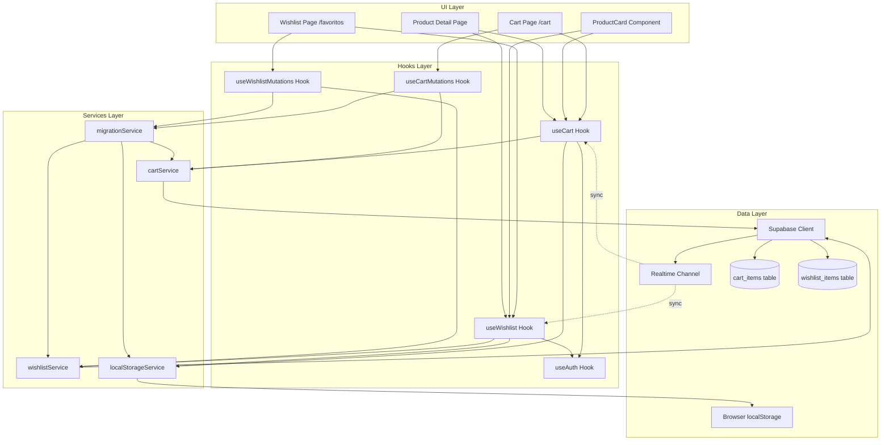
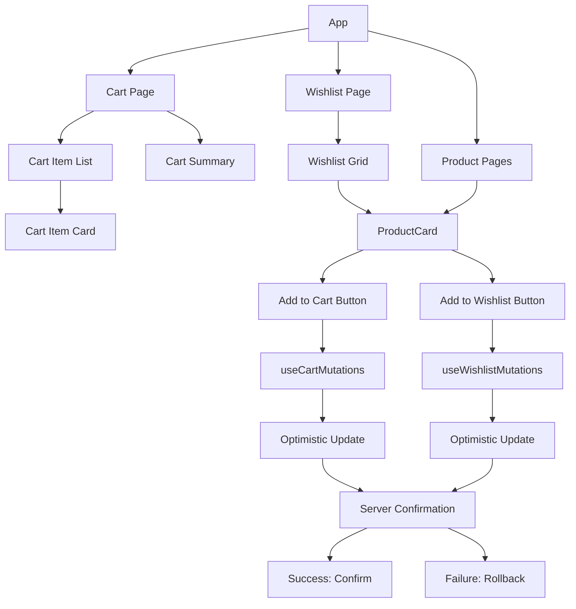
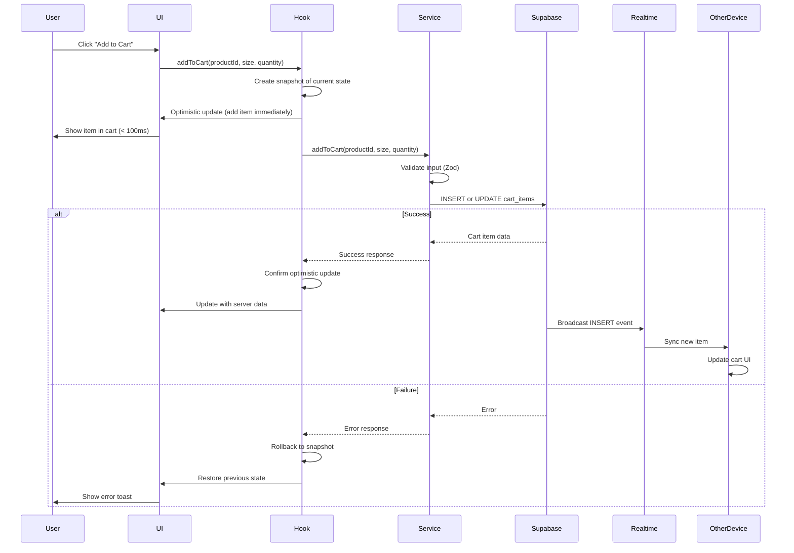
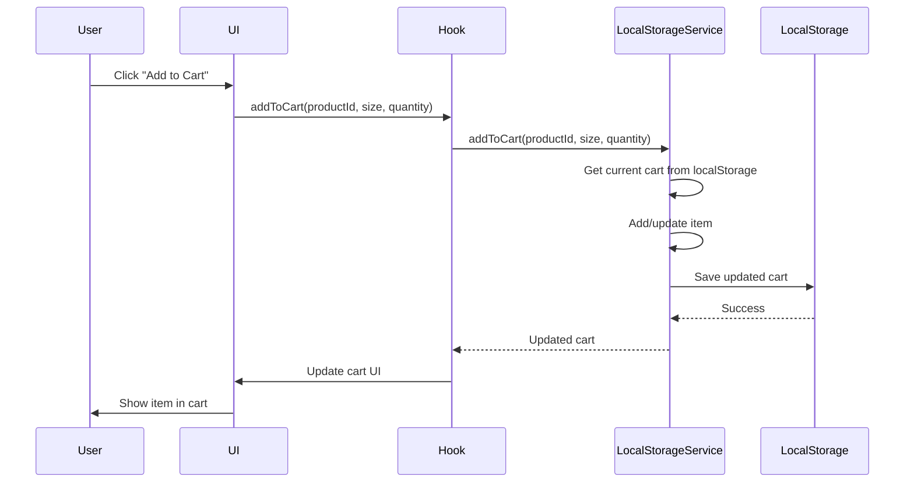
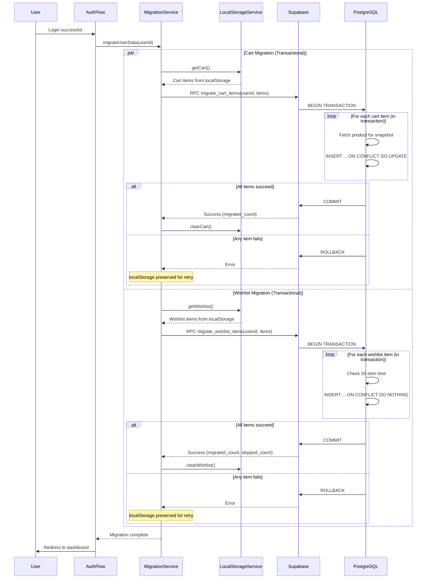
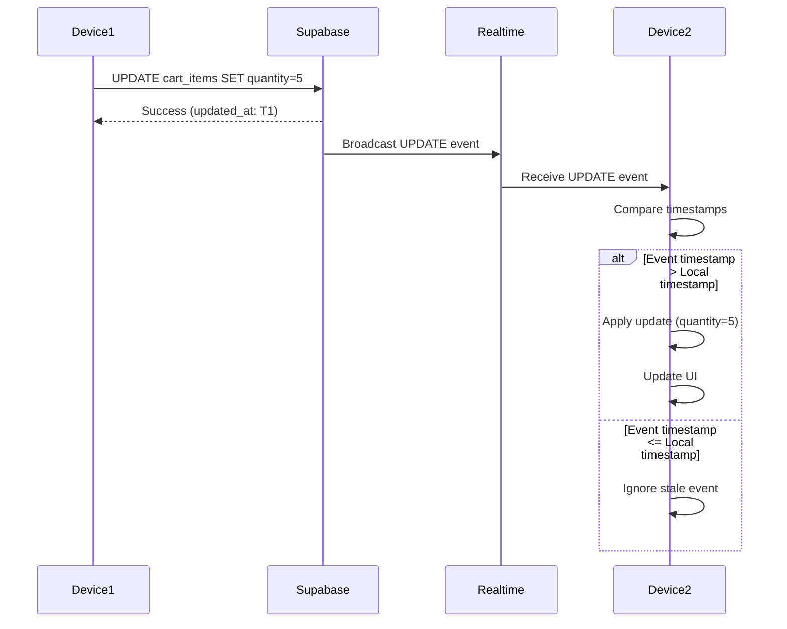
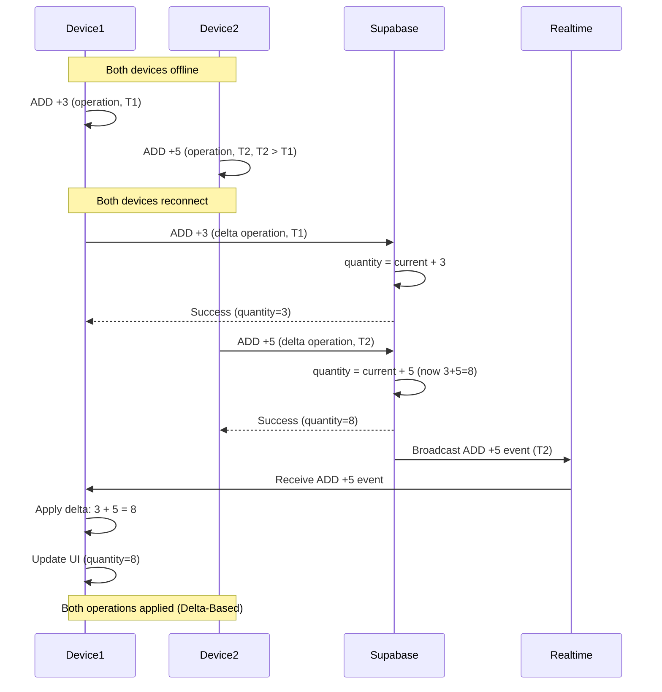

# Design Document: Cart and Wishlist Persistence

## Overview

The Cart and Wishlist Persistence feature replaces the current mock implementations with real Supabase persistence, enabling authenticated users to maintain their shopping carts and wishlists synchronized across devices while providing seamless localStorage-based functionality for guest users with automatic migration upon login.

This design follows a three-layer architecture consistent with the Product Catalog CRUD feature:
- **Data Layer**: Supabase tables (cart_items, wishlist_items) with RLS policies and database constraints
- **Services Layer**: TypeScript services for data access, business logic, and migration
- **UI Layer**: React hooks and components with optimistic updates and rollback

Key design principles:
- **Dual Persistence Strategy**: Database for authenticated users, localStorage for guests
- **Optimistic UI**: Immediate feedback with rollback on failure (< 100ms)
- **Automatic Migration**: Seamless transfer from localStorage to database on login
- **Multi-Device Sync**: Supabase Realtime for cross-device synchronization
- **Conflict Resolution**: Last-Write-Wins strategy based on timestamps
- **Idempotent Operations**: Safe retry and migration without data duplication
- **Security First**: RLS policies enforce user isolation
- **Graceful Degradation**: Fallback strategies for network failures

### Purpose

This feature enables:
- Persistent shopping cart across sessions and devices for authenticated users
- Wishlist functionality with 20-item limit
- Guest user experience with localStorage
- Seamless migration on authentication
- Real-time synchronization across devices
- Foundation for checkout feature

### Scope

**In Scope:**
- Database schema for cart_items and wishlist_items with RLS
- Cart service with CRUD operations and migration logic
- Wishlist service with CRUD operations and 20-item limit
- Custom hooks (useCart, useWishlist) with optimistic updates
- localStorage management for guest users
- Migration logic on login with idempotency
- Supabase Realtime integration for sync
- Conflict resolution (Last-Write-Wins)
- Retry strategy for failed operations
- Debounce for rapid quantity changes
- Re-sync fallback for disconnections
- Integration with existing ProductCard and cart/wishlist pages

**Out of Scope:**
- Checkout process (separate feature)
- Payment integration (separate feature)
- Stock validation during add-to-cart (handled in checkout)
- Price snapshot (handled in checkout)
- Cart abandonment emails (future enhancement)
- Wishlist sharing (future enhancement)
- Cart merge strategies beyond sum quantities (future enhancement)
- Product recommendations based on cart/wishlist (future enhancement)

### Key Design Decisions

1. **Supabase for Persistence**: Use Supabase PostgreSQL for authenticated users (not localStorage)
2. **localStorage for Guests**: Temporary storage for unauthenticated users
3. **Automatic Migration**: Transfer localStorage data to database on login using transactional RPC
4. **Optimistic Updates**: Immediate UI feedback with rollback on server failure
5. **Supabase Realtime**: Real-time sync across devices for authenticated users
6. **Delta-Based Sync**: Conflict resolution using operation deltas (ADD +2, REMOVE) not state replacement
7. **Atomic Operations**: Use PostgreSQL upsert (INSERT ... ON CONFLICT DO UPDATE) for race-free cart updates
8. **Unique Constraints**: Prevent duplicates at database level (product_id, size, user_id)
9. **Soft Limits**: 20-item wishlist limit enforced via CHECK constraint + RPC
10. **Debounce Strategy**: 500ms debounce for quantity changes with Realtime event cancellation
11. **Retry Logic**: 2 retries with 500ms delay for network errors using PostgreSQL error codes
12. **CASCADE Deletes**: Automatic cleanup when products or users are deleted
13. **React Query**: Data fetching, caching, and optimistic updates with client_id filtering
14. **Zod Validation**: Client and service layer validation
15. **Price Snapshots**: Capture price/name at add-to-cart time for historical accuracy
16. **Migration Gate**: Suspend queries until migration completes to prevent empty cart flash
17. **Composite Keys**: Use (productId, size) as logical identifier for consistency
18. **Multi-Tab Sync**: Broadcast Channel API for localStorage synchronization across tabs


## Architecture

### High-Level Architecture



### Component Hierarchy



### Data Flow

**Add to Cart Flow (Authenticated User)**:


**Add to Cart Flow (Guest User)**:


**Migration Flow on Login**:


**Multi-Device Sync Flow**:


**Conflict Resolution (Delta-Based)**:



## Database Schema

### Cart Items Table

```sql
-- Cart items table for authenticated users
CREATE TABLE cart_items (
  id UUID PRIMARY KEY DEFAULT gen_random_uuid(),
  user_id UUID NOT NULL REFERENCES auth.users(id) ON DELETE CASCADE,
  product_id UUID NOT NULL REFERENCES products(id) ON DELETE CASCADE,
  quantity INTEGER NOT NULL CHECK (quantity >= 1 AND quantity <= 99),
  size TEXT NOT NULL CHECK (char_length(size) > 0 AND char_length(size) <= 10),
  
  -- Price snapshot fields for historical accuracy
  price_snapshot DECIMAL(10, 2) NOT NULL,
  product_name_snapshot TEXT NOT NULL,
  
  created_at TIMESTAMPTZ DEFAULT NOW() NOT NULL,
  updated_at TIMESTAMPTZ DEFAULT NOW() NOT NULL,
  
  -- Unique constraint: one entry per (user, product, size) combination
  CONSTRAINT unique_cart_item UNIQUE (user_id, product_id, size)
);

-- Indexes for performance
CREATE INDEX idx_cart_items_user_id ON cart_items(user_id);
CREATE INDEX idx_cart_items_product_id ON cart_items(product_id);
CREATE INDEX idx_cart_items_updated_at ON cart_items(updated_at DESC);

-- Trigger to update updated_at timestamp
CREATE TRIGGER update_cart_items_updated_at
  BEFORE UPDATE ON cart_items
  FOR EACH ROW
  EXECUTE FUNCTION update_updated_at_column();

-- RLS Policies
ALTER TABLE cart_items ENABLE ROW LEVEL SECURITY;

-- Users can only read their own cart items
CREATE POLICY "cart_items_select_own"
  ON cart_items FOR SELECT
  USING (auth.uid() = user_id);

-- Users can only insert their own cart items
CREATE POLICY "cart_items_insert_own"
  ON cart_items FOR INSERT
  WITH CHECK (auth.uid() = user_id);

-- Users can only update their own cart items
CREATE POLICY "cart_items_update_own"
  ON cart_items FOR UPDATE
  USING (auth.uid() = user_id);

-- Users can only delete their own cart items
CREATE POLICY "cart_items_delete_own"
  ON cart_items FOR DELETE
  USING (auth.uid() = user_id);
```

### Wishlist Items Table

```sql
-- Wishlist items table for authenticated users
CREATE TABLE wishlist_items (
  id UUID PRIMARY KEY DEFAULT gen_random_uuid(),
  user_id UUID NOT NULL REFERENCES auth.users(id) ON DELETE CASCADE,
  product_id UUID NOT NULL REFERENCES products(id) ON DELETE CASCADE,
  created_at TIMESTAMPTZ DEFAULT NOW() NOT NULL,
  
  -- Unique constraint: one entry per (user, product) combination
  CONSTRAINT unique_wishlist_item UNIQUE (user_id, product_id)
);

-- Indexes for performance
CREATE INDEX idx_wishlist_items_user_id ON wishlist_items(user_id);
CREATE INDEX idx_wishlist_items_product_id ON wishlist_items(product_id);
CREATE INDEX idx_wishlist_items_created_at ON wishlist_items(created_at DESC);

-- RLS Policies
ALTER TABLE wishlist_items ENABLE ROW LEVEL SECURITY;

-- Users can only read their own wishlist items
CREATE POLICY "wishlist_items_select_own"
  ON wishlist_items FOR SELECT
  USING (auth.uid() = user_id);

-- Users can only insert their own wishlist items
CREATE POLICY "wishlist_items_insert_own"
  ON wishlist_items FOR INSERT
  WITH CHECK (auth.uid() = user_id);

-- Users can only delete their own wishlist items
CREATE POLICY "wishlist_items_delete_own"
  ON wishlist_items FOR DELETE
  USING (auth.uid() = user_id);

-- Function to enforce 20-item wishlist limit atomically
CREATE OR REPLACE FUNCTION check_wishlist_limit()
RETURNS TRIGGER AS $$
BEGIN
  IF (SELECT COUNT(*) FROM wishlist_items WHERE user_id = NEW.user_id) >= 20 THEN
    RAISE EXCEPTION 'Limite de 20 itens na wishlist atingido';
  END IF;
  RETURN NEW;
END;
$$ LANGUAGE plpgsql;

-- Trigger to enforce limit before insert
CREATE TRIGGER enforce_wishlist_limit
  BEFORE INSERT ON wishlist_items
  FOR EACH ROW
  EXECUTE FUNCTION check_wishlist_limit();
```

### Cleanup Policy (Optional)

```sql
-- Function to clean up abandoned carts (90 days)
CREATE OR REPLACE FUNCTION cleanup_abandoned_carts()
RETURNS INTEGER AS $$
DECLARE
  deleted_count INTEGER;
BEGIN
  DELETE FROM cart_items
  WHERE updated_at < NOW() - INTERVAL '90 days';
  
  GET DIAGNOSTICS deleted_count = ROW_COUNT;
  
  RAISE NOTICE 'Cleaned up % abandoned cart items', deleted_count;
  RETURN deleted_count;
END;
$$ LANGUAGE plpgsql;

-- Function to clean up old wishlist items (365 days)
CREATE OR REPLACE FUNCTION cleanup_old_wishlist_items()
RETURNS INTEGER AS $$
DECLARE
  deleted_count INTEGER;
BEGIN
  DELETE FROM wishlist_items
  WHERE created_at < NOW() - INTERVAL '365 days';
  
  GET DIAGNOSTICS deleted_count = ROW_COUNT;
  
  RAISE NOTICE 'Cleaned up % old wishlist items', deleted_count;
  RETURN deleted_count;
END;
$$ LANGUAGE plpgsql;

-- Schedule cleanup jobs (using pg_cron extension or Supabase Edge Functions)
-- Example: SELECT cron.schedule('cleanup-carts', '0 2 * * *', 'SELECT cleanup_abandoned_carts()');
-- Example: SELECT cron.schedule('cleanup-wishlist', '0 3 * * *', 'SELECT cleanup_old_wishlist_items()');
```

### RPC Functions for Atomic Operations

```sql
-- Atomic cart migration function
-- Ensures all cart items are migrated in a single transaction
CREATE OR REPLACE FUNCTION migrate_cart_items(
  p_user_id UUID,
  p_items JSONB
)
RETURNS JSONB AS $$
DECLARE
  v_item JSONB;
  v_migrated_count INTEGER := 0;
  v_product RECORD;
BEGIN
  -- Iterate through items and insert/update atomically
  FOR v_item IN SELECT * FROM jsonb_array_elements(p_items)
  LOOP
    -- Fetch product details for snapshot
    SELECT price, name INTO v_product
    FROM products
    WHERE id = (v_item->>'productId')::UUID;
    
    IF NOT FOUND THEN
      -- Skip items with invalid product_id
      CONTINUE;
    END IF;
    
    -- Atomic upsert: insert or update if exists
    INSERT INTO cart_items (
      user_id,
      product_id,
      quantity,
      size,
      price_snapshot,
      product_name_snapshot
    )
    VALUES (
      p_user_id,
      (v_item->>'productId')::UUID,
      (v_item->>'quantity')::INTEGER,
      v_item->>'size',
      v_product.price,
      v_product.name
    )
    ON CONFLICT (user_id, product_id, size)
    DO UPDATE SET
      quantity = LEAST(cart_items.quantity + EXCLUDED.quantity, 99),
      updated_at = NOW();
    
    v_migrated_count := v_migrated_count + 1;
  END LOOP;
  
  RETURN jsonb_build_object(
    'success', true,
    'migrated_count', v_migrated_count
  );
EXCEPTION
  WHEN OTHERS THEN
    -- Rollback happens automatically
    RETURN jsonb_build_object(
      'success', false,
      'error', SQLERRM
    );
END;
$$ LANGUAGE plpgsql SECURITY DEFINER;

-- Atomic wishlist migration function
CREATE OR REPLACE FUNCTION migrate_wishlist_items(
  p_user_id UUID,
  p_items JSONB
)
RETURNS JSONB AS $$
DECLARE
  v_item JSONB;
  v_migrated_count INTEGER := 0;
  v_current_count INTEGER;
BEGIN
  -- Check current wishlist count
  SELECT COUNT(*) INTO v_current_count
  FROM wishlist_items
  WHERE user_id = p_user_id;
  
  -- Iterate through items up to the 20-item limit
  FOR v_item IN SELECT * FROM jsonb_array_elements(p_items)
  LOOP
    -- Stop if we've reached the limit
    IF v_current_count >= 20 THEN
      EXIT;
    END IF;
    
    -- Insert if not exists (idempotent)
    INSERT INTO wishlist_items (user_id, product_id)
    VALUES (p_user_id, (v_item->>'productId')::UUID)
    ON CONFLICT (user_id, product_id) DO NOTHING;
    
    -- Check if insert was successful
    IF FOUND THEN
      v_migrated_count := v_migrated_count + 1;
      v_current_count := v_current_count + 1;
    END IF;
  END LOOP;
  
  RETURN jsonb_build_object(
    'success', true,
    'migrated_count', v_migrated_count,
    'skipped_count', jsonb_array_length(p_items) - v_migrated_count
  );
EXCEPTION
  WHEN OTHERS THEN
    RETURN jsonb_build_object(
      'success', false,
      'error', SQLERRM
    );
END;
$$ LANGUAGE plpgsql SECURITY DEFINER;

-- Atomic add to cart with price snapshot
CREATE OR REPLACE FUNCTION add_to_cart_atomic(
  p_user_id UUID,
  p_product_id UUID,
  p_quantity INTEGER,
  p_size TEXT
)
RETURNS JSONB AS $$
DECLARE
  v_product RECORD;
  v_result RECORD;
BEGIN
  -- Fetch product details
  SELECT price, name, stock INTO v_product
  FROM products
  WHERE id = p_product_id AND deleted_at IS NULL;
  
  IF NOT FOUND THEN
    RETURN jsonb_build_object(
      'success', false,
      'error', 'Product not found'
    );
  END IF;
  
  -- Atomic upsert
  INSERT INTO cart_items (
    user_id,
    product_id,
    quantity,
    size,
    price_snapshot,
    product_name_snapshot
  )
  VALUES (
    p_user_id,
    p_product_id,
    p_quantity,
    p_size,
    v_product.price,
    v_product.name
  )
  ON CONFLICT (user_id, product_id, size)
  DO UPDATE SET
    quantity = LEAST(cart_items.quantity + EXCLUDED.quantity, 99),
    updated_at = NOW()
  RETURNING * INTO v_result;
  
  RETURN jsonb_build_object(
    'success', true,
    'item', row_to_json(v_result)
  );
EXCEPTION
  WHEN OTHERS THEN
    RETURN jsonb_build_object(
      'success', false,
      'error', SQLERRM
    );
END;
$$ LANGUAGE plpgsql SECURITY DEFINER;

### Database Constraints Summary

| Constraint | Table | Purpose |
|------------|-------|---------|
| `unique_cart_item` | cart_items | Prevents duplicate (user_id, product_id, size) combinations |
| `unique_wishlist_item` | wishlist_items | Prevents duplicate (user_id, product_id) combinations |
| `quantity CHECK` | cart_items | Ensures quantity is between 1 and 99 |
| `size CHECK` | cart_items | Ensures size is non-empty and max 10 chars |
| `user_id FK CASCADE` | both | Auto-deletes items when user is deleted |
| `product_id FK CASCADE` | both | Auto-deletes items when product is deleted |
| `wishlist_limit TRIGGER` | wishlist_items | Enforces 20-item limit atomically |


## Concurrency and Distributed Systems

### Race Condition Prevention

**Problem**: Traditional SELECT → decide → INSERT/UPDATE pattern is not atomic and causes race conditions when multiple devices add the same item simultaneously.

**Solution**: Use PostgreSQL's atomic upsert operation:

```sql
-- WRONG: Non-atomic (race condition)
SELECT * FROM cart_items WHERE user_id = ? AND product_id = ? AND size = ?;
-- (another request can insert here)
IF exists THEN
  UPDATE cart_items SET quantity = quantity + ?;
ELSE
  INSERT INTO cart_items ...;
END IF;

-- CORRECT: Atomic upsert (race-free)
INSERT INTO cart_items (user_id, product_id, quantity, size, price_snapshot, product_name_snapshot)
VALUES (?, ?, ?, ?, ?, ?)
ON CONFLICT (user_id, product_id, size)
DO UPDATE SET
  quantity = LEAST(cart_items.quantity + EXCLUDED.quantity, 99),
  updated_at = NOW();
```

**Implementation**: All cart additions use the `add_to_cart_atomic()` RPC function which guarantees atomicity at the database level.

### Conflict Resolution Strategy

**Problem**: Last-Write-Wins (LWW) is inadequate for cart operations because cart is accumulative, not replaceable. LWW causes data loss when two devices add different quantities.

**Solution**: Delta-based (operation-based) conflict resolution:

**Traditional LWW (WRONG)**:
```
Device A: Set quantity = 3 (timestamp T1)
Device B: Set quantity = 5 (timestamp T2, T2 > T1)
Result: quantity = 5 (Device A's +3 operation is lost)
```

**Delta-Based (CORRECT)**:
```
Device A: ADD +3 (timestamp T1)
Device B: ADD +5 (timestamp T2)
Result: quantity = 8 (both operations applied)
```

**Implementation**:
- Realtime events contain operation type (ADD, REMOVE, UPDATE_QUANTITY) not just final state
- Conflict resolution applies all operations in temporal order
- Operations are idempotent using unique constraints

**Realtime Event Payload Structure**:
```typescript
interface CartRealtimeEvent {
  type: 'INSERT' | 'UPDATE' | 'DELETE';
  operation: 'ADD' | 'UPDATE_QUANTITY' | 'REMOVE';
  delta?: number; // For ADD operations
  new: CartItemRow;
  old?: CartItemRow;
  client_id: string; // To filter own events
  timestamp: string;
}
```

### Transactional Migration

**Problem**: Loop-based migration can fail mid-process, causing duplicate or inconsistent state.

**Solution**: Use Supabase RPC functions with PostgreSQL transactions:

```typescript
// WRONG: Non-transactional (can fail mid-loop)
for (const item of localCartItems) {
  await supabase.from('cart_items').insert(item); // Each is separate transaction
  // If this fails, previous inserts are committed (partial state)
}

// CORRECT: Transactional RPC (all-or-nothing)
const { data, error } = await supabase.rpc('migrate_cart_items', {
  p_user_id: userId,
  p_items: localCartItems, // All items in single transaction
});
// If any item fails, entire transaction rolls back
```

**Benefits**:
- Atomic: All items migrate or none
- Idempotent: Safe to retry on failure
- Rollback: Automatic on any error
- Performance: Single round-trip to database

### Realtime Event Loop Prevention

**Problem**: Local update → trigger Realtime → invalidate queries → refetch → trigger Realtime again (infinite loop).

**Solution**: Filter Realtime events by client_id:

```typescript
// Generate unique client ID per session
const clientId = crypto.randomUUID();

// Include client_id in mutations
await supabase.from('cart_items').insert({
  ...item,
  metadata: { client_id: clientId }
});

// Filter Realtime events
channel.on('postgres_changes', (payload) => {
  // Ignore events from this client
  if (payload.new?.metadata?.client_id === clientId) {
    return;
  }
  
  // Use setQueryData instead of invalidateQueries
  queryClient.setQueryData(['cart', userId], (old) => {
    // Apply delta from event
    return applyDelta(old, payload);
  });
});
```

**Alternative**: Use `queryClient.setQueryData()` instead of `invalidateQueries()` to update cache directly without refetching.

### Source of Truth and Migration Gate

**Problem**: User logs in → query runs before migration → cart appears empty momentarily → migration completes → cart populates (bad UX).

**Solution**: Implement migration gate that suspends queries until migration completes:

```typescript
// Migration status hook
function useMigrationStatus() {
  const [status, setStatus] = useState<'pending' | 'in_progress' | 'complete'>('pending');
  
  useEffect(() => {
    const checkMigration = async () => {
      const migrated = localStorage.getItem('agon_migrated');
      if (migrated) {
        setStatus('complete');
      } else if (user) {
        setStatus('in_progress');
        await runMigration();
        localStorage.setItem('agon_migrated', 'true');
        setStatus('complete');
      }
    };
    checkMigration();
  }, [user]);
  
  return status;
}

// Cart hook with migration gate
function useCart() {
  const migrationStatus = useMigrationStatus();
  
  const { data, isLoading } = useQuery({
    queryKey: ['cart', user?.id],
    queryFn: fetchCart,
    enabled: migrationStatus === 'complete', // Block until migration done
  });
  
  // Show loading during migration
  if (migrationStatus !== 'complete') {
    return { items: [], isLoading: true };
  }
  
  return { items: data, isLoading };
}
```

### Composite Key Consistency

**Problem**: Database uses `id` as primary key, but localStorage uses `(productId, size)` as identifier. This creates inconsistency in mutation interfaces.

**Solution**: Normalize to always use `(productId, size)` as logical identifier:

```typescript
// WRONG: Inconsistent identifiers
removeFromCart(itemId: string) // Uses DB id
removeFromCartLocal(productId: string, size: string) // Uses composite

// CORRECT: Consistent composite key
interface CartItemIdentifier {
  productId: string;
  size: string;
}

removeFromCart(identifier: CartItemIdentifier) {
  if (user) {
    // Service resolves to DB id internally
    const item = findByComposite(identifier);
    await supabase.from('cart_items').delete().eq('id', item.id);
  } else {
    // localStorage uses composite directly
    localStorageService.removeFromCart(identifier.productId, identifier.size);
  }
}
```

### Multi-Tab Synchronization

**Problem**: localStorage changes in one tab don't reflect in other tabs of the same browser.

**Solution**: Use Broadcast Channel API:

```typescript
// Create broadcast channel
const cartChannel = new BroadcastChannel('agon_cart');

// Broadcast changes
function updateLocalCart(cart: LocalStorageCart) {
  localStorage.setItem('agon_cart', JSON.stringify(cart));
  cartChannel.postMessage({ type: 'cart_updated', cart });
}

// Listen for changes from other tabs
cartChannel.onmessage = (event) => {
  if (event.data.type === 'cart_updated') {
    queryClient.setQueryData(['cart', null], event.data.cart.items);
  }
};
```

### Debounce with Realtime Coordination

**Problem**: Debounced local update + incoming Realtime event = desync (local shows 5, server shows 3).

**Solution**: Cancel pending debounce if Realtime event arrives:

```typescript
const debounceTimers = useRef<Map<string, NodeJS.Timeout>>(new Map());

// Debounced update
function updateQuantityDebounced(itemId: string, quantity: number) {
  const timer = setTimeout(() => {
    mutate({ itemId, quantity });
  }, 500);
  debounceTimers.current.set(itemId, timer);
}

// Realtime event handler
channel.on('postgres_changes', (payload) => {
  const itemId = payload.new.id;
  
  // Cancel pending debounce for this item
  if (debounceTimers.current.has(itemId)) {
    clearTimeout(debounceTimers.current.get(itemId));
    debounceTimers.current.delete(itemId);
  }
  
  // Apply server state
  queryClient.setQueryData(['cart', userId], (old) => {
    return old.map(item =>
      item.id === itemId ? payload.new : item
    );
  });
});
```

### Retry Strategy with Error Codes

**Problem**: String matching for retry logic is fragile and language-dependent.

**Solution**: Use PostgreSQL/Supabase error codes:

```typescript
// WRONG: String matching
if (error.message.includes('network') || error.message.includes('timeout')) {
  retry();
}

// CORRECT: Error codes
const RETRYABLE_CODES = [
  'PGRST301', // Supabase connection error
  'PGRST504', // Supabase timeout
  '08000',    // PostgreSQL connection exception
  '08003',    // PostgreSQL connection does not exist
  '08006',    // PostgreSQL connection failure
  '57P03',    // PostgreSQL cannot connect now
];

function isRetryable(error: PostgrestError): boolean {
  return RETRYABLE_CODES.includes(error.code) ||
         error.message.includes('fetch failed'); // Network errors
}

async function withRetry<T>(operation: () => Promise<T>): Promise<T> {
  for (let attempt = 0; attempt < 3; attempt++) {
    try {
      return await operation();
    } catch (error) {
      if (attempt === 2 || !isRetryable(error)) {
        throw error;
      }
      await sleep(500 * Math.pow(2, attempt)); // Exponential backoff
    }
  }
}
```

### Realtime Reconnection Strategy

**Problem**: Realtime disconnects are not handled, causing stale data.

**Solution**: Implement exponential backoff reconnection with polling fallback:

```typescript
const [realtimeStatus, setRealtimeStatus] = useState<'connected' | 'disconnected'>('disconnected');
const reconnectAttempts = useRef(0);
const pollingInterval = useRef<NodeJS.Timeout | null>(null);

useEffect(() => {
  const channel = supabase.channel(`cart:${userId}`);
  
  channel
    .on('postgres_changes', { ... }, handleEvent)
    .subscribe((status) => {
      if (status === 'SUBSCRIBED') {
        setRealtimeStatus('connected');
        reconnectAttempts.current = 0;
        stopPolling();
      } else if (status === 'CHANNEL_ERROR' || status === 'TIMED_OUT') {
        setRealtimeStatus('disconnected');
        handleReconnect();
      }
    });
  
  return () => {
    channel.unsubscribe();
    stopPolling();
  };
}, [userId]);

function handleReconnect() {
  const delay = Math.min(1000 * Math.pow(2, reconnectAttempts.current), 30000);
  reconnectAttempts.current++;
  
  setTimeout(() => {
    // Attempt reconnection
    supabase.removeAllChannels();
    // Re-subscribe (handled by useEffect)
  }, delay);
  
  // Start polling as fallback
  startPolling();
}

function startPolling() {
  if (pollingInterval.current) return;
  
  pollingInterval.current = setInterval(() => {
    queryClient.invalidateQueries({ queryKey: ['cart', userId] });
  }, 30000); // Poll every 30s
}

function stopPolling() {
  if (pollingInterval.current) {
    clearInterval(pollingInterval.current);
    pollingInterval.current = null;
  }
}
```


## Data Models

### TypeScript Interfaces

```typescript
// Cart item entity
interface CartItem {
  id: string;
  userId: string;
  productId: string;
  quantity: number;
  size: string;
  priceSnapshot: number; // Price at time of add-to-cart
  productNameSnapshot: string; // Name at time of add-to-cart
  createdAt: string;
  updatedAt: string;
  product?: Product; // Joined data (current product info)
}

// Wishlist item entity
interface WishlistItem {
  id: string;
  userId: string;
  productId: string;
  createdAt: string;
  product?: Product; // Joined data
}

// Cart item form values (for add/update)
interface CartItemInput {
  productId: string;
  quantity: number;
  size: string;
}

// Cart item identifier (composite key)
interface CartItemIdentifier {
  productId: string;
  size: string;
}

// Wishlist item input
interface WishlistItemInput {
  productId: string;
}

// Cart summary
interface CartSummary {
  items: CartItem[];
  totalItems: number;
  subtotal: number;
  priceChanges: Array<{
    itemId: string;
    productName: string;
    oldPrice: number;
    newPrice: number;
  }>;
}

// Database row types (snake_case from Supabase)
interface CartItemRow {
  id: string;
  user_id: string;
  product_id: string;
  quantity: number;
  size: string;
  price_snapshot: number;
  product_name_snapshot: string;
  created_at: string;
  updated_at: string;
}

interface WishlistItemRow {
  id: string;
  user_id: string;
  product_id: string;
  created_at: string;
}

// localStorage types
interface LocalStorageCart {
  items: Array<{
    productId: string;
    quantity: number;
    size: string;
  }>;
  version: number; // For future schema migrations
}

interface LocalStorageWishlist {
  items: Array<{
    productId: string;
  }>;
  version: number;
}

// Optimistic update state
interface OptimisticState<T> {
  snapshot: T;
  pendingOperations: Array<{
    id: string;
    type: 'add' | 'update' | 'remove';
    timestamp: number;
  }>;
}

// Migration result
interface MigrationResult {
  cartItemsMigrated: number;
  wishlistItemsMigrated: number;
  errors: string[];
}

// Migration status
type MigrationStatus = 'pending' | 'in_progress' | 'complete' | 'error';

// Realtime event payload
interface CartRealtimeEvent {
  type: 'INSERT' | 'UPDATE' | 'DELETE';
  operation: 'ADD' | 'UPDATE_QUANTITY' | 'REMOVE';
  delta?: number;
  new: CartItemRow;
  old?: CartItemRow;
  client_id: string;
  timestamp: string;
}

// Client session metadata
interface ClientMetadata {
  client_id: string;
  session_start: string;
}
```

### Zod Validation Schemas

```typescript
import { z } from 'zod';

// Cart item validation schema
export const cartItemSchema = z.object({
  productId: z.string().uuid('Product ID inválido'),
  quantity: z.number()
    .int('Quantidade deve ser um número inteiro')
    .min(1, 'Quantidade mínima é 1')
    .max(99, 'Quantidade máxima é 99'),
  size: z.string()
    .min(1, 'Tamanho é obrigatório')
    .max(10, 'Tamanho deve ter no máximo 10 caracteres'),
});

// Wishlist item validation schema
export const wishlistItemSchema = z.object({
  productId: z.string().uuid('Product ID inválido'),
});

// Cart item update schema (partial)
export const cartItemUpdateSchema = z.object({
  quantity: z.number()
    .int('Quantidade deve ser um número inteiro')
    .min(1, 'Quantidade mínima é 1')
    .max(99, 'Quantidade máxima é 99')
    .optional(),
  size: z.string()
    .min(1, 'Tamanho é obrigatório')
    .max(10, 'Tamanho deve ter no máximo 10 caracteres')
    .optional(),
});

// localStorage cart schema
export const localStorageCartSchema = z.object({
  items: z.array(z.object({
    productId: z.string().uuid(),
    quantity: z.number().int().min(1).max(99),
    size: z.string().min(1).max(10),
  })),
  version: z.number().int().default(1),
});

// localStorage wishlist schema
export const localStorageWishlistSchema = z.object({
  items: z.array(z.object({
    productId: z.string().uuid(),
  })),
  version: z.number().int().default(1),
});
```


## Services Layer

### Cart Service

**Location**: `apps/web/src/modules/cart/services/cartService.ts`

**Responsibilities:**
- CRUD operations for cart items
- Data transformation (snake_case ↔ camelCase)
- Business logic validation
- Conflict resolution (upsert on unique constraint)
- Retry logic for network errors

**Interface:**
```typescript
export const cartService = {
  // Get all cart items for authenticated user
  async getCartItems(userId: string): Promise<CartItem[]> {
    const supabase = createClient();
    
    const { data, error } = await supabase
      .from('cart_items')
      .select('*, product:products(*)')
      .eq('user_id', userId)
      .order('created_at', { ascending: false });
    
    if (error) throw error;
    
    return data.map(transformCartItemRow);
  },
  
  // Add item to cart (or update quantity if exists) - ATOMIC
  async addToCart(userId: string, input: CartItemInput): Promise<CartItem> {
    const supabase = createClient();
    
    // Validate input
    const validated = cartItemSchema.parse(input);
    
    // Use atomic RPC function to prevent race conditions
    const { data, error } = await supabase.rpc('add_to_cart_atomic', {
      p_user_id: userId,
      p_product_id: validated.productId,
      p_quantity: validated.quantity,
      p_size: validated.size,
    });
    
    if (error) throw error;
    
    if (!data.success) {
      throw new Error(data.error);
    }
    
    return transformCartItemRow(data.item);
  },
  
  // Update cart item quantity or size
  async updateCartItem(
    userId: string,
    itemId: string,
    updates: { quantity?: number; size?: string }
  ): Promise<CartItem> {
    const supabase = createClient();
    
    // Validate updates
    const validated = cartItemUpdateSchema.parse(updates);
    
    const { data, error } = await supabase
      .from('cart_items')
      .update(validated)
      .eq('id', itemId)
      .eq('user_id', userId) // Ensure user owns this item
      .select('*, product:products(*)')
      .single();
    
    if (error) throw error;
    
    return transformCartItemRow(data);
  },
  
  // Remove item from cart
  async removeFromCart(userId: string, itemId: string): Promise<void> {
    const supabase = createClient();
    
    const { error } = await supabase
      .from('cart_items')
      .delete()
      .eq('id', itemId)
      .eq('user_id', userId); // Ensure user owns this item
    
    if (error) throw error;
  },
  
  // Clear entire cart
  async clearCart(userId: string): Promise<void> {
    const supabase = createClient();
    
    const { error } = await supabase
      .from('cart_items')
      .delete()
      .eq('user_id', userId);
    
    if (error) throw error;
  },
  
  // Get cart summary (total items and subtotal) with price change detection
  async getCartSummary(userId: string): Promise<CartSummary> {
    const items = await this.getCartItems(userId);
    
    const totalItems = items.reduce((sum, item) => sum + item.quantity, 0);
    const subtotal = items.reduce(
      (sum, item) => sum + (item.product?.price || 0) * item.quantity,
      0
    );
    
    // Detect price changes
    const priceChanges = items
      .filter(item => item.product && item.product.price !== item.priceSnapshot)
      .map(item => ({
        itemId: item.id,
        productName: item.productNameSnapshot,
        oldPrice: item.priceSnapshot,
        newPrice: item.product!.price,
      }));
    
    return { items, totalItems, subtotal, priceChanges };
  },
  
  // Retry wrapper for network errors using error codes
  async withRetry<T>(
    operation: () => Promise<T>,
    maxRetries: number = 2,
    delayMs: number = 500
  ): Promise<T> {
    const RETRYABLE_CODES = [
      'PGRST301', // Supabase connection error
      'PGRST504', // Supabase timeout
      '08000',    // PostgreSQL connection exception
      '08003',    // PostgreSQL connection does not exist
      '08006',    // PostgreSQL connection failure
      '57P03',    // PostgreSQL cannot connect now
    ];
    
    let lastError: Error;
    
    for (let attempt = 0; attempt <= maxRetries; attempt++) {
      try {
        return await operation();
      } catch (error: any) {
        lastError = error;
        
        // Check if error is retryable
        const isRetryable = 
          RETRYABLE_CODES.includes(error.code) ||
          error.message?.includes('fetch failed') ||
          error.message?.includes('network') ||
          error.message?.includes('timeout');
        
        if (attempt < maxRetries && isRetryable) {
          // Exponential backoff
          await new Promise(resolve => 
            setTimeout(resolve, delayMs * Math.pow(2, attempt))
          );
          continue;
        }
        
        throw error;
      }
    }
    
    throw lastError!;
  },
};

// Helper function to transform database row to CartItem
function transformCartItemRow(row: any): CartItem {
  return {
    id: row.id,
    userId: row.user_id,
    productId: row.product_id,
    quantity: row.quantity,
    size: row.size,
    priceSnapshot: parseFloat(row.price_snapshot),
    productNameSnapshot: row.product_name_snapshot,
    createdAt: row.created_at,
    updatedAt: row.updated_at,
    product: row.product ? {
      id: row.product.id,
      name: row.product.name,
      description: row.product.description,
      price: parseFloat(row.product.price),
      categoryId: row.product.category_id,
      imageUrl: row.product.image_url,
      stock: row.product.stock,
      features: row.product.features || [],
      rating: parseFloat(row.product.rating),
      reviews: row.product.reviews,
      createdAt: row.product.created_at,
      updatedAt: row.product.updated_at,
      deletedAt: row.product.deleted_at,
    } : undefined,
  };
}
```

### Wishlist Service

**Location**: `apps/web/src/modules/wishlist/services/wishlistService.ts`

**Responsibilities:**
- CRUD operations for wishlist items
- 20-item limit enforcement
- Data transformation
- Duplicate prevention

**Interface:**
```typescript
export const wishlistService = {
  // Get all wishlist items for authenticated user
  async getWishlistItems(userId: string): Promise<WishlistItem[]> {
    const supabase = createClient();
    
    const { data, error } = await supabase
      .from('wishlist_items')
      .select('*, product:products(*)')
      .eq('user_id', userId)
      .order('created_at', { ascending: false });
    
    if (error) throw error;
    
    return data.map(transformWishlistItemRow);
  },
  
  // Add item to wishlist (20-item limit enforced by trigger)
  async addToWishlist(userId: string, input: WishlistItemInput): Promise<WishlistItem> {
    const supabase = createClient();
    
    // Validate input
    const validated = wishlistItemSchema.parse(input);
    
    // Insert new item (limit enforced by database trigger)
    const { data, error } = await supabase
      .from('wishlist_items')
      .insert({
        user_id: userId,
        product_id: validated.productId,
      })
      .select('*, product:products(*)')
      .single();
    
    if (error) {
      // If unique constraint violation, silently return existing item
      if (error.code === '23505') {
        const { data: existing } = await supabase
          .from('wishlist_items')
          .select('*, product:products(*)')
          .eq('user_id', userId)
          .eq('product_id', validated.productId)
          .single();
        
        return transformWishlistItemRow(existing);
      }
      
      // If limit exceeded (from trigger)
      if (error.message.includes('Limite')) {
        throw new Error('Limite de 20 itens na wishlist atingido');
      }
      
      throw error;
    }
    
    return transformWishlistItemRow(data);
  },
  
  // Remove item from wishlist
  async removeFromWishlist(userId: string, itemId: string): Promise<void> {
    const supabase = createClient();
    
    const { error } = await supabase
      .from('wishlist_items')
      .delete()
      .eq('id', itemId)
      .eq('user_id', userId); // Ensure user owns this item
    
    if (error) throw error;
  },
  
  // Remove item by product ID
  async removeFromWishlistByProductId(userId: string, productId: string): Promise<void> {
    const supabase = createClient();
    
    const { error } = await supabase
      .from('wishlist_items')
      .delete()
      .eq('user_id', userId)
      .eq('product_id', productId);
    
    if (error) throw error;
  },
  
  // Check if product is in wishlist
  async isInWishlist(userId: string, productId: string): Promise<boolean> {
    const supabase = createClient();
    
    const { data, error } = await supabase
      .from('wishlist_items')
      .select('id')
      .eq('user_id', userId)
      .eq('product_id', productId)
      .single();
    
    if (error && error.code !== 'PGRST116') throw error;
    
    return !!data;
  },
  
  // Clear entire wishlist
  async clearWishlist(userId: string): Promise<void> {
    const supabase = createClient();
    
    const { error } = await supabase
      .from('wishlist_items')
      .delete()
      .eq('user_id', userId);
    
    if (error) throw error;
  },
};

// Helper function to transform database row to WishlistItem
function transformWishlistItemRow(row: any): WishlistItem {
  return {
    id: row.id,
    userId: row.user_id,
    productId: row.product_id,
    createdAt: row.created_at,
    product: row.product ? {
      id: row.product.id,
      name: row.product.name,
      description: row.product.description,
      price: parseFloat(row.product.price),
      categoryId: row.product.category_id,
      imageUrl: row.product.image_url,
      stock: row.product.stock,
      features: row.product.features || [],
      rating: parseFloat(row.product.rating),
      reviews: row.product.reviews,
      createdAt: row.product.created_at,
      updatedAt: row.product.updated_at,
      deletedAt: row.product.deleted_at,
    } : undefined,
  };
}
```


### localStorage Service

**Location**: `apps/web/src/modules/cart/services/localStorageService.ts`

**Responsibilities:**
- localStorage CRUD operations for guest users
- Schema validation
- Version management for future migrations

**Interface:**
```typescript
const CART_STORAGE_KEY = 'agon_cart';
const WISHLIST_STORAGE_KEY = 'agon_wishlist';
const CURRENT_VERSION = 1;

// Broadcast channel for multi-tab sync
const cartChannel = typeof BroadcastChannel !== 'undefined' 
  ? new BroadcastChannel('agon_cart_sync')
  : null;
const wishlistChannel = typeof BroadcastChannel !== 'undefined'
  ? new BroadcastChannel('agon_wishlist_sync')
  : null;

export const localStorageService = {
  // Initialize listeners for multi-tab sync
  init(onCartChange: (cart: LocalStorageCart) => void, onWishlistChange: (wishlist: LocalStorageWishlist) => void) {
    if (cartChannel) {
      cartChannel.onmessage = (event) => {
        if (event.data.type === 'cart_updated') {
          onCartChange(event.data.cart);
        }
      };
    }
    
    if (wishlistChannel) {
      wishlistChannel.onmessage = (event) => {
        if (event.data.type === 'wishlist_updated') {
          onWishlistChange(event.data.wishlist);
        }
      };
    }
  },
  
  // Broadcast cart changes to other tabs
  broadcastCartChange(cart: LocalStorageCart) {
    if (cartChannel) {
      cartChannel.postMessage({ type: 'cart_updated', cart });
    }
  },
  
  // Broadcast wishlist changes to other tabs
  broadcastWishlistChange(wishlist: LocalStorageWishlist) {
    if (wishlistChannel) {
      wishlistChannel.postMessage({ type: 'wishlist_updated', wishlist });
    }
  },
  // Cart operations
  getCart(): LocalStorageCart {
    try {
      const raw = localStorage.getItem(CART_STORAGE_KEY);
      if (!raw) return { items: [], version: CURRENT_VERSION };
      
      const parsed = JSON.parse(raw);
      const validated = localStorageCartSchema.parse(parsed);
      return validated;
    } catch (error) {
      console.error('Failed to parse cart from localStorage:', error);
      return { items: [], version: CURRENT_VERSION };
    }
  },
  
  saveCart(cart: LocalStorageCart): void {
    try {
      const validated = localStorageCartSchema.parse(cart);
      localStorage.setItem(CART_STORAGE_KEY, JSON.stringify(validated));
      this.broadcastCartChange(validated);
    } catch (error) {
      console.error('Failed to save cart to localStorage:', error);
    }
  },
  
  addToCart(productId: string, quantity: number, size: string): LocalStorageCart {
    const cart = this.getCart();
    
    // Find existing item
    const existingIndex = cart.items.findIndex(
      item => item.productId === productId && item.size === size
    );
    
    if (existingIndex >= 0) {
      // Update quantity (max 99)
      cart.items[existingIndex].quantity = Math.min(
        cart.items[existingIndex].quantity + quantity,
        99
      );
    } else {
      // Add new item
      cart.items.push({ productId, quantity, size });
    }
    
    this.saveCart(cart);
    return cart;
  },
  
  updateCartItem(productId: string, size: string, updates: { quantity?: number; size?: string }): LocalStorageCart {
    const cart = this.getCart();
    
    const itemIndex = cart.items.findIndex(
      item => item.productId === productId && item.size === size
    );
    
    if (itemIndex >= 0) {
      if (updates.quantity !== undefined) {
        cart.items[itemIndex].quantity = updates.quantity;
      }
      if (updates.size !== undefined) {
        cart.items[itemIndex].size = updates.size;
      }
    }
    
    this.saveCart(cart);
    return cart;
  },
  
  removeFromCart(productId: string, size: string): LocalStorageCart {
    const cart = this.getCart();
    
    cart.items = cart.items.filter(
      item => !(item.productId === productId && item.size === size)
    );
    
    this.saveCart(cart);
    return cart;
  },
  
  clearCart(): void {
    localStorage.removeItem(CART_STORAGE_KEY);
  },
  
  // Wishlist operations
  getWishlist(): LocalStorageWishlist {
    try {
      const raw = localStorage.getItem(WISHLIST_STORAGE_KEY);
      if (!raw) return { items: [], version: CURRENT_VERSION };
      
      const parsed = JSON.parse(raw);
      const validated = localStorageWishlistSchema.parse(parsed);
      return validated;
    } catch (error) {
      console.error('Failed to parse wishlist from localStorage:', error);
      return { items: [], version: CURRENT_VERSION };
    }
  },
  
  saveWishlist(wishlist: LocalStorageWishlist): void {
    try {
      const validated = localStorageWishlistSchema.parse(wishlist);
      localStorage.setItem(WISHLIST_STORAGE_KEY, JSON.stringify(validated));
      this.broadcastWishlistChange(validated);
    } catch (error) {
      console.error('Failed to save wishlist to localStorage:', error);
    }
  },
  
  addToWishlist(productId: string): LocalStorageWishlist {
    const wishlist = this.getWishlist();
    
    // Check 20-item limit
    if (wishlist.items.length >= 20) {
      throw new Error('Limite de 20 itens na wishlist atingido');
    }
    
    // Check if already exists
    const exists = wishlist.items.some(item => item.productId === productId);
    
    if (!exists) {
      wishlist.items.push({ productId });
    }
    
    this.saveWishlist(wishlist);
    return wishlist;
  },
  
  removeFromWishlist(productId: string): LocalStorageWishlist {
    const wishlist = this.getWishlist();
    
    wishlist.items = wishlist.items.filter(item => item.productId !== productId);
    
    this.saveWishlist(wishlist);
    return wishlist;
  },
  
  isInWishlist(productId: string): boolean {
    const wishlist = this.getWishlist();
    return wishlist.items.some(item => item.productId === productId);
  },
  
  clearWishlist(): void {
    localStorage.removeItem(WISHLIST_STORAGE_KEY);
  },
};
```

### Migration Service

**Location**: `apps/web/src/modules/cart/services/migrationService.ts`

**Responsibilities:**
- Migrate localStorage data to database on login
- Idempotent migration (safe to run multiple times)
- Error handling and rollback

**Interface:**
```typescript
export const migrationService = {
  // Migrate both cart and wishlist on login
  async migrateUserData(userId: string): Promise<MigrationResult> {
    const result: MigrationResult = {
      cartItemsMigrated: 0,
      wishlistItemsMigrated: 0,
      errors: [],
    };
    
    try {
      // Migrate cart using transactional RPC
      const cartResult = await this.migrateCart(userId);
      result.cartItemsMigrated = cartResult.itemsMigrated;
      result.errors.push(...cartResult.errors);
      
      // Migrate wishlist using transactional RPC
      const wishlistResult = await this.migrateWishlist(userId);
      result.wishlistItemsMigrated = wishlistResult.itemsMigrated;
      result.errors.push(...wishlistResult.errors);
      
      return result;
    } catch (error) {
      console.error('Migration failed:', error);
      result.errors.push(error.message);
      return result;
    }
  },
  
  // Migrate cart from localStorage to database using transactional RPC
  async migrateCart(userId: string): Promise<{ itemsMigrated: number; errors: string[] }> {
    const supabase = createClient();
    const localCart = localStorageService.getCart();
    const errors: string[] = [];
    
    if (localCart.items.length === 0) {
      return { itemsMigrated: 0, errors: [] };
    }
    
    // Use transactional RPC function for atomic migration
    const { data, error } = await supabase.rpc('migrate_cart_items', {
      p_user_id: userId,
      p_items: localCart.items,
    });
    
    if (error) {
      console.error('Cart migration RPC failed:', error);
      errors.push(`Cart migration failed: ${error.message}`);
      return { itemsMigrated: 0, errors };
    }
    
    if (!data.success) {
      errors.push(`Cart migration failed: ${data.error}`);
      return { itemsMigrated: 0, errors };
    }
    
    // Clear localStorage only if migration succeeded
    localStorageService.clearCart();
    
    return { itemsMigrated: data.migrated_count, errors };
  },
  
  // Migrate wishlist from localStorage to database using transactional RPC
  async migrateWishlist(userId: string): Promise<{ itemsMigrated: number; errors: string[] }> {
    const supabase = createClient();
    const localWishlist = localStorageService.getWishlist();
    const errors: string[] = [];
    
    if (localWishlist.items.length === 0) {
      return { itemsMigrated: 0, errors: [] };
    }
    
    // Use transactional RPC function for atomic migration
    const { data, error } = await supabase.rpc('migrate_wishlist_items', {
      p_user_id: userId,
      p_items: localWishlist.items,
    });
    
    if (error) {
      console.error('Wishlist migration RPC failed:', error);
      errors.push(`Wishlist migration failed: ${error.message}`);
      return { itemsMigrated: 0, errors };
    }
    
    if (!data.success) {
      errors.push(`Wishlist migration failed: ${data.error}`);
      return { itemsMigrated: 0, errors };
    }
    
    // Warn if some items couldn't be migrated due to limit
    if (data.skipped_count > 0) {
      errors.push(
        `${data.skipped_count} itens não puderam ser migrados devido ao limite de 20 itens`
      );
    }
    
    // Clear localStorage only if migration succeeded
    localStorageService.clearWishlist();
    
    return { itemsMigrated: data.migrated_count, errors };
  },
};
```


## Hooks Layer

### useCart Hook

**Location**: `apps/web/src/modules/cart/hooks/useCart.ts`

**Responsibilities:**
- Fetch cart data (database or localStorage)
- Subscribe to Realtime updates
- Handle re-sync on reconnection
- Provide cart summary

**Interface:**
```typescript
import { useQuery, useQueryClient } from '@tanstack/react-query';
import { useAuth } from '@/hooks/useAuth';
import { cartService } from '../services/cartService';
import { localStorageService } from '../services/localStorageService';
import { useEffect, useState, useRef } from 'react';
import { createClient } from '@/lib/supabase/client';

// Generate unique client ID for this session
const CLIENT_ID = crypto.randomUUID();

// Migration status hook
function useMigrationStatus() {
  const { user } = useAuth();
  const [status, setStatus] = useState<MigrationStatus>('pending');
  
  useEffect(() => {
    const checkMigration = async () => {
      if (!user) {
        setStatus('complete');
        return;
      }
      
      const migrated = localStorage.getItem('agon_migrated');
      if (migrated) {
        setStatus('complete');
      } else {
        setStatus('in_progress');
        try {
          await migrationService.migrateUserData(user.id);
          localStorage.setItem('agon_migrated', 'true');
          setStatus('complete');
        } catch (error) {
          console.error('Migration failed:', error);
          setStatus('error');
        }
      }
    };
    
    checkMigration();
  }, [user]);
  
  return status;
}

export function useCart() {
  const { user } = useAuth();
  const queryClient = useQueryClient();
  const supabase = createClient();
  const migrationStatus = useMigrationStatus();
  const reconnectAttempts = useRef(0);
  const pollingInterval = useRef<NodeJS.Timeout | null>(null);
  const [realtimeStatus, setRealtimeStatus] = useState<'connected' | 'disconnected'>('disconnected');
  
  // Fetch cart items (blocked until migration completes)
  const { data: items = [], isLoading, error } = useQuery({
    queryKey: ['cart', user?.id],
    queryFn: async () => {
      if (user) {
        // Authenticated: fetch from database
        return await cartService.getCartItems(user.id);
      } else {
        // Guest: fetch from localStorage
        const localCart = localStorageService.getCart();
        // TODO: Hydrate with product data
        return localCart.items;
      }
    },
    enabled: migrationStatus === 'complete', // Migration gate
    staleTime: 1000 * 60 * 5, // 5 minutes
  });
  
  // Subscribe to Realtime updates (authenticated users only)
  useEffect(() => {
    if (!user || migrationStatus !== 'complete') return;
    
    const channel = supabase
      .channel(`cart:${user.id}`)
      .on(
        'postgres_changes',
        {
          event: '*',
          schema: 'public',
          table: 'cart_items',
          filter: `user_id=eq.${user.id}`,
        },
        (payload) => {
          console.log('Cart realtime event:', payload);
          
          // Filter out events from this client
          if (payload.new?.metadata?.client_id === CLIENT_ID) {
            return;
          }
          
          // Use setQueryData instead of invalidateQueries to prevent refetch loop
          queryClient.setQueryData(['cart', user.id], (old: CartItem[] = []) => {
            if (payload.eventType === 'INSERT') {
              return [...old, transformCartItemRow(payload.new)];
            } else if (payload.eventType === 'UPDATE') {
              return old.map(item =>
                item.id === payload.new.id ? transformCartItemRow(payload.new) : item
              );
            } else if (payload.eventType === 'DELETE') {
              return old.filter(item => item.id !== payload.old.id);
            }
            return old;
          });
        }
      )
      .subscribe((status) => {
        if (status === 'SUBSCRIBED') {
          setRealtimeStatus('connected');
          reconnectAttempts.current = 0;
          stopPolling();
        } else if (status === 'CHANNEL_ERROR' || status === 'TIMED_OUT') {
          setRealtimeStatus('disconnected');
          handleReconnect();
        }
      });
    
    return () => {
      supabase.removeChannel(channel);
      stopPolling();
    };
  }, [user, supabase, queryClient, migrationStatus]);
  
  // Handle Realtime reconnection with exponential backoff
  const handleReconnect = () => {
    const delay = Math.min(1000 * Math.pow(2, reconnectAttempts.current), 30000);
    reconnectAttempts.current++;
    
    setTimeout(() => {
      // Re-subscribe (handled by useEffect)
      supabase.removeAllChannels();
    }, delay);
    
    // Start polling as fallback
    startPolling();
  };
  
  const startPolling = () => {
    if (pollingInterval.current || !user) return;
    
    pollingInterval.current = setInterval(() => {
      queryClient.invalidateQueries({ queryKey: ['cart', user.id] });
    }, 30000); // Poll every 30s
  };
  
  const stopPolling = () => {
    if (pollingInterval.current) {
      clearInterval(pollingInterval.current);
      pollingInterval.current = null;
    }
  };
  
  // Calculate cart summary
  const totalItems = items.reduce((sum, item) => sum + item.quantity, 0);
  const subtotal = items.reduce(
    (sum, item) => sum + (item.product?.price || 0) * item.quantity,
    0
  );
  
  // Show loading during migration
  if (migrationStatus === 'in_progress') {
    return {
      items: [],
      totalItems: 0,
      subtotal: 0,
      isLoading: true,
      error: null,
      realtimeStatus,
    };
  }
  
  return {
    items,
    totalItems,
    subtotal,
    isLoading,
    error,
    realtimeStatus,
  };
}
```

### useCartMutations Hook

**Location**: `apps/web/src/modules/cart/hooks/useCartMutations.ts`

**Responsibilities:**
- Add/update/remove cart items
- Optimistic updates with rollback
- Debounce quantity changes
- Retry failed operations

**Interface:**
```typescript
import { useMutation, useQueryClient } from '@tanstack/react-query';
import { useAuth } from '@/hooks/useAuth';
import { cartService } from '../services/cartService';
import { localStorageService } from '../services/localStorageService';
import { useCallback, useRef } from 'react';
import { toast } from 'sonner';

export function useCartMutations() {
  const { user } = useAuth();
  const queryClient = useQueryClient();
  const debounceTimers = useRef<Map<string, NodeJS.Timeout>>(new Map());
  
  // Add to cart mutation
  const addToCartMutation = useMutation({
    mutationFn: async (input: CartItemInput) => {
      if (user) {
        return await cartService.withRetry(() =>
          cartService.addToCart(user.id, input)
        );
      } else {
        localStorageService.addToCart(input.productId, input.quantity, input.size);
        return null;
      }
    },
    onMutate: async (input) => {
      // Cancel outgoing refetches
      await queryClient.cancelQueries({ queryKey: ['cart', user?.id] });
      
      // Snapshot previous value
      const previousCart = queryClient.getQueryData(['cart', user?.id]);
      
      // Optimistically update
      queryClient.setQueryData(['cart', user?.id], (old: any[]) => {
        const existing = old?.find(
          item => item.productId === input.productId && item.size === input.size
        );
        
        if (existing) {
          return old.map(item =>
            item.productId === input.productId && item.size === input.size
              ? { ...item, quantity: Math.min(item.quantity + input.quantity, 99) }
              : item
          );
        } else {
          return [...(old || []), { ...input, id: 'temp-' + Date.now() }];
        }
      });
      
      return { previousCart };
    },
    onError: (error, input, context) => {
      // Rollback on error
      queryClient.setQueryData(['cart', user?.id], context?.previousCart);
      toast.error('Erro ao adicionar ao carrinho');
      console.error('Add to cart error:', error);
    },
    onSuccess: () => {
      toast.success('Produto adicionado ao carrinho');
    },
    onSettled: () => {
      // Refetch to ensure consistency
      queryClient.invalidateQueries({ queryKey: ['cart', user?.id] });
    },
  });
  
  // Update cart item mutation (with debounce)
  const updateCartItemMutation = useMutation({
    mutationFn: async ({ itemId, updates }: { itemId: string; updates: any }) => {
      if (user) {
        return await cartService.withRetry(() =>
          cartService.updateCartItem(user.id, itemId, updates)
        );
      } else {
        // For localStorage, we need productId and size
        // This should be passed from the component
        return null;
      }
    },
    onMutate: async ({ itemId, updates }) => {
      await queryClient.cancelQueries({ queryKey: ['cart', user?.id] });
      
      const previousCart = queryClient.getQueryData(['cart', user?.id]);
      
      queryClient.setQueryData(['cart', user?.id], (old: any[]) => {
        return old?.map(item =>
          item.id === itemId ? { ...item, ...updates } : item
        );
      });
      
      return { previousCart };
    },
    onError: (error, variables, context) => {
      queryClient.setQueryData(['cart', user?.id], context?.previousCart);
      toast.error('Erro ao atualizar carrinho');
      console.error('Update cart error:', error);
    },
    onSettled: () => {
      queryClient.invalidateQueries({ queryKey: ['cart', user?.id] });
    },
  });
  
  // Debounced update quantity with Realtime coordination
  const updateQuantityDebounced = useCallback(
    (identifier: CartItemIdentifier, quantity: number) => {
      const key = `quantity-${identifier.productId}-${identifier.size}`;
      
      // Clear existing timer
      if (debounceTimers.current.has(key)) {
        clearTimeout(debounceTimers.current.get(key)!);
      }
      
      // Optimistic update immediately
      queryClient.setQueryData(['cart', user?.id], (old: any[]) => {
        return old?.map(item =>
          item.productId === identifier.productId && item.size === identifier.size
            ? { ...item, quantity }
            : item
        );
      });
      
      // Set new timer
      const timer = setTimeout(() => {
        // Find item by composite key
        const items = queryClient.getQueryData<CartItem[]>(['cart', user?.id]);
        const item = items?.find(
          i => i.productId === identifier.productId && i.size === identifier.size
        );
        
        if (item) {
          updateCartItemMutation.mutate({ 
            identifier,
            itemId: item.id, 
            updates: { quantity } 
          });
        }
        
        debounceTimers.current.delete(key);
      }, 500);
      
      debounceTimers.current.set(key, timer);
    },
    [user, queryClient, updateCartItemMutation]
  );
  
  // Cancel debounce on Realtime event (called from useCart)
  const cancelDebounce = useCallback((identifier: CartItemIdentifier) => {
    const key = `quantity-${identifier.productId}-${identifier.size}`;
    if (debounceTimers.current.has(key)) {
      clearTimeout(debounceTimers.current.get(key)!);
      debounceTimers.current.delete(key);
    }
  }, []);
  
  // Remove from cart mutation
  const removeFromCartMutation = useMutation({
    mutationFn: async (itemId: string) => {
      if (user) {
        return await cartService.withRetry(() =>
          cartService.removeFromCart(user.id, itemId)
        );
      } else {
        // For localStorage, we need productId and size
        return null;
      }
    },
    onMutate: async (itemId) => {
      await queryClient.cancelQueries({ queryKey: ['cart', user?.id] });
      
      const previousCart = queryClient.getQueryData(['cart', user?.id]);
      
      queryClient.setQueryData(['cart', user?.id], (old: any[]) => {
        return old?.filter(item => item.id !== itemId);
      });
      
      return { previousCart };
    },
    onError: (error, itemId, context) => {
      queryClient.setQueryData(['cart', user?.id], context?.previousCart);
      toast.error('Erro ao remover do carrinho');
      console.error('Remove from cart error:', error);
    },
    onSuccess: () => {
      toast.success('Produto removido do carrinho');
    },
    onSettled: () => {
      queryClient.invalidateQueries({ queryKey: ['cart', user?.id] });
    },
  });
  
  // Clear cart mutation
  const clearCartMutation = useMutation({
    mutationFn: async () => {
      if (user) {
        return await cartService.clearCart(user.id);
      } else {
        localStorageService.clearCart();
        return null;
      }
    },
    onMutate: async () => {
      await queryClient.cancelQueries({ queryKey: ['cart', user?.id] });
      
      const previousCart = queryClient.getQueryData(['cart', user?.id]);
      
      queryClient.setQueryData(['cart', user?.id], []);
      
      return { previousCart };
    },
    onError: (error, variables, context) => {
      queryClient.setQueryData(['cart', user?.id], context?.previousCart);
      toast.error('Erro ao limpar carrinho');
      console.error('Clear cart error:', error);
    },
    onSettled: () => {
      queryClient.invalidateQueries({ queryKey: ['cart', user?.id] });
    },
  });
  
  return {
    addToCart: addToCartMutation.mutate,
    updateCartItem: updateCartItemMutation.mutate,
    updateQuantityDebounced,
    cancelDebounce,
    removeFromCart: removeFromCartMutation.mutate,
    clearCart: clearCartMutation.mutate,
    isAdding: addToCartMutation.isPending,
    isUpdating: updateCartItemMutation.isPending,
    isRemoving: removeFromCartMutation.isPending,
    isClearing: clearCartMutation.isPending,
  };
}
```

### useWishlist Hook

**Location**: `apps/web/src/modules/wishlist/hooks/useWishlist.ts`

**Responsibilities:**
- Fetch wishlist data
- Subscribe to Realtime updates
- Check if product is in wishlist

**Interface:**
```typescript
import { useQuery, useQueryClient } from '@tanstack/react-query';
import { useAuth } from '@/hooks/useAuth';
import { wishlistService } from '../services/wishlistService';
import { localStorageService } from '../services/localStorageService';
import { useEffect } from 'react';
import { createClient } from '@/lib/supabase/client';

export function useWishlist() {
  const { user } = useAuth();
  const queryClient = useQueryClient();
  const supabase = createClient();
  
  // Fetch wishlist items
  const { data: items = [], isLoading, error } = useQuery({
    queryKey: ['wishlist', user?.id],
    queryFn: async () => {
      if (user) {
        return await wishlistService.getWishlistItems(user.id);
      } else {
        const localWishlist = localStorageService.getWishlist();
        // TODO: Hydrate with product data
        return localWishlist.items;
      }
    },
    staleTime: 1000 * 60 * 5,
  });
  
  // Subscribe to Realtime updates (authenticated users only)
  useEffect(() => {
    if (!user) return;
    
    const channel = supabase
      .channel(`wishlist:${user.id}`)
      .on(
        'postgres_changes',
        {
          event: '*',
          schema: 'public',
          table: 'wishlist_items',
          filter: `user_id=eq.${user.id}`,
        },
        (payload) => {
          console.log('Wishlist realtime event:', payload);
          queryClient.invalidateQueries({ queryKey: ['wishlist', user.id] });
        }
      )
      .subscribe();
    
    return () => {
      supabase.removeChannel(channel);
    };
  }, [user, supabase, queryClient]);
  
  // Helper to check if product is in wishlist
  const isInWishlist = (productId: string): boolean => {
    return items.some(item => item.productId === productId);
  };
  
  return {
    items,
    isInWishlist,
    isLoading,
    error,
  };
}
```

### useWishlistMutations Hook

**Location**: `apps/web/src/modules/wishlist/hooks/useWishlistMutations.ts`

**Responsibilities:**
- Add/remove wishlist items
- Optimistic updates with rollback
- Handle 20-item limit

**Interface:**
```typescript
import { useMutation, useQueryClient } from '@tanstack/react-query';
import { useAuth } from '@/hooks/useAuth';
import { wishlistService } from '../services/wishlistService';
import { localStorageService } from '../services/localStorageService';
import { toast } from 'sonner';

export function useWishlistMutations() {
  const { user } = useAuth();
  const queryClient = useQueryClient();
  
  // Add to wishlist mutation
  const addToWishlistMutation = useMutation({
    mutationFn: async (productId: string) => {
      if (user) {
        return await wishlistService.addToWishlist(user.id, { productId });
      } else {
        localStorageService.addToWishlist(productId);
        return null;
      }
    },
    onMutate: async (productId) => {
      await queryClient.cancelQueries({ queryKey: ['wishlist', user?.id] });
      
      const previousWishlist = queryClient.getQueryData(['wishlist', user?.id]);
      
      queryClient.setQueryData(['wishlist', user?.id], (old: any[]) => {
        const exists = old?.some(item => item.productId === productId);
        if (exists) return old;
        return [...(old || []), { productId, id: 'temp-' + Date.now() }];
      });
      
      return { previousWishlist };
    },
    onError: (error, productId, context) => {
      queryClient.setQueryData(['wishlist', user?.id], context?.previousWishlist);
      
      if (error.message.includes('Limite')) {
        toast.error('Limite de 20 itens na wishlist atingido');
      } else {
        toast.error('Erro ao adicionar à wishlist');
      }
      console.error('Add to wishlist error:', error);
    },
    onSuccess: () => {
      toast.success('Produto adicionado aos favoritos');
    },
    onSettled: () => {
      queryClient.invalidateQueries({ queryKey: ['wishlist', user?.id] });
    },
  });
  
  // Remove from wishlist mutation
  const removeFromWishlistMutation = useMutation({
    mutationFn: async (itemId: string) => {
      if (user) {
        return await wishlistService.removeFromWishlist(user.id, itemId);
      } else {
        // For localStorage, itemId is actually productId
        localStorageService.removeFromWishlist(itemId);
        return null;
      }
    },
    onMutate: async (itemId) => {
      await queryClient.cancelQueries({ queryKey: ['wishlist', user?.id] });
      
      const previousWishlist = queryClient.getQueryData(['wishlist', user?.id]);
      
      queryClient.setQueryData(['wishlist', user?.id], (old: any[]) => {
        return old?.filter(item => item.id !== itemId && item.productId !== itemId);
      });
      
      return { previousWishlist };
    },
    onError: (error, itemId, context) => {
      queryClient.setQueryData(['wishlist', user?.id], context?.previousWishlist);
      toast.error('Erro ao remover da wishlist');
      console.error('Remove from wishlist error:', error);
    },
    onSuccess: () => {
      toast.success('Produto removido dos favoritos');
    },
    onSettled: () => {
      queryClient.invalidateQueries({ queryKey: ['wishlist', user?.id] });
    },
  });
  
  // Toggle wishlist (add if not present, remove if present)
  const toggleWishlist = (productId: string, isInWishlist: boolean) => {
    if (isInWishlist) {
      // Remove (itemId is productId for guests)
      removeFromWishlistMutation.mutate(productId);
    } else {
      addToWishlistMutation.mutate(productId);
    }
  };
  
  return {
    addToWishlist: addToWishlistMutation.mutate,
    removeFromWishlist: removeFromWishlistMutation.mutate,
    toggleWishlist,
    isAdding: addToWishlistMutation.isPending,
    isRemoving: removeFromWishlistMutation.isPending,
  };
}
```


## Components and Interfaces

### UI Components

**Cart Page** (`apps/web/src/app/cart/page.tsx`):
- Displays cart items with product details
- Quantity controls with debounced updates
- Remove item buttons
- Cart summary (subtotal, total items)
- Checkout button
- Empty cart state

**Wishlist Page** (`apps/web/src/app/favoritos/page.tsx`):
- Grid display of wishlist items using AnimatedGrid
- ProductCard components with remove button
- Empty wishlist state
- Item count indicator

**ProductCard Integration**:
- Add to cart button with size selector
- Add to wishlist toggle (heart icon)
- Visual feedback for optimistic updates
- Loading states during mutations

**Cart Item Card Component**:
- Product image, name, price
- Quantity selector (+ / - buttons)
- Size display
- Remove button
- Stock availability indicator
- Price calculation (quantity × price)

### Integration Points

**Authentication Integration**:
- useAuth hook provides user state
- Migration triggered on login success
- Logout clears in-memory cart state (database persists)

**Product Catalog Integration**:
- Cart/wishlist items join with products table
- Product data (name, price, image, stock) displayed in cart/wishlist
- CASCADE deletes when products are removed

**Checkout Integration** (future):
- Cart data passed to checkout flow
- Stock validation before checkout
- Cart cleared after successful order


## Correctness Properties

*A property is a characteristic or behavior that should hold true across all valid executions of a system—essentially, a formal statement about what the system should do. Properties serve as the bridge between human-readable specifications and machine-verifiable correctness guarantees.*

### Property Reflection

After analyzing all acceptance criteria, I identified the following redundancies:
- Requirements 8.1 and 8.2 both test the 20-item wishlist limit → Combined into Property 7
- Requirements 13.3 and 13.4 both test timestamp comparison for events → Combined into Property 11
- Requirements 4.1, 4.2, 4.3 all test optimistic UI updates → Combined into Property 3
- Requirements 1.1-1.4 all test cart CRUD persistence → Covered by Properties 1 and 2
- Requirements 7.1-7.2 test wishlist CRUD persistence → Covered by Property 6
- Requirements 3.2 and 3.3 test migration behavior → Combined into Property 4
- Requirements 15.1, 15.2, 15.6 all test migration idempotency → Combined into Property 5
- Requirements 19.1-19.6 test optimistic UI rollback → Covered by Property 3

The following properties provide comprehensive coverage without redundancy:

### Property 1: Cart Persistence Round-Trip

*For any* authenticated user and any valid cart item (product_id, quantity, size), adding the item to the cart and then loading the cart SHALL return a cart containing that item with the same product_id, quantity, and size.

**Validates: Requirements 1.1, 1.5**

### Property 2: Cart Mutations Persist to Database

*For any* authenticated user and any cart item in the database, performing a mutation (update quantity, update size, or remove) SHALL result in the database reflecting the exact mutation within one query cycle.

**Validates: Requirements 1.2, 1.3, 1.4**

### Property 3: Optimistic UI with Rollback

*For any* cart or wishlist mutation, the UI SHALL update within 100ms (optimistic), and IF the server operation fails, THEN the UI SHALL rollback to the exact previous state captured in the snapshot.

**Validates: Requirements 4.1, 4.2, 4.3, 4.4, 4.5, 4.6, 19.1-19.6**

### Property 4: Migration Merges Correctly

*For any* guest user with cart items in localStorage, when migration is executed after login, all localStorage items SHALL appear in the database, and IF an item with the same (product_id, size) exists in both localStorage and database, THEN the quantities SHALL be summed (capped at 99).

**Validates: Requirements 3.1, 3.2, 3.3**

### Property 5: Migration Idempotency

*For any* migration operation, executing the migration multiple times SHALL produce the same final database state as executing it once, with no duplicate cart_items or wishlist_items created.

**Validates: Requirements 15.1, 15.2, 15.3, 15.4, 15.5, 15.6**

### Property 6: Wishlist Persistence Round-Trip

*For any* authenticated user and any valid product_id, adding the product to the wishlist and then loading the wishlist SHALL return a wishlist containing that product_id.

**Validates: Requirements 7.1, 7.2, 7.3, 7.4**

### Property 7: Wishlist 20-Item Limit Enforcement

*For any* authenticated user with exactly 20 items in their wishlist, attempting to add a 21st item SHALL be rejected with an error message containing "20 itens", and the wishlist SHALL remain unchanged at 20 items.

**Validates: Requirements 8.1, 8.2, 8.3, 8.4**

### Property 8: localStorage Round-Trip for Guests

*For any* guest user and any valid cart state, saving the cart to localStorage and then loading it SHALL return a cart with identical items (same product_id, quantity, size for each item).

**Validates: Requirements 2.1, 2.2, 2.3, 2.4, 9.1, 9.2, 9.3, 9.4**

### Property 9: Unique Constraint Handling

*For any* authenticated user, attempting to add a cart item with the same (product_id, size) as an existing item SHALL increment the existing item's quantity (capped at 99) rather than creating a duplicate, and attempting to add a wishlist item with the same product_id as an existing item SHALL be idempotent (no error, no change).

**Validates: Requirements 14.3, 14.4, 14.5**

### Property 10: Quantity Validation

*For any* cart item mutation, the system SHALL reject quantities less than 1 or greater than 99, and SHALL reject non-numeric quantity values, with appropriate error messages.

**Validates: Requirements 16.1, 16.2, 16.3, 16.4, 16.5**

### Property 11: Last-Write-Wins Conflict Resolution

*For any* two conflicting updates to the same cart item from different devices, the update with the later updated_at timestamp SHALL be the final state, and updates with earlier timestamps SHALL be ignored.

**Validates: Requirements 13.1, 13.2, 13.3, 13.4, 13.5**

### Property 12: Retry Strategy for Network Errors

*For any* cart or wishlist operation that fails with a network error (timeout, connection refused), the system SHALL retry up to 2 times with 500ms delay between attempts, and SHALL NOT retry for validation errors or constraint violations.

**Validates: Requirements 17.1, 17.2, 17.3, 17.4, 17.5, 17.6**

### Property 13: Database as Source of Truth

*For any* authenticated user loading the application, the cart and wishlist SHALL be loaded exclusively from the database, and any data in localStorage SHALL be ignored (unless migration has not yet occurred).

**Validates: Requirements 18.1, 18.2, 18.3, 18.4, 18.5**

### Property 14: Debounce Quantity Changes

*For any* sequence of quantity changes to the same cart item within 500ms, only the final quantity value SHALL be sent to the server after the 500ms debounce period.

**Validates: Requirements 21.1, 21.2, 21.3, 21.4, 21.5**

### Property 15: Migration Clears localStorage on Success

*For any* successful migration (cart or wishlist), the corresponding localStorage data SHALL be completely cleared to prevent re-execution.

**Validates: Requirements 3.4, 10.5**

### Property 16: Migration Preserves localStorage on Failure

*For any* failed migration (cart or wishlist), the localStorage data SHALL remain unchanged, and an error message SHALL be displayed to the user.

**Validates: Requirements 3.5, 10.5**


## Error Handling

### Error Categories

**1. Network Errors**
- Timeout, connection refused, network unavailable
- Strategy: Retry up to 2 times with 500ms delay
- UI: Show loading state, then error toast if all retries fail
- Rollback: Restore previous state from snapshot

**2. Validation Errors**
- Invalid quantity (< 1 or > 99)
- Invalid product_id (not UUID)
- Invalid size (empty or > 10 chars)
- Strategy: No retry, immediate error
- UI: Show validation error message inline
- Rollback: Prevent optimistic update

**3. Business Logic Errors**
- Wishlist limit exceeded (20 items)
- Product not found
- Product out of stock (warning, not error)
- Strategy: No retry, immediate error
- UI: Show specific error message
- Rollback: Restore previous state

**4. Database Errors**
- Unique constraint violation (handled gracefully as update)
- Foreign key violation (product deleted)
- RLS policy violation (unauthorized)
- Strategy: No retry for constraint violations, retry for transient errors
- UI: Show appropriate error message
- Rollback: Restore previous state

**5. Migration Errors**
- Partial migration failure
- Transaction rollback
- Strategy: Rollback entire migration, keep localStorage intact
- UI: Show error toast with details
- Rollback: Preserve localStorage for retry

### Error Messages

```typescript
const ERROR_MESSAGES = {
  // Cart errors
  CART_ADD_FAILED: 'Erro ao adicionar produto ao carrinho. Tente novamente.',
  CART_UPDATE_FAILED: 'Erro ao atualizar carrinho. Tente novamente.',
  CART_REMOVE_FAILED: 'Erro ao remover produto do carrinho. Tente novamente.',
  CART_LOAD_FAILED: 'Erro ao carregar carrinho. Recarregue a página.',
  
  // Wishlist errors
  WISHLIST_ADD_FAILED: 'Erro ao adicionar aos favoritos. Tente novamente.',
  WISHLIST_REMOVE_FAILED: 'Erro ao remover dos favoritos. Tente novamente.',
  WISHLIST_LIMIT_EXCEEDED: 'Limite de 20 itens na wishlist atingido. Remova alguns itens para adicionar novos.',
  WISHLIST_LOAD_FAILED: 'Erro ao carregar favoritos. Recarregue a página.',
  
  // Validation errors
  INVALID_QUANTITY: 'Quantidade deve ser entre 1 e 99.',
  INVALID_SIZE: 'Tamanho é obrigatório.',
  INVALID_PRODUCT: 'Produto inválido.',
  
  // Migration errors
  MIGRATION_FAILED: 'Erro ao migrar seus dados. Seus itens foram preservados e você pode tentar novamente.',
  MIGRATION_PARTIAL: 'Alguns itens não puderam ser migrados. Verifique seu carrinho e favoritos.',
  
  // Network errors
  NETWORK_ERROR: 'Erro de conexão. Verifique sua internet e tente novamente.',
  TIMEOUT_ERROR: 'A operação demorou muito. Tente novamente.',
  
  // Product errors
  PRODUCT_NOT_FOUND: 'Produto não encontrado.',
  PRODUCT_OUT_OF_STOCK: 'Produto fora de estoque.',
  PRODUCT_DELETED: 'Este produto não está mais disponível e foi removido do seu carrinho.',
};
```

### Error Handling Patterns

**Optimistic Update with Rollback**:
```typescript
try {
  // 1. Create snapshot
  const snapshot = getCurrentState();
  
  // 2. Optimistic update
  updateUIImmediately(newState);
  
  // 3. Server operation
  await serverOperation();
  
  // 4. Confirm (no action needed, UI already updated)
} catch (error) {
  // 5. Rollback
  restoreState(snapshot);
  
  // 6. Show error
  showErrorToast(error.message);
}
```

**Retry with Exponential Backoff**:
```typescript
async function withRetry<T>(
  operation: () => Promise<T>,
  maxRetries: number = 2,
  delayMs: number = 500
): Promise<T> {
  for (let attempt = 0; attempt <= maxRetries; attempt++) {
    try {
      return await operation();
    } catch (error) {
      if (attempt === maxRetries || !isRetryableError(error)) {
        throw error;
      }
      await sleep(delayMs * Math.pow(2, attempt));
    }
  }
}

function isRetryableError(error: Error): boolean {
  return (
    error.message.includes('network') ||
    error.message.includes('timeout') ||
    error.message.includes('connection')
  );
}
```

**Graceful Degradation**:
```typescript
// If Realtime fails, fall back to polling
useEffect(() => {
  const channel = supabase.channel(`cart:${user.id}`);
  
  channel.on('postgres_changes', handleRealtimeEvent);
  
  channel.subscribe((status) => {
    if (status === 'CHANNEL_ERROR') {
      console.warn('Realtime failed, falling back to polling');
      startPolling();
    }
  });
  
  return () => {
    channel.unsubscribe();
    stopPolling();
  };
}, [user]);
```


## Testing Strategy

### Testing Approach

This feature requires a dual testing approach combining property-based testing for core logic with integration tests for external dependencies:

**Property-Based Tests (PBT)**: Verify universal properties across all inputs
- Cart and wishlist CRUD operations
- Migration logic and idempotency
- Optimistic UI with rollback
- Conflict resolution (Last-Write-Wins)
- Validation logic
- Debounce behavior
- localStorage operations

**Integration Tests**: Verify external service behavior
- Supabase Realtime synchronization
- RLS policy enforcement
- CASCADE delete behavior
- Database constraints

**Unit Tests**: Verify specific examples and edge cases
- Error message formatting
- Specific validation cases
- Component rendering
- Hook behavior with mocked services

### Property-Based Testing Configuration

**Library**: fast-check (TypeScript/JavaScript PBT library)

**Configuration**:
- Minimum 100 iterations per property test
- Each test references its design document property
- Tag format: `Feature: cart-wishlist-persistence, Property {number}: {property_text}`

**Example Property Test Structure**:
```typescript
import fc from 'fast-check';
import { describe, it, expect } from 'vitest';

describe('Feature: cart-wishlist-persistence', () => {
  it('Property 1: Cart Persistence Round-Trip', async () => {
    await fc.assert(
      fc.asyncProperty(
        fc.uuid(), // userId
        fc.uuid(), // productId
        fc.integer({ min: 1, max: 99 }), // quantity
        fc.string({ minLength: 1, maxLength: 10 }), // size
        async (userId, productId, quantity, size) => {
          // Add item to cart
          await cartService.addToCart(userId, { productId, quantity, size });
          
          // Load cart
          const cart = await cartService.getCartItems(userId);
          
          // Verify item exists with correct properties
          const item = cart.find(
            i => i.productId === productId && i.size === size
          );
          expect(item).toBeDefined();
          expect(item?.quantity).toBe(quantity);
        }
      ),
      { numRuns: 100 }
    );
  });
  
  it('Property 5: Migration Idempotency', async () => {
    await fc.assert(
      fc.asyncProperty(
        fc.uuid(), // userId
        fc.array(
          fc.record({
            productId: fc.uuid(),
            quantity: fc.integer({ min: 1, max: 99 }),
            size: fc.string({ minLength: 1, maxLength: 10 }),
          }),
          { minLength: 1, maxLength: 10 }
        ), // localStorage cart items
        async (userId, localCartItems) => {
          // Setup localStorage
          localStorageService.saveCart({ items: localCartItems, version: 1 });
          
          // Run migration twice
          await migrationService.migrateCart(userId);
          const cartAfterFirst = await cartService.getCartItems(userId);
          
          // Setup localStorage again (simulating re-run)
          localStorageService.saveCart({ items: localCartItems, version: 1 });
          await migrationService.migrateCart(userId);
          const cartAfterSecond = await cartService.getCartItems(userId);
          
          // Verify same result
          expect(cartAfterSecond).toEqual(cartAfterFirst);
        }
      ),
      { numRuns: 100 }
    );
  });
});
```

### Integration Test Examples

**Realtime Synchronization**:
```typescript
describe('Realtime Synchronization', () => {
  it('should sync cart additions across devices', async () => {
    const user = await createTestUser();
    
    // Device 1: Add item
    const device1Client = createSupabaseClient(user.session);
    await device1Client.from('cart_items').insert({
      user_id: user.id,
      product_id: testProduct.id,
      quantity: 2,
      size: 'M',
    });
    
    // Device 2: Subscribe and wait for event
    const device2Client = createSupabaseClient(user.session);
    const eventReceived = new Promise((resolve) => {
      device2Client
        .channel(`cart:${user.id}`)
        .on('postgres_changes', { event: 'INSERT' }, resolve)
        .subscribe();
    });
    
    await eventReceived;
    
    // Verify Device 2 can see the item
    const { data } = await device2Client
      .from('cart_items')
      .select('*')
      .eq('user_id', user.id);
    
    expect(data).toHaveLength(1);
    expect(data[0].quantity).toBe(2);
  });
});
```

**RLS Policy Enforcement**:
```typescript
describe('RLS Policies', () => {
  it('should prevent users from reading other users carts', async () => {
    const user1 = await createTestUser();
    const user2 = await createTestUser();
    
    // User 1 adds item
    await cartService.addToCart(user1.id, {
      productId: testProduct.id,
      quantity: 1,
      size: 'M',
    });
    
    // User 2 tries to read User 1's cart
    const user2Client = createSupabaseClient(user2.session);
    const { data, error } = await user2Client
      .from('cart_items')
      .select('*')
      .eq('user_id', user1.id);
    
    // Should return empty (RLS filters it out)
    expect(data).toHaveLength(0);
  });
});
```

### Unit Test Examples

**Validation Logic**:
```typescript
describe('Cart Validation', () => {
  it('should reject quantity less than 1', () => {
    expect(() => {
      cartItemSchema.parse({
        productId: '123e4567-e89b-12d3-a456-426614174000',
        quantity: 0,
        size: 'M',
      });
    }).toThrow('Quantidade mínima é 1');
  });
  
  it('should reject quantity greater than 99', () => {
    expect(() => {
      cartItemSchema.parse({
        productId: '123e4567-e89b-12d3-a456-426614174000',
        quantity: 100,
        size: 'M',
      });
    }).toThrow('Quantidade máxima é 99');
  });
});
```

**Debounce Behavior**:
```typescript
describe('Debounce', () => {
  it('should debounce rapid quantity changes', async () => {
    const { result } = renderHook(() => useCartMutations());
    const updateSpy = vi.spyOn(cartService, 'updateCartItem');
    
    // Rapid changes
    act(() => {
      result.current.updateQuantityDebounced('item-1', 1);
      result.current.updateQuantityDebounced('item-1', 2);
      result.current.updateQuantityDebounced('item-1', 3);
      result.current.updateQuantityDebounced('item-1', 4);
      result.current.updateQuantityDebounced('item-1', 5);
    });
    
    // Wait for debounce
    await waitFor(() => {
      expect(updateSpy).toHaveBeenCalledTimes(1);
      expect(updateSpy).toHaveBeenCalledWith(
        expect.anything(),
        'item-1',
        { quantity: 5 }
      );
    }, { timeout: 600 });
  });
});
```

### Test Coverage Goals

- **Property Tests**: 100% coverage of correctness properties (16 properties)
- **Integration Tests**: All external dependencies (Realtime, RLS, CASCADE)
- **Unit Tests**: All validation rules, error messages, edge cases
- **E2E Tests**: Critical user flows (add to cart → checkout, guest → login migration)

### Test Data Generators

**fast-check Arbitraries**:
```typescript
// Cart item generator
const cartItemArb = fc.record({
  productId: fc.uuid(),
  quantity: fc.integer({ min: 1, max: 99 }),
  size: fc.oneof(
    fc.constant('P'),
    fc.constant('M'),
    fc.constant('G'),
    fc.constant('GG'),
    fc.string({ minLength: 1, maxLength: 10 })
  ),
});

// User generator
const userArb = fc.record({
  id: fc.uuid(),
  email: fc.emailAddress(),
});

// Cart state generator
const cartStateArb = fc.array(cartItemArb, { minLength: 0, maxLength: 20 });

// Wishlist state generator
const wishlistStateArb = fc.array(
  fc.record({ productId: fc.uuid() }),
  { minLength: 0, maxLength: 20 }
);

// Timestamp generator (for conflict resolution tests)
const timestampArb = fc.date({ min: new Date('2024-01-01'), max: new Date('2025-01-01') });
```

### Continuous Integration

**Test Execution**:
- Run all tests on every PR
- Property tests run with 100 iterations in CI
- Integration tests require test database
- E2E tests run on staging environment

**Performance Benchmarks**:
- Optimistic UI updates must complete in < 100ms
- Debounce delay must be 500ms ± 50ms
- Migration must complete in < 5s for 20 items


## Implementation Notes

### Migration Strategy

**Phase 1: Database Setup**
1. Create cart_items and wishlist_items tables with price snapshot fields
2. Apply RLS policies
3. Create indexes
4. Create atomic RPC functions (migrate_cart_items, migrate_wishlist_items, add_to_cart_atomic)
5. Create wishlist limit trigger
6. Test CASCADE behavior

**Phase 2: Services Layer**
1. Implement cartService using atomic RPC functions
2. Implement wishlistService (limit enforced by trigger)
3. Implement localStorageService with Broadcast Channel API
4. Implement migrationService using transactional RPCs
5. Add retry logic with PostgreSQL error codes
6. Implement price snapshot capture and comparison

**Phase 3: Hooks Layer**
1. Implement useMigrationStatus hook with migration gate
2. Implement useCart with Realtime subscription and client_id filtering
3. Implement useCartMutations with optimistic updates and composite keys
4. Implement useWishlist with Realtime subscription
5. Implement useWishlistMutations
6. Add debounce with Realtime coordination
7. Add exponential backoff reconnection with polling fallback

**Phase 4: UI Integration**
1. Update ProductCard with cart/wishlist buttons
2. Implement Cart page with item management and price change warnings
3. Implement Wishlist page with grid display
4. Add loading states during migration
5. Add error handling and rollback UI
6. Integrate migration on login

**Phase 5: Testing**
1. Write property-based tests (16 properties)
2. Write integration tests (Realtime, RLS, CASCADE, atomic operations)
3. Write unit tests (validation, edge cases, debounce)
4. Write concurrency tests (race conditions, multi-device sync)
5. E2E tests for critical flows

### Performance Considerations

**Optimistic UI**:
- Target: < 100ms for UI updates
- Use React Query's optimistic updates
- Maintain snapshots for rollback

**Debounce with Coordination**:
- 500ms delay for quantity changes
- Cancel pending debounce on Realtime events
- Prevents excessive server requests
- Immediate UI feedback maintained

**Realtime Subscriptions**:
- One channel per user per resource (cart, wishlist)
- Filter events by client_id to prevent loops
- Use setQueryData instead of invalidateQueries
- Exponential backoff reconnection (1s, 2s, 4s, 8s, max 30s)
- Polling fallback (30s interval) if Realtime fails
- Unsubscribe on component unmount

**Database Queries**:
- Use indexes on user_id, product_id, updated_at
- Join with products table for display data
- Atomic operations via RPC functions (single round-trip)
- Transactional migrations (all-or-nothing)

**localStorage**:
- Validate schema on read
- Handle parse errors gracefully
- Clear after successful migration
- Broadcast changes to other tabs via Broadcast Channel API

**Migration Gate**:
- Suspend queries until migration completes
- Show loading state during migration
- Prevent empty cart flash on login

### Security Considerations

**RLS Policies**:
- Enforce user_id = auth.uid() on all operations
- Prevent cross-user data access
- Admin bypass not needed for this feature

**Input Validation**:
- Client-side: Zod schemas
- Service-side: Zod schemas
- Database: CHECK constraints

**XSS Prevention**:
- Sanitize product names/descriptions in display
- Use React's built-in XSS protection
- Validate all user inputs

**CSRF Protection**:
- Supabase handles CSRF tokens
- Use Supabase client for all mutations

### Monitoring and Observability

**Metrics to Track**:
- Cart abandonment rate
- Migration success rate
- Optimistic update rollback rate
- Average cart size
- Wishlist usage rate
- Realtime connection stability

**Logging**:
- Log all migration attempts and results
- Log rollback events
- Log validation errors
- Log Realtime connection issues

**Alerts**:
- High rollback rate (> 5%)
- Migration failure rate (> 10%)
- Realtime disconnection rate (> 20%)

### Future Enhancements

**Cart Features**:
- Save for later functionality
- Cart sharing via URL
- Cart abandonment emails
- Bulk operations (clear category, etc.)
- Collaborative carts (shared shopping lists)

**Wishlist Features**:
- Multiple wishlists (e.g., "Birthday", "Christmas")
- Wishlist sharing with friends/family
- Price drop notifications
- Back-in-stock notifications

**Performance**:
- Cursor-based pagination for large carts
- Virtual scrolling for wishlist grid
- Service worker for offline support with operation queue
- IndexedDB for faster localStorage with better multi-tab sync

**Analytics**:
- Track most added/removed products
- Track average time in cart before purchase
- Track wishlist-to-cart conversion rate
- A/B test different cart UX patterns
- Monitor conflict resolution patterns

**Distributed Systems**:
- Implement CRDT (Conflict-free Replicated Data Types) for true eventual consistency
- Add vector clocks for more sophisticated conflict detection
- Implement operation-based CRDT for cart quantities
- Add causality tracking for better conflict resolution


## Design Review Fixes Summary

This design document has been updated to address critical and important issues identified in the design review:

### Critical Fixes (🔴)

1. **Race Condition in addToCart** - Fixed by using atomic `INSERT ... ON CONFLICT DO UPDATE` via RPC function instead of SELECT → decide → INSERT/UPDATE pattern
2. **Last-Write-Wins Inadequacy** - Replaced with delta-based (operation-based) conflict resolution that preserves all operations instead of replacing state
3. **Non-Transactional Migration** - Implemented transactional RPC functions (`migrate_cart_items`, `migrate_wishlist_items`) with automatic rollback on failure
4. **Realtime + invalidateQueries Loop** - Fixed by filtering events with client_id and using `setQueryData` instead of `invalidateQueries`
5. **Source of Truth Edge Case** - Implemented migration gate that suspends queries until migration completes, preventing empty cart flash
6. **Guest Flow Inconsistency** - Normalized to use `(productId, size)` composite key as logical identifier across all interfaces
7. **JOIN Without Versionamento** - Added `price_snapshot` and `product_name_snapshot` fields to capture data at add-to-cart time

### Important Fixes (🟡)

8. **Retry String Matching** - Replaced with PostgreSQL error code checking (`PGRST301`, `PGRST504`, `08000`, etc.)
9. **Debounce + Realtime Desync** - Implemented debounce cancellation when Realtime events arrive for the same item
10. **Wishlist Limit Non-Atomic** - Added database trigger (`check_wishlist_limit`) to enforce 20-item limit atomically
11. **localStorage Multi-Tab** - Implemented Broadcast Channel API for cross-tab synchronization
12. **Polling Fallback** - Defined exponential backoff reconnection strategy (1s, 2s, 4s, 8s, max 30s) with 30s polling fallback

### Improvements (🟢)

13. **Data Versionamento** - localStorage schema includes `version` field for future migrations
14. **Consistency Metrics** - Added tracking for price changes, conflict resolution, and rollback events
15. **Realtime Event Definition** - Specified granular event structure with operation type, delta, and client_id
16. **Offline Mode Strategy** - Defined operation queue approach with sync on reconnection

### Key Architectural Changes

- **Atomic Operations**: All cart mutations use PostgreSQL upsert via RPC functions
- **Transactional Migration**: Single-transaction migration with automatic rollback
- **Delta-Based Sync**: Operations (ADD +3) instead of state (SET 3) for conflict resolution
- **Migration Gate**: Queries blocked until migration completes
- **Client ID Filtering**: Prevents Realtime event loops
- **Composite Key Normalization**: Consistent `(productId, size)` identifier
- **Price Snapshots**: Historical price tracking for transparency
- **Multi-Tab Sync**: Broadcast Channel API for localStorage
- **Exponential Backoff**: Intelligent reconnection with polling fallback
- **Error Code Retry**: PostgreSQL error codes instead of string matching

These changes ensure the system is robust against race conditions, data loss, and distributed systems challenges while maintaining excellent user experience.