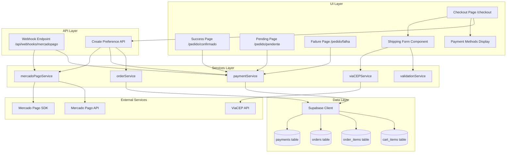
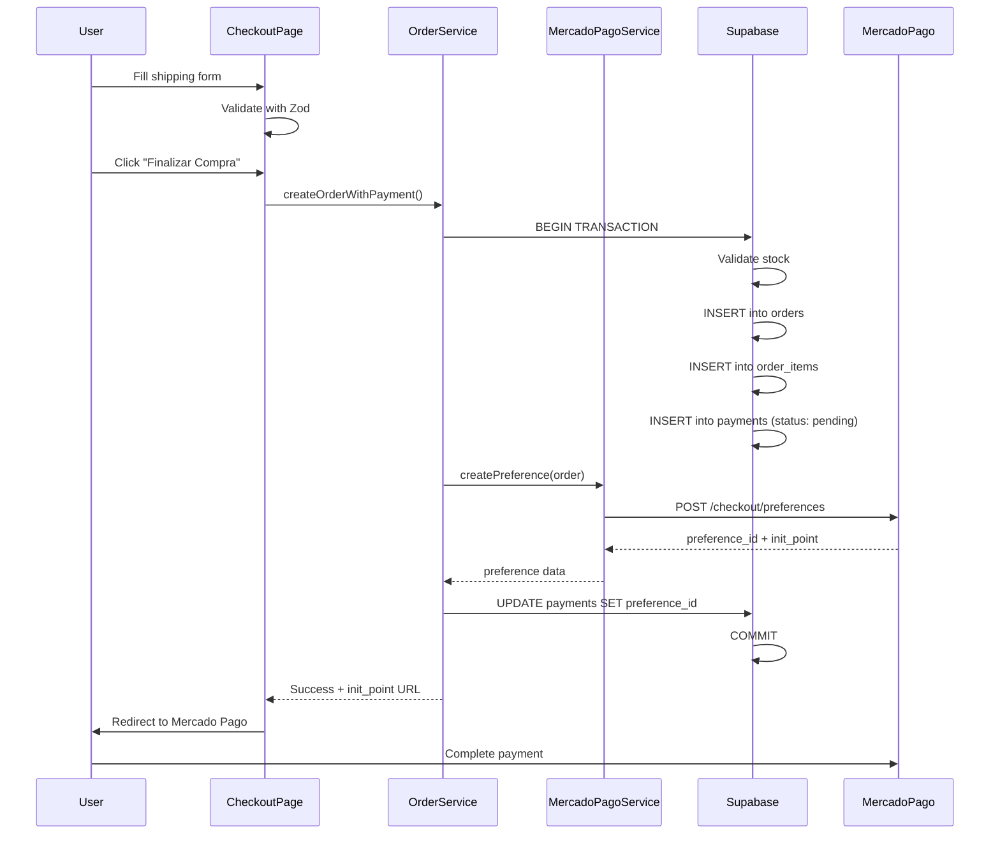
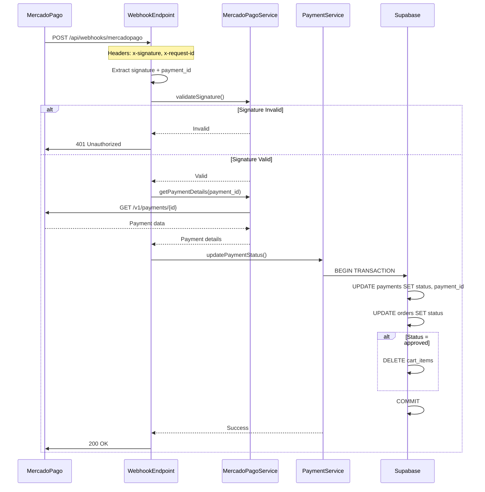
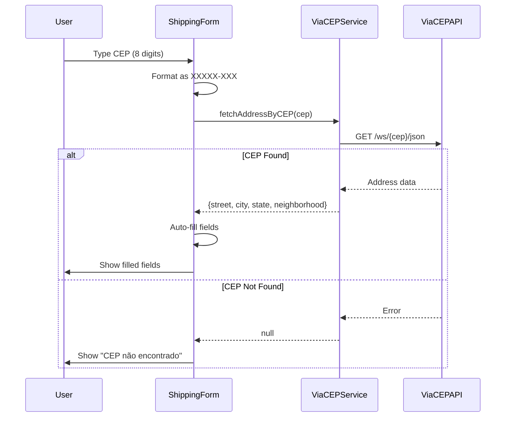
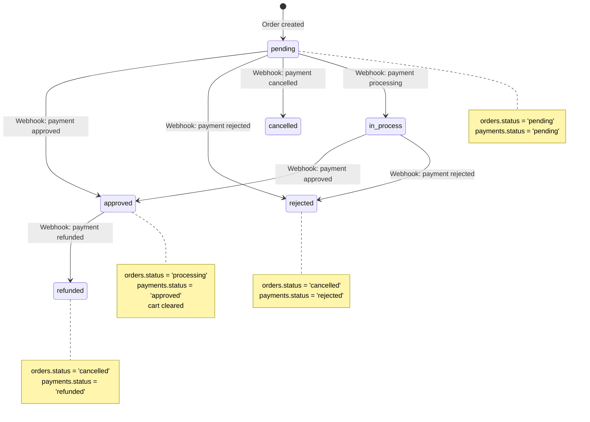

# Design Document: Mercado Pago Checkout Integration

## Overview

A integração do Mercado Pago permite que clientes autenticados finalizem compras usando múltiplos métodos de pagamento (cartão de crédito, PIX, boleto) através da plataforma Mercado Pago. O sistema cria preferências de pagamento, processa webhooks para atualizar status de pedidos, e mantém rastreamento completo de transações.

Esta implementação substitui o método "Pagamento na Entrega" por integração real de pagamento online, mantendo a estrutura de pedidos existente (tabelas `orders` e `order_items`) e adicionando uma nova tabela `payments` para rastreamento de transações do Mercado Pago.

O design segue uma arquitetura de três camadas consistente com as features existentes:
- **Data Layer**: Tabela Supabase `payments` com políticas RLS e constraints
- **Services Layer**: Serviços TypeScript para criação de preferências, processamento de webhooks, e sincronização de status
- **UI Layer**: Componentes React para checkout, páginas de resultado (sucesso/pendente/falha)

### Princípios de Design

1. **Atomic Transactions**: Criação de pedido + registro de pagamento inicial é atômica
2. **Webhook Idempotency**: Processamento de webhooks é idempotente para lidar com reenvios
3. **Security First**: Validação de assinatura de webhooks, credenciais server-side only
4. **Price Snapshots**: Preços capturados no momento da criação do pedido (já existente)
5. **Status Synchronization**: Status de pagamento e pedido mantidos consistentes
6. **Graceful Degradation**: Erros claros, fallbacks, e retry logic
7. **Brazilian Compliance**: Validação de formatos brasileiros (CEP, telefone, estados)
8. **Audit Trail**: Logs de todas as transações e mudanças de status

### Purpose

Esta feature habilita:
- Pagamentos online reais através do Mercado Pago
- Suporte a múltiplos métodos de pagamento (cartão, PIX, boleto)
- Processamento automático de webhooks para atualização de status
- Rastreamento completo de transações
- Páginas de resultado apropriadas para cada status de pagamento
- Integração com CEP via ViaCEP para preenchimento automático de endereço

### Scope

**In Scope:**
- Tabela `payments` com relacionamento 1:1 com `orders`
- SDK do Mercado Pago (Checkout Pro) para criação de preferências
- Webhook endpoint para receber notificações do Mercado Pago
- Validação de assinatura de webhooks (HMAC-SHA256)
- Sincronização de status entre `payments` e `orders`
- Páginas de resultado: sucesso, pendente, falha
- Integração com ViaCEP para preenchimento automático de endereço
- Validação de formatos brasileiros (CEP, telefone, estados)
- Limpeza de carrinho após pagamento aprovado (via webhook)
- Configuração de variáveis de ambiente
- Tratamento de erros e retry logic

**Out of Scope:**
- Mercado Pago Checkout Transparente (cartão direto no site)
- Processamento de reembolsos (manual via dashboard Mercado Pago)
- Cálculo de frete (frete grátis para MVP)
- Descontos e cupons
- Parcelamento customizado (usa configuração padrão do Mercado Pago)
- Notificações por email (feature separada)
- Painel admin para gerenciar pagamentos (feature futura)
- Decremento automático de estoque (feature futura)
- Cancelamento de pedidos por usuários
- Múltiplos endereços de entrega

### Key Design Decisions

1. **Mercado Pago Checkout Pro**: Usar solução hosted (redireciona para página do Mercado Pago) ao invés de Checkout Transparente
2. **Webhook-Driven Updates**: Status de pagamento atualizado via webhooks, não polling
3. **HMAC Signature Validation**: Validar todas as notificações de webhook usando secret
4. **1:1 Payment-Order Relationship**: Cada pedido tem exatamente um registro de pagamento
5. **Preference ID Storage**: Armazenar preference_id para referência futura
6. **Payment ID on Webhook**: payment_id só é conhecido após webhook (não na criação)
7. **Cart Clearing on Approval**: Carrinho limpo apenas quando pagamento aprovado (via webhook)
8. **Status Mapping**: Mapeamento claro entre status Mercado Pago e status de pedido
9. **ViaCEP Integration**: Preenchimento automático de endereço via API brasileira
10. **Server-Side Credentials**: Access token e webhook secret apenas server-side
11. **Idempotent Webhooks**: Usar payment_id como chave de idempotência
12. **Transaction Isolation**: Atualizações de payment + order em transação única
13. **Preference Expiration**: Aceitar expiração padrão de 30 dias do Mercado Pago
14. **Error Recovery**: Mercado Pago retenta webhooks automaticamente (até 12x em 48h)
15. **Brazilian Formats**: Validação rigorosa de CEP, telefone, e estados brasileiros


## Architecture

### High-Level Architecture



### Component Hierarchy

```mermaid
graph TD
    A[App Router] --> B[/checkout - Checkout Page]
    A --> C[/pedido/confirmado - Success Page]
    A --> D[/pedido/pendente - Pending Page]
    A --> E[/pedido/falha - Failure Page]
    A --> F[/api/webhooks/mercadopago - Webhook]
    
    B --> G[Auth Check]
    B --> H[Cart Check]
    B --> I[Shipping Form]
    B --> J[Cart Summary]
    B --> K[Payment Methods Display]
    B --> L[Submit Button]
    
    I --> M[CEP Auto-fill]
    I --> N[Brazilian Format Validation]
    
    C --> O[Order Details]
    C --> P[Payment Status Badge]
    C --> Q[Order Items List]
    
    D --> R[Pending Message]
    D --> S[Payment Method Info]
    
    E --> T[Error Message]
    E --> U[Retry Button]
    
    F --> V[Signature Validation]
    F --> W[Payment Status Update]
    F --> X[Order Status Update]
    F --> Y[Cart Clearing]
```

### Data Flow

**Checkout Flow (Happy Path)**:


**Webhook Processing Flow**:


**CEP Auto-fill Flow**:


**Payment Status Synchronization**:



## Database Schema

### Payments Table

```sql
-- Payments table for Mercado Pago transactions
CREATE TABLE payments (
  id UUID PRIMARY KEY DEFAULT gen_random_uuid(),
  
  -- Foreign key to orders (1:1 relationship)
  order_id UUID NOT NULL UNIQUE REFERENCES orders(id) ON DELETE RESTRICT,
  
  -- Mercado Pago identifiers
  mercadopago_payment_id TEXT NULL, -- Set when webhook received
  mercadopago_preference_id TEXT NOT NULL, -- Set when preference created
  
  -- Payment status
  status TEXT NOT NULL DEFAULT 'pending' CHECK (
    status IN ('pending', 'approved', 'rejected', 'cancelled', 'refunded', 'in_process')
  ),
  
  -- Payment details
  payment_method TEXT NULL, -- e.g., 'credit_card', 'pix', 'boleto'
  amount DECIMAL(10, 2) NOT NULL CHECK (amount >= 0),
  
  -- Timestamps
  created_at TIMESTAMPTZ DEFAULT NOW() NOT NULL,
  updated_at TIMESTAMPTZ DEFAULT NOW() NOT NULL
);

-- Indexes for performance
CREATE INDEX idx_payments_order_id ON payments(order_id);
CREATE INDEX idx_payments_mercadopago_payment_id ON payments(mercadopago_payment_id) WHERE mercadopago_payment_id IS NOT NULL;
CREATE INDEX idx_payments_mercadopago_preference_id ON payments(mercadopago_preference_id);
CREATE INDEX idx_payments_status ON payments(status);

-- Trigger to update updated_at timestamp
CREATE TRIGGER update_payments_updated_at
  BEFORE UPDATE ON payments
  FOR EACH ROW
  EXECUTE FUNCTION update_updated_at_column();

-- Comments
COMMENT ON TABLE payments IS 'Stores Mercado Pago payment transactions linked to orders';
COMMENT ON COLUMN payments.mercadopago_payment_id IS 'Mercado Pago payment ID, set when webhook is received';
COMMENT ON COLUMN payments.mercadopago_preference_id IS 'Mercado Pago preference ID, set when preference is created';
COMMENT ON COLUMN payments.status IS 'Payment status from Mercado Pago: pending, approved, rejected, cancelled, refunded, in_process';
COMMENT ON COLUMN payments.payment_method IS 'Payment method used: credit_card, debit_card, pix, boleto, account_money';
```

### RLS Policies for Payments

```sql
-- Enable RLS
ALTER TABLE payments ENABLE ROW LEVEL SECURITY;

-- Policy: Users can only read payments for their own orders
CREATE POLICY "payments_select_own"
  ON payments FOR SELECT
  USING (
    EXISTS (
      SELECT 1 FROM orders
      WHERE orders.id = payments.order_id
      AND orders.user_id = auth.uid()
    )
  );

-- Policy: Users can only insert payments for their own orders
CREATE POLICY "payments_insert_own"
  ON payments FOR INSERT
  WITH CHECK (
    EXISTS (
      SELECT 1 FROM orders
      WHERE orders.id = payments.order_id
      AND orders.user_id = auth.uid()
    )
  );

-- Policy: Only system (via RPC) or admin can update payments
CREATE POLICY "payments_update_system_or_admin"
  ON payments FOR UPDATE
  USING (
    -- Allow if user is admin
    EXISTS (
      SELECT 1 FROM profiles
      WHERE profiles.id = auth.uid()
      AND profiles.role = 'admin'
    )
    -- Or allow if user owns the order (for webhook processing)
    OR EXISTS (
      SELECT 1 FROM orders
      WHERE orders.id = payments.order_id
      AND orders.user_id = auth.uid()
    )
  );

-- Policy: Only admins can delete payments
CREATE POLICY "payments_delete_admin"
  ON payments FOR DELETE
  USING (
    EXISTS (
      SELECT 1 FROM profiles
      WHERE profiles.id = auth.uid()
      AND profiles.role = 'admin'
    )
  );
```

### Update Orders Table for Mercado Pago

```sql
-- Update payment_method CHECK constraint to include Mercado Pago methods
ALTER TABLE orders DROP CONSTRAINT IF EXISTS orders_payment_method_check;

ALTER TABLE orders ADD CONSTRAINT orders_payment_method_check
  CHECK (payment_method IN (
    'cash_on_delivery',
    'mercadopago_credit_card',
    'mercadopago_debit_card',
    'mercadopago_pix',
    'mercadopago_boleto',
    'mercadopago_account_money'
  ));

-- Update default to mercadopago
ALTER TABLE orders ALTER COLUMN payment_method SET DEFAULT 'mercadopago_credit_card';
```

### Atomic Order Creation with Payment RPC Function

```sql
-- Enhanced RPC function to create order + payment atomically
CREATE OR REPLACE FUNCTION create_order_with_payment_atomic(
  p_user_id UUID,
  p_shipping_name TEXT,
  p_shipping_address TEXT,
  p_shipping_city TEXT,
  p_shipping_state TEXT,
  p_shipping_zip TEXT,
  p_shipping_phone TEXT,
  p_shipping_email TEXT,
  p_payment_method TEXT,
  p_mercadopago_preference_id TEXT
)
RETURNS JSONB AS $$
DECLARE
  v_order_id UUID;
  v_cart_item RECORD;
  v_product RECORD;
  v_total_amount DECIMAL(10, 2) := 0;
  v_item_count INTEGER := 0;
  v_subtotal DECIMAL(10, 2);
  v_payment_id UUID;
BEGIN
  -- Validate cart is not empty
  SELECT COUNT(*) INTO v_item_count
  FROM cart_items
  WHERE user_id = p_user_id;
  
  IF v_item_count = 0 THEN
    RETURN jsonb_build_object(
      'success', false,
      'error', 'Cart is empty'
    );
  END IF;
  
  -- Create order record
  INSERT INTO orders (
    user_id,
    status,
    total_amount,
    shipping_name,
    shipping_address,
    shipping_city,
    shipping_state,
    shipping_zip,
    shipping_phone,
    shipping_email,
    payment_method
  )
  VALUES (
    p_user_id,
    'pending',
    0, -- Will be updated after calculating items
    p_shipping_name,
    p_shipping_address,
    p_shipping_city,
    p_shipping_state,
    p_shipping_zip,
    p_shipping_phone,
    p_shipping_email,
    p_payment_method
  )
  RETURNING id INTO v_order_id;
  
  -- Process each cart item
  FOR v_cart_item IN
    SELECT * FROM cart_items WHERE user_id = p_user_id
  LOOP
    -- Fetch current product data
    SELECT id, name, price, stock INTO v_product
    FROM products
    WHERE id = v_cart_item.product_id
    AND deleted_at IS NULL;
    
    -- Validate product exists
    IF NOT FOUND THEN
      RAISE EXCEPTION 'Product % not found', v_cart_item.product_id;
    END IF;
    
    -- Validate stock availability
    IF v_product.stock < v_cart_item.quantity THEN
      RAISE EXCEPTION 'Product % has insufficient stock (available: %, requested: %)',
        v_product.name, v_product.stock, v_cart_item.quantity;
    END IF;
    
    -- Calculate subtotal
    v_subtotal := v_product.price * v_cart_item.quantity;
    v_total_amount := v_total_amount + v_subtotal;
    
    -- Insert order item with price snapshot
    INSERT INTO order_items (
      order_id,
      product_id,
      product_name,
      product_price,
      quantity,
      size,
      subtotal
    )
    VALUES (
      v_order_id,
      v_product.id,
      v_product.name,
      v_product.price,
      v_cart_item.quantity,
      v_cart_item.size,
      v_subtotal
    );
  END LOOP;
  
  -- Update order total
  UPDATE orders
  SET total_amount = v_total_amount
  WHERE id = v_order_id;
  
  -- Create payment record
  INSERT INTO payments (
    order_id,
    mercadopago_preference_id,
    status,
    amount
  )
  VALUES (
    v_order_id,
    p_mercadopago_preference_id,
    'pending',
    v_total_amount
  )
  RETURNING id INTO v_payment_id;
  
  -- NOTE: Cart is NOT cleared here - it will be cleared by webhook when payment is approved
  
  -- Return success with order and payment data
  RETURN jsonb_build_object(
    'success', true,
    'order_id', v_order_id,
    'payment_id', v_payment_id,
    'total_amount', v_total_amount,
    'item_count', v_item_count
  );
  
EXCEPTION
  WHEN OTHERS THEN
    -- Rollback happens automatically
    RETURN jsonb_build_object(
      'success', false,
      'error', SQLERRM
    );
END;
$$ LANGUAGE plpgsql SECURITY DEFINER;

COMMENT ON FUNCTION create_order_with_payment_atomic IS 'Atomically creates order with items and initial payment record';
```

### Webhook Payment Update RPC Function

```sql
-- RPC function to update payment status from webhook (idempotent)
CREATE OR REPLACE FUNCTION update_payment_from_webhook(
  p_mercadopago_payment_id TEXT,
  p_status TEXT,
  p_payment_method TEXT
)
RETURNS JSONB AS $$
DECLARE
  v_payment RECORD;
  v_order_id UUID;
  v_new_order_status TEXT;
BEGIN
  -- Find payment by mercadopago_payment_id or preference_id
  SELECT * INTO v_payment
  FROM payments
  WHERE mercadopago_payment_id = p_mercadopago_payment_id
     OR (mercadopago_payment_id IS NULL AND id IN (
       SELECT id FROM payments WHERE mercadopago_preference_id IN (
         SELECT mercadopago_preference_id FROM payments WHERE mercadopago_payment_id = p_mercadopago_payment_id
       )
     ))
  LIMIT 1;
  
  IF NOT FOUND THEN
    RETURN jsonb_build_object(
      'success', false,
      'error', 'Payment not found'
    );
  END IF;
  
  v_order_id := v_payment.order_id;
  
  -- Determine new order status based on payment status
  CASE p_status
    WHEN 'approved' THEN
      v_new_order_status := 'processing';
    WHEN 'rejected', 'cancelled', 'refunded' THEN
      v_new_order_status := 'cancelled';
    ELSE
      v_new_order_status := 'pending';
  END CASE;
  
  -- Update payment record
  UPDATE payments
  SET 
    mercadopago_payment_id = p_mercadopago_payment_id,
    status = p_status,
    payment_method = p_payment_method,
    updated_at = NOW()
  WHERE id = v_payment.id;
  
  -- Update order status
  UPDATE orders
  SET 
    status = v_new_order_status,
    updated_at = NOW()
  WHERE id = v_order_id;
  
  -- Clear cart if payment approved
  IF p_status = 'approved' THEN
    DELETE FROM cart_items
    WHERE user_id = (SELECT user_id FROM orders WHERE id = v_order_id);
  END IF;
  
  RETURN jsonb_build_object(
    'success', true,
    'payment_id', v_payment.id,
    'order_id', v_order_id,
    'old_status', v_payment.status,
    'new_status', p_status,
    'order_status', v_new_order_status
  );
  
EXCEPTION
  WHEN OTHERS THEN
    RETURN jsonb_build_object(
      'success', false,
      'error', SQLERRM
    );
END;
$$ LANGUAGE plpgsql SECURITY DEFINER;

COMMENT ON FUNCTION update_payment_from_webhook IS 'Updates payment and order status from Mercado Pago webhook (idempotent)';
```

### Database Constraints Summary

| Constraint | Table | Purpose |
|------------|-------|---------|
| `order_id UNIQUE` | payments | Ensures 1:1 relationship between order and payment |
| `order_id FK RESTRICT` | payments | Prevents order deletion if payment exists |
| `status CHECK` | payments | Validates payment status values |
| `amount CHECK` | payments | Ensures non-negative amount |
| `mercadopago_payment_id INDEX` | payments | Fast webhook lookups by payment_id |
| `mercadopago_preference_id INDEX` | payments | Fast lookups by preference_id |
| `payment_method CHECK` | orders | Updated to include Mercado Pago methods |


## Data Models

### TypeScript Interfaces

```typescript
// Payment entity
interface Payment {
  id: string;
  orderId: string;
  mercadopagoPaymentId: string | null;
  mercadopagoPreferenceId: string;
  status: 'pending' | 'approved' | 'rejected' | 'cancelled' | 'refunded' | 'in_process';
  paymentMethod: string | null;
  amount: number;
  createdAt: string;
  updatedAt: string;
  order?: Order; // Joined data
}

// Mercado Pago preference request
interface PreferenceRequest {
  items: Array<{
    title: string;
    quantity: number;
    unit_price: number;
    currency_id: string;
  }>;
  payer: {
    email: string;
    name: string;
    phone: {
      area_code: string;
      number: string;
    };
  };
  back_urls: {
    success: string;
    failure: string;
    pending: string;
  };
  auto_return: 'approved' | 'all';
  external_reference: string;
  notification_url: string;
  statement_descriptor: string;
  payment_methods?: {
    excluded_payment_types?: Array<{ id: string }>;
    installments?: number;
  };
}

// Mercado Pago preference response
interface PreferenceResponse {
  id: string; // preference_id
  init_point: string; // URL to redirect user
  sandbox_init_point: string;
  date_created: string;
  external_reference: string;
}

// Mercado Pago payment details
interface MercadoPagoPayment {
  id: number;
  status: string;
  status_detail: string;
  payment_method_id: string;
  payment_type_id: string;
  transaction_amount: number;
  currency_id: string;
  date_created: string;
  date_approved: string | null;
  external_reference: string;
  payer: {
    email: string;
    identification: {
      type: string;
      number: string;
    };
  };
}

// Webhook notification payload
interface WebhookNotification {
  action: string;
  api_version: string;
  data: {
    id: string; // payment_id
  };
  date_created: string;
  id: number;
  live_mode: boolean;
  type: 'payment' | 'plan' | 'subscription' | 'invoice';
  user_id: string;
}

// Webhook signature validation
interface WebhookSignature {
  ts: string; // timestamp
  v1: string; // HMAC-SHA256 hash
}

// Order creation with payment
interface CreateOrderWithPaymentRequest {
  userId: string;
  shippingInfo: ShippingFormValues;
  paymentMethod: string;
}

interface CreateOrderWithPaymentResponse {
  success: boolean;
  orderId?: string;
  paymentId?: string;
  preferenceId?: string;
  initPoint?: string;
  totalAmount?: number;
  itemCount?: number;
  error?: string;
}

// Payment status update
interface UpdatePaymentStatusRequest {
  mercadopagoPaymentId: string;
  status: Payment['status'];
  paymentMethod: string;
}

interface UpdatePaymentStatusResponse {
  success: boolean;
  paymentId?: string;
  orderId?: string;
  oldStatus?: string;
  newStatus?: string;
  orderStatus?: string;
  error?: string;
}

// ViaCEP response
interface ViaCEPResponse {
  cep: string;
  logradouro: string; // street
  complemento: string;
  bairro: string; // neighborhood
  localidade: string; // city
  uf: string; // state
  ibge: string;
  gia: string;
  ddd: string;
  siafi: string;
  erro?: boolean;
}

// Address data from ViaCEP
interface AddressData {
  street: string;
  neighborhood: string;
  city: string;
  state: string;
}

// Database row types (snake_case from Supabase)
interface PaymentRow {
  id: string;
  order_id: string;
  mercadopago_payment_id: string | null;
  mercadopago_preference_id: string;
  status: string;
  payment_method: string | null;
  amount: number;
  created_at: string;
  updated_at: string;
}

// Shipping form values (reused from basic-checkout)
interface ShippingFormValues {
  shippingName: string;
  shippingAddress: string;
  shippingCity: string;
  shippingState: string;
  shippingZip: string;
  shippingPhone: string;
  shippingEmail: string;
}
```

### Zod Validation Schemas

```typescript
import { z } from 'zod';

// Brazilian state codes
const BRAZILIAN_STATES = [
  'AC', 'AL', 'AP', 'AM', 'BA', 'CE', 'DF', 'ES', 'GO', 'MA',
  'MT', 'MS', 'MG', 'PA', 'PB', 'PR', 'PE', 'PI', 'RJ', 'RN',
  'RS', 'RO', 'RR', 'SC', 'SP', 'SE', 'TO'
] as const;

// Payment status validation
export const paymentStatusSchema = z.enum([
  'pending',
  'approved',
  'rejected',
  'cancelled',
  'refunded',
  'in_process'
]);

// Mercado Pago payment method validation
export const mercadopagoPaymentMethodSchema = z.enum([
  'credit_card',
  'debit_card',
  'pix',
  'boleto',
  'account_money'
]);

// Shipping form validation (Brazilian formats)
export const shippingFormSchema = z.object({
  shippingName: z.string()
    .min(1, 'Nome é obrigatório')
    .max(200, 'Nome deve ter no máximo 200 caracteres')
    .regex(/^[a-zA-ZÀ-ÿ\s]+$/, 'Nome deve conter apenas letras'),
  
  shippingAddress: z.string()
    .min(1, 'Endereço é obrigatório')
    .max(500, 'Endereço deve ter no máximo 500 caracteres'),
  
  shippingCity: z.string()
    .min(1, 'Cidade é obrigatória')
    .max(100, 'Cidade deve ter no máximo 100 caracteres')
    .regex(/^[a-zA-ZÀ-ÿ\s]+$/, 'Cidade deve conter apenas letras'),
  
  shippingState: z.enum(BRAZILIAN_STATES, {
    errorMap: () => ({ message: 'Estado inválido' })
  }),
  
  shippingZip: z.string()
    .regex(/^\d{5}-\d{3}$/, 'CEP deve estar no formato XXXXX-XXX'),
  
  shippingPhone: z.string()
    .regex(/^\(\d{2}\) \d{4,5}-\d{4}$/, 'Telefone deve estar no formato (XX) XXXXX-XXXX'),
  
  shippingEmail: z.string()
    .email('Email inválido')
    .max(200, 'Email deve ter no máximo 200 caracteres'),
});

// Webhook notification validation
export const webhookNotificationSchema = z.object({
  action: z.string(),
  api_version: z.string(),
  data: z.object({
    id: z.string(),
  }),
  date_created: z.string(),
  id: z.number(),
  live_mode: z.boolean(),
  type: z.enum(['payment', 'plan', 'subscription', 'invoice']),
  user_id: z.string(),
});

// Environment variables validation
export const mercadopagoEnvSchema = z.object({
  MERCADOPAGO_ACCESS_TOKEN: z.string()
    .min(1, 'MERCADOPAGO_ACCESS_TOKEN is required')
    .startsWith('APP_USR-', 'Invalid Mercado Pago access token format'),
  
  MERCADOPAGO_WEBHOOK_SECRET: z.string()
    .min(1, 'MERCADOPAGO_WEBHOOK_SECRET is required'),
  
  NEXT_PUBLIC_APP_URL: z.string()
    .url('NEXT_PUBLIC_APP_URL must be a valid URL'),
});

// CEP validation and formatting
export const cepSchema = z.string()
  .transform((val) => val.replace(/\D/g, '')) // Remove non-digits
  .refine((val) => val.length === 8, 'CEP deve ter 8 dígitos')
  .transform((val) => `${val.slice(0, 5)}-${val.slice(5)}`); // Format as XXXXX-XXX

// Phone validation and formatting
export const phoneSchema = z.string()
  .transform((val) => val.replace(/\D/g, '')) // Remove non-digits
  .refine((val) => val.length >= 10 && val.length <= 11, 'Telefone deve ter 10 ou 11 dígitos')
  .transform((val) => {
    const ddd = val.slice(0, 2);
    const number = val.slice(2);
    if (number.length === 8) {
      return `(${ddd}) ${number.slice(0, 4)}-${number.slice(4)}`;
    } else {
      return `(${ddd}) ${number.slice(0, 5)}-${number.slice(5)}`;
    }
  });
```


## Services Layer

### Mercado Pago Service

**Location**: `apps/web/src/modules/payment/services/mercadoPagoService.ts`

**Responsibilities:**
- Initialize Mercado Pago SDK with credentials
- Create payment preferences
- Fetch payment details from Mercado Pago API
- Validate webhook signatures (HMAC-SHA256)
- Handle Mercado Pago API errors

**Interface:**
```typescript
import { MercadoPago, Preference, Payment } from 'mercadopago';
import crypto from 'crypto';

// Initialize SDK (singleton)
let mercadoPagoClient: MercadoPago | null = null;

function getMercadoPagoClient(): MercadoPago {
  if (!mercadoPagoClient) {
    const accessToken = process.env.MERCADOPAGO_ACCESS_TOKEN;
    
    if (!accessToken) {
      throw new Error('MERCADOPAGO_ACCESS_TOKEN is not configured');
    }
    
    if (!accessToken.startsWith('APP_USR-')) {
      throw new Error('Invalid MERCADOPAGO_ACCESS_TOKEN format');
    }
    
    mercadoPagoClient = new MercadoPago({
      accessToken,
      options: {
        timeout: 5000,
        idempotencyKey: crypto.randomUUID(),
      },
    });
  }
  
  return mercadoPagoClient;
}

export const mercadoPagoService = {
  /**
   * Create payment preference
   */
  async createPreference(request: PreferenceRequest): Promise<PreferenceResponse> {
    const client = getMercadoPagoClient();
    
    try {
      const preference = new Preference(client);
      
      const response = await preference.create({
        body: request,
      });
      
      return {
        id: response.id!,
        init_point: response.init_point!,
        sandbox_init_point: response.sandbox_init_point!,
        date_created: response.date_created!,
        external_reference: response.external_reference!,
      };
    } catch (error: any) {
      console.error('Mercado Pago preference creation failed:', error);
      throw new Error(`Failed to create payment preference: ${error.message}`);
    }
  },
  
  /**
   * Get payment details by payment ID
   */
  async getPaymentDetails(paymentId: string): Promise<MercadoPagoPayment> {
    const client = getMercadoPagoClient();
    
    try {
      const payment = new Payment(client);
      const response = await payment.get({ id: paymentId });
      
      return {
        id: response.id!,
        status: response.status!,
        status_detail: response.status_detail!,
        payment_method_id: response.payment_method_id!,
        payment_type_id: response.payment_type_id!,
        transaction_amount: response.transaction_amount!,
        currency_id: response.currency_id!,
        date_created: response.date_created!,
        date_approved: response.date_approved || null,
        external_reference: response.external_reference!,
        payer: {
          email: response.payer?.email!,
          identification: {
            type: response.payer?.identification?.type!,
            number: response.payer?.identification?.number!,
          },
        },
      };
    } catch (error: any) {
      console.error('Failed to fetch payment details:', error);
      throw new Error(`Failed to fetch payment details: ${error.message}`);
    }
  },
  
  /**
   * Validate webhook signature using HMAC-SHA256
   * 
   * Mercado Pago sends signature in x-signature header:
   * ts=1234567890,v1=abc123def456...
   * 
   * Manifest format: id:{data.id};request-id:{x-request-id};ts:{ts};
   */
  validateWebhookSignature(
    signature: string,
    requestId: string,
    dataId: string
  ): boolean {
    const webhookSecret = process.env.MERCADOPAGO_WEBHOOK_SECRET;
    
    if (!webhookSecret) {
      throw new Error('MERCADOPAGO_WEBHOOK_SECRET is not configured');
    }
    
    try {
      // Parse signature header: ts=1234567890,v1=abc123...
      const parts = signature.split(',');
      const tsMatch = parts.find((p) => p.startsWith('ts='));
      const v1Match = parts.find((p) => p.startsWith('v1='));
      
      if (!tsMatch || !v1Match) {
        console.error('Invalid signature format');
        return false;
      }
      
      const ts = tsMatch.split('=')[1];
      const receivedHash = v1Match.split('=')[1];
      
      // Construct manifest: id:{data.id};request-id:{x-request-id};ts:{ts};
      const manifest = `id:${dataId};request-id:${requestId};ts:${ts};`;
      
      // Compute HMAC-SHA256
      const computedHash = crypto
        .createHmac('sha256', webhookSecret)
        .update(manifest)
        .digest('hex');
      
      // Compare hashes (constant-time comparison)
      return crypto.timingSafeEqual(
        Buffer.from(receivedHash, 'hex'),
        Buffer.from(computedHash, 'hex')
      );
    } catch (error) {
      console.error('Signature validation error:', error);
      return false;
    }
  },
  
  /**
   * Build preference request from order data
   */
  buildPreferenceRequest(
    order: Order,
    items: OrderItem[],
    shippingInfo: ShippingFormValues
  ): PreferenceRequest {
    const appUrl = process.env.NEXT_PUBLIC_APP_URL;
    
    if (!appUrl) {
      throw new Error('NEXT_PUBLIC_APP_URL is not configured');
    }
    
    // Parse phone: (XX) XXXXX-XXXX -> area_code: XX, number: XXXXXXXXX
    const phoneMatch = shippingInfo.shippingPhone.match(/\((\d{2})\) (\d{4,5})-(\d{4})/);
    const areaCode = phoneMatch?.[1] || '';
    const phoneNumber = phoneMatch ? `${phoneMatch[2]}${phoneMatch[3]}` : '';
    
    return {
      items: items.map((item) => ({
        title: item.productName,
        quantity: item.quantity,
        unit_price: item.productPrice,
        currency_id: 'BRL',
      })),
      payer: {
        email: shippingInfo.shippingEmail,
        name: shippingInfo.shippingName,
        phone: {
          area_code: areaCode,
          number: phoneNumber,
        },
      },
      back_urls: {
        success: `${appUrl}/pedido/confirmado`,
        failure: `${appUrl}/pedido/falha`,
        pending: `${appUrl}/pedido/pendente`,
      },
      auto_return: 'approved',
      external_reference: order.id,
      notification_url: `${appUrl}/api/webhooks/mercadopago`,
      statement_descriptor: 'AGON MVP',
      payment_methods: {
        excluded_payment_types: [], // Allow all payment methods
        installments: 12, // Allow up to 12 installments
      },
    };
  },
};
```

### Payment Service

**Location**: `apps/web/src/modules/payment/services/paymentService.ts`

**Responsibilities:**
- CRUD operations for payments table
- Update payment status from webhooks
- Synchronize payment and order status
- Data transformation (snake_case ↔ camelCase)

**Interface:**
```typescript
import { createClient } from '@/lib/supabase/client';
import { createClient as createServerClient } from '@/lib/supabase/server';

export const paymentService = {
  /**
   * Get payment by order ID
   */
  async getPaymentByOrderId(orderId: string): Promise<Payment | null> {
    const supabase = createClient();
    
    const { data, error } = await supabase
      .from('payments')
      .select('*, order:orders(*)')
      .eq('order_id', orderId)
      .single();
    
    if (error) {
      if (error.code === 'PGRST116') return null; // Not found
      throw error;
    }
    
    return transformPaymentRow(data);
  },
  
  /**
   * Get payment by Mercado Pago payment ID
   */
  async getPaymentByMercadoPagoId(paymentId: string): Promise<Payment | null> {
    const supabase = createClient();
    
    const { data, error } = await supabase
      .from('payments')
      .select('*, order:orders(*)')
      .eq('mercadopago_payment_id', paymentId)
      .single();
    
    if (error) {
      if (error.code === 'PGRST116') return null;
      throw error;
    }
    
    return transformPaymentRow(data);
  },
  
  /**
   * Get payment by Mercado Pago preference ID
   */
  async getPaymentByPreferenceId(preferenceId: string): Promise<Payment | null> {
    const supabase = createClient();
    
    const { data, error } = await supabase
      .from('payments')
      .select('*, order:orders(*)')
      .eq('mercadopago_preference_id', preferenceId)
      .single();
    
    if (error) {
      if (error.code === 'PGRST116') return null;
      throw error;
    }
    
    return transformPaymentRow(data);
  },
  
  /**
   * Update payment status from webhook (server-side only)
   * Uses RPC function for atomic update of payment + order + cart
   */
  async updatePaymentFromWebhook(
    mercadopagoPaymentId: string,
    status: Payment['status'],
    paymentMethod: string
  ): Promise<UpdatePaymentStatusResponse> {
    const supabase = await createServerClient();
    
    const { data, error } = await supabase.rpc('update_payment_from_webhook', {
      p_mercadopago_payment_id: mercadopagoPaymentId,
      p_status: status,
      p_payment_method: paymentMethod,
    });
    
    if (error) {
      console.error('Failed to update payment from webhook:', error);
      throw error;
    }
    
    const result = data as UpdatePaymentStatusResponse;
    
    if (!result.success) {
      throw new Error(result.error || 'Failed to update payment');
    }
    
    return result;
  },
  
  /**
   * Create initial payment record (called by order creation RPC)
   * This is typically not called directly - use orderService.createOrderWithPayment
   */
  async createPayment(
    orderId: string,
    preferenceId: string,
    amount: number
  ): Promise<Payment> {
    const supabase = createClient();
    
    const { data, error } = await supabase
      .from('payments')
      .insert({
        order_id: orderId,
        mercadopago_preference_id: preferenceId,
        status: 'pending',
        amount,
      })
      .select('*')
      .single();
    
    if (error) throw error;
    
    return transformPaymentRow(data);
  },
  
  /**
   * Get user's payments (paginated)
   */
  async getUserPayments(
    userId: string,
    page: number = 1,
    limit: number = 10
  ): Promise<{ payments: Payment[]; total: number }> {
    const supabase = createClient();
    
    const from = (page - 1) * limit;
    const to = from + limit - 1;
    
    const { data, error, count } = await supabase
      .from('payments')
      .select('*, order:orders!inner(*)', { count: 'exact' })
      .eq('order.user_id', userId)
      .order('created_at', { ascending: false })
      .range(from, to);
    
    if (error) throw error;
    
    return {
      payments: data.map(transformPaymentRow),
      total: count || 0,
    };
  },
};

// Helper function to transform database row to Payment
function transformPaymentRow(row: any): Payment {
  return {
    id: row.id,
    orderId: row.order_id,
    mercadopagoPaymentId: row.mercadopago_payment_id,
    mercadopagoPreferenceId: row.mercadopago_preference_id,
    status: row.status as Payment['status'],
    paymentMethod: row.payment_method,
    amount: parseFloat(row.amount),
    createdAt: row.created_at,
    updatedAt: row.updated_at,
    order: row.order ? {
      id: row.order.id,
      userId: row.order.user_id,
      status: row.order.status,
      totalAmount: parseFloat(row.order.total_amount),
      shippingName: row.order.shipping_name,
      shippingAddress: row.order.shipping_address,
      shippingCity: row.order.shipping_city,
      shippingState: row.order.shipping_state,
      shippingZip: row.order.shipping_zip,
      shippingPhone: row.order.shipping_phone,
      shippingEmail: row.order.shipping_email,
      paymentMethod: row.order.payment_method,
      createdAt: row.order.created_at,
      updatedAt: row.order.updated_at,
    } : undefined,
  };
}
```

### ViaCEP Service

**Location**: `apps/web/src/modules/checkout/services/viaCEPService.ts`

**Responsibilities:**
- Fetch address data from ViaCEP API
- Validate and format CEP
- Handle API errors gracefully

**Interface:**
```typescript
export const viaCEPService = {
  /**
   * Fetch address data by CEP
   * Returns null if CEP not found or API error
   */
  async fetchAddressByCEP(cep: string): Promise<AddressData | null> {
    // Remove non-digits
    const cleanedCEP = cep.replace(/\D/g, '');
    
    if (cleanedCEP.length !== 8) {
      return null;
    }
    
    try {
      const response = await fetch(
        `https://viacep.com.br/ws/${cleanedCEP}/json/`,
        {
          method: 'GET',
          headers: {
            'Accept': 'application/json',
          },
        }
      );
      
      if (!response.ok) {
        console.error('ViaCEP API error:', response.status);
        return null;
      }
      
      const data: ViaCEPResponse = await response.json();
      
      // Check if CEP was not found
      if (data.erro) {
        return null;
      }
      
      return {
        street: data.logradouro || '',
        neighborhood: data.bairro || '',
        city: data.localidade || '',
        state: data.uf || '',
      };
    } catch (error) {
      console.error('Failed to fetch CEP data:', error);
      return null;
    }
  },
  
  /**
   * Validate CEP format
   */
  validateCEP(cep: string): boolean {
    const cleaned = cep.replace(/\D/g, '');
    return cleaned.length === 8;
  },
  
  /**
   * Format CEP as XXXXX-XXX
   */
  formatCEP(cep: string): string {
    const cleaned = cep.replace(/\D/g, '');
    
    if (cleaned.length !== 8) {
      return cep;
    }
    
    return `${cleaned.slice(0, 5)}-${cleaned.slice(5)}`;
  },
};
```

### Validation Service

**Location**: `apps/web/src/modules/checkout/services/validationService.ts`

**Responsibilities:**
- Brazilian-specific validation (CEP, phone, states)
- Format masking and unmasking
- Input sanitization

**Interface:**
```typescript
export const validationService = {
  /**
   * Validate and format CEP
   */
  validateCEP(cep: string): { valid: boolean; formatted: string } {
    const cleaned = cep.replace(/\D/g, '');
    
    if (cleaned.length !== 8) {
      return { valid: false, formatted: cep };
    }
    
    const formatted = `${cleaned.slice(0, 5)}-${cleaned.slice(5)}`;
    return { valid: true, formatted };
  },
  
  /**
   * Validate and format phone
   */
  validatePhone(phone: string): { valid: boolean; formatted: string } {
    const cleaned = phone.replace(/\D/g, '');
    
    if (cleaned.length < 10 || cleaned.length > 11) {
      return { valid: false, formatted: phone };
    }
    
    const ddd = cleaned.slice(0, 2);
    const number = cleaned.slice(2);
    
    if (number.length === 8) {
      // Landline: (XX) XXXX-XXXX
      const formatted = `(${ddd}) ${number.slice(0, 4)}-${number.slice(4)}`;
      return { valid: true, formatted };
    } else {
      // Mobile: (XX) XXXXX-XXXX
      const formatted = `(${ddd}) ${number.slice(0, 5)}-${number.slice(5)}`;
      return { valid: true, formatted };
    }
  },
  
  /**
   * Validate Brazilian state code
   */
  validateState(state: string): boolean {
    return BRAZILIAN_STATES.includes(state as any);
  },
  
  /**
   * Format currency as Brazilian Real
   */
  formatCurrency(amount: number): string {
    return new Intl.NumberFormat('pt-BR', {
      style: 'currency',
      currency: 'BRL',
    }).format(amount);
  },
  
  /**
   * Sanitize input (remove dangerous characters)
   */
  sanitizeInput(input: string): string {
    return input
      .replace(/<script[^>]*>.*?<\/script>/gi, '')
      .replace(/<[^>]+>/g, '')
      .trim();
  },
};
```


## Components and Interfaces

### Checkout Page Enhancement

**Location**: `apps/web/src/app/checkout/page.tsx` (enhanced)

**Changes:**
- Update to use Mercado Pago payment flow
- Remove "Pagamento na Entrega" option
- Add Mercado Pago payment methods display
- Integrate ViaCEP for address auto-fill

**Implementation:**
```typescript
// Server component (existing structure, enhanced)
export default async function CheckoutPage() {
  const supabase = await createClient();
  
  // Check authentication (existing)
  const { data: { user }, error: authError } = await supabase.auth.getUser();
  
  if (authError || !user) {
    redirect('/login?redirect=/checkout');
  }
  
  // Fetch cart items (existing)
  const { data: cartData, error: cartError } = await supabase
    .from('cart_items')
    .select('*, product:products(*)')
    .eq('user_id', user.id)
    .order('created_at', { ascending: false });
  
  if (cartError || !cartData || cartData.length === 0) {
    redirect('/cart');
  }
  
  // Transform cart items (existing)
  const checkoutItems = cartData.map((item: any) => ({
    id: item.id,
    productId: item.product_id,
    productName: item.product?.name || item.product_name_snapshot,
    productPrice: item.product?.price ? parseFloat(item.product.price) : parseFloat(item.price_snapshot),
    quantity: item.quantity,
    size: item.size,
    imageUrl: item.product?.image_url,
  }));
  
  return (
    <CheckoutPageClient 
      cartItems={checkoutItems}
      userEmail={user.email}
      userId={user.id}
    />
  );
}
```

### Checkout Page Client Component

**Location**: `apps/web/src/modules/checkout/components/CheckoutPageClient.tsx` (enhanced)

**Responsibilities:**
- Render shipping form with ViaCEP integration
- Display cart summary
- Display Mercado Pago payment methods
- Handle form submission and redirect to Mercado Pago
- Show loading states and errors

**Key Features:**
- CEP auto-fill on blur
- Brazilian format validation
- Optimistic UI feedback
- Error handling with toast notifications

### Shipping Form Component

**Location**: `apps/web/src/modules/checkout/components/ShippingForm.tsx`

**Responsibilities:**
- Render form fields with validation
- Integrate ViaCEP for CEP auto-fill
- Format inputs (CEP, phone) on change
- Display inline validation errors

**Implementation:**
```typescript
'use client';

import { useForm } from 'react-hook-form';
import { zodResolver } from '@hookform/resolvers/zod';
import { shippingFormSchema } from '../contracts';
import { viaCEPService } from '../services/viaCEPService';
import { validationService } from '../services/validationService';
import { useState } from 'react';

interface ShippingFormProps {
  defaultEmail?: string;
  onSubmit: (values: ShippingFormValues) => void;
  isLoading: boolean;
}

export function ShippingForm({ defaultEmail, onSubmit, isLoading }: ShippingFormProps) {
  const [cepLoading, setCepLoading] = useState(false);
  const [cepError, setCepError] = useState<string | null>(null);
  
  const form = useForm<ShippingFormValues>({
    resolver: zodResolver(shippingFormSchema),
    defaultValues: {
      shippingEmail: defaultEmail || '',
      shippingName: '',
      shippingAddress: '',
      shippingCity: '',
      shippingState: '',
      shippingZip: '',
      shippingPhone: '',
    },
  });
  
  // Handle CEP blur - fetch address data
  const handleCEPBlur = async (cep: string) => {
    const validation = validationService.validateCEP(cep);
    
    if (!validation.valid) {
      setCepError('CEP inválido');
      return;
    }
    
    setCepLoading(true);
    setCepError(null);
    
    const addressData = await viaCEPService.fetchAddressByCEP(validation.formatted);
    
    setCepLoading(false);
    
    if (!addressData) {
      setCepError('CEP não encontrado. Preencha manualmente.');
      return;
    }
    
    // Auto-fill fields
    if (addressData.street) {
      form.setValue('shippingAddress', addressData.street);
    }
    if (addressData.city) {
      form.setValue('shippingCity', addressData.city);
    }
    if (addressData.state) {
      form.setValue('shippingState', addressData.state);
    }
  };
  
  // Handle CEP change - format on type
  const handleCEPChange = (value: string) => {
    const validation = validationService.validateCEP(value);
    form.setValue('shippingZip', validation.formatted);
  };
  
  // Handle phone change - format on type
  const handlePhoneChange = (value: string) => {
    const validation = validationService.validatePhone(value);
    form.setValue('shippingPhone', validation.formatted);
  };
  
  return (
    <form onSubmit={form.handleSubmit(onSubmit)} className="space-y-4">
      {/* Name field */}
      <div>
        <label htmlFor="shippingName" className="block text-sm font-medium">
          Nome completo
        </label>
        <input
          {...form.register('shippingName')}
          type="text"
          className="mt-1 block w-full rounded-md border-gray-300"
          disabled={isLoading}
        />
        {form.formState.errors.shippingName && (
          <p className="mt-1 text-sm text-red-600">
            {form.formState.errors.shippingName.message}
          </p>
        )}
      </div>
      
      {/* CEP field with auto-fill */}
      <div>
        <label htmlFor="shippingZip" className="block text-sm font-medium">
          CEP
        </label>
        <input
          {...form.register('shippingZip')}
          type="text"
          placeholder="00000-000"
          className="mt-1 block w-full rounded-md border-gray-300"
          disabled={isLoading || cepLoading}
          onChange={(e) => handleCEPChange(e.target.value)}
          onBlur={(e) => handleCEPBlur(e.target.value)}
        />
        {cepLoading && (
          <p className="mt-1 text-sm text-gray-500">Buscando endereço...</p>
        )}
        {cepError && (
          <p className="mt-1 text-sm text-yellow-600">{cepError}</p>
        )}
        {form.formState.errors.shippingZip && (
          <p className="mt-1 text-sm text-red-600">
            {form.formState.errors.shippingZip.message}
          </p>
        )}
      </div>
      
      {/* Address field */}
      <div>
        <label htmlFor="shippingAddress" className="block text-sm font-medium">
          Endereço
        </label>
        <input
          {...form.register('shippingAddress')}
          type="text"
          className="mt-1 block w-full rounded-md border-gray-300"
          disabled={isLoading}
        />
        {form.formState.errors.shippingAddress && (
          <p className="mt-1 text-sm text-red-600">
            {form.formState.errors.shippingAddress.message}
          </p>
        )}
      </div>
      
      {/* City and State fields */}
      <div className="grid grid-cols-2 gap-4">
        <div>
          <label htmlFor="shippingCity" className="block text-sm font-medium">
            Cidade
          </label>
          <input
            {...form.register('shippingCity')}
            type="text"
            className="mt-1 block w-full rounded-md border-gray-300"
            disabled={isLoading}
          />
          {form.formState.errors.shippingCity && (
            <p className="mt-1 text-sm text-red-600">
              {form.formState.errors.shippingCity.message}
            </p>
          )}
        </div>
        
        <div>
          <label htmlFor="shippingState" className="block text-sm font-medium">
            Estado
          </label>
          <select
            {...form.register('shippingState')}
            className="mt-1 block w-full rounded-md border-gray-300"
            disabled={isLoading}
          >
            <option value="">Selecione</option>
            {BRAZILIAN_STATES.map((state) => (
              <option key={state} value={state}>
                {state}
              </option>
            ))}
          </select>
          {form.formState.errors.shippingState && (
            <p className="mt-1 text-sm text-red-600">
              {form.formState.errors.shippingState.message}
            </p>
          )}
        </div>
      </div>
      
      {/* Phone field */}
      <div>
        <label htmlFor="shippingPhone" className="block text-sm font-medium">
          Telefone
        </label>
        <input
          {...form.register('shippingPhone')}
          type="tel"
          placeholder="(00) 00000-0000"
          className="mt-1 block w-full rounded-md border-gray-300"
          disabled={isLoading}
          onChange={(e) => handlePhoneChange(e.target.value)}
        />
        {form.formState.errors.shippingPhone && (
          <p className="mt-1 text-sm text-red-600">
            {form.formState.errors.shippingPhone.message}
          </p>
        )}
      </div>
      
      {/* Email field */}
      <div>
        <label htmlFor="shippingEmail" className="block text-sm font-medium">
          Email
        </label>
        <input
          {...form.register('shippingEmail')}
          type="email"
          className="mt-1 block w-full rounded-md border-gray-300"
          disabled={isLoading}
        />
        {form.formState.errors.shippingEmail && (
          <p className="mt-1 text-sm text-red-600">
            {form.formState.errors.shippingEmail.message}
          </p>
        )}
      </div>
      
      {/* Submit button */}
      <button
        type="submit"
        disabled={isLoading}
        className="w-full bg-blue-600 text-white py-3 rounded-md hover:bg-blue-700 disabled:opacity-50"
      >
        {isLoading ? 'Processando...' : 'Finalizar Compra'}
      </button>
    </form>
  );
}
```

### Payment Methods Display Component

**Location**: `apps/web/src/modules/payment/components/PaymentMethodsDisplay.tsx`

**Responsibilities:**
- Display available payment methods (icons + labels)
- Show Mercado Pago logo
- Display security badge

**Implementation:**
```typescript
'use client';

import Image from 'next/image';
import { CreditCard, Smartphone, FileText } from 'lucide-react';

export function PaymentMethodsDisplay() {
  return (
    <div className="bg-gray-50 p-6 rounded-lg">
      <h3 className="text-lg font-semibold mb-4">Métodos de Pagamento</h3>
      
      <div className="grid grid-cols-2 md:grid-cols-4 gap-4 mb-4">
        <div className="flex flex-col items-center p-3 bg-white rounded-md">
          <CreditCard className="w-8 h-8 text-blue-600 mb-2" />
          <span className="text-sm text-center">Cartão de Crédito</span>
        </div>
        
        <div className="flex flex-col items-center p-3 bg-white rounded-md">
          <CreditCard className="w-8 h-8 text-green-600 mb-2" />
          <span className="text-sm text-center">Cartão de Débito</span>
        </div>
        
        <div className="flex flex-col items-center p-3 bg-white rounded-md">
          <Smartphone className="w-8 h-8 text-teal-600 mb-2" />
          <span className="text-sm text-center">PIX</span>
        </div>
        
        <div className="flex flex-col items-center p-3 bg-white rounded-md">
          <FileText className="w-8 h-8 text-orange-600 mb-2" />
          <span className="text-sm text-center">Boleto</span>
        </div>
      </div>
      
      <div className="flex items-center justify-between border-t pt-4">
        <div className="flex items-center gap-2">
          <Image
            src="/mercadopago-logo.svg"
            alt="Mercado Pago"
            width={120}
            height={30}
          />
        </div>
        
        <div className="flex items-center gap-2 text-sm text-gray-600">
          <svg className="w-5 h-5 text-green-600" fill="currentColor" viewBox="0 0 20 20">
            <path fillRule="evenodd" d="M10 18a8 8 0 100-16 8 8 0 000 16zm3.707-9.293a1 1 0 00-1.414-1.414L9 10.586 7.707 9.293a1 1 0 00-1.414 1.414l2 2a1 1 0 001.414 0l4-4z" clipRule="evenodd" />
          </svg>
          <span>Pagamento 100% seguro</span>
        </div>
      </div>
      
      <p className="text-sm text-gray-500 mt-4 text-center">
        Você será redirecionado para o Mercado Pago para finalizar o pagamento
      </p>
    </div>
  );
}
```

### Success Page

**Location**: `apps/web/src/app/pedido/confirmado/page.tsx`

**Responsibilities:**
- Display order confirmation
- Show payment status
- Display order items and shipping info
- Provide navigation back to products

**Implementation:**
```typescript
import { redirect } from 'next/navigation';
import { createClient } from '@/lib/supabase/server';
import { paymentService } from '@/modules/payment/services/paymentService';
import { orderService } from '@/modules/checkout/services/orderService';

export default async function OrderConfirmationPage({
  searchParams,
}: {
  searchParams: { payment_id?: string; order_id?: string };
}) {
  const supabase = await createClient();
  
  // Check authentication
  const { data: { user } } = await supabase.auth.getUser();
  
  if (!user) {
    redirect('/login');
  }
  
  // Get payment and order data
  let payment: Payment | null = null;
  let order: Order | null = null;
  
  if (searchParams.payment_id) {
    payment = await paymentService.getPaymentByMercadoPagoId(searchParams.payment_id);
  } else if (searchParams.order_id) {
    payment = await paymentService.getPaymentByOrderId(searchParams.order_id);
  }
  
  if (!payment) {
    return <div>Pedido não encontrado</div>;
  }
  
  order = await orderService.getOrderById(payment.orderId, user.id);
  
  if (!order) {
    return <div>Pedido não encontrado</div>;
  }
  
  return (
    <div className="container mx-auto px-4 py-8">
      <div className="max-w-3xl mx-auto">
        {/* Success header */}
        <div className="bg-green-50 border border-green-200 rounded-lg p-6 mb-6">
          <div className="flex items-center gap-3">
            <svg className="w-8 h-8 text-green-600" fill="currentColor" viewBox="0 0 20 20">
              <path fillRule="evenodd" d="M10 18a8 8 0 100-16 8 8 0 000 16zm3.707-9.293a1 1 0 00-1.414-1.414L9 10.586 7.707 9.293a1 1 0 00-1.414 1.414l2 2a1 1 0 001.414 0l4-4z" clipRule="evenodd" />
            </svg>
            <div>
              <h1 className="text-2xl font-bold text-green-900">
                Pagamento Aprovado!
              </h1>
              <p className="text-green-700">
                Seu pedido está sendo processado.
              </p>
            </div>
          </div>
        </div>
        
        {/* Order details */}
        <div className="bg-white border rounded-lg p-6 mb-6">
          <h2 className="text-lg font-semibold mb-4">Detalhes do Pedido</h2>
          
          <div className="grid grid-cols-2 gap-4 mb-4">
            <div>
              <p className="text-sm text-gray-600">Número do Pedido</p>
              <p className="font-mono">{order.id.slice(0, 8).toUpperCase()}</p>
            </div>
            
            <div>
              <p className="text-sm text-gray-600">Status do Pagamento</p>
              <span className="inline-block px-2 py-1 bg-green-100 text-green-800 rounded text-sm">
                {payment.status === 'approved' ? 'Aprovado' : payment.status}
              </span>
            </div>
            
            <div>
              <p className="text-sm text-gray-600">Método de Pagamento</p>
              <p>{payment.paymentMethod || 'Mercado Pago'}</p>
            </div>
            
            <div>
              <p className="text-sm text-gray-600">Total</p>
              <p className="text-lg font-bold">
                {new Intl.NumberFormat('pt-BR', {
                  style: 'currency',
                  currency: 'BRL',
                }).format(order.totalAmount)}
              </p>
            </div>
          </div>
        </div>
        
        {/* Order items */}
        <div className="bg-white border rounded-lg p-6 mb-6">
          <h2 className="text-lg font-semibold mb-4">Itens do Pedido</h2>
          
          <div className="space-y-4">
            {order.items?.map((item) => (
              <div key={item.id} className="flex justify-between">
                <div>
                  <p className="font-medium">{item.productName}</p>
                  <p className="text-sm text-gray-600">
                    Quantidade: {item.quantity} {item.size && `• Tamanho: ${item.size}`}
                  </p>
                </div>
                <p className="font-medium">
                  {new Intl.NumberFormat('pt-BR', {
                    style: 'currency',
                    currency: 'BRL',
                  }).format(item.subtotal)}
                </p>
              </div>
            ))}
          </div>
        </div>
        
        {/* Shipping info */}
        <div className="bg-white border rounded-lg p-6 mb-6">
          <h2 className="text-lg font-semibold mb-4">Informações de Entrega</h2>
          
          <div className="space-y-2 text-sm">
            <p><strong>Nome:</strong> {order.shippingName}</p>
            <p><strong>Endereço:</strong> {order.shippingAddress}</p>
            <p><strong>Cidade:</strong> {order.shippingCity} - {order.shippingState}</p>
            <p><strong>CEP:</strong> {order.shippingZip}</p>
            <p><strong>Telefone:</strong> {order.shippingPhone}</p>
          </div>
        </div>
        
        {/* Actions */}
        <div className="flex gap-4">
          <a
            href="/products"
            className="flex-1 bg-blue-600 text-white text-center py-3 rounded-md hover:bg-blue-700"
          >
            Continuar Comprando
          </a>
          
          <a
            href="/perfil"
            className="flex-1 border border-gray-300 text-center py-3 rounded-md hover:bg-gray-50"
          >
            Ver Meus Pedidos
          </a>
        </div>
      </div>
    </div>
  );
}
```

### Pending Payment Page

**Location**: `apps/web/src/app/pedido/pendente/page.tsx`

**Responsibilities:**
- Display pending payment message
- Show payment method specific instructions
- Provide navigation options

### Failure Page

**Location**: `apps/web/src/app/pedido/falha/page.tsx`

**Responsibilities:**
- Display payment failure message
- Show possible reasons
- Provide retry and navigation options


## API Endpoints

### Webhook Endpoint

**Location**: `apps/web/src/app/api/webhooks/mercadopago/route.ts`

**Responsibilities:**
- Receive POST notifications from Mercado Pago
- Validate webhook signature (HMAC-SHA256)
- Extract payment_id and fetch payment details
- Update payment and order status atomically
- Return 200 OK within 5 seconds
- Handle errors and retries gracefully

**Implementation:**
```typescript
import { NextRequest, NextResponse } from 'next/server';
import { mercadoPagoService } from '@/modules/payment/services/mercadoPagoService';
import { paymentService } from '@/modules/payment/services/paymentService';
import { webhookNotificationSchema } from '@/modules/payment/contracts';

export async function POST(request: NextRequest) {
  try {
    // Extract headers
    const signature = request.headers.get('x-signature');
    const requestId = request.headers.get('x-request-id');
    
    if (!signature || !requestId) {
      console.error('Missing webhook headers');
      return NextResponse.json(
        { error: 'Missing required headers' },
        { status: 400 }
      );
    }
    
    // Parse body
    const body = await request.json();
    
    // Validate notification schema
    const notification = webhookNotificationSchema.parse(body);
    
    // Only process payment notifications
    if (notification.type !== 'payment') {
      console.log('Ignoring non-payment notification:', notification.type);
      return NextResponse.json({ received: true }, { status: 200 });
    }
    
    const paymentId = notification.data.id;
    
    // Validate signature
    const isValid = mercadoPagoService.validateWebhookSignature(
      signature,
      requestId,
      paymentId
    );
    
    if (!isValid) {
      console.error('Invalid webhook signature');
      return NextResponse.json(
        { error: 'Invalid signature' },
        { status: 401 }
      );
    }
    
    // Fetch payment details from Mercado Pago
    const paymentDetails = await mercadoPagoService.getPaymentDetails(paymentId);
    
    // Update payment status in database
    const result = await paymentService.updatePaymentFromWebhook(
      paymentId,
      paymentDetails.status as any,
      paymentDetails.payment_method_id
    );
    
    console.log('Webhook processed successfully:', {
      paymentId,
      orderId: result.orderId,
      oldStatus: result.oldStatus,
      newStatus: result.newStatus,
    });
    
    return NextResponse.json({ received: true }, { status: 200 });
    
  } catch (error: any) {
    console.error('Webhook processing error:', error);
    
    // Return 500 to trigger Mercado Pago retry
    return NextResponse.json(
      { error: 'Internal server error' },
      { status: 500 }
    );
  }
}

// Disable body size limit for webhooks
export const config = {
  api: {
    bodyParser: {
      sizeLimit: '1mb',
    },
  },
};
```

### Create Order with Payment API (Optional)

**Note**: This can be handled directly in the checkout page client component using the RPC function, but an API route provides better separation of concerns.

**Location**: `apps/web/src/app/api/checkout/create-order/route.ts`

**Responsibilities:**
- Validate request body
- Create order + payment atomically via RPC
- Create Mercado Pago preference
- Return init_point URL for redirect

**Implementation:**
```typescript
import { NextRequest, NextResponse } from 'next/server';
import { createClient } from '@/lib/supabase/server';
import { mercadoPagoService } from '@/modules/payment/services/mercadoPagoService';
import { shippingFormSchema } from '@/modules/checkout/contracts';

export async function POST(request: NextRequest) {
  try {
    const supabase = await createClient();
    
    // Check authentication
    const { data: { user }, error: authError } = await supabase.auth.getUser();
    
    if (authError || !user) {
      return NextResponse.json(
        { error: 'Unauthorized' },
        { status: 401 }
      );
    }
    
    // Parse and validate request body
    const body = await request.json();
    const shippingInfo = shippingFormSchema.parse(body.shippingInfo);
    
    // Fetch cart items
    const { data: cartItems, error: cartError } = await supabase
      .from('cart_items')
      .select('*, product:products(*)')
      .eq('user_id', user.id);
    
    if (cartError || !cartItems || cartItems.length === 0) {
      return NextResponse.json(
        { error: 'Cart is empty' },
        { status: 400 }
      );
    }
    
    // Calculate total
    const totalAmount = cartItems.reduce(
      (sum, item) => sum + (item.product.price * item.quantity),
      0
    );
    
    // Create Mercado Pago preference first (to get preference_id)
    const preferenceRequest = mercadoPagoService.buildPreferenceRequest(
      { id: 'temp', totalAmount } as any, // Temporary order data
      cartItems.map((item) => ({
        productName: item.product.name,
        productPrice: item.product.price,
        quantity: item.quantity,
      })) as any,
      shippingInfo
    );
    
    const preference = await mercadoPagoService.createPreference(preferenceRequest);
    
    // Create order + payment atomically via RPC
    const { data: rpcResult, error: rpcError } = await supabase.rpc(
      'create_order_with_payment_atomic',
      {
        p_user_id: user.id,
        p_shipping_name: shippingInfo.shippingName,
        p_shipping_address: shippingInfo.shippingAddress,
        p_shipping_city: shippingInfo.shippingCity,
        p_shipping_state: shippingInfo.shippingState,
        p_shipping_zip: shippingInfo.shippingZip,
        p_shipping_phone: shippingInfo.shippingPhone,
        p_shipping_email: shippingInfo.shippingEmail,
        p_payment_method: 'mercadopago_credit_card',
        p_mercadopago_preference_id: preference.id,
      }
    );
    
    if (rpcError || !rpcResult.success) {
      console.error('Order creation failed:', rpcError || rpcResult.error);
      return NextResponse.json(
        { error: rpcResult.error || 'Failed to create order' },
        { status: 500 }
      );
    }
    
    // Update preference with actual order_id as external_reference
    // (This is a limitation - we need order_id before creating preference)
    // Alternative: Create preference after order, then update payment record
    
    return NextResponse.json({
      success: true,
      orderId: rpcResult.order_id,
      paymentId: rpcResult.payment_id,
      preferenceId: preference.id,
      initPoint: preference.init_point,
      totalAmount: rpcResult.total_amount,
    });
    
  } catch (error: any) {
    console.error('Create order API error:', error);
    return NextResponse.json(
      { error: error.message || 'Internal server error' },
      { status: 500 }
    );
  }
}
```


## Error Handling

### Error Categories

1. **Validation Errors** (400)
   - Invalid shipping information format
   - Invalid CEP format
   - Invalid phone format
   - Invalid state code
   - Empty cart

2. **Authentication Errors** (401)
   - User not authenticated
   - Invalid webhook signature
   - Expired session

3. **Authorization Errors** (403)
   - User doesn't own the order
   - User doesn't own the payment

4. **Not Found Errors** (404)
   - Order not found
   - Payment not found
   - Product not found

5. **Business Logic Errors** (422)
   - Insufficient stock
   - Product deleted
   - Cart empty
   - Preference creation failed

6. **External Service Errors** (502/503)
   - Mercado Pago API unavailable
   - ViaCEP API unavailable
   - Network timeout

7. **Server Errors** (500)
   - Database transaction failed
   - RPC function error
   - Unexpected errors

### Error Handling Strategy

**Client-Side:**
```typescript
// Toast notifications for user-facing errors
import { toast } from 'sonner';

function handleCheckoutError(error: any) {
  if (error.message.includes('insufficient stock')) {
    toast.error('Produto sem estoque suficiente');
  } else if (error.message.includes('Cart is empty')) {
    toast.error('Carrinho vazio');
    router.push('/cart');
  } else if (error.message.includes('Mercado Pago')) {
    toast.error('Erro ao conectar com Mercado Pago. Tente novamente.');
  } else if (error.message.includes('CEP')) {
    toast.error('CEP inválido');
  } else {
    toast.error('Erro ao processar pedido. Tente novamente.');
  }
}
```

**Server-Side (Webhook):**
```typescript
// Return appropriate status codes for Mercado Pago retry logic
function handleWebhookError(error: any): NextResponse {
  // Signature validation failure - don't retry
  if (error.message.includes('signature')) {
    return NextResponse.json({ error: 'Invalid signature' }, { status: 401 });
  }
  
  // Payment not found - don't retry
  if (error.message.includes('not found')) {
    return NextResponse.json({ error: 'Payment not found' }, { status: 404 });
  }
  
  // Database or network errors - retry
  return NextResponse.json({ error: 'Internal error' }, { status: 500 });
}
```

**Database Transaction Rollback:**
```sql
-- RPC functions automatically rollback on exception
BEGIN
  -- Operations...
EXCEPTION
  WHEN OTHERS THEN
    -- Rollback happens automatically
    RETURN jsonb_build_object('success', false, 'error', SQLERRM);
END;
```

### Retry Logic

**Mercado Pago Webhook Retries:**
- Mercado Pago automatically retries webhooks on 5xx errors
- Retry schedule: immediate, 5min, 15min, 30min, 1h, 2h, 4h, 8h, 16h, 24h, 48h
- Total: up to 12 retries over 48 hours
- Our webhook endpoint must be idempotent to handle retries

**Client-Side Retries:**
```typescript
// Retry preference creation on network errors
async function createOrderWithRetry(data: any, maxRetries = 2) {
  let lastError: Error;
  
  for (let attempt = 0; attempt <= maxRetries; attempt++) {
    try {
      return await createOrder(data);
    } catch (error: any) {
      lastError = error;
      
      // Only retry on network errors
      if (error.message.includes('network') || error.message.includes('timeout')) {
        if (attempt < maxRetries) {
          await new Promise((resolve) => setTimeout(resolve, 1000 * (attempt + 1)));
          continue;
        }
      }
      
      throw error;
    }
  }
  
  throw lastError!;
}
```

### Logging Strategy

**Structured Logging:**
```typescript
// Log all critical operations with context
console.log(JSON.stringify({
  timestamp: new Date().toISOString(),
  level: 'info',
  event: 'webhook_received',
  paymentId: paymentId,
  orderId: orderId,
  status: status,
  userId: userId,
}));

// Log errors with stack traces
console.error(JSON.stringify({
  timestamp: new Date().toISOString(),
  level: 'error',
  event: 'webhook_processing_failed',
  paymentId: paymentId,
  error: error.message,
  stack: error.stack,
}));
```

**Security Logging:**
```typescript
// Log security events
console.warn(JSON.stringify({
  timestamp: new Date().toISOString(),
  level: 'warn',
  event: 'webhook_signature_invalid',
  requestId: requestId,
  ip: request.ip,
}));
```

**Never Log:**
- Access tokens
- Webhook secrets
- Full credit card numbers
- CVV codes
- User passwords


## Testing Strategy

### Overview

This feature involves integration with external services (Mercado Pago API, ViaCEP API) and complex state management (orders, payments, webhooks). Property-based testing is **NOT appropriate** for this feature because:

1. **External Service Integration**: Testing Mercado Pago API behavior (not our code)
2. **Webhooks and I/O**: Side effects and HTTP notifications
3. **Infrastructure Configuration**: Environment variables and credentials
4. **One-shot Operations**: Payment processing doesn't vary meaningfully with input structure

Instead, we use:
- **Unit tests with mocks** for service layer logic
- **Integration tests** for end-to-end flows (using Mercado Pago sandbox)
- **Schema validation tests** for data integrity
- **Manual testing** with test credentials

### Unit Tests (with Mocks)

**Test Coverage:**
- Webhook signature validation logic
- Payment status mapping (Mercado Pago status → order status)
- Brazilian format validation (CEP, phone, state)
- Data transformation (snake_case ↔ camelCase)
- Error handling and retry logic

**Example: Webhook Signature Validation**
```typescript
// apps/web/src/modules/payment/services/__tests__/mercadoPagoService.test.ts

import { describe, it, expect, beforeEach } from 'vitest';
import { mercadoPagoService } from '../mercadoPagoService';
import crypto from 'crypto';

describe('mercadoPagoService.validateWebhookSignature', () => {
  const mockSecret = 'test_webhook_secret';
  
  beforeEach(() => {
    process.env.MERCADOPAGO_WEBHOOK_SECRET = mockSecret;
  });
  
  it('should validate correct signature', () => {
    const dataId = '12345';
    const requestId = 'req-abc-123';
    const ts = '1234567890';
    
    // Construct manifest
    const manifest = `id:${dataId};request-id:${requestId};ts:${ts};`;
    
    // Compute expected hash
    const expectedHash = crypto
      .createHmac('sha256', mockSecret)
      .update(manifest)
      .digest('hex');
    
    const signature = `ts=${ts},v1=${expectedHash}`;
    
    const result = mercadoPagoService.validateWebhookSignature(
      signature,
      requestId,
      dataId
    );
    
    expect(result).toBe(true);
  });
  
  it('should reject invalid signature', () => {
    const signature = 'ts=1234567890,v1=invalid_hash';
    const requestId = 'req-abc-123';
    const dataId = '12345';
    
    const result = mercadoPagoService.validateWebhookSignature(
      signature,
      requestId,
      dataId
    );
    
    expect(result).toBe(false);
  });
  
  it('should reject malformed signature', () => {
    const signature = 'invalid_format';
    const requestId = 'req-abc-123';
    const dataId = '12345';
    
    const result = mercadoPagoService.validateWebhookSignature(
      signature,
      requestId,
      dataId
    );
    
    expect(result).toBe(false);
  });
});
```

**Example: Brazilian Format Validation**
```typescript
// apps/web/src/modules/checkout/services/__tests__/validationService.test.ts

import { describe, it, expect } from 'vitest';
import { validationService } from '../validationService';

describe('validationService.validateCEP', () => {
  it('should validate and format correct CEP', () => {
    const result = validationService.validateCEP('12345678');
    
    expect(result.valid).toBe(true);
    expect(result.formatted).toBe('12345-678');
  });
  
  it('should accept already formatted CEP', () => {
    const result = validationService.validateCEP('12345-678');
    
    expect(result.valid).toBe(true);
    expect(result.formatted).toBe('12345-678');
  });
  
  it('should reject CEP with wrong length', () => {
    const result = validationService.validateCEP('1234567');
    
    expect(result.valid).toBe(false);
  });
  
  it('should reject non-numeric CEP', () => {
    const result = validationService.validateCEP('abcde-fgh');
    
    expect(result.valid).toBe(false);
  });
});

describe('validationService.validatePhone', () => {
  it('should validate and format mobile phone', () => {
    const result = validationService.validatePhone('11987654321');
    
    expect(result.valid).toBe(true);
    expect(result.formatted).toBe('(11) 98765-4321');
  });
  
  it('should validate and format landline', () => {
    const result = validationService.validatePhone('1133334444');
    
    expect(result.valid).toBe(true);
    expect(result.formatted).toBe('(11) 3333-4444');
  });
  
  it('should reject phone with wrong length', () => {
    const result = validationService.validatePhone('123456789');
    
    expect(result.valid).toBe(false);
  });
});
```

### Integration Tests (Mercado Pago Sandbox)

**Test Coverage:**
- Complete checkout flow (create order → redirect → webhook)
- Payment approval flow
- Payment rejection flow
- Payment pending flow (PIX, boleto)
- Webhook signature validation with real signatures
- Cart clearing after approval

**Setup:**
```typescript
// Use Mercado Pago test credentials
process.env.MERCADOPAGO_ACCESS_TOKEN = 'TEST-1234567890-123456-abcdef1234567890abcdef1234567890-123456789';
process.env.MERCADOPAGO_WEBHOOK_SECRET = 'test_webhook_secret';
process.env.NEXT_PUBLIC_APP_URL = 'http://localhost:3000';
```

**Example: End-to-End Checkout Flow**
```typescript
// apps/web/src/modules/payment/__tests__/checkout-flow.integration.test.ts

import { describe, it, expect, beforeAll } from 'vitest';
import { createClient } from '@/lib/supabase/client';
import { mercadoPagoService } from '../services/mercadoPagoService';
import { paymentService } from '../services/paymentService';

describe('Checkout Flow Integration', () => {
  let testUserId: string;
  let testOrderId: string;
  
  beforeAll(async () => {
    // Setup: Create test user and add items to cart
    // (Implementation depends on test database setup)
  });
  
  it('should create order with payment and preference', async () => {
    const supabase = createClient();
    
    // Create order via RPC
    const { data: rpcResult } = await supabase.rpc('create_order_with_payment_atomic', {
      p_user_id: testUserId,
      p_shipping_name: 'Test User',
      p_shipping_address: 'Rua Teste, 123',
      p_shipping_city: 'São Paulo',
      p_shipping_state: 'SP',
      p_shipping_zip: '01234-567',
      p_shipping_phone: '(11) 98765-4321',
      p_shipping_email: 'test@example.com',
      p_payment_method: 'mercadopago_credit_card',
      p_mercadopago_preference_id: 'temp-preference-id',
    });
    
    expect(rpcResult.success).toBe(true);
    expect(rpcResult.order_id).toBeDefined();
    expect(rpcResult.payment_id).toBeDefined();
    
    testOrderId = rpcResult.order_id;
    
    // Verify payment record created
    const payment = await paymentService.getPaymentByOrderId(testOrderId);
    
    expect(payment).toBeDefined();
    expect(payment?.status).toBe('pending');
    expect(payment?.mercadopagoPreferenceId).toBe('temp-preference-id');
  });
  
  it('should update payment status from webhook', async () => {
    // Simulate webhook notification
    const mockPaymentId = 'test-payment-123';
    
    const result = await paymentService.updatePaymentFromWebhook(
      mockPaymentId,
      'approved',
      'credit_card'
    );
    
    expect(result.success).toBe(true);
    expect(result.newStatus).toBe('approved');
    expect(result.orderStatus).toBe('processing');
    
    // Verify cart was cleared
    const supabase = createClient();
    const { data: cartItems } = await supabase
      .from('cart_items')
      .select('*')
      .eq('user_id', testUserId);
    
    expect(cartItems).toHaveLength(0);
  });
});
```

### Schema Validation Tests

**Test Coverage:**
- Database constraints (CHECK, FOREIGN KEY, UNIQUE)
- RLS policies (users can only see their own payments)
- Trigger functions (updated_at timestamp)
- RPC function error handling

**Example: RLS Policy Test**
```typescript
// apps/web/src/modules/payment/__tests__/rls-policies.test.ts

import { describe, it, expect } from 'vitest';
import { createClient } from '@/lib/supabase/client';

describe('Payments RLS Policies', () => {
  it('should prevent users from seeing other users payments', async () => {
    const supabase = createClient();
    
    // Try to fetch payment for different user
    const { data, error } = await supabase
      .from('payments')
      .select('*')
      .eq('order_id', 'other-user-order-id')
      .single();
    
    // Should return no data (filtered by RLS)
    expect(data).toBeNull();
  });
  
  it('should allow users to see their own payments', async () => {
    const supabase = createClient();
    
    // Fetch own payment
    const { data, error } = await supabase
      .from('payments')
      .select('*')
      .eq('order_id', 'own-order-id')
      .single();
    
    expect(data).toBeDefined();
    expect(error).toBeNull();
  });
});
```

### Manual Testing Checklist

**Mercado Pago Sandbox Testing:**

1. **Successful Credit Card Payment**
   - [ ] Create order with valid shipping info
   - [ ] Redirect to Mercado Pago sandbox
   - [ ] Use test card: 5031 4332 1540 6351 (approved)
   - [ ] Complete payment
   - [ ] Verify redirect to success page
   - [ ] Verify order status = 'processing'
   - [ ] Verify payment status = 'approved'
   - [ ] Verify cart cleared

2. **Rejected Credit Card Payment**
   - [ ] Use test card: 5031 4332 1540 6351 with CVV 123 (rejected)
   - [ ] Verify redirect to failure page
   - [ ] Verify order status = 'cancelled'
   - [ ] Verify payment status = 'rejected'
   - [ ] Verify cart NOT cleared

3. **PIX Payment (Pending)**
   - [ ] Select PIX as payment method
   - [ ] Verify redirect to pending page
   - [ ] Verify order status = 'pending'
   - [ ] Verify payment status = 'pending'

4. **Webhook Processing**
   - [ ] Use ngrok to expose local webhook endpoint
   - [ ] Configure webhook URL in Mercado Pago dashboard
   - [ ] Complete payment
   - [ ] Verify webhook received and processed
   - [ ] Verify signature validation
   - [ ] Verify status updated correctly

5. **CEP Auto-fill**
   - [ ] Enter valid CEP: 01310-100
   - [ ] Verify address auto-filled
   - [ ] Enter invalid CEP: 00000-000
   - [ ] Verify error message displayed

6. **Form Validation**
   - [ ] Submit empty form → verify errors
   - [ ] Enter invalid CEP → verify error
   - [ ] Enter invalid phone → verify error
   - [ ] Enter invalid state → verify error

7. **Error Scenarios**
   - [ ] Empty cart → verify redirect to cart
   - [ ] Insufficient stock → verify error message
   - [ ] Network error → verify retry logic
   - [ ] Expired preference → verify error handling

**Test Cards (Mercado Pago Sandbox):**
- Approved: 5031 4332 1540 6351
- Rejected: 5031 4332 1540 6351 (CVV 123)
- Pending: 5031 4332 1540 6351 (CVV 321)

### Performance Testing

**Metrics to Monitor:**
- Checkout page load time: < 2 seconds
- Order creation time: < 5 seconds
- Webhook processing time: < 3 seconds
- ViaCEP API response time: < 2 seconds
- Preference creation time: < 3 seconds

**Load Testing:**
- Simulate 100 concurrent checkouts
- Verify database transaction isolation
- Verify webhook idempotency under load
- Monitor database connection pool


## Security Considerations

### Credential Management

**Environment Variables:**
```bash
# .env.local (NEVER commit to git)
MERCADOPAGO_ACCESS_TOKEN=APP_USR-1234567890-123456-abcdef1234567890abcdef1234567890-123456789
MERCADOPAGO_WEBHOOK_SECRET=your_webhook_secret_here
NEXT_PUBLIC_APP_URL=https://your-domain.com
```

**Validation on Startup:**
```typescript
// Validate credentials on server startup
function validateMercadoPagoConfig() {
  const accessToken = process.env.MERCADOPAGO_ACCESS_TOKEN;
  const webhookSecret = process.env.MERCADOPAGO_WEBHOOK_SECRET;
  const appUrl = process.env.NEXT_PUBLIC_APP_URL;
  
  if (!accessToken) {
    throw new Error('MERCADOPAGO_ACCESS_TOKEN is not configured');
  }
  
  if (!accessToken.startsWith('APP_USR-')) {
    throw new Error('Invalid MERCADOPAGO_ACCESS_TOKEN format');
  }
  
  if (!webhookSecret) {
    throw new Error('MERCADOPAGO_WEBHOOK_SECRET is not configured');
  }
  
  if (!appUrl) {
    throw new Error('NEXT_PUBLIC_APP_URL is not configured');
  }
  
  if (!appUrl.startsWith('https://') && process.env.NODE_ENV === 'production') {
    throw new Error('NEXT_PUBLIC_APP_URL must use HTTPS in production');
  }
}
```

**Never Expose:**
- Access token in client-side code
- Webhook secret in API responses
- Full payment details in logs
- User credit card information

### Webhook Security

**Signature Validation (HMAC-SHA256):**
```typescript
// Always validate signature before processing
const isValid = mercadoPagoService.validateWebhookSignature(
  signature,
  requestId,
  dataId
);

if (!isValid) {
  console.error('Invalid webhook signature - possible attack');
  return NextResponse.json({ error: 'Invalid signature' }, { status: 401 });
}
```

**Idempotency:**
```typescript
// Use payment_id as idempotency key
// If payment already processed with same status, skip update
const existingPayment = await paymentService.getPaymentByMercadoPagoId(paymentId);

if (existingPayment && existingPayment.status === newStatus) {
  console.log('Payment already processed with same status - skipping');
  return NextResponse.json({ received: true }, { status: 200 });
}
```

**Rate Limiting:**
```typescript
// Implement rate limiting for webhook endpoint
// (Using middleware or edge function)
const rateLimiter = new RateLimiter({
  windowMs: 60 * 1000, // 1 minute
  max: 100, // Max 100 requests per minute
});
```

### Data Protection

**RLS Policies:**
```sql
-- Users can only see their own payments
CREATE POLICY "payments_select_own"
  ON payments FOR SELECT
  USING (
    EXISTS (
      SELECT 1 FROM orders
      WHERE orders.id = payments.order_id
      AND orders.user_id = auth.uid()
    )
  );
```

**Input Sanitization:**
```typescript
// Sanitize all user inputs
function sanitizeInput(input: string): string {
  return input
    .replace(/<script[^>]*>.*?<\/script>/gi, '')
    .replace(/<[^>]+>/g, '')
    .trim();
}
```

**SQL Injection Prevention:**
- Use parameterized queries (Supabase client handles this)
- Never concatenate user input into SQL strings
- Use RPC functions with typed parameters

### HTTPS Requirements

**Production:**
- All API calls to Mercado Pago must use HTTPS
- Webhook endpoint must be HTTPS (Mercado Pago requirement)
- Redirect URLs must be HTTPS

**Development:**
- Use ngrok or similar for local webhook testing
- HTTP allowed for local development only

### Logging Security

**Safe Logging:**
```typescript
// Log events without sensitive data
console.log({
  event: 'payment_created',
  orderId: orderId,
  amount: amount,
  // DO NOT log: access_token, webhook_secret, card_number
});
```

**Security Event Logging:**
```typescript
// Log security events for monitoring
console.warn({
  event: 'webhook_signature_invalid',
  timestamp: new Date().toISOString(),
  requestId: requestId,
  ip: request.ip,
});
```

### PCI Compliance

**Mercado Pago Handles:**
- Credit card data collection
- PCI DSS compliance
- Card tokenization
- Fraud detection

**We Never:**
- Store credit card numbers
- Store CVV codes
- Process card data directly
- Handle sensitive payment information

### Access Control

**Admin Only:**
- View all payments
- Update payment status manually
- Delete payments
- Refund payments (via Mercado Pago dashboard)

**User Access:**
- View own payments only
- Create payments for own orders
- Cannot modify payment status
- Cannot delete payments


## Deployment and Configuration

### Environment Variables

**Required Variables:**
```bash
# Mercado Pago Credentials
MERCADOPAGO_ACCESS_TOKEN=APP_USR-your-access-token-here
MERCADOPAGO_WEBHOOK_SECRET=your-webhook-secret-here

# Application URL (for webhook callbacks)
NEXT_PUBLIC_APP_URL=https://your-domain.com

# Supabase (existing)
NEXT_PUBLIC_SUPABASE_URL=https://your-project.supabase.co
NEXT_PUBLIC_SUPABASE_ANON_KEY=your-anon-key
SUPABASE_SERVICE_ROLE_KEY=your-service-role-key
```

**Obtaining Mercado Pago Credentials:**

1. **Create Mercado Pago Account:**
   - Go to https://www.mercadopago.com.br
   - Sign up for a business account
   - Complete verification process

2. **Get Access Token:**
   - Navigate to https://www.mercadopago.com.br/developers
   - Go to "Suas integrações" → "Credenciais"
   - Copy "Access Token" (production or test)
   - Format: `APP_USR-1234567890-123456-abc...`

3. **Configure Webhook:**
   - Go to "Webhooks" section
   - Add webhook URL: `https://your-domain.com/api/webhooks/mercadopago`
   - Select events: "Pagamentos"
   - Copy webhook secret

4. **Test Mode:**
   - Use test credentials for development
   - Test cards available in Mercado Pago docs
   - Sandbox environment: https://www.mercadopago.com.br/developers/pt/docs/checkout-pro/testing

### Database Migrations

**Apply Migrations:**
```bash
# 1. Create payments table
psql -h your-db-host -U postgres -d your-db -f supabase/migrations/001_create_payments_table.sql

# 2. Create RLS policies
psql -h your-db-host -U postgres -d your-db -f supabase/migrations/002_payments_rls_policies.sql

# 3. Create RPC functions
psql -h your-db-host -U postgres -d your-db -f supabase/migrations/003_payment_rpc_functions.sql

# 4. Update orders table
psql -h your-db-host -U postgres -d your-db -f supabase/migrations/004_update_orders_payment_methods.sql
```

**Or use Supabase Dashboard:**
- Navigate to SQL Editor
- Copy and paste migration SQL
- Execute

### Webhook Configuration

**Local Development (ngrok):**
```bash
# 1. Install ngrok
npm install -g ngrok

# 2. Start Next.js dev server
npm run dev

# 3. Expose local server
ngrok http 3000

# 4. Copy ngrok URL (e.g., https://abc123.ngrok.io)
# 5. Configure in Mercado Pago dashboard:
#    Webhook URL: https://abc123.ngrok.io/api/webhooks/mercadopago
```

**Production:**
```bash
# Configure webhook URL in Mercado Pago dashboard
# URL: https://your-domain.com/api/webhooks/mercadopago
# Events: Pagamentos
```

### Deployment Checklist

**Pre-Deployment:**
- [ ] Environment variables configured
- [ ] Database migrations applied
- [ ] Webhook URL configured in Mercado Pago
- [ ] Test credentials replaced with production credentials
- [ ] HTTPS enabled
- [ ] RLS policies verified
- [ ] Access token format validated

**Post-Deployment:**
- [ ] Test checkout flow end-to-end
- [ ] Verify webhook receives notifications
- [ ] Verify signature validation works
- [ ] Test payment approval flow
- [ ] Test payment rejection flow
- [ ] Monitor logs for errors
- [ ] Verify cart clearing after approval

### Monitoring and Alerts

**Key Metrics:**
- Webhook processing time
- Webhook failure rate
- Payment approval rate
- Order creation success rate
- API response times

**Alerts:**
- Webhook signature validation failures (possible attack)
- High webhook failure rate (> 5%)
- Mercado Pago API errors
- Database transaction failures
- Preference creation failures

**Logging:**
```typescript
// Structured logging for monitoring
console.log(JSON.stringify({
  timestamp: new Date().toISOString(),
  level: 'info',
  service: 'mercadopago-integration',
  event: 'webhook_processed',
  paymentId: paymentId,
  orderId: orderId,
  status: status,
  processingTime: processingTime,
}));
```

### Rollback Plan

**If Issues Occur:**

1. **Disable Mercado Pago Integration:**
   - Revert to "Pagamento na Entrega" temporarily
   - Update checkout page to hide Mercado Pago option

2. **Database Rollback:**
   - Keep payments table (data preservation)
   - Revert orders.payment_method constraint
   - Disable webhook endpoint

3. **Webhook Pause:**
   - Remove webhook URL from Mercado Pago dashboard
   - Webhooks will be queued and retried later

4. **Data Recovery:**
   - Export payment records
   - Reconcile with Mercado Pago dashboard
   - Manually update order statuses if needed

### Performance Optimization

**Database Indexes:**
```sql
-- Already created in migrations
CREATE INDEX idx_payments_mercadopago_payment_id ON payments(mercadopago_payment_id);
CREATE INDEX idx_payments_mercadopago_preference_id ON payments(mercadopago_preference_id);
CREATE INDEX idx_payments_order_id ON payments(order_id);
```

**Caching:**
- Cache ViaCEP responses (1 hour TTL)
- Cache category/product data (already implemented)
- Don't cache payment data (always fresh)

**Connection Pooling:**
- Supabase handles connection pooling
- Configure max connections in Supabase dashboard
- Monitor connection usage

**Webhook Processing:**
- Process webhooks asynchronously if needed
- Use queue for high-volume scenarios
- Return 200 OK quickly (< 5 seconds)


## Migration from Cash on Delivery

### Current State

**Existing Implementation:**
- Orders table with `payment_method = 'cash_on_delivery'`
- Checkout flow creates orders directly
- No payment tracking
- Cart cleared immediately after order creation

### Migration Strategy

**Phase 1: Add Payments Table (Non-Breaking)**
- Create payments table
- Add RLS policies
- Create RPC functions
- Existing orders continue to work

**Phase 2: Update Checkout Flow**
- Update checkout page to use Mercado Pago
- Keep existing orders.payment_method values
- New orders use Mercado Pago methods
- Backward compatible

**Phase 3: Remove Cash on Delivery (Optional)**
- Update UI to remove "Pagamento na Entrega" option
- Keep constraint to allow existing orders
- Document manual process for legacy orders

### Backward Compatibility

**Existing Orders:**
```sql
-- Existing orders with cash_on_delivery remain valid
SELECT * FROM orders WHERE payment_method = 'cash_on_delivery';
-- These orders have no payment record (acceptable)
```

**New Orders:**
```sql
-- New orders must have payment record
SELECT o.*, p.*
FROM orders o
LEFT JOIN payments p ON p.order_id = o.id
WHERE o.payment_method LIKE 'mercadopago_%';
-- All new orders should have matching payment record
```

**Mixed State Handling:**
```typescript
// Handle orders with and without payments
async function getOrderWithPayment(orderId: string) {
  const order = await orderService.getOrderById(orderId);
  
  if (!order) return null;
  
  // Try to fetch payment (may not exist for legacy orders)
  const payment = await paymentService.getPaymentByOrderId(orderId);
  
  return {
    order,
    payment: payment || null, // null for legacy orders
    isLegacy: !payment,
  };
}
```

### Data Migration (Optional)

**Create Payment Records for Legacy Orders:**
```sql
-- Optional: Create payment records for existing orders
-- Only if you want unified payment tracking

INSERT INTO payments (order_id, mercadopago_preference_id, status, amount)
SELECT 
  id,
  'legacy-' || id, -- Fake preference_id
  CASE 
    WHEN status = 'delivered' THEN 'approved'
    WHEN status = 'cancelled' THEN 'cancelled'
    ELSE 'pending'
  END,
  total_amount
FROM orders
WHERE payment_method = 'cash_on_delivery'
AND NOT EXISTS (
  SELECT 1 FROM payments WHERE payments.order_id = orders.id
);
```

### UI Updates

**Checkout Page:**
```typescript
// Remove cash on delivery option
// Before:
<select name="paymentMethod">
  <option value="cash_on_delivery">Pagamento na Entrega</option>
</select>

// After:
<PaymentMethodsDisplay />
// Shows Mercado Pago methods only
```

**Order History:**
```typescript
// Display payment method appropriately
function PaymentMethodBadge({ order, payment }) {
  if (order.paymentMethod === 'cash_on_delivery') {
    return <span>Pagamento na Entrega</span>;
  }
  
  if (payment) {
    return <span>{payment.paymentMethod || 'Mercado Pago'}</span>;
  }
  
  return <span>-</span>;
}
```

### Testing Migration

**Test Scenarios:**
1. **Legacy Order Access:**
   - [ ] User can view old cash_on_delivery orders
   - [ ] Order details page works without payment record
   - [ ] No errors in console

2. **New Order Creation:**
   - [ ] New orders use Mercado Pago
   - [ ] Payment record created
   - [ ] Webhook updates work

3. **Mixed Order History:**
   - [ ] User sees both legacy and new orders
   - [ ] Payment status displayed correctly
   - [ ] Filters work for both types


## Future Enhancements

### Out of Scope for MVP (Future Features)

**1. Refund Processing**
- Admin interface for refunds
- Automatic refund via Mercado Pago API
- Partial refunds
- Refund status tracking

**2. Order Cancellation by Users**
- User-initiated cancellation
- Automatic refund trigger
- Cancellation reasons
- Cancellation window (e.g., 24 hours)

**3. Email Notifications**
- Order confirmation email
- Payment approval email
- Payment rejection email
- Shipping updates

**4. Inventory Management**
- Automatic stock decrement on order
- Stock reservation during checkout
- Stock restoration on cancellation
- Low stock alerts

**5. Shipping Cost Calculation**
- Integration with Correios API
- Real-time shipping quotes
- Multiple shipping options
- Shipping tracking

**6. Discount Codes and Promotions**
- Coupon code system
- Percentage and fixed discounts
- Minimum order value
- Expiration dates
- Usage limits

**7. Installment Configuration**
- Custom installment rules
- Interest rates
- Minimum installment value
- Maximum installments per product

**8. Admin Payment Dashboard**
- View all payments
- Filter by status, date, method
- Export payment reports
- Reconciliation tools
- Manual status updates

**9. Payment Analytics**
- Conversion rate tracking
- Payment method preferences
- Rejection reasons analysis
- Revenue reports
- Cohort analysis

**10. Multiple Payment Methods**
- Mercado Pago + other gateways
- Payment method selection
- Fallback options
- A/B testing

**11. Subscription Payments**
- Recurring payments
- Subscription management
- Auto-renewal
- Subscription cancellation

**12. Split Payments**
- Multiple payment methods per order
- Gift cards + credit card
- Wallet + credit card

**13. Fraud Detection**
- Custom fraud rules
- Blacklist management
- Velocity checks
- Device fingerprinting

**14. International Payments**
- Multi-currency support
- Currency conversion
- International shipping
- Tax calculation

**15. Mobile App Integration**
- Deep linking to Mercado Pago app
- In-app payment flow
- Push notifications

### Technical Debt to Address

**1. Preference Creation Timing**
- Current: Create preference before order (need order_id for external_reference)
- Better: Create order first, then preference, then update payment
- Requires refactoring RPC function

**2. Webhook Retry Handling**
- Current: Rely on Mercado Pago retries
- Better: Implement own retry queue
- Handle failed webhooks gracefully

**3. Payment Status Reconciliation**
- Current: Webhook-driven only
- Better: Periodic reconciliation job
- Fetch payment status from Mercado Pago API
- Update any missed webhooks

**4. Error Recovery**
- Current: Manual intervention needed
- Better: Automated recovery workflows
- Retry failed operations
- Alert on persistent failures

**5. Testing Infrastructure**
- Current: Manual testing with sandbox
- Better: Automated integration tests
- Mock Mercado Pago API
- CI/CD pipeline integration

### Performance Improvements

**1. Webhook Processing**
- Move to background queue (e.g., BullMQ)
- Process asynchronously
- Return 200 OK immediately
- Retry failed processing

**2. Database Optimization**
- Add composite indexes
- Optimize RPC functions
- Use materialized views for reports
- Partition large tables

**3. Caching Strategy**
- Cache payment status (short TTL)
- Cache order details
- Invalidate on updates
- Use Redis for distributed cache

**4. API Rate Limiting**
- Implement rate limiting
- Per-user limits
- Per-IP limits
- Graceful degradation

### Scalability Considerations

**1. High Volume Scenarios**
- Webhook queue for high traffic
- Database read replicas
- CDN for static assets
- Load balancing

**2. Multi-Region Support**
- Deploy to multiple regions
- Regional databases
- Latency optimization
- Failover strategy

**3. Monitoring and Observability**
- APM integration (e.g., Datadog, New Relic)
- Distributed tracing
- Custom metrics
- Real-time dashboards


## Appendix

### Mercado Pago Payment Status Reference

| Status | Description | Order Status | Action |
|--------|-------------|--------------|--------|
| `pending` | Payment is being processed | `pending` | Wait for webhook |
| `approved` | Payment approved | `processing` | Clear cart, fulfill order |
| `authorized` | Payment authorized but not captured | `pending` | Wait for capture |
| `in_process` | Payment is being reviewed | `pending` | Wait for webhook |
| `in_mediation` | Dispute in progress | `pending` | Manual review |
| `rejected` | Payment rejected | `cancelled` | Notify user |
| `cancelled` | Payment cancelled by user | `cancelled` | Notify user |
| `refunded` | Payment refunded | `cancelled` | Update inventory |
| `charged_back` | Chargeback processed | `cancelled` | Manual review |

### Mercado Pago Payment Methods

| Method ID | Type | Description |
|-----------|------|-------------|
| `credit_card` | Credit Card | Visa, Mastercard, Amex, etc. |
| `debit_card` | Debit Card | Debit cards |
| `pix` | Instant Payment | Brazilian instant payment |
| `boleto` | Bank Slip | Brazilian bank slip |
| `account_money` | Mercado Pago Balance | User's Mercado Pago account |

### Brazilian State Codes

```typescript
const BRAZILIAN_STATES = [
  'AC', // Acre
  'AL', // Alagoas
  'AP', // Amapá
  'AM', // Amazonas
  'BA', // Bahia
  'CE', // Ceará
  'DF', // Distrito Federal
  'ES', // Espírito Santo
  'GO', // Goiás
  'MA', // Maranhão
  'MT', // Mato Grosso
  'MS', // Mato Grosso do Sul
  'MG', // Minas Gerais
  'PA', // Pará
  'PB', // Paraíba
  'PR', // Paraná
  'PE', // Pernambuco
  'PI', // Piauí
  'RJ', // Rio de Janeiro
  'RN', // Rio Grande do Norte
  'RS', // Rio Grande do Sul
  'RO', // Rondônia
  'RR', // Roraima
  'SC', // Santa Catarina
  'SP', // São Paulo
  'SE', // Sergipe
  'TO', // Tocantins
] as const;
```

### Webhook Signature Validation Algorithm

**Mercado Pago Signature Format:**
```
x-signature: ts=1234567890,v1=abc123def456...
x-request-id: req-abc-123
```

**Manifest Construction:**
```
id:{data.id};request-id:{x-request-id};ts:{ts};
```

**HMAC-SHA256 Computation:**
```typescript
const manifest = `id:${dataId};request-id:${requestId};ts:${ts};`;
const computedHash = crypto
  .createHmac('sha256', webhookSecret)
  .update(manifest)
  .digest('hex');
```

**Validation:**
```typescript
const isValid = crypto.timingSafeEqual(
  Buffer.from(receivedHash, 'hex'),
  Buffer.from(computedHash, 'hex')
);
```

### ViaCEP API Reference

**Endpoint:**
```
GET https://viacep.com.br/ws/{cep}/json/
```

**Example Request:**
```bash
curl https://viacep.com.br/ws/01310100/json/
```

**Example Response:**
```json
{
  "cep": "01310-100",
  "logradouro": "Avenida Paulista",
  "complemento": "",
  "bairro": "Bela Vista",
  "localidade": "São Paulo",
  "uf": "SP",
  "ibge": "3550308",
  "gia": "1004",
  "ddd": "11",
  "siafi": "7107"
}
```

**Error Response:**
```json
{
  "erro": true
}
```

### Useful Links

**Mercado Pago Documentation:**
- Checkout Pro: https://www.mercadopago.com.br/developers/pt/docs/checkout-pro/landing
- Webhooks: https://www.mercadopago.com.br/developers/pt/docs/your-integrations/notifications/webhooks
- Testing: https://www.mercadopago.com.br/developers/pt/docs/checkout-pro/testing
- API Reference: https://www.mercadopago.com.br/developers/pt/reference

**ViaCEP Documentation:**
- API Docs: https://viacep.com.br/

**Supabase Documentation:**
- RLS Policies: https://supabase.com/docs/guides/auth/row-level-security
- RPC Functions: https://supabase.com/docs/guides/database/functions
- Triggers: https://supabase.com/docs/guides/database/triggers

**Brazilian Regulations:**
- LGPD (Data Protection): https://www.gov.br/cidadania/pt-br/acesso-a-informacao/lgpd
- E-commerce Law: https://www.planalto.gov.br/ccivil_03/_ato2011-2014/2013/lei/l12965.htm


## Conclusion

This design document provides a comprehensive blueprint for integrating Mercado Pago payment processing into the Agon MVP e-commerce platform. The implementation follows established patterns from existing features (basic-checkout, product-catalog-crud) while introducing new capabilities for online payment processing.

### Key Achievements

1. **Secure Payment Processing**: HMAC-SHA256 webhook signature validation ensures only legitimate notifications are processed
2. **Atomic Transactions**: Order and payment creation happens atomically, preventing inconsistent states
3. **Idempotent Webhooks**: Webhook processing is idempotent, handling Mercado Pago retries gracefully
4. **Brazilian Compliance**: Full support for Brazilian formats (CEP, phone, states) and ViaCEP integration
5. **User Experience**: Clear payment flow with appropriate success/pending/failure pages
6. **Security First**: Credentials server-side only, RLS policies, input sanitization
7. **Backward Compatible**: Existing cash_on_delivery orders continue to work

### Implementation Priorities

**Phase 1 (Core Functionality):**
1. Database schema (payments table, RLS policies, RPC functions)
2. Mercado Pago service (SDK integration, preference creation)
3. Webhook endpoint (signature validation, status updates)
4. Checkout page enhancement (Mercado Pago flow)
5. Result pages (success, pending, failure)

**Phase 2 (User Experience):**
1. ViaCEP integration (address auto-fill)
2. Brazilian format validation
3. Error handling and user feedback
4. Loading states and optimistic UI

**Phase 3 (Polish):**
1. Comprehensive testing (unit, integration, manual)
2. Performance optimization
3. Monitoring and logging
4. Documentation and deployment

### Success Criteria

- [ ] Users can complete purchases using Mercado Pago
- [ ] Multiple payment methods supported (credit card, PIX, boleto)
- [ ] Webhooks process correctly and update order status
- [ ] Cart clears only after payment approval
- [ ] CEP auto-fill works reliably
- [ ] All Brazilian formats validated correctly
- [ ] Security best practices followed
- [ ] No sensitive data exposed
- [ ] Backward compatible with existing orders
- [ ] Performance meets requirements (< 5s checkout)

### Next Steps

1. Review and approve this design document
2. Create implementation tasks from requirements
3. Set up Mercado Pago test account
4. Apply database migrations
5. Implement services layer
6. Build UI components
7. Implement webhook endpoint
8. Test end-to-end with sandbox
9. Deploy to production
10. Monitor and iterate

---

**Document Version**: 1.0  
**Last Updated**: 2024  
**Status**: Ready for Implementation

