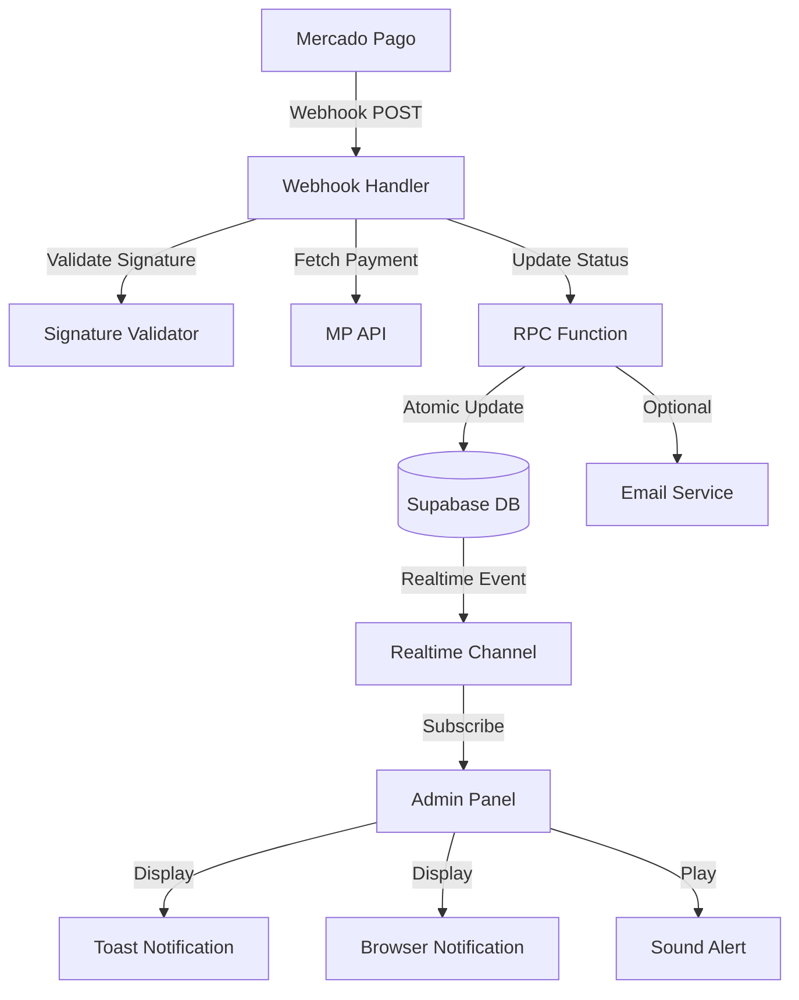

# Design Document: Payment Status Notifications

## Overview

This design document specifies the technical architecture for the payment status notifications and automatic order status update system for the Agon e-commerce platform. The system addresses the current gap where approved payments in Mercado Pago do not automatically update order status in the database and do not generate real-time notifications for administrators.

### Problem Statement

Currently, the webhook endpoint at `/api/webhooks/mercadopago` is configured but not processing payment notifications correctly. This results in:
- Orders remaining in "pending" status even after payment approval
- No real-time notifications for administrators when orders are approved
- Manual intervention required to track and process approved orders
- Poor customer experience due to delayed order processing

### Solution Overview

The solution implements a complete webhook processing pipeline with:
1. **Secure Webhook Handler**: HMAC-SHA256 signature validation and idempotent processing
2. **Atomic Database Updates**: RPC function for transactional payment and order status updates
3. **Real-Time Notifications**: Supabase Realtime subscriptions for instant admin alerts
4. **Multi-Channel Alerts**: Toast notifications, browser notifications, and sound alerts
5. **Admin Dashboard**: Real-time order list updates and statistics
6. **Optional Email Notifications**: Resend integration for offline alerts

### Key Design Decisions

1. **RPC Function for Updates**: Use PostgreSQL RPC function (`update_payment_from_webhook`) with `SECURITY DEFINER` to ensure atomic updates and bypass RLS policies
2. **Idempotency via Status Check**: Compare current status with incoming status before updating to prevent duplicate processing
3. **Supabase Realtime**: Leverage existing Supabase Realtime infrastructure instead of custom WebSocket implementation
4. **Client-Side Notifications**: Handle all notification rendering (toast, browser, sound) on client to reduce server load
5. **Graceful Degradation**: Fall back to polling if Realtime connection fails
6. **No Breaking Changes**: Extend existing tables and functions without modifying core checkout flow

## Architecture

### System Components



### Data Flow

#### Webhook Processing Flow

1. **Mercado Pago** sends POST request to `/api/webhooks/mercadopago`
2. **Webhook Handler** extracts headers (`x-signature`, `x-request-id`)
3. **Signature Validator** validates HMAC-SHA256 signature
4. **Webhook Handler** fetches payment details from Mercado Pago API
5. **Webhook Handler** finds payment record using `external_reference` (order_id)
6. **Webhook Handler** performs idempotency check (status comparison)
7. **RPC Function** atomically updates payment and order status
8. **RPC Function** clears cart if payment approved
9. **Webhook Handler** returns 200 OK to Mercado Pago

#### Real-Time Notification Flow

1. **RPC Function** updates orders table
2. **Supabase Realtime** broadcasts UPDATE event
3. **Admin Panel** receives event via subscription
4. **Admin Panel** displays toast notification
5. **Admin Panel** shows browser notification (if permission granted)
6. **Admin Panel** plays sound alert (if enabled)
7. **Admin Panel** updates order list in real-time
8. **Admin Panel** updates dashboard statistics

### Technology Stack

- **Backend**: Next.js 15 API Routes (App Router)
- **Database**: Supabase PostgreSQL with RLS
- **Real-Time**: Supabase Realtime (WebSocket-based)
- **Payment Gateway**: Mercado Pago SDK
- **Notifications**: Sonner (toast), Web Notifications API (browser), HTML5 Audio (sound)
- **Email**: Resend (optional)
- **State Management**: TanStack Query for server state, React Context for UI state
- **UI Components**: Radix UI primitives, Tailwind CSS

## Components and Interfaces

### 1. Webhook Handler (`/api/webhooks/mercadopago/route.ts`)

**Responsibilities**:
- Receive and validate webhook requests from Mercado Pago
- Validate HMAC-SHA256 signature
- Fetch payment details from Mercado Pago API
- Coordinate payment status updates via RPC function
- Handle errors and return appropriate HTTP status codes
- Log all operations with correlation ID

**Interface**:
```typescript
// POST /api/webhooks/mercadopago
interface WebhookRequest {
  headers: {
    'x-signature': string;      // ts=1234567890,v1=abc123...
    'x-request-id': string;      // Correlation ID
  };
  body: {
    type: 'payment' | 'merchant_order' | 'plan' | 'subscription';
    data: {
      id: string;                // Payment ID
    };
  };
}

interface WebhookResponse {
  received: boolean;
  updated?: boolean;
  skipped?: boolean;
  error?: string;
}
```

**Error Handling**:
- `400 Bad Request`: Missing headers or invalid payload
- `401 Unauthorized`: Invalid signature (no retry)
- `404 Not Found`: Payment not found in database (no retry)
- `409 Conflict`: Payment ID mismatch (no retry)
- `500 Internal Server Error`: Database or API errors (triggers retry)

### 2. Signature Validator (`mercadoPagoService.validateWebhookSignature`)

**Responsibilities**:
- Parse x-signature header to extract timestamp and hash
- Construct manifest string according to Mercado Pago specification
- Compute HMAC-SHA256 hash using webhook secret
- Perform constant-time comparison to prevent timing attacks

**Interface**:
```typescript
function validateWebhookSignature(
  signature: string,      // ts=1234567890,v1=abc123...
  requestId: string,      // x-request-id header
  dataId: string          // Payment ID from body
): boolean;

// Manifest format: id:{data.id};request-id:{x-request-id};ts:{ts};
```

**Security Considerations**:
- Use `crypto.timingSafeEqual` for constant-time comparison
- Validate signature before any data processing
- Log validation failures with correlation ID
- Never expose webhook secret in logs or responses

### 3. RPC Function (`update_payment_from_webhook`)

**Responsibilities**:
- Find payment record by `mercadopago_payment_id`
- Determine new order status based on payment status
- Update payment record with new status and payment method
- Update order record with new status
- Clear cart items if payment approved
- Execute all operations in single transaction
- Return detailed result for logging

**Interface**:
```sql
CREATE OR REPLACE FUNCTION update_payment_from_webhook(
  p_mercadopago_payment_id TEXT,
  p_status TEXT,
  p_payment_method TEXT
)
RETURNS JSONB;

-- Return format:
{
  "success": true,
  "payment_id": "uuid",
  "order_id": "uuid",
  "old_status": "pending",
  "new_status": "approved",
  "order_status": "processing"
}
```

**Status Mapping**:
| Payment Status | Order Status |
|---------------|--------------|
| `approved` | `processing` |
| `rejected` | `cancelled` |
| `cancelled` | `cancelled` |
| `refunded` | `cancelled` |
| `pending` | `pending` |
| `in_process` | `pending` |

**Transaction Isolation**:
- Use `SECURITY DEFINER` to bypass RLS policies
- Wrap all updates in single transaction
- Rollback on any error
- Use row-level locks to prevent race conditions

### 4. Admin Panel Real-Time Subscription

**Responsibilities**:
- Subscribe to Supabase Realtime channel for orders table
- Filter for INSERT and UPDATE events
- Handle connection errors and reconnection
- Trigger notifications when relevant events occur
- Update UI state in real-time

**Interface**:
```typescript
interface RealtimeSubscription {
  channel: RealtimeChannel;
  status: 'connected' | 'disconnected' | 'error';
  
  subscribe(callbacks: {
    onInsert: (order: Order) => void;
    onUpdate: (order: Order, oldOrder: Order) => void;
    onError: (error: Error) => void;
  }): void;
  
  unsubscribe(): void;
  reconnect(): void;
}

// Event filter
const subscription = supabase
  .channel('admin-orders')
  .on('postgres_changes', {
    event: 'INSERT',
    schema: 'public',
    table: 'orders'
  }, handleInsert)
  .on('postgres_changes', {
    event: 'UPDATE',
    schema: 'public',
    table: 'orders',
    filter: 'status=eq.processing'  // Only notify on status change to processing
  }, handleUpdate)
  .subscribe();
```

### 5. Notification Components

#### Toast Notification (`useToast` + Sonner)

**Responsibilities**:
- Display temporary visual notification
- Show order details (number, customer, amount)
- Provide action button to view order
- Auto-dismiss after 10 seconds
- Use color coding for status

**Interface**:
```typescript
interface ToastNotification {
  title: string;
  description: string;
  action?: {
    label: string;
    onClick: () => void;
  };
  duration: number;
  variant: 'success' | 'warning' | 'error';
}

// Usage
toast.success('Novo Pedido Aprovado!', {
  description: `Pedido #${orderNumber} - R$ ${amount}`,
  action: {
    label: 'Ver Pedido',
    onClick: () => router.push(`/admin/orders/${orderId}`)
  },
  duration: 10000
});
```

#### Browser Notification (Web Notifications API)

**Responsibilities**:
- Request notification permission on mount
- Display native browser notification
- Focus window and navigate on click
- Only show when tab is not active
- Auto-close after 10 seconds

**Interface**:
```typescript
interface BrowserNotificationOptions {
  title: string;
  body: string;
  icon: string;
  tag: string;          // Unique ID to prevent duplicates
  requireInteraction?: boolean;
  data?: any;           // Custom data for click handler
}

// Usage
if (Notification.permission === 'granted' && document.hidden) {
  const notification = new Notification('Novo Pedido Aprovado!', {
    body: `Pedido #${orderNumber} - R$ ${formatCurrency(amount)}`,
    icon: '/logo.png',
    tag: `order-${orderId}`,
    data: { orderId }
  });
  
  notification.onclick = () => {
    window.focus();
    router.push(`/admin/orders/${orderId}`);
    notification.close();
  };
  
  setTimeout(() => notification.close(), 10000);
}
```

#### Sound Alert (HTML5 Audio)

**Responsibilities**:
- Play short notification sound
- Respect browser autoplay policies
- Provide toggle to enable/disable
- Store preference in localStorage
- Handle playback errors gracefully

**Interface**:
```typescript
interface SoundAlert {
  play(): Promise<void>;
  setEnabled(enabled: boolean): void;
  isEnabled(): boolean;
}

// Usage
const soundAlert = new Audio('/sounds/notification.mp3');
soundAlert.volume = 0.5;

if (soundPreference.enabled && !document.hidden) {
  soundAlert.play().catch(error => {
    console.warn('Failed to play notification sound:', error);
  });
}
```

### 6. Admin Orders Page Component

**Responsibilities**:
- Display paginated list of orders
- Subscribe to real-time updates
- Render order status badges
- Provide search and filter functionality
- Handle loading and error states
- Update statistics in real-time

**Interface**:
```typescript
interface OrdersPageProps {
  initialOrders: Order[];
  initialStats: OrderStats;
}

interface Order {
  id: string;
  order_number: string;
  user_id: string;
  status: OrderStatus;
  total_amount: number;
  shipping_name: string;
  shipping_email: string;
  payment_method: string;
  created_at: string;
  updated_at: string;
}

interface OrderStats {
  total: number;
  pending: number;
  processing: number;
  shipped: number;
  delivered: number;
  cancelled: number;
  totalRevenue: number;
}
```

### 7. Order Status Badge Component

**Responsibilities**:
- Display status text in Portuguese
- Apply color coding based on status
- Use consistent styling across admin panel
- Support accessibility (ARIA labels)

**Interface**:
```typescript
interface OrderStatusBadgeProps {
  status: OrderStatus;
  className?: string;
}

type OrderStatus = 
  | 'pending' 
  | 'processing' 
  | 'shipped' 
  | 'delivered' 
  | 'cancelled';

// Status mapping
const statusConfig = {
  pending: { label: 'Pendente', color: 'yellow' },
  processing: { label: 'Processando', color: 'green' },
  shipped: { label: 'Enviado', color: 'blue' },
  delivered: { label: 'Entregue', color: 'gray' },
  cancelled: { label: 'Cancelado', color: 'red' }
};
```

### 8. Notification Preferences Component

**Responsibilities**:
- Display toggle switches for each notification type
- Store preferences in localStorage
- Request browser notification permission
- Apply preferences immediately
- Persist across sessions

**Interface**:
```typescript
interface NotificationPreferences {
  toast: boolean;
  browser: boolean;
  sound: boolean;
}

interface NotificationPreferencesProps {
  preferences: NotificationPreferences;
  onPreferencesChange: (preferences: NotificationPreferences) => void;
}

// localStorage key
const PREFERENCES_KEY = 'admin-notification-preferences';
```

## Data Models

### Database Schema Updates

#### Existing Tables (No Changes Required)

**payments table** (already exists):
```sql
CREATE TABLE payments (
  id UUID PRIMARY KEY DEFAULT gen_random_uuid(),
  order_id UUID NOT NULL UNIQUE REFERENCES orders(id),
  mercadopago_payment_id TEXT NULL,
  mercadopago_preference_id TEXT NOT NULL,
  status TEXT NOT NULL DEFAULT 'pending',
  payment_method TEXT NULL,
  amount DECIMAL(10, 2) NOT NULL,
  created_at TIMESTAMPTZ DEFAULT NOW(),
  updated_at TIMESTAMPTZ DEFAULT NOW()
);
```

**orders table** (already exists):
```sql
CREATE TABLE orders (
  id UUID PRIMARY KEY DEFAULT gen_random_uuid(),
  user_id UUID NOT NULL REFERENCES auth.users(id),
  status TEXT NOT NULL DEFAULT 'pending',
  total_amount DECIMAL(10, 2) NOT NULL,
  shipping_name TEXT NOT NULL,
  shipping_address TEXT NOT NULL,
  shipping_city TEXT NOT NULL,
  shipping_state TEXT NOT NULL,
  shipping_zip TEXT NOT NULL,
  shipping_phone TEXT NOT NULL,
  shipping_email TEXT NOT NULL,
  payment_method TEXT NOT NULL,
  created_at TIMESTAMPTZ DEFAULT NOW(),
  updated_at TIMESTAMPTZ DEFAULT NOW()
);
```

#### New RPC Function

```sql
CREATE OR REPLACE FUNCTION update_payment_from_webhook(
  p_mercadopago_payment_id TEXT,
  p_status TEXT,
  p_payment_method TEXT
)
RETURNS JSONB AS $$
DECLARE
  v_payment RECORD;
  v_order_id UUID;
  v_new_order_status TEXT;
  v_user_id UUID;
BEGIN
  -- Find payment by mercadopago_payment_id
  SELECT * INTO v_payment
  FROM payments
  WHERE mercadopago_payment_id = p_mercadopago_payment_id
  LIMIT 1;
  
  IF NOT FOUND THEN
    RETURN jsonb_build_object(
      'success', false,
      'error', 'Payment not found'
    );
  END IF;
  
  v_order_id := v_payment.order_id;
  
  -- Get user_id from order
  SELECT user_id INTO v_user_id
  FROM orders
  WHERE id = v_order_id;
  
  -- Determine new order status based on payment status
  CASE p_status
    WHEN 'approved' THEN
      v_new_order_status := 'processing';
    WHEN 'rejected', 'cancelled', 'refunded' THEN
      v_new_order_status := 'cancelled';
    ELSE
      v_new_order_status := 'pending';
  END CASE;
  
  -- Update payment record
  UPDATE payments
  SET 
    status = p_status,
    payment_method = p_payment_method,
    updated_at = NOW()
  WHERE id = v_payment.id;
  
  -- Update order status
  UPDATE orders
  SET 
    status = v_new_order_status,
    updated_at = NOW()
  WHERE id = v_order_id;
  
  -- Clear cart if payment approved
  IF p_status = 'approved' THEN
    DELETE FROM cart_items
    WHERE user_id = v_user_id;
  END IF;
  
  RETURN jsonb_build_object(
    'success', true,
    'payment_id', v_payment.id,
    'order_id', v_order_id,
    'old_status', v_payment.status,
    'new_status', p_status,
    'order_status', v_new_order_status
  );
  
EXCEPTION
  WHEN OTHERS THEN
    RETURN jsonb_build_object(
      'success', false,
      'error', SQLERRM
    );
END;
$$ LANGUAGE plpgsql SECURITY DEFINER;
```

### TypeScript Types

```typescript
// Payment types
export type PaymentStatus = 
  | 'pending' 
  | 'approved' 
  | 'rejected' 
  | 'cancelled' 
  | 'refunded' 
  | 'in_process';

export type PaymentMethod = 
  | 'credit_card' 
  | 'debit_card' 
  | 'pix' 
  | 'boleto' 
  | 'account_money';

export interface Payment {
  id: string;
  order_id: string;
  mercadopago_payment_id: string | null;
  mercadopago_preference_id: string;
  status: PaymentStatus;
  payment_method: PaymentMethod | null;
  amount: number;
  created_at: string;
  updated_at: string;
}

// Order types
export type OrderStatus = 
  | 'pending' 
  | 'processing' 
  | 'shipped' 
  | 'delivered' 
  | 'cancelled';

export interface Order {
  id: string;
  order_number: string;
  user_id: string;
  status: OrderStatus;
  total_amount: number;
  shipping_name: string;
  shipping_address: string;
  shipping_city: string;
  shipping_state: string;
  shipping_zip: string;
  shipping_phone: string;
  shipping_email: string;
  payment_method: string;
  created_at: string;
  updated_at: string;
}

// Webhook types
export interface WebhookPayload {
  type: string;
  data: {
    id: string;
  };
}

export interface MercadoPagoPayment {
  id: number;
  status: PaymentStatus;
  status_detail: string;
  payment_method_id: string;
  payment_type_id: string;
  transaction_amount: number;
  currency_id: string;
  date_created: string;
  date_approved: string | null;
  external_reference: string;
  payer: {
    email: string;
    identification: {
      type: string;
      number: string;
    };
  };
}

// Notification types
export interface NotificationPreferences {
  toast: boolean;
  browser: boolean;
  sound: boolean;
}

export interface OrderNotification {
  type: 'new_order' | 'status_change';
  order: Order;
  oldStatus?: OrderStatus;
}
```

## Error Handling

### Webhook Error Handling

**Signature Validation Errors**:
- Return `401 Unauthorized` immediately
- Log error with correlation ID
- Do not trigger Mercado Pago retry

**Payment Not Found Errors**:
- Return `404 Not Found`
- Log error with external_reference
- Do not trigger Mercado Pago retry

**Payment ID Mismatch Errors**:
- Return `409 Conflict`
- Log both stored and incoming payment IDs
- Do not trigger Mercado Pago retry

**Database Update Errors**:
- Return `500 Internal Server Error`
- Log full error with stack trace
- Trigger Mercado Pago retry (up to 12 times over 48 hours)

**Mercado Pago API Errors**:
- Return `500 Internal Server Error`
- Log API error details
- Trigger Mercado Pago retry

### Real-Time Subscription Error Handling

**Connection Errors**:
- Log error to console
- Display error toast to admin
- Attempt reconnection with exponential backoff (5 retries)
- Fall back to manual refresh button if all retries fail

**Subscription Errors**:
- Log error to console
- Continue displaying existing data
- Show connection status indicator (red)
- Provide "Reconnect" button

**Event Processing Errors**:
- Log error to console
- Skip problematic event
- Continue processing subsequent events
- Do not crash admin panel

### Notification Error Handling

**Toast Notification Errors**:
- Log error to console
- Continue with other notification types
- Do not block UI

**Browser Notification Errors**:
- Log error to console
- Fall back to toast notification only
- Handle permission denied gracefully

**Sound Alert Errors**:
- Log error to console
- Continue with visual notifications
- Do not block UI or show error to user

**Email Notification Errors** (Optional):
- Log error to console
- Do not block webhook processing
- Return success to Mercado Pago even if email fails

## Testing Strategy

### Property-Based Testing Assessment

**PBT is NOT appropriate for this feature** because:

1. **Infrastructure Integration**: The feature primarily integrates with external services (Mercado Pago webhooks, Supabase Realtime, Web Notifications API)
2. **Side-Effect Heavy**: Most operations involve side effects (database updates, API calls, browser notifications, sound playback)
3. **UI Rendering**: Significant portion involves UI components and user interactions
4. **Configuration Validation**: Many requirements are about setup and configuration checks

**Alternative Testing Strategies**:

### Unit Tests

**Signature Validation**:
- Test valid signature with correct manifest
- Test invalid signature with wrong hash
- Test malformed signature header
- Test missing timestamp or hash
- Test constant-time comparison

**Status Mapping Logic**:
- Test each payment status maps to correct order status
- Test edge cases (null, undefined, unknown status)

**Notification Preferences**:
- Test localStorage read/write
- Test preference application
- Test default values

### Integration Tests

**Webhook Processing**:
- Test complete webhook flow with mock Mercado Pago API
- Test idempotency (duplicate webhooks)
- Test concurrent webhook deliveries
- Test payment ID seeding on first webhook
- Test cart clearing on approval

**Database Updates**:
- Test RPC function with various payment statuses
- Test transaction rollback on error
- Test concurrent updates with row locks

**Real-Time Subscriptions**:
- Test subscription setup and teardown
- Test event filtering (INSERT, UPDATE)
- Test reconnection logic
- Test error handling

### End-to-End Tests

**Complete Payment Flow**:
1. Create order with payment
2. Simulate Mercado Pago webhook (approved)
3. Verify order status updated to "processing"
4. Verify cart cleared
5. Verify admin receives notification (mock)

**Admin Panel Real-Time Updates**:
1. Admin opens orders page
2. Simulate order status change
3. Verify order list updates without refresh
4. Verify toast notification displayed
5. Verify statistics updated

### Manual Testing Checklist

**Webhook Testing**:
- [ ] Test with ngrok tunnel in development
- [ ] Test signature validation with real Mercado Pago webhooks
- [ ] Test idempotency with duplicate webhooks
- [ ] Test error scenarios (invalid signature, payment not found)
- [ ] Verify logs contain correlation IDs

**Notification Testing**:
- [ ] Test toast notifications appear and auto-dismiss
- [ ] Test browser notifications with permission granted/denied
- [ ] Test sound alert plays correctly
- [ ] Test notification preferences persist
- [ ] Test notifications only show for admins

**Real-Time Testing**:
- [ ] Test order list updates in real-time
- [ ] Test connection loss and reconnection
- [ ] Test multiple admin tabs receive updates
- [ ] Test performance with many orders

**Accessibility Testing**:
- [ ] Test keyboard navigation in admin panel
- [ ] Test screen reader announcements for notifications
- [ ] Test color contrast for status badges
- [ ] Test focus indicators

## Security Considerations

### Webhook Security

1. **Signature Validation**: Always validate HMAC-SHA256 signature before processing
2. **Constant-Time Comparison**: Use `crypto.timingSafeEqual` to prevent timing attacks
3. **HTTPS Only**: Mercado Pago requires HTTPS in production
4. **Secret Rotation**: Rotate `MERCADOPAGO_WEBHOOK_SECRET` periodically
5. **Rate Limiting**: Limit webhook requests to 100 per minute
6. **Input Sanitization**: Sanitize all input data before database operations
7. **Parameterized Queries**: Use RPC function with parameterized queries to prevent SQL injection

### Admin Access Control

1. **Role Verification**: Check `profiles.role = 'admin'` before rendering admin panel
2. **Server-Side Checks**: Verify admin role in API routes and middleware
3. **RLS Policies**: Ensure RLS policies restrict admin data access
4. **Session Management**: Use Supabase Auth for secure session handling

### Data Protection

1. **No Sensitive Data in Logs**: Never log access tokens, webhook secrets, or full payment details
2. **Correlation IDs**: Use `x-request-id` for tracing without exposing sensitive data
3. **Error Messages**: Do not expose internal error details in webhook responses
4. **SECURITY DEFINER**: Use carefully in RPC function to bypass RLS only when necessary

## Performance Considerations

### Webhook Performance

1. **Response Time**: Return 200 OK within 5 seconds to prevent Mercado Pago retry
2. **Async Operations**: Email sending should not block webhook response
3. **Database Indexes**: Ensure indexes on `mercadopago_payment_id` and `order_id`
4. **Connection Pooling**: Use Supabase connection pooling for concurrent webhooks

### Admin Panel Performance

1. **Pagination**: Load 20 orders per page to reduce initial load time
2. **Virtual Scrolling**: Use virtual scrolling for large order lists
3. **Debounced Search**: Debounce search input by 300ms
4. **Optimistic Updates**: Use optimistic updates for status changes
5. **React Query Caching**: Cache fetched orders to reduce API calls
6. **Lazy Loading**: Lazy load order details on demand

### Real-Time Performance

1. **Event Filtering**: Filter events on server-side to reduce client processing
2. **Batch Updates**: Batch multiple rapid updates to prevent UI thrashing
3. **Connection Reuse**: Reuse single Realtime connection for all subscriptions
4. **Graceful Degradation**: Fall back to polling if Realtime unavailable

## Deployment Considerations

### Environment Variables

**Required**:
- `MERCADOPAGO_ACCESS_TOKEN`: Mercado Pago API access token
- `MERCADOPAGO_WEBHOOK_SECRET`: Webhook signature validation secret
- `NEXT_PUBLIC_SUPABASE_URL`: Supabase project URL
- `NEXT_PUBLIC_SUPABASE_ANON_KEY`: Supabase anonymous key
- `SUPABASE_SERVICE_ROLE_KEY`: Supabase service role key (server-only)
- `NEXT_PUBLIC_APP_URL`: Application base URL

**Optional**:
- `RESEND_API_KEY`: Resend API key for email notifications
- `ADMIN_EMAIL_PRIMARY`: Primary admin email for notifications
- `ADMIN_EMAIL_BACKUP`: Backup admin email

### Database Migrations

1. Apply RPC function migration: `update_payment_from_webhook`
2. Verify indexes exist on `payments` table
3. Test RPC function with sample data
4. Verify RLS policies allow admin access

### Webhook Configuration

1. Configure webhook URL in Mercado Pago dashboard: `https://yourdomain.com/api/webhooks/mercadopago`
2. Copy webhook secret from Mercado Pago dashboard
3. Set `MERCADOPAGO_WEBHOOK_SECRET` environment variable
4. Test webhook with Mercado Pago test payments
5. Monitor webhook logs for errors

### Supabase Realtime Configuration

1. Enable Realtime for `orders` table in Supabase dashboard
2. Configure Realtime policies to allow admin subscriptions
3. Test Realtime connection in development
4. Monitor Realtime connection status in production

### Monitoring and Logging

1. **Webhook Logs**: Monitor webhook processing logs for errors
2. **Correlation IDs**: Use `x-request-id` for tracing webhook requests
3. **Error Rates**: Track webhook error rates and retry counts
4. **Notification Delivery**: Monitor notification delivery success rates
5. **Real-Time Connection**: Monitor Realtime connection health

## Future Enhancements

### Phase 2 Features

1. **Notification History**: Persistent notification history in database
2. **Email Digest**: Daily email digest of orders for admins
3. **SMS Notifications**: SMS alerts for critical orders
4. **Webhook Replay**: Admin interface to replay failed webhooks
5. **Advanced Filters**: More sophisticated order filtering and search
6. **Export Orders**: Export orders to CSV/Excel
7. **Bulk Actions**: Bulk status updates for multiple orders
8. **Order Notes**: Add internal notes to orders
9. **Customer Communication**: Send status update emails to customers
10. **Analytics Dashboard**: Advanced analytics and reporting

### Technical Improvements

1. **Webhook Queue**: Use message queue (e.g., BullMQ) for webhook processing
2. **Distributed Locks**: Use Redis for distributed locking in webhook processing
3. **Metrics Collection**: Collect detailed metrics for monitoring
4. **A/B Testing**: Test different notification strategies
5. **Performance Monitoring**: Add APM for performance tracking

---

**Design Status**: ✅ Complete and ready for implementation

**Next Steps**:
1. Review design with team
2. Create implementation tasks
3. Set up development environment
4. Begin implementation with webhook handler
5. Test with Mercado Pago sandbox
