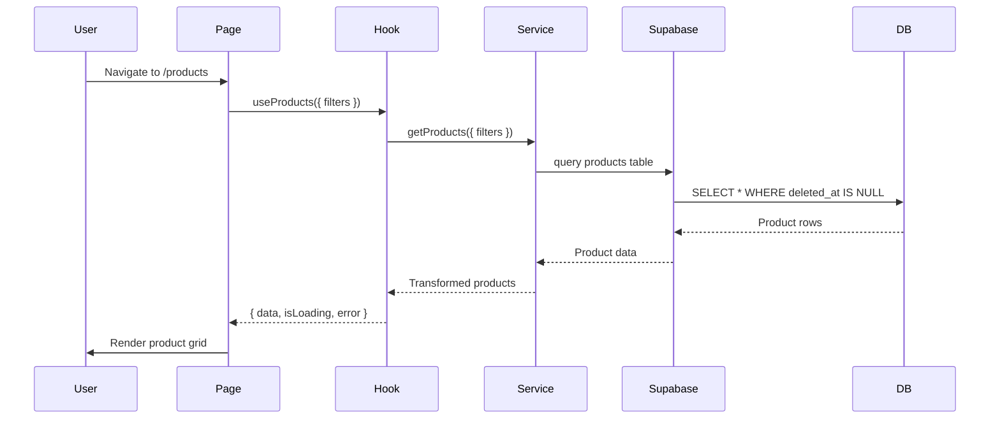
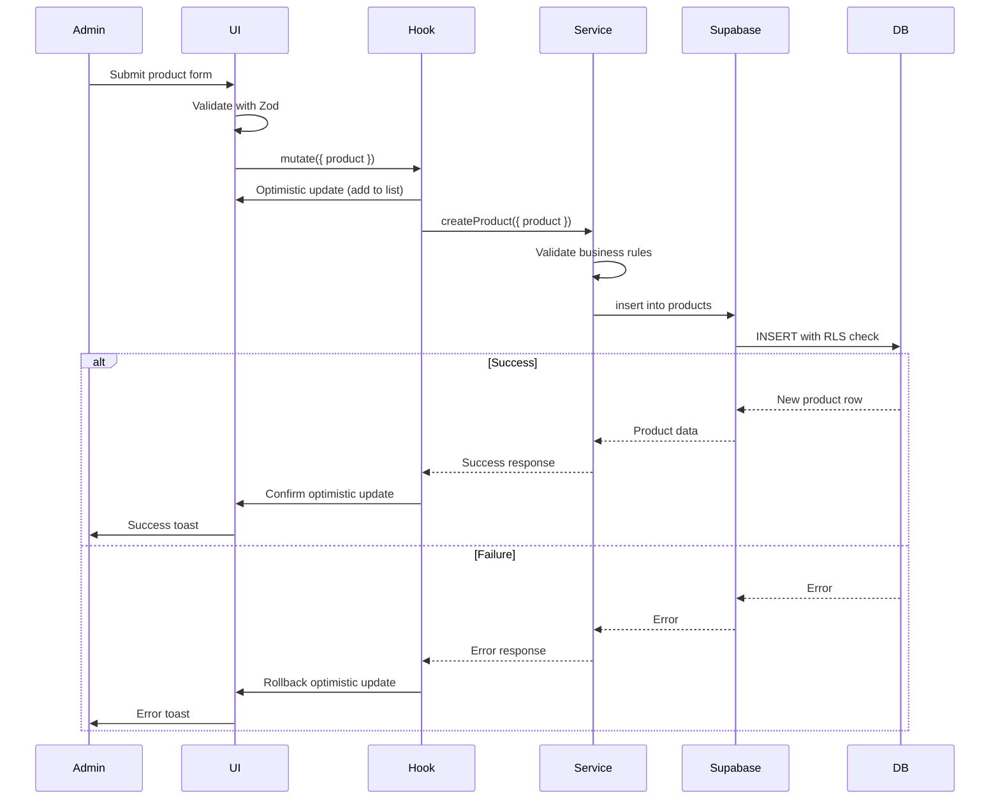
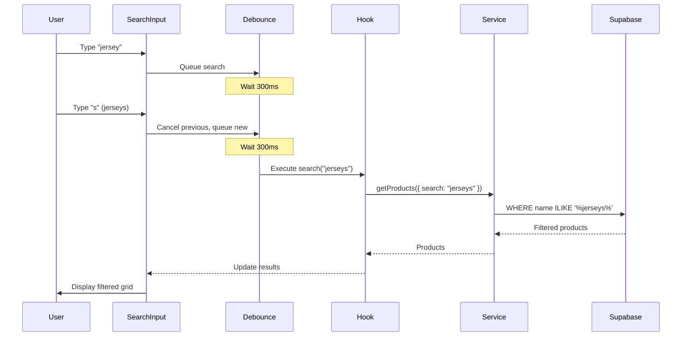

# Design Document: Product Catalog CRUD

## Overview

The Product Catalog CRUD feature establishes the foundational data layer for the Agon e-commerce platform by replacing mock product data with real Supabase persistence. This feature enables complete product lifecycle management through an admin panel while providing customers with a rich browsing experience including search, filtering, sorting, and detailed product views.

The design follows a three-layer architecture:
- **Data Layer**: Supabase tables (products, categories) with RLS policies and database constraints
- **Services Layer**: TypeScript services for data access and business logic
- **UI Layer**: React components for admin management and customer browsing

Key design principles:
- **Single Source of Truth**: Database is the only source of truth; UI reconciles after mutations
- **Layer Separation**: Data → Services → Hooks → UI (no direct DB access from UI components)
- **Feature-Based Architecture**: Organized by domain (products, categories, admin, customer)
- **Optimistic Updates**: Immediate UI feedback with rollback on failure (scoped, confirmed/rolled back within 100ms)
- **Read Consistency**: Customer reads filter deleted_at IS NULL, respect RLS policies
- **Write Consistency**: Client validation → Service validation → DB constraints → Reconciliation
- **Cross-Domain Consistency**: Product/category updates reflect across all views
- **Failure Consistency**: Rollback to exact previous state, no partial state allowed
- **Soft Delete Strategy**: Products marked as deleted (deleted_at timestamp) preserve historical data

### Purpose

This feature unblocks cart, wishlist, and checkout features by providing:
- Persistent product data with proper schema and constraints
- Admin interface for product management (CRUD operations)
- Customer interface for product discovery (search, filter, sort)
- Image upload and management via Cloudinary
- Stock tracking and validation
- Category-based organization

### Scope

**In Scope:**
- Products and categories database schema with RLS policies
- Admin panel at `/admin/products` for product management
- Product listing page at `/products` with search, filters, and sorting
- Product detail page at `/products/[id]` with complete information
- Image upload to Cloudinary with validation
- Soft delete implementation for products
- Stock management and validation
- Category management interface
- Optimistic UI updates with rollback
- Integration with existing ProductCard, SearchFilters, AnimatedGrid components

**Out of Scope:**
- Cart functionality (separate feature)
- Wishlist functionality (separate feature)
- Checkout process (separate feature)
- Product reviews and ratings (future enhancement)
- Product variants (sizes, colors) beyond basic features array
- Inventory management beyond stock count
- Bulk operations (import/export)
- Product analytics and reporting

### Key Design Decisions

1. **Cloudinary for Images**: Use Cloudinary for image storage (not Supabase Storage) for better CDN performance and transformation capabilities
2. **Soft Delete**: Implement soft delete (deleted_at timestamp) to preserve historical data for orders
3. **React Query**: Use React Query for data fetching, caching, and optimistic updates
4. **Zod Validation**: Use Zod schemas for client-side and service-layer validation
5. **Server-Side Rendering**: Use SSR for product listing page for SEO and performance
6. **Client-Side Admin**: Admin panel is client-side for rich interactivity
7. **Offset Pagination**: Use offset-based pagination for MVP (cursor-based for future)
8. **Search Debounce**: 300ms debounce on search input to reduce API calls
9. **Feature-Based Structure**: Organize code by feature (products, categories) not by type (components, hooks)
10. **RLS Enforcement**: All database access respects Row Level Security policies


## Architecture

### High-Level Architecture

```mermaid
graph TB
    subgraph "Customer UI Layer"
        ProductListing[Product Listing /products]
        ProductDetail[Product Detail /products/[id]]
        SearchFilters[SearchFilters Component]
        ProductCard[ProductCard Component]
        AnimatedGrid[AnimatedGrid Component]
    end
    
    subgraph "Admin UI Layer"
        AdminPanel[Admin Panel /admin/products]
        ProductForm[Product Form Modal]
        ProductTable[Product Table]
        CategoryManager[Category Manager]
    end
    
    subgraph "Hooks Layer"
        useProducts[useProducts Hook]
        useProductMutations[useProductMutations Hook]
        useCategories[useCategories Hook]
        useCategoryMutations[useCategoryMutations Hook]
    end
    
    subgraph "Services Layer"
        ProductService[productService]
        CategoryService[categoryService]
        ImageService[imageService]
    end
    
    subgraph "Data Layer"
        SupabaseClient[Supabase Client]
        ProductsTable[(products table)]
        CategoriesTable[(categories table)]
        CloudinaryAPI[Cloudinary API]
    end
    
    ProductListing --> SearchFilters
    ProductListing --> AnimatedGrid
    AnimatedGrid --> ProductCard
    ProductListing --> useProducts
    ProductDetail --> useProducts
    
    AdminPanel --> ProductTable
    AdminPanel --> ProductForm
    AdminPanel --> CategoryManager
    AdminPanel --> useProducts
    AdminPanel --> useProductMutations
    AdminPanel --> useCategories
    AdminPanel --> useCategoryMutations
    
    useProducts --> ProductService
    useProductMutations --> ProductService
    useCategories --> CategoryService
    useCategoryMutations --> CategoryService
    
    ProductService --> SupabaseClient
    CategoryService --> SupabaseClient
    ImageService --> CloudinaryAPI
    
    SupabaseClient --> ProductsTable
    SupabaseClient --> CategoriesTable
    
    ProductForm --> ImageService
```

### Component Hierarchy

```mermaid
graph TD
    A[App Router] --> B[/products - Product Listing]
    A --> C[/products/[id] - Product Detail]
    A --> D[/admin/products - Admin Panel]
    
    B --> E[SearchFilters]
    B --> F[AnimatedGrid]
    F --> G[ProductCard]
    
    C --> H[Product Image]
    C --> I[Product Info]
    C --> J[ClientActions]
    
    D --> K[Product Table]
    D --> L[Product Form Modal]
    D --> M[Category Manager]
    
    L --> N[Image Upload]
    L --> O[Form Fields]
    L --> P[Validation]
```

### Data Flow

**Read Path (Customer)**:


**Write Path (Admin)**:


**Search and Filter Flow**:



## Database Schema

### Products Table

```sql
-- Products table with soft delete support
CREATE TABLE products (
  id UUID PRIMARY KEY DEFAULT gen_random_uuid(),
  name TEXT NOT NULL CHECK (char_length(name) > 0 AND char_length(name) <= 200),
  description TEXT NOT NULL CHECK (char_length(description) > 0 AND char_length(description) <= 2000),
  price DECIMAL(10, 2) NOT NULL CHECK (price >= 0),
  category_id UUID NOT NULL REFERENCES categories(id) ON DELETE RESTRICT,
  image_url TEXT NOT NULL,
  stock INTEGER NOT NULL DEFAULT 0 CHECK (stock >= 0),
  features TEXT[] DEFAULT '{}',
  rating DECIMAL(2, 1) DEFAULT 0 CHECK (rating >= 0 AND rating <= 5),
  reviews INTEGER DEFAULT 0 CHECK (reviews >= 0),
  created_at TIMESTAMPTZ DEFAULT NOW() NOT NULL,
  updated_at TIMESTAMPTZ DEFAULT NOW() NOT NULL,
  deleted_at TIMESTAMPTZ NULL
);

-- Indexes for performance
CREATE INDEX idx_products_category_id ON products(category_id);
CREATE INDEX idx_products_deleted_at ON products(deleted_at) WHERE deleted_at IS NULL;
CREATE INDEX idx_products_created_at ON products(created_at DESC);
CREATE INDEX idx_products_price ON products(price);
CREATE INDEX idx_products_name_search ON products USING gin(to_tsvector('portuguese', name));
CREATE INDEX idx_products_description_search ON products USING gin(to_tsvector('portuguese', description));

-- Trigger to update updated_at timestamp
CREATE OR REPLACE FUNCTION update_updated_at_column()
RETURNS TRIGGER AS $$
BEGIN
  NEW.updated_at = NOW();
  RETURN NEW;
END;
$$ LANGUAGE plpgsql;

CREATE TRIGGER update_products_updated_at
  BEFORE UPDATE ON products
  FOR EACH ROW
  EXECUTE FUNCTION update_updated_at_column();

-- RLS Policies
ALTER TABLE products ENABLE ROW LEVEL SECURITY;

-- Public read access (customers) - only non-deleted products
CREATE POLICY "products_select_public"
  ON products FOR SELECT
  USING (deleted_at IS NULL);

-- Admin write access
CREATE POLICY "products_insert_admin"
  ON products FOR INSERT
  WITH CHECK (
    EXISTS (
      SELECT 1 FROM profiles
      WHERE profiles.id = auth.uid()
      AND profiles.role = 'admin'
    )
  );

CREATE POLICY "products_update_admin"
  ON products FOR UPDATE
  USING (
    EXISTS (
      SELECT 1 FROM profiles
      WHERE profiles.id = auth.uid()
      AND profiles.role = 'admin'
    )
  );

CREATE POLICY "products_delete_admin"
  ON products FOR DELETE
  USING (
    EXISTS (
      SELECT 1 FROM profiles
      WHERE profiles.id = auth.uid()
      AND profiles.role = 'admin'
    )
  );
```

### Categories Table

```sql
-- Categories table for product organization
CREATE TABLE categories (
  id UUID PRIMARY KEY DEFAULT gen_random_uuid(),
  name TEXT NOT NULL UNIQUE CHECK (char_length(name) > 0 AND char_length(name) <= 100),
  slug TEXT NOT NULL UNIQUE CHECK (char_length(slug) > 0 AND char_length(slug) <= 100),
  description TEXT,
  created_at TIMESTAMPTZ DEFAULT NOW() NOT NULL,
  updated_at TIMESTAMPTZ DEFAULT NOW() NOT NULL
);

-- Index for slug-based lookups
CREATE INDEX idx_categories_slug ON categories(slug);

-- Trigger to update updated_at timestamp
CREATE TRIGGER update_categories_updated_at
  BEFORE UPDATE ON categories
  FOR EACH ROW
  EXECUTE FUNCTION update_updated_at_column();

-- RLS Policies
ALTER TABLE categories ENABLE ROW LEVEL SECURITY;

-- Public read access
CREATE POLICY "categories_select_public"
  ON categories FOR SELECT
  USING (true);

-- Admin write access
CREATE POLICY "categories_insert_admin"
  ON categories FOR INSERT
  WITH CHECK (
    EXISTS (
      SELECT 1 FROM profiles
      WHERE profiles.id = auth.uid()
      AND profiles.role = 'admin'
    )
  );

CREATE POLICY "categories_update_admin"
  ON categories FOR UPDATE
  USING (
    EXISTS (
      SELECT 1 FROM profiles
      WHERE profiles.id = auth.uid()
      AND profiles.role = 'admin'
    )
  );

CREATE POLICY "categories_delete_admin"
  ON categories FOR DELETE
  USING (
    EXISTS (
      SELECT 1 FROM profiles
      WHERE profiles.id = auth.uid()
      AND profiles.role = 'admin'
    )
  );
```

### Seed Data

```sql
-- Insert default categories
INSERT INTO categories (name, slug, description) VALUES
  ('Manto Oficial', 'manto-oficial', 'Camisas oficiais da Seleção Brasileira'),
  ('Equipamentos', 'equipamentos', 'Bolas, chuteiras e acessórios esportivos'),
  ('Lifestyle', 'lifestyle', 'Bonés, mochilas e itens casuais'),
  ('Cuidados', 'cuidados', 'Produtos de cuidados pessoais e beleza');
```


## Data Models

### TypeScript Interfaces

```typescript
// Product entity
interface Product {
  id: string;
  name: string;
  description: string;
  price: number;
  categoryId: string;
  imageUrl: string;
  stock: number;
  features: string[];
  rating: number;
  reviews: number;
  createdAt: string;
  updatedAt: string;
  deletedAt: string | null;
  category?: Category; // Joined data
}

// Category entity
interface Category {
  id: string;
  name: string;
  slug: string;
  description: string | null;
  createdAt: string;
  updatedAt: string;
}

// Product form values (for create/update)
interface ProductFormValues {
  name: string;
  description: string;
  price: number;
  categoryId: string;
  imageUrl: string;
  stock: number;
  features: string[];
}

// Product filters (for search/filter)
interface ProductFilters {
  search?: string;
  categoryId?: string;
  minPrice?: number;
  maxPrice?: number;
  minRating?: number;
  sortBy?: 'latest' | 'oldest' | 'price_asc' | 'price_desc';
  page?: number;
  limit?: number;
}

// Paginated response
interface PaginatedProducts {
  products: Product[];
  total: number;
  page: number;
  limit: number;
  totalPages: number;
}

// Category form values
interface CategoryFormValues {
  name: string;
  slug: string;
  description?: string;
}

// Image upload response
interface ImageUploadResponse {
  url: string;
  publicId: string;
  width: number;
  height: number;
}

// Database row types (snake_case from Supabase)
interface ProductRow {
  id: string;
  name: string;
  description: string;
  price: number;
  category_id: string;
  image_url: string;
  stock: number;
  features: string[];
  rating: number;
  reviews: number;
  created_at: string;
  updated_at: string;
  deleted_at: string | null;
}

interface CategoryRow {
  id: string;
  name: string;
  slug: string;
  description: string | null;
  created_at: string;
  updated_at: string;
}
```

### Zod Validation Schemas

```typescript
import { z } from 'zod';

// Product validation schema
export const productSchema = z.object({
  name: z.string()
    .min(1, 'Nome é obrigatório')
    .max(200, 'Nome deve ter no máximo 200 caracteres'),
  description: z.string()
    .min(1, 'Descrição é obrigatória')
    .max(2000, 'Descrição deve ter no máximo 2000 caracteres'),
  price: z.number()
    .positive('Preço deve ser positivo')
    .multipleOf(0.01, 'Preço deve ter no máximo 2 casas decimais'),
  categoryId: z.string()
    .uuid('Categoria inválida'),
  imageUrl: z.string()
    .url('URL da imagem inválida'),
  stock: z.number()
    .int('Estoque deve ser um número inteiro')
    .nonnegative('Estoque não pode ser negativo'),
  features: z.array(z.string())
    .default([]),
});

// Category validation schema
export const categorySchema = z.object({
  name: z.string()
    .min(1, 'Nome é obrigatório')
    .max(100, 'Nome deve ter no máximo 100 caracteres'),
  slug: z.string()
    .min(1, 'Slug é obrigatório')
    .max(100, 'Slug deve ter no máximo 100 caracteres')
    .regex(/^[a-z0-9-]+$/, 'Slug deve conter apenas letras minúsculas, números e hífens'),
  description: z.string()
    .optional(),
});

// Product filters validation
export const productFiltersSchema = z.object({
  search: z.string().optional(),
  categoryId: z.string().uuid().optional(),
  minPrice: z.number().nonnegative().optional(),
  maxPrice: z.number().nonnegative().optional(),
  minRating: z.number().min(0).max(5).optional(),
  sortBy: z.enum(['latest', 'oldest', 'price_asc', 'price_desc']).optional(),
  page: z.number().int().positive().default(1),
  limit: z.number().int().positive().max(100).default(20),
});

// Image file validation
export const imageFileSchema = z.object({
  file: z.instanceof(File)
    .refine((file) => file.size <= 5 * 1024 * 1024, 'Arquivo deve ter no máximo 5MB')
    .refine(
      (file) => ['image/jpeg', 'image/png', 'image/webp'].includes(file.type),
      'Formato deve ser JPEG, PNG ou WebP'
    ),
});
```


## Services Layer

### Product Service

**Location**: `apps/web/src/modules/products/services/productService.ts`

**Responsibilities:**
- CRUD operations for products
- Data transformation (snake_case ↔ camelCase)
- Business logic validation
- Query building for filters and search
- Soft delete implementation

**Interface:**
```typescript
export const productService = {
  // Get paginated products with filters
  async getProducts(filters: ProductFilters): Promise<PaginatedProducts> {
    const supabase = createClient();
    const { search, categoryId, minPrice, maxPrice, minRating, sortBy, page = 1, limit = 20 } = filters;
    
    let query = supabase
      .from('products')
      .select('*, category:categories(*)', { count: 'exact' })
      .is('deleted_at', null);
    
    // Apply filters
    if (search) {
      query = query.or(`name.ilike.%${search}%,description.ilike.%${search}%`);
    }
    if (categoryId) {
      query = query.eq('category_id', categoryId);
    }
    if (minPrice !== undefined) {
      query = query.gte('price', minPrice);
    }
    if (maxPrice !== undefined) {
      query = query.lte('price', maxPrice);
    }
    if (minRating !== undefined) {
      query = query.gte('rating', minRating);
    }
    
    // Apply sorting
    switch (sortBy) {
      case 'latest':
        query = query.order('created_at', { ascending: false });
        break;
      case 'oldest':
        query = query.order('created_at', { ascending: true });
        break;
      case 'price_asc':
        query = query.order('price', { ascending: true });
        break;
      case 'price_desc':
        query = query.order('price', { ascending: false });
        break;
      default:
        query = query.order('created_at', { ascending: false });
    }
    
    // Apply pagination
    const from = (page - 1) * limit;
    const to = from + limit - 1;
    query = query.range(from, to);
    
    const { data, error, count } = await query;
    
    if (error) throw error;
    
    return {
      products: data.map(transformProductRow),
      total: count || 0,
      page,
      limit,
      totalPages: Math.ceil((count || 0) / limit),
    };
  },
  
  // Get single product by ID
  async getProductById(id: string): Promise<Product | null> {
    const supabase = createClient();
    
    const { data, error } = await supabase
      .from('products')
      .select('*, category:categories(*)')
      .eq('id', id)
      .is('deleted_at', null)
      .single();
    
    if (error) {
      if (error.code === 'PGRST116') return null; // Not found
      throw error;
    }
    
    return transformProductRow(data);
  },
  
  // Create new product
  async createProduct(values: ProductFormValues): Promise<Product> {
    const supabase = createClient();
    
    // Validate with Zod
    const validated = productSchema.parse(values);
    
    const { data, error } = await supabase
      .from('products')
      .insert({
        name: validated.name,
        description: validated.description,
        price: validated.price,
        category_id: validated.categoryId,
        image_url: validated.imageUrl,
        stock: validated.stock,
        features: validated.features,
      })
      .select('*, category:categories(*)')
      .single();
    
    if (error) throw error;
    
    return transformProductRow(data);
  },
  
  // Update existing product
  async updateProduct(id: string, values: Partial<ProductFormValues>): Promise<Product> {
    const supabase = createClient();
    
    // Validate with Zod (partial)
    const validated = productSchema.partial().parse(values);
    
    const updateData: any = {};
    if (validated.name !== undefined) updateData.name = validated.name;
    if (validated.description !== undefined) updateData.description = validated.description;
    if (validated.price !== undefined) updateData.price = validated.price;
    if (validated.categoryId !== undefined) updateData.category_id = validated.categoryId;
    if (validated.imageUrl !== undefined) updateData.image_url = validated.imageUrl;
    if (validated.stock !== undefined) updateData.stock = validated.stock;
    if (validated.features !== undefined) updateData.features = validated.features;
    
    const { data, error } = await supabase
      .from('products')
      .update(updateData)
      .eq('id', id)
      .select('*, category:categories(*)')
      .single();
    
    if (error) throw error;
    
    return transformProductRow(data);
  },
  
  // Soft delete product
  async softDeleteProduct(id: string): Promise<void> {
    const supabase = createClient();
    
    const { error } = await supabase
      .from('products')
      .update({ deleted_at: new Date().toISOString() })
      .eq('id', id);
    
    if (error) throw error;
  },
  
  // Restore soft-deleted product
  async restoreProduct(id: string): Promise<Product> {
    const supabase = createClient();
    
    const { data, error } = await supabase
      .from('products')
      .update({ deleted_at: null })
      .eq('id', id)
      .select('*, category:categories(*)')
      .single();
    
    if (error) throw error;
    
    return transformProductRow(data);
  },
  
  // Get deleted products (admin only)
  async getDeletedProducts(): Promise<Product[]> {
    const supabase = createClient();
    
    const { data, error } = await supabase
      .from('products')
      .select('*, category:categories(*)')
      .not('deleted_at', 'is', null)
      .order('deleted_at', { ascending: false });
    
    if (error) throw error;
    
    return data.map(transformProductRow);
  },
};

// Helper function to transform database row to Product
function transformProductRow(row: any): Product {
  return {
    id: row.id,
    name: row.name,
    description: row.description,
    price: parseFloat(row.price),
    categoryId: row.category_id,
    imageUrl: row.image_url,
    stock: row.stock,
    features: row.features || [],
    rating: parseFloat(row.rating),
    reviews: row.reviews,
    createdAt: row.created_at,
    updatedAt: row.updated_at,
    deletedAt: row.deleted_at,
    category: row.category ? {
      id: row.category.id,
      name: row.category.name,
      slug: row.category.slug,
      description: row.category.description,
      createdAt: row.category.created_at,
      updatedAt: row.category.updated_at,
    } : undefined,
  };
}
```

### Category Service

**Location**: `apps/web/src/modules/products/services/categoryService.ts`

**Responsibilities:**
- CRUD operations for categories
- Slug generation from name
- Validation for category deletion (check for associated products)

**Interface:**
```typescript
export const categoryService = {
  // Get all categories
  async getCategories(): Promise<Category[]> {
    const supabase = createClient();
    
    const { data, error } = await supabase
      .from('categories')
      .select('*')
      .order('name', { ascending: true });
    
    if (error) throw error;
    
    return data.map(transformCategoryRow);
  },
  
  // Get single category by ID
  async getCategoryById(id: string): Promise<Category | null> {
    const supabase = createClient();
    
    const { data, error } = await supabase
      .from('categories')
      .select('*')
      .eq('id', id)
      .single();
    
    if (error) {
      if (error.code === 'PGRST116') return null;
      throw error;
    }
    
    return transformCategoryRow(data);
  },
  
  // Get category by slug
  async getCategoryBySlug(slug: string): Promise<Category | null> {
    const supabase = createClient();
    
    const { data, error } = await supabase
      .from('categories')
      .select('*')
      .eq('slug', slug)
      .single();
    
    if (error) {
      if (error.code === 'PGRST116') return null;
      throw error;
    }
    
    return transformCategoryRow(data);
  },
  
  // Create new category
  async createCategory(values: CategoryFormValues): Promise<Category> {
    const supabase = createClient();
    
    // Validate with Zod
    const validated = categorySchema.parse(values);
    
    const { data, error } = await supabase
      .from('categories')
      .insert({
        name: validated.name,
        slug: validated.slug,
        description: validated.description,
      })
      .select()
      .single();
    
    if (error) throw error;
    
    return transformCategoryRow(data);
  },
  
  // Update existing category
  async updateCategory(id: string, values: Partial<CategoryFormValues>): Promise<Category> {
    const supabase = createClient();
    
    // Validate with Zod (partial)
    const validated = categorySchema.partial().parse(values);
    
    const { data, error } = await supabase
      .from('categories')
      .update(validated)
      .eq('id', id)
      .select()
      .single();
    
    if (error) throw error;
    
    return transformCategoryRow(data);
  },
  
  // Delete category (only if no products)
  async deleteCategory(id: string): Promise<void> {
    const supabase = createClient();
    
    // Check for associated products
    const { count, error: countError } = await supabase
      .from('products')
      .select('id', { count: 'exact', head: true })
      .eq('category_id', id)
      .is('deleted_at', null);
    
    if (countError) throw countError;
    
    if (count && count > 0) {
      throw new Error(`Cannot delete category with ${count} associated products`);
    }
    
    const { error } = await supabase
      .from('categories')
      .delete()
      .eq('id', id);
    
    if (error) throw error;
  },
  
  // Get product count for category
  async getCategoryProductCount(id: string): Promise<number> {
    const supabase = createClient();
    
    const { count, error } = await supabase
      .from('products')
      .select('id', { count: 'exact', head: true })
      .eq('category_id', id)
      .is('deleted_at', null);
    
    if (error) throw error;
    
    return count || 0;
  },
  
  // Generate slug from name
  generateSlug(name: string): string {
    return name
      .toLowerCase()
      .normalize('NFD')
      .replace(/[\u0300-\u036f]/g, '') // Remove accents
      .replace(/[^a-z0-9\s-]/g, '') // Remove special chars
      .trim()
      .replace(/\s+/g, '-') // Replace spaces with hyphens
      .replace(/-+/g, '-'); // Remove duplicate hyphens
  },
};

// Helper function to transform database row to Category
function transformCategoryRow(row: CategoryRow): Category {
  return {
    id: row.id,
    name: row.name,
    slug: row.slug,
    description: row.description,
    createdAt: row.created_at,
    updatedAt: row.updated_at,
  };
}
```

### Image Service

**Location**: `apps/web/src/modules/products/services/imageService.ts`

**Responsibilities:**
- Upload images to Cloudinary
- Validate image files
- Generate optimized URLs

**Interface:**
```typescript
export const imageService = {
  // Upload image to Cloudinary
  async uploadImage(file: File): Promise<ImageUploadResponse> {
    // Validate file
    imageFileSchema.parse({ file });
    
    const formData = new FormData();
    formData.append('file', file);
    formData.append('upload_preset', process.env.NEXT_PUBLIC_CLOUDINARY_UPLOAD_PRESET!);
    formData.append('folder', 'agon/products');
    
    const response = await fetch(
      `https://api.cloudinary.com/v1_1/${process.env.NEXT_PUBLIC_CLOUDINARY_CLOUD_NAME}/image/upload`,
      {
        method: 'POST',
        body: formData,
      }
    );
    
    if (!response.ok) {
      throw new Error('Failed to upload image');
    }
    
    const data = await response.json();
    
    return {
      url: data.secure_url,
      publicId: data.public_id,
      width: data.width,
      height: data.height,
    };
  },
  
  // Delete image from Cloudinary (optional, for cleanup)
  async deleteImage(publicId: string): Promise<void> {
    // Note: Requires server-side API route with Cloudinary SDK
    // Client-side deletion not supported for security
    const response = await fetch('/api/images/delete', {
      method: 'POST',
      headers: { 'Content-Type': 'application/json' },
      body: JSON.stringify({ publicId }),
    });
    
    if (!response.ok) {
      throw new Error('Failed to delete image');
    }
  },
  
  // Generate optimized image URL
  getOptimizedUrl(url: string, options?: { width?: number; height?: number; quality?: number }): string {
    const { width, height, quality = 80 } = options || {};
    
    // If not a Cloudinary URL, return as-is
    if (!url.includes('cloudinary.com')) {
      return url;
    }
    
    // Insert transformation parameters
    const parts = url.split('/upload/');
    if (parts.length !== 2) return url;
    
    const transformations = [];
    if (width) transformations.push(`w_${width}`);
    if (height) transformations.push(`h_${height}`);
    transformations.push(`q_${quality}`);
    transformations.push('f_auto'); // Auto format
    
    return `${parts[0]}/upload/${transformations.join(',')}/${parts[1]}`;
  },
};
```


## Hooks Layer

### useProducts Hook

**Location**: `apps/web/src/modules/products/hooks/useProducts.ts`

**Responsibilities:**
- Fetch products with filters using React Query
- Handle loading and error states
- Cache product data
- Provide refetch functionality

**Interface:**
```typescript
import { useQuery } from '@tanstack/react-query';
import { productService } from '../services/productService';

export function useProducts(filters: ProductFilters = {}) {
  return useQuery({
    queryKey: ['products', filters],
    queryFn: () => productService.getProducts(filters),
    staleTime: 1000 * 60 * 5, // 5 minutes
    gcTime: 1000 * 60 * 10, // 10 minutes
  });
}

export function useProduct(id: string) {
  return useQuery({
    queryKey: ['products', id],
    queryFn: () => productService.getProductById(id),
    staleTime: 1000 * 60 * 5,
    enabled: !!id,
  });
}
```

### useProductMutations Hook

**Location**: `apps/web/src/modules/products/hooks/useProductMutations.ts`

**Responsibilities:**
- Create, update, delete products with optimistic updates
- Invalidate cache after mutations
- Handle mutation errors with rollback

**Interface:**
```typescript
import { useMutation, useQueryClient } from '@tanstack/react-query';
import { productService } from '../services/productService';
import { toast } from 'sonner';

export function useProductMutations() {
  const queryClient = useQueryClient();
  
  const createProduct = useMutation({
    mutationFn: productService.createProduct,
    onMutate: async (newProduct) => {
      // Cancel outgoing refetches
      await queryClient.cancelQueries({ queryKey: ['products'] });
      
      // Snapshot previous value
      const previousProducts = queryClient.getQueryData(['products']);
      
      // Optimistically update
      queryClient.setQueryData(['products'], (old: any) => {
        if (!old) return old;
        return {
          ...old,
          products: [
            { ...newProduct, id: 'temp-' + Date.now(), createdAt: new Date().toISOString() },
            ...old.products,
          ],
          total: old.total + 1,
        };
      });
      
      return { previousProducts };
    },
    onError: (err, newProduct, context) => {
      // Rollback on error
      if (context?.previousProducts) {
        queryClient.setQueryData(['products'], context.previousProducts);
      }
      toast.error('Erro ao criar produto');
      console.error(err);
    },
    onSuccess: () => {
      toast.success('Produto criado com sucesso');
    },
    onSettled: () => {
      // Refetch to ensure consistency
      queryClient.invalidateQueries({ queryKey: ['products'] });
    },
  });
  
  const updateProduct = useMutation({
    mutationFn: ({ id, values }: { id: string; values: Partial<ProductFormValues> }) =>
      productService.updateProduct(id, values),
    onMutate: async ({ id, values }) => {
      await queryClient.cancelQueries({ queryKey: ['products'] });
      
      const previousProducts = queryClient.getQueryData(['products']);
      const previousProduct = queryClient.getQueryData(['products', id]);
      
      // Optimistically update list
      queryClient.setQueryData(['products'], (old: any) => {
        if (!old) return old;
        return {
          ...old,
          products: old.products.map((p: Product) =>
            p.id === id ? { ...p, ...values, updatedAt: new Date().toISOString() } : p
          ),
        };
      });
      
      // Optimistically update single product
      queryClient.setQueryData(['products', id], (old: any) => {
        if (!old) return old;
        return { ...old, ...values, updatedAt: new Date().toISOString() };
      });
      
      return { previousProducts, previousProduct };
    },
    onError: (err, { id }, context) => {
      if (context?.previousProducts) {
        queryClient.setQueryData(['products'], context.previousProducts);
      }
      if (context?.previousProduct) {
        queryClient.setQueryData(['products', id], context.previousProduct);
      }
      toast.error('Erro ao atualizar produto');
      console.error(err);
    },
    onSuccess: () => {
      toast.success('Produto atualizado com sucesso');
    },
    onSettled: (data, error, { id }) => {
      queryClient.invalidateQueries({ queryKey: ['products'] });
      queryClient.invalidateQueries({ queryKey: ['products', id] });
    },
  });
  
  const softDeleteProduct = useMutation({
    mutationFn: productService.softDeleteProduct,
    onMutate: async (id) => {
      await queryClient.cancelQueries({ queryKey: ['products'] });
      
      const previousProducts = queryClient.getQueryData(['products']);
      
      // Optimistically remove from list
      queryClient.setQueryData(['products'], (old: any) => {
        if (!old) return old;
        return {
          ...old,
          products: old.products.filter((p: Product) => p.id !== id),
          total: old.total - 1,
        };
      });
      
      return { previousProducts };
    },
    onError: (err, id, context) => {
      if (context?.previousProducts) {
        queryClient.setQueryData(['products'], context.previousProducts);
      }
      toast.error('Erro ao deletar produto');
      console.error(err);
    },
    onSuccess: () => {
      toast.success('Produto deletado com sucesso');
    },
    onSettled: () => {
      queryClient.invalidateQueries({ queryKey: ['products'] });
    },
  });
  
  const restoreProduct = useMutation({
    mutationFn: productService.restoreProduct,
    onSuccess: () => {
      toast.success('Produto restaurado com sucesso');
      queryClient.invalidateQueries({ queryKey: ['products'] });
    },
    onError: (err) => {
      toast.error('Erro ao restaurar produto');
      console.error(err);
    },
  });
  
  return {
    createProduct,
    updateProduct,
    softDeleteProduct,
    restoreProduct,
  };
}
```

### useCategories Hook

**Location**: `apps/web/src/modules/products/hooks/useCategories.ts`

**Interface:**
```typescript
import { useQuery } from '@tanstack/react-query';
import { categoryService } from '../services/categoryService';

export function useCategories() {
  return useQuery({
    queryKey: ['categories'],
    queryFn: categoryService.getCategories,
    staleTime: 1000 * 60 * 10, // 10 minutes (categories change rarely)
  });
}

export function useCategory(id: string) {
  return useQuery({
    queryKey: ['categories', id],
    queryFn: () => categoryService.getCategoryById(id),
    enabled: !!id,
  });
}

export function useCategoryProductCount(id: string) {
  return useQuery({
    queryKey: ['categories', id, 'product-count'],
    queryFn: () => categoryService.getCategoryProductCount(id),
    enabled: !!id,
  });
}
```

### useCategoryMutations Hook

**Location**: `apps/web/src/modules/products/hooks/useCategoryMutations.ts`

**Interface:**
```typescript
import { useMutation, useQueryClient } from '@tanstack/react-query';
import { categoryService } from '../services/categoryService';
import { toast } from 'sonner';

export function useCategoryMutations() {
  const queryClient = useQueryClient();
  
  const createCategory = useMutation({
    mutationFn: categoryService.createCategory,
    onSuccess: () => {
      toast.success('Categoria criada com sucesso');
      queryClient.invalidateQueries({ queryKey: ['categories'] });
    },
    onError: (err) => {
      toast.error('Erro ao criar categoria');
      console.error(err);
    },
  });
  
  const updateCategory = useMutation({
    mutationFn: ({ id, values }: { id: string; values: Partial<CategoryFormValues> }) =>
      categoryService.updateCategory(id, values),
    onSuccess: () => {
      toast.success('Categoria atualizada com sucesso');
      queryClient.invalidateQueries({ queryKey: ['categories'] });
    },
    onError: (err) => {
      toast.error('Erro ao atualizar categoria');
      console.error(err);
    },
  });
  
  const deleteCategory = useMutation({
    mutationFn: categoryService.deleteCategory,
    onSuccess: () => {
      toast.success('Categoria deletada com sucesso');
      queryClient.invalidateQueries({ queryKey: ['categories'] });
    },
    onError: (err: any) => {
      if (err.message.includes('associated products')) {
        toast.error('Não é possível deletar categoria com produtos associados');
      } else {
        toast.error('Erro ao deletar categoria');
      }
      console.error(err);
    },
  });
  
  return {
    createCategory,
    updateCategory,
    deleteCategory,
  };
}
```


## Components and Interfaces

### Admin Panel Page

**Location**: `apps/web/src/app/admin/products/page.tsx`

**Responsibilities:**
- Display product table with pagination
- Handle product CRUD operations
- Show/hide deleted products toggle
- Render product form modal

**Interface:**
```typescript
"use client";

export default function AdminProductsPage(): JSX.Element {
  const [page, setPage] = useState(1);
  const [showDeleted, setShowDeleted] = useState(false);
  const [isFormOpen, setIsFormOpen] = useState(false);
  const [editingProduct, setEditingProduct] = useState<Product | null>(null);
  
  const { data, isLoading } = useProducts({ page, limit: 20 });
  const { createProduct, updateProduct, softDeleteProduct } = useProductMutations();
  
  // Handlers for CRUD operations
  // Render product table and form modal
}
```

### Product Form Modal

**Location**: `apps/web/src/modules/products/components/ProductForm.tsx`

**Responsibilities:**
- Render form fields for product data
- Handle image upload
- Validate input with Zod
- Submit create/update mutations

**Interface:**
```typescript
interface ProductFormProps {
  product?: Product; // For edit mode
  isOpen: boolean;
  onClose: () => void;
  onSubmit: (values: ProductFormValues) => Promise<void>;
}

export function ProductForm({ product, isOpen, onClose, onSubmit }: ProductFormProps): JSX.Element
```

### Product Listing Page

**Location**: `apps/web/src/app/products/page.tsx`

**Responsibilities:**
- Server-side render product grid
- Pass filters from URL params to data fetching
- Render SearchFilters and AnimatedGrid

**Interface:**
```typescript
export default async function ProductsPage({ 
  searchParams 
}: { 
  searchParams: Record<string, string | string[] | undefined> 
}): Promise<JSX.Element> {
  const filters = parseSearchParams(searchParams);
  const { products } = await productService.getProducts(filters);
  const categories = await categoryService.getCategories();
  
  return (
    <div>
      <SearchFilters categories={categories} />
      <AnimatedGrid>
        {products.map(product => (
          <ProductCard key={product.id} {...product} />
        ))}
      </AnimatedGrid>
    </div>
  );
}
```

### Product Detail Page

**Location**: `apps/web/src/app/products/[id]/page.tsx`

**Responsibilities:**
- Server-side render product details
- Handle 404 for missing/deleted products
- Render ClientActions for cart/wishlist

**Interface:**
```typescript
export default async function ProductDetailPage({ 
  params 
}: { 
  params: { id: string } 
}): Promise<JSX.Element> {
  const product = await productService.getProductById(params.id);
  
  if (!product) {
    notFound();
  }
  
  return (
    <div>
      {/* Product image, info, features */}
      <ClientActions productId={product.id} stock={product.stock} />
    </div>
  );
}
```

### Category Manager Component

**Location**: `apps/web/src/modules/products/components/CategoryManager.tsx`

**Responsibilities:**
- Display category list
- Handle category CRUD operations
- Show product count per category
- Prevent deletion of categories with products

**Interface:**
```typescript
export function CategoryManager(): JSX.Element {
  const { data: categories } = useCategories();
  const { createCategory, updateCategory, deleteCategory } = useCategoryMutations();
  
  // Render category table and form
}
```


## Correctness Properties

*A property is a characteristic or behavior that should hold true across all valid executions of a system—essentially, a formal statement about what the system should do. Properties serve as the bridge between human-readable specifications and machine-verifiable correctness guarantees.*

### Property 1: Price Non-Negativity Validation

*For any* price value submitted through the product form, the validation SHALL reject negative prices and accept non-negative prices with at most 2 decimal places.

**Validates: Requirements 1.4, 4.6**

### Property 2: Soft Delete Visibility Exclusion

*For any* product query from customer-facing pages, the results SHALL NOT include products where deleted_at IS NOT NULL.

**Validates: Requirements 3.2**

### Property 3: Name Length Validation

*For any* string input for product name, the validation SHALL accept strings with length 1-200 characters and reject empty strings or strings exceeding 200 characters.

**Validates: Requirements 4.4**

### Property 4: Description Length Validation

*For any* string input for product description, the validation SHALL accept strings with length 1-2000 characters and reject empty strings or strings exceeding 2000 characters.

**Validates: Requirements 4.5**

### Property 5: Stock Non-Negativity Validation

*For any* integer input for product stock, the validation SHALL accept non-negative integers and reject negative integers.

**Validates: Requirements 4.7, 12.1**

### Property 6: Category Foreign Key Validation

*For any* product creation or update with a category_id, the service SHALL reject UUIDs that do not reference an existing category in the categories table.

**Validates: Requirements 1.5**

### Property 7: Filter Combination Consistency

*For any* combination of filters (category, price range, rating), applying the filters in any order SHALL produce the same result set.

**Validates: Requirements 8.8**

### Property 8: Search Term Matching

*For any* search term, all returned products SHALL have the search term (case-insensitive) in either the name or description field.

**Validates: Requirements 9.4, 9.10**

### Property 9: Sort Order Correctness

*For any* sort option (latest, oldest, price_asc, price_desc), the returned products SHALL be ordered according to the specified criterion.

**Validates: Requirements 10.2, 10.3, 10.4, 10.5**

### Property 10: Slug Generation Consistency

*For any* category name, the generated slug SHALL be lowercase, contain only alphanumeric characters and hyphens, have no leading/trailing hyphens, and have no consecutive hyphens.

**Validates: Requirements 13.4**

### Property 11: Image File Type Validation

*For any* file uploaded as a product image, the validation SHALL accept only JPEG, PNG, and WebP formats and reject all other file types.

**Validates: Requirements 14.2, 14.5**

### Property 12: Image File Size Validation

*For any* file uploaded as a product image, the validation SHALL accept files up to 5MB and reject files exceeding 5MB.

**Validates: Requirements 14.3, 14.4**


## Error Handling

### Client-Side Error Handling

**Validation Errors**:
- Display inline error messages below form fields using Zod error messages
- Prevent form submission until all validation passes
- Use red border styling for invalid fields
- Show validation errors in real-time (on blur)

**Network Errors**:
- All service operations wrapped in try-catch blocks
- Display user-friendly error toasts using Sonner
- Provide retry buttons for failed operations
- Log errors to console with structured format: `[Products][Operation]`

**Authentication Errors**:
- Detect 401/403 responses from Supabase
- Redirect to `/login` for unauthenticated users
- Display "Unauthorized" message for non-admin users attempting admin operations
- Clear optimistic updates on auth errors

**Image Upload Errors**:
- Timeout after 30 seconds
- Display specific error messages:
  - "Arquivo muito grande. Máximo 5MB."
  - "Formato inválido. Use JPEG, PNG ou WebP."
  - "Erro ao fazer upload. Tente novamente."
- Allow retry without losing form data

### Optimistic Update Rollback

**Product Creation**:
```typescript
const handleCreate = async (values: ProductFormValues) => {
  const tempId = `temp-${Date.now()}`;
  const optimisticProduct = { ...values, id: tempId, createdAt: new Date().toISOString() };
  
  // Optimistic add
  setProducts([optimisticProduct, ...products]);
  
  try {
    const newProduct = await productService.createProduct(values);
    // Replace temp with real
    setProducts(prev => prev.map(p => p.id === tempId ? newProduct : p));
    toast.success('Produto criado com sucesso');
  } catch (error) {
    // Rollback on failure
    setProducts(prev => prev.filter(p => p.id !== tempId));
    toast.error('Erro ao criar produto');
    console.error('[Products][Create]', error);
  }
};
```

**Product Update**:
```typescript
const handleUpdate = async (id: string, values: Partial<ProductFormValues>) => {
  const previousProduct = products.find(p => p.id === id);
  
  // Optimistic update
  setProducts(prev => prev.map(p => 
    p.id === id ? { ...p, ...values, updatedAt: new Date().toISOString() } : p
  ));
  
  try {
    await productService.updateProduct(id, values);
    toast.success('Produto atualizado com sucesso');
  } catch (error) {
    // Rollback on failure
    if (previousProduct) {
      setProducts(prev => prev.map(p => p.id === id ? previousProduct : p));
    }
    toast.error('Erro ao atualizar produto');
    console.error('[Products][Update]', error);
  }
};
```

**Product Soft Delete**:
```typescript
const handleSoftDelete = async (id: string) => {
  const previousProducts = [...products];
  
  // Optimistic remove
  setProducts(prev => prev.filter(p => p.id !== id));
  
  try {
    await productService.softDeleteProduct(id);
    toast.success('Produto deletado com sucesso');
  } catch (error) {
    // Rollback on failure
    setProducts(previousProducts);
    toast.error('Erro ao deletar produto');
    console.error('[Products][SoftDelete]', error);
  }
};
```

### Edge Cases

**Empty States**:
- No products: Display empty state with "Create Product" CTA (admin) or "No products available" (customer)
- No categories: Display message "Create a category first" in product form
- No search results: Display "No products match your search" with reset button
- No filtered results: Display "No products match your filters" with reset button

**Boundary Conditions**:
- Stock = 0: Display "Out of Stock" badge, disable "Add to Cart" button
- Stock 1-5: Display "Only X left" badge
- Price = 0: Allow (free products)
- Empty features array: Display "No features listed"
- Missing image: Use placeholder image URL

**Data Integrity**:
- Concurrent updates: Use Supabase's built-in optimistic locking (updated_at check)
- Stale data: Refetch after mutations using React Query invalidation
- Orphaned references: Foreign key constraints prevent invalid category_id
- Soft-deleted products in cart: Handle gracefully in cart feature (separate spec)

**Category Deletion Protection**:
- Check product count before deletion
- Display error: "Cannot delete category with X associated products"
- Suggest moving products to another category first

**Image Upload Limits**:
- Max file size: 5MB (enforced client-side)
- Supported formats: JPEG, PNG, WebP
- Compression: Cloudinary handles automatically
- Error message: Clear and actionable

**Pagination Edge Cases**:
- Page beyond total pages: Return empty array, don't error
- Negative page number: Default to page 1
- Limit > 100: Cap at 100 items per page
- Total count changes during pagination: Refetch on navigation


## Testing Strategy

### Unit Testing

**Component Tests** (React Testing Library + Vitest):
- ProductForm: Form rendering, validation, image upload, submission
- ProductTable: Product list rendering, pagination, actions
- CategoryManager: Category CRUD, product count display, deletion protection
- SearchFilters: Filter UI, search input, debounce behavior
- ProductCard: Product display, stock badges, favorite toggle

**Service Tests**:
- productService: CRUD operations, query building, data transformation
- categoryService: CRUD operations, slug generation, product count
- imageService: File validation, upload, URL generation

**Validation Tests**:
- Zod schemas: Test all validation rules with valid/invalid inputs
- Price validation: Positive numbers, decimal places
- Name/description validation: Length constraints
- Stock validation: Non-negative integers
- Image file validation: Size and type constraints

### Property-Based Testing

**Library**: fast-check (TypeScript property-based testing)

**Configuration**: Minimum 100 iterations per property test

**Property Tests**:

1. **Price Non-Negativity Validation** (Property 1)
   ```typescript
   // Feature: product-catalog-crud, Property 1: Price Non-Negativity Validation
   fc.assert(
     fc.property(
       fc.float({ min: -1000, max: 10000, noNaN: true }),
       (price) => {
         const result = productSchema.safeParse({ 
           name: 'Test', 
           description: 'Test', 
           price, 
           categoryId: 'uuid', 
           imageUrl: 'http://test.com', 
           stock: 0 
         });
         
         if (price < 0) {
           expect(result.success).toBe(false);
         } else {
           // Check decimal places
           const decimalPlaces = (price.toString().split('.')[1] || '').length;
           if (decimalPlaces <= 2) {
             expect(result.success).toBe(true);
           }
         }
       }
     ),
     { numRuns: 100 }
   );
   ```

2. **Soft Delete Visibility Exclusion** (Property 2)
   ```typescript
   // Feature: product-catalog-crud, Property 2: Soft Delete Visibility Exclusion
   fc.assert(
     fc.property(
       fc.array(
         fc.record({
           id: fc.uuid(),
           name: fc.string(),
           deletedAt: fc.option(fc.date(), { nil: null }),
         }),
         { minLength: 5, maxLength: 20 }
       ),
       async (products) => {
         // Mock database with products
         const results = products.filter(p => p.deletedAt === null);
         
         // Verify no deleted products in results
         expect(results.every(p => p.deletedAt === null)).toBe(true);
       }
     ),
     { numRuns: 100 }
   );
   ```

3. **Name Length Validation** (Property 3)
   ```typescript
   // Feature: product-catalog-crud, Property 3: Name Length Validation
   fc.assert(
     fc.property(
       fc.string(),
       (name) => {
         const result = productSchema.shape.name.safeParse(name);
         
         if (name.length === 0 || name.length > 200) {
           expect(result.success).toBe(false);
         } else {
           expect(result.success).toBe(true);
         }
       }
     ),
     { numRuns: 100 }
   );
   ```

4. **Description Length Validation** (Property 4)
   ```typescript
   // Feature: product-catalog-crud, Property 4: Description Length Validation
   fc.assert(
     fc.property(
       fc.string({ maxLength: 2500 }),
       (description) => {
         const result = productSchema.shape.description.safeParse(description);
         
         if (description.length === 0 || description.length > 2000) {
           expect(result.success).toBe(false);
         } else {
           expect(result.success).toBe(true);
         }
       }
     ),
     { numRuns: 100 }
   );
   ```

5. **Stock Non-Negativity Validation** (Property 5)
   ```typescript
   // Feature: product-catalog-crud, Property 5: Stock Non-Negativity Validation
   fc.assert(
     fc.property(
       fc.integer({ min: -100, max: 1000 }),
       (stock) => {
         const result = productSchema.shape.stock.safeParse(stock);
         
         if (stock < 0) {
           expect(result.success).toBe(false);
         } else {
           expect(result.success).toBe(true);
         }
       }
     ),
     { numRuns: 100 }
   );
   ```

6. **Category Foreign Key Validation** (Property 6)
   ```typescript
   // Feature: product-catalog-crud, Property 6: Category Foreign Key Validation
   fc.assert(
     fc.property(
       fc.uuid(),
       fc.array(fc.uuid(), { minLength: 1, maxLength: 10 }),
       async (categoryId, existingCategoryIds) => {
         const exists = existingCategoryIds.includes(categoryId);
         
         try {
           // Mock service call
           if (!exists) {
             throw new Error('Foreign key violation');
           }
           expect(exists).toBe(true);
         } catch (error) {
           expect(exists).toBe(false);
         }
       }
     ),
     { numRuns: 100 }
   );
   ```

7. **Filter Combination Consistency** (Property 7)
   ```typescript
   // Feature: product-catalog-crud, Property 7: Filter Combination Consistency
   fc.assert(
     fc.property(
       fc.array(
         fc.record({
           id: fc.uuid(),
           categoryId: fc.uuid(),
           price: fc.float({ min: 0, max: 1000 }),
           rating: fc.float({ min: 0, max: 5 }),
         }),
         { minLength: 10, maxLength: 50 }
       ),
       fc.uuid(),
       fc.float({ min: 0, max: 500 }),
       fc.float({ min: 3, max: 5 }),
       (products, categoryId, maxPrice, minRating) => {
         // Apply filters in different orders
         const result1 = products
           .filter(p => p.categoryId === categoryId)
           .filter(p => p.price <= maxPrice)
           .filter(p => p.rating >= minRating);
         
         const result2 = products
           .filter(p => p.rating >= minRating)
           .filter(p => p.price <= maxPrice)
           .filter(p => p.categoryId === categoryId);
         
         // Results should be identical
         expect(result1.map(p => p.id).sort()).toEqual(result2.map(p => p.id).sort());
       }
     ),
     { numRuns: 100 }
   );
   ```

8. **Search Term Matching** (Property 8)
   ```typescript
   // Feature: product-catalog-crud, Property 8: Search Term Matching
   fc.assert(
     fc.property(
       fc.array(
         fc.record({
           id: fc.uuid(),
           name: fc.string({ minLength: 5, maxLength: 50 }),
           description: fc.string({ minLength: 10, maxLength: 200 }),
         }),
         { minLength: 10, maxLength: 30 }
       ),
       fc.string({ minLength: 3, maxLength: 10 }),
       (products, searchTerm) => {
         const results = products.filter(p =>
           p.name.toLowerCase().includes(searchTerm.toLowerCase()) ||
           p.description.toLowerCase().includes(searchTerm.toLowerCase())
         );
         
         // All results must contain search term
         expect(
           results.every(p =>
             p.name.toLowerCase().includes(searchTerm.toLowerCase()) ||
             p.description.toLowerCase().includes(searchTerm.toLowerCase())
           )
         ).toBe(true);
       }
     ),
     { numRuns: 100 }
   );
   ```

9. **Sort Order Correctness** (Property 9)
   ```typescript
   // Feature: product-catalog-crud, Property 9: Sort Order Correctness
   fc.assert(
     fc.property(
       fc.array(
         fc.record({
           id: fc.uuid(),
           price: fc.float({ min: 0, max: 1000 }),
           createdAt: fc.date(),
         }),
         { minLength: 5, maxLength: 20 }
       ),
       fc.constantFrom('latest', 'oldest', 'price_asc', 'price_desc'),
       (products, sortBy) => {
         let sorted = [...products];
         
         switch (sortBy) {
           case 'latest':
             sorted.sort((a, b) => b.createdAt.getTime() - a.createdAt.getTime());
             break;
           case 'oldest':
             sorted.sort((a, b) => a.createdAt.getTime() - b.createdAt.getTime());
             break;
           case 'price_asc':
             sorted.sort((a, b) => a.price - b.price);
             break;
           case 'price_desc':
             sorted.sort((a, b) => b.price - a.price);
             break;
         }
         
         // Verify order is correct
         for (let i = 0; i < sorted.length - 1; i++) {
           if (sortBy === 'latest') {
             expect(sorted[i].createdAt.getTime()).toBeGreaterThanOrEqual(sorted[i + 1].createdAt.getTime());
           } else if (sortBy === 'oldest') {
             expect(sorted[i].createdAt.getTime()).toBeLessThanOrEqual(sorted[i + 1].createdAt.getTime());
           } else if (sortBy === 'price_asc') {
             expect(sorted[i].price).toBeLessThanOrEqual(sorted[i + 1].price);
           } else if (sortBy === 'price_desc') {
             expect(sorted[i].price).toBeGreaterThanOrEqual(sorted[i + 1].price);
           }
         }
       }
     ),
     { numRuns: 100 }
   );
   ```

10. **Slug Generation Consistency** (Property 10)
    ```typescript
    // Feature: product-catalog-crud, Property 10: Slug Generation Consistency
    fc.assert(
      fc.property(
        fc.string({ minLength: 1, maxLength: 100 }),
        (name) => {
          const slug = categoryService.generateSlug(name);
          
          // Verify slug rules
          expect(slug).toMatch(/^[a-z0-9-]+$/); // Only lowercase, numbers, hyphens
          expect(slug).not.toMatch(/^-/); // No leading hyphen
          expect(slug).not.toMatch(/-$/); // No trailing hyphen
          expect(slug).not.toMatch(/--/); // No consecutive hyphens
          expect(slug.length).toBeGreaterThan(0);
        }
      ),
      { numRuns: 100 }
    );
    ```

11. **Image File Type Validation** (Property 11)
    ```typescript
    // Feature: product-catalog-crud, Property 11: Image File Type Validation
    fc.assert(
      fc.property(
        fc.constantFrom('image/jpeg', 'image/png', 'image/webp', 'image/gif', 'application/pdf', 'text/plain'),
        (mimeType) => {
          const file = new File([''], 'test', { type: mimeType });
          const result = imageFileSchema.safeParse({ file });
          
          const validTypes = ['image/jpeg', 'image/png', 'image/webp'];
          if (validTypes.includes(mimeType)) {
            expect(result.success).toBe(true);
          } else {
            expect(result.success).toBe(false);
          }
        }
      ),
      { numRuns: 100 }
    );
    ```

12. **Image File Size Validation** (Property 12)
    ```typescript
    // Feature: product-catalog-crud, Property 12: Image File Size Validation
    fc.assert(
      fc.property(
        fc.integer({ min: 0, max: 10 * 1024 * 1024 }), // 0 to 10MB
        (fileSize) => {
          const file = new File([new ArrayBuffer(fileSize)], 'test.jpg', { type: 'image/jpeg' });
          const result = imageFileSchema.safeParse({ file });
          
          if (fileSize <= 5 * 1024 * 1024) {
            expect(result.success).toBe(true);
          } else {
            expect(result.success).toBe(false);
          }
        }
      ),
      { numRuns: 100 }
    );
    ```

### Integration Testing

**Database Operations**:
- Product CRUD with real Supabase client (test database)
- Category CRUD with foreign key constraints
- RLS policy enforcement (admin vs customer access)
- Soft delete behavior (deleted_at timestamp)
- Query performance with indexes

**Authentication Flow**:
- Admin access to product management
- Customer read-only access
- Unauthorized access attempts
- Session expiry handling

**Image Upload**:
- Cloudinary integration with test account
- File upload success/failure scenarios
- URL generation and optimization

**Search and Filter**:
- Full-text search with Portuguese language support
- Multiple filter combinations
- Pagination with various page sizes
- Sort order verification

### End-to-End Testing

**User Flows** (Playwright or Cypress):

1. **Admin Product Management**:
   - Login as admin → Navigate to /admin/products
   - Create new product with image upload
   - Edit product details
   - Soft delete product → Verify removed from customer view
   - Restore deleted product

2. **Customer Product Browsing**:
   - Navigate to /products
   - Apply category filter → Verify filtered results
   - Search for product → Verify search results
   - Apply price range filter → Verify filtered results
   - Change sort order → Verify sorted results
   - Click product → View detail page

3. **Category Management**:
   - Login as admin → Navigate to category manager
   - Create new category → Verify slug generation
   - Edit category → Verify updates
   - Attempt to delete category with products → Verify error
   - Delete empty category → Verify success

### Performance Testing

**Metrics**:
- Product listing page load: < 2 seconds (SSR)
- Product detail page load: < 1.5 seconds (SSR)
- Admin panel load: < 2 seconds
- Search response time: < 500ms (with debounce)
- Filter application: < 300ms
- Image upload: < 5 seconds for 5MB file
- Pagination navigation: < 200ms

**Optimization Verification**:
- Database indexes improve query performance
- React Query caching reduces redundant requests
- Cloudinary CDN delivers images quickly
- Search debounce reduces API calls
- Optimistic updates provide instant feedback


## API Contracts

### Product Endpoints

**Get Products (Paginated with Filters)**
```typescript
GET /api/products?search=jersey&categoryId=uuid&minPrice=50&maxPrice=200&minRating=4&sortBy=price_asc&page=1&limit=20

Response:
{
  "data": {
    "products": [
      {
        "id": "uuid",
        "name": "Camisa Seleção Brasileira",
        "description": "Camisa oficial...",
        "price": 299.90,
        "categoryId": "uuid",
        "imageUrl": "https://...",
        "stock": 15,
        "features": ["Tecnologia Dri-FIT", "Escudo bordado"],
        "rating": 4.8,
        "reviews": 124,
        "createdAt": "2024-01-15T10:00:00Z",
        "updatedAt": "2024-01-15T10:00:00Z",
        "deletedAt": null,
        "category": {
          "id": "uuid",
          "name": "Manto Oficial",
          "slug": "manto-oficial"
        }
      }
    ],
    "total": 45,
    "page": 1,
    "limit": 20,
    "totalPages": 3
  }
}
```

**Get Product by ID**
```typescript
GET /api/products/:id

Response:
{
  "data": {
    "id": "uuid",
    "name": "Camisa Seleção Brasileira",
    // ... full product data
  }
}

Error (404):
{
  "error": {
    "code": "PRODUCT_NOT_FOUND",
    "message": "Product not found"
  }
}
```

**Create Product (Admin Only)**
```typescript
POST /api/products
Authorization: Bearer <token>

Request:
{
  "name": "Camisa Seleção Brasileira",
  "description": "Camisa oficial...",
  "price": 299.90,
  "categoryId": "uuid",
  "imageUrl": "https://...",
  "stock": 15,
  "features": ["Tecnologia Dri-FIT", "Escudo bordado"]
}

Response (201):
{
  "data": {
    "id": "uuid",
    "name": "Camisa Seleção Brasileira",
    // ... full product data
  }
}

Error (401):
{
  "error": {
    "code": "UNAUTHORIZED",
    "message": "Authentication required"
  }
}

Error (403):
{
  "error": {
    "code": "FORBIDDEN",
    "message": "Admin access required"
  }
}

Error (400):
{
  "error": {
    "code": "VALIDATION_ERROR",
    "message": "Invalid input",
    "details": [
      {
        "field": "price",
        "message": "Price must be positive"
      }
    ]
  }
}
```

**Update Product (Admin Only)**
```typescript
PATCH /api/products/:id
Authorization: Bearer <token>

Request:
{
  "price": 279.90,
  "stock": 20
}

Response (200):
{
  "data": {
    "id": "uuid",
    // ... updated product data
  }
}
```

**Soft Delete Product (Admin Only)**
```typescript
DELETE /api/products/:id
Authorization: Bearer <token>

Response (204): No content

Error (404):
{
  "error": {
    "code": "PRODUCT_NOT_FOUND",
    "message": "Product not found"
  }
}
```

### Category Endpoints

**Get Categories**
```typescript
GET /api/categories

Response:
{
  "data": {
    "categories": [
      {
        "id": "uuid",
        "name": "Manto Oficial",
        "slug": "manto-oficial",
        "description": "Camisas oficiais...",
        "createdAt": "2024-01-01T00:00:00Z",
        "updatedAt": "2024-01-01T00:00:00Z"
      }
    ]
  }
}
```

**Create Category (Admin Only)**
```typescript
POST /api/categories
Authorization: Bearer <token>

Request:
{
  "name": "Manto Oficial",
  "slug": "manto-oficial",
  "description": "Camisas oficiais..."
}

Response (201):
{
  "data": {
    "id": "uuid",
    "name": "Manto Oficial",
    // ... full category data
  }
}

Error (409):
{
  "error": {
    "code": "DUPLICATE_SLUG",
    "message": "Category with this slug already exists"
  }
}
```

**Delete Category (Admin Only)**
```typescript
DELETE /api/categories/:id
Authorization: Bearer <token>

Response (204): No content

Error (409):
{
  "error": {
    "code": "CATEGORY_HAS_PRODUCTS",
    "message": "Cannot delete category with 15 associated products"
  }
}
```

### Image Upload Endpoint

**Upload Image**
```typescript
POST /api/images/upload
Authorization: Bearer <token>
Content-Type: multipart/form-data

Request:
{
  "file": <binary>
}

Response (200):
{
  "data": {
    "url": "https://res.cloudinary.com/.../image.jpg",
    "publicId": "agon/products/abc123",
    "width": 1920,
    "height": 1080
  }
}

Error (413):
{
  "error": {
    "code": "FILE_TOO_LARGE",
    "message": "File size exceeds 5MB limit"
  }
}

Error (415):
{
  "error": {
    "code": "UNSUPPORTED_MEDIA_TYPE",
    "message": "Only JPEG, PNG, and WebP formats are supported"
  }
}
```

## Performance Considerations

### Database Optimization

**Indexes**:
- `idx_products_category_id`: Fast category filtering
- `idx_products_deleted_at`: Fast soft delete queries
- `idx_products_created_at`: Fast sorting by date
- `idx_products_price`: Fast price range filtering
- `idx_products_name_search`: Full-text search on name (GIN index)
- `idx_products_description_search`: Full-text search on description (GIN index)
- `idx_categories_slug`: Fast slug-based lookups

**Query Optimization**:
- Use `select('*')` with specific columns to reduce payload size
- Implement pagination to limit result sets
- Use `count: 'exact'` only when needed (expensive operation)
- Leverage Supabase's query builder for efficient SQL generation

### Caching Strategy

**React Query Configuration**:
- Products list: 5-minute stale time, 10-minute garbage collection
- Single product: 5-minute stale time
- Categories: 10-minute stale time (rarely change)
- Invalidate on mutations to ensure consistency

**Cloudinary CDN**:
- Images served from global CDN
- Automatic format optimization (WebP for supported browsers)
- Responsive image transformations
- Browser caching headers

### Client-Side Optimization

**Search Debounce**:
- 300ms delay on search input
- Cancel previous pending searches
- Reduce API calls by ~80% during typing

**Lazy Loading**:
- Images use Next.js Image component with lazy loading
- Product cards render on viewport intersection
- Admin panel loads data on demand

**Code Splitting**:
- Admin panel code split from customer pages
- Product form modal loaded on demand
- Image upload component lazy loaded

### Server-Side Rendering

**Product Listing**:
- SSR for initial page load (SEO and performance)
- Hydrate with client-side React Query for interactivity
- Cache at CDN level for static content

**Product Detail**:
- SSR for each product page
- Generate static paths for popular products (ISR)
- Revalidate every 60 seconds

## Security Considerations

### Row Level Security (RLS)

**Products Table**:
- Public SELECT: Only non-deleted products visible to all users
- Admin INSERT/UPDATE/DELETE: Requires `profiles.role = 'admin'`
- RLS policies enforced at database level (cannot be bypassed)

**Categories Table**:
- Public SELECT: All categories visible to all users
- Admin INSERT/UPDATE/DELETE: Requires `profiles.role = 'admin'`

**Policy Testing**:
- Integration tests verify RLS enforcement
- Test with different user roles (admin, customer, anonymous)
- Verify unauthorized access attempts are blocked

### Input Validation

**Client-Side**:
- Zod schemas validate all form inputs
- Prevent submission of invalid data
- Display user-friendly error messages

**Service-Layer**:
- Re-validate all inputs before database operations
- Sanitize user input to prevent injection attacks
- Use parameterized queries (Supabase handles this)

**Database-Level**:
- CHECK constraints enforce data integrity
- Foreign key constraints prevent orphaned references
- NOT NULL constraints prevent missing required data

### Authentication and Authorization

**Admin Access**:
- Verify user role before admin operations
- Use Supabase auth tokens for authentication
- Check `profiles.role = 'admin'` in RLS policies

**Session Management**:
- Supabase handles session tokens securely
- Tokens stored in httpOnly cookies
- Automatic token refresh

**CORS Configuration**:
- Restrict API access to allowed origins
- Configure Supabase CORS settings
- Validate request origins

### Image Upload Security

**File Validation**:
- Validate file type (JPEG, PNG, WebP only)
- Validate file size (max 5MB)
- Validate file content (not just extension)

**Cloudinary Security**:
- Use upload presets to restrict uploads
- Implement signed uploads for admin operations
- Set folder restrictions (agon/products)
- Configure allowed formats and transformations

**Content Security Policy**:
- Allow images only from Cloudinary domain
- Prevent XSS through image URLs
- Validate URLs before storing in database

## Deployment Considerations

### Environment Variables

**Required Variables**:
```bash
# Supabase
NEXT_PUBLIC_SUPABASE_URL=https://xxx.supabase.co
NEXT_PUBLIC_SUPABASE_ANON_KEY=eyJxxx...

# Cloudinary
NEXT_PUBLIC_CLOUDINARY_CLOUD_NAME=xxx
NEXT_PUBLIC_CLOUDINARY_UPLOAD_PRESET=xxx
CLOUDINARY_API_KEY=xxx (server-side only)
CLOUDINARY_API_SECRET=xxx (server-side only)

# App
NEXT_PUBLIC_API_URL=https://agonimports.com/api
```

### Database Migrations

**Migration Steps**:
1. Create categories table
2. Create products table with foreign key to categories
3. Create indexes for performance
4. Create RLS policies
5. Create triggers for updated_at
6. Seed default categories

**Migration Script**:
```sql
-- Run in Supabase SQL Editor
-- See "Database Schema" section for full SQL
```

**Rollback Plan**:
- Keep migration scripts versioned
- Test migrations in staging environment
- Have rollback scripts ready
- Backup database before migration

### Monitoring and Logging

**Application Monitoring**:
- Track API response times
- Monitor error rates by endpoint
- Alert on high error rates (> 5%)
- Track user flows and conversion rates

**Database Monitoring**:
- Monitor query performance
- Track slow queries (> 1 second)
- Monitor connection pool usage
- Alert on high database load

**Image Upload Monitoring**:
- Track upload success/failure rates
- Monitor Cloudinary bandwidth usage
- Alert on quota limits
- Track average upload time

**Logging Strategy**:
- Structured logging with prefixes: `[Products][Operation]`
- Log errors with stack traces
- Log performance metrics
- Do not log sensitive data (tokens, passwords)

### Deployment Checklist

- [ ] Environment variables configured
- [ ] Database migrations applied
- [ ] RLS policies enabled and tested
- [ ] Seed data inserted (categories)
- [ ] Cloudinary upload preset configured
- [ ] Admin user created with role='admin'
- [ ] Integration tests passing
- [ ] E2E tests passing
- [ ] Performance benchmarks met
- [ ] Security audit completed
- [ ] Monitoring and alerts configured
- [ ] Documentation updated
- [ ] Rollback plan documented

## Conclusion

This design provides a comprehensive, production-ready implementation of the Product Catalog CRUD feature that:

- Establishes a solid data foundation with proper schema, constraints, and RLS policies
- Implements a clean three-layer architecture (Data → Services → Hooks → UI)
- Provides rich admin functionality for product management
- Delivers excellent customer experience with search, filters, and sorting
- Ensures data consistency with optimistic updates and rollback
- Maintains security through RLS policies and input validation
- Optimizes performance with caching, indexes, and CDN
- Supports future features (cart, wishlist, checkout) through well-defined interfaces

The implementation follows all critical design constraints and is ready for development with clear specifications for each component, service, and database table.

