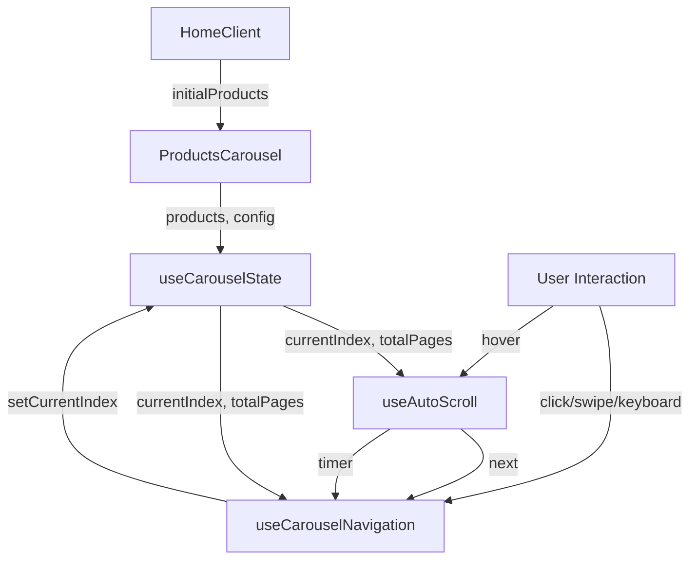

# Design Document: Products Carousel Auto Scroll

## Overview

Esta funcionalidade transforma a seção "Equipamentos da Seleção" de uma grade estática em um carrossel interativo com scroll automático. A solução utiliza React hooks customizados para gerenciar estado, timers e interações do usuário, mantendo a arquitetura modular e testável do projeto.

O carrossel será implementado como um novo componente `ProductsCarousel` que substituirá o `HomeProductsSection` atual, mantendo compatibilidade com a interface de produtos existente e adicionando funcionalidades de navegação automática e manual.

### Key Design Decisions

1. **Hook-based Architecture**: Separar lógica de negócio (auto-scroll, navegação) em hooks customizados reutilizáveis
2. **CSS-based Animations**: Usar CSS transforms e transitions para performance otimizada (GPU acceleration)
3. **Touch Gesture Support**: Implementar swipe nativo via `touch` events para dispositivos móveis
4. **Accessibility First**: Garantir navegação por teclado e compatibilidade com screen readers desde o início
5. **Progressive Enhancement**: Funcionar como grade estática se JavaScript falhar

## Architecture

### Component Hierarchy

```
HomeClient (existing)
└── ProductsCarousel (new)
    ├── CarouselContainer
    │   ├── NavigationButton (previous)
    │   ├── CarouselTrack
    │   │   └── ProductCard[] (existing, reused)
    │   └── NavigationButton (next)
    └── PaginationDots
```

### Data Flow



### State Management

O estado do carrossel será gerenciado localmente via hooks customizados:

- `useCarouselState`: Estado central (currentIndex, itemsPerView, totalPages)
- `useAutoScroll`: Gerencia timer de auto-scroll e pausas
- `useCarouselNavigation`: Controla navegação manual (click, keyboard, swipe)
- `useCarouselResponsive`: Detecta mudanças de viewport e ajusta itemsPerView

## Components and Interfaces

### ProductsCarousel Component

**Props Interface:**
```typescript
interface ProductsCarouselProps {
  initialProducts?: Product[];
  error?: string | null;
  autoScrollInterval?: number; // default: 5000ms
  autoScrollDelay?: number; // default: 3000ms
  transitionDuration?: number; // default: 500ms
  pauseOnHoverDuration?: number; // default: 1000ms
  pauseOnInteractionDuration?: number; // default: 10000ms
}
```

**Responsibilities:**
- Orquestrar hooks de estado e navegação
- Renderizar estrutura do carrossel
- Gerenciar event listeners (hover, touch)
- Fornecer contexto de acessibilidade (ARIA)

### CarouselTrack Component

**Props Interface:**
```typescript
interface CarouselTrackProps {
  products: Product[];
  currentIndex: number;
  itemsPerView: number;
  transitionDuration: number;
  isTransitioning: boolean;
}
```

**Responsibilities:**
- Renderizar lista de produtos
- Aplicar transformações CSS para scroll
- Gerenciar estado de transição

### NavigationButton Component

**Props Interface:**
```typescript
interface NavigationButtonProps {
  direction: 'prev' | 'next';
  onClick: () => void;
  disabled: boolean;
  isAtBoundary: boolean; // first or last page
  ariaLabel: string;
}
```

**Responsibilities:**
- Renderizar botão de navegação
- Aplicar estilos de estado (disabled, boundary)
- Fornecer feedback visual de hover/focus

### PaginationDots Component

**Props Interface:**
```typescript
interface PaginationDotsProps {
  totalPages: number;
  currentPage: number;
  onDotClick: (pageIndex: number) => void;
}
```

**Responsibilities:**
- Renderizar indicadores de página
- Destacar página atual
- Permitir navegação direta via click

## Data Models

### CarouselState

```typescript
interface CarouselState {
  currentIndex: number; // índice do primeiro item visível
  itemsPerView: number; // 2 (mobile) ou 4 (desktop)
  totalItems: number;
  totalPages: number; // Math.ceil(totalItems / itemsPerView)
  isTransitioning: boolean;
}
```

### AutoScrollState

```typescript
interface AutoScrollState {
  isActive: boolean;
  isPaused: boolean;
  pauseReason: 'hover' | 'interaction' | null;
  resumeTimeout: NodeJS.Timeout | null;
}
```

### NavigationState

```typescript
interface NavigationState {
  canGoPrev: boolean;
  canGoNext: boolean;
  isAtStart: boolean; // currentIndex === 0
  isAtEnd: boolean; // currentIndex + itemsPerView >= totalItems
}
```

## Custom Hooks

### useCarouselState

**Purpose:** Gerenciar estado central do carrossel

**Interface:**
```typescript
function useCarouselState(
  totalItems: number,
  initialItemsPerView: number
): {
  currentIndex: number;
  setCurrentIndex: (index: number) => void;
  itemsPerView: number;
  setItemsPerView: (count: number) => void;
  totalPages: number;
  currentPage: number;
  isTransitioning: boolean;
  setIsTransitioning: (value: boolean) => void;
}
```

**Behavior:**
- Calcula `totalPages` automaticamente: `Math.ceil(totalItems / itemsPerView)`
- Calcula `currentPage`: `Math.floor(currentIndex / itemsPerView)`
- Valida `currentIndex` para não exceder limites
- Gerencia flag `isTransitioning` para bloquear inputs durante animação

### useAutoScroll

**Purpose:** Gerenciar timer de auto-scroll e pausas

**Interface:**
```typescript
function useAutoScroll(
  onNext: () => void,
  config: {
    interval: number;
    initialDelay: number;
    pauseOnHoverDuration: number;
    pauseOnInteractionDuration: number;
  }
): {
  pause: (reason: 'hover' | 'interaction') => void;
  resume: () => void;
  isActive: boolean;
}
```

**Behavior:**
- Inicia timer após `initialDelay` (3s)
- Chama `onNext()` a cada `interval` (5s)
- Pausa imediatamente quando `pause()` é chamado
- Resume após duração específica baseada em `reason`:
  - `hover`: 1s após mouse sair
  - `interaction`: 10s após click/swipe
- Limpa timers no unmount

### useCarouselNavigation

**Purpose:** Controlar navegação manual

**Interface:**
```typescript
function useCarouselNavigation(
  currentIndex: number,
  setCurrentIndex: (index: number) => void,
  itemsPerView: number,
  totalItems: number,
  onInteraction: () => void
): {
  goToNext: () => void;
  goToPrev: () => void;
  goToPage: (pageIndex: number) => void;
  canGoNext: boolean;
  canGoPrev: boolean;
  isAtStart: boolean;
  isAtEnd: boolean;
}
```

**Behavior:**
- `goToNext()`: Avança `itemsPerView` itens, com loop ao final
- `goToPrev()`: Retrocede `itemsPerView` itens, com loop ao início
- `goToPage(pageIndex)`: Salta para página específica
- Chama `onInteraction()` após cada ação para pausar auto-scroll
- Calcula flags de navegação (canGoNext, isAtStart, etc.)

### useCarouselResponsive

**Purpose:** Detectar mudanças de viewport e ajustar itemsPerView

**Interface:**
```typescript
function useCarouselResponsive(): {
  itemsPerView: number;
  isMobile: boolean;
}
```

**Behavior:**
- Usa `window.matchMedia('(min-width: 768px)')` para detectar breakpoint
- Retorna `2` para mobile (< 768px), `4` para desktop (>= 768px)
- Atualiza em tempo real via `addEventListener('change')`
- Limpa listener no unmount

### useSwipeGesture

**Purpose:** Detectar gestos de swipe em dispositivos touch

**Interface:**
```typescript
function useSwipeGesture(
  onSwipeLeft: () => void,
  onSwipeRight: () => void,
  threshold?: number // default: 50px
): {
  onTouchStart: (e: TouchEvent) => void;
  onTouchMove: (e: TouchEvent) => void;
  onTouchEnd: (e: TouchEvent) => void;
}
```

**Behavior:**
- Captura `touchstart` para registrar posição inicial
- Captura `touchmove` para calcular delta
- Captura `touchend` para determinar direção e disparar callback
- Requer movimento mínimo de `threshold` pixels para ativar
- Chama `onSwipeLeft()` para swipe esquerda (next)
- Chama `onSwipeRight()` para swipe direita (prev)

## Error Handling

### Error Scenarios

1. **No Products Available**
   - Display: Mensagem "Nenhum produto disponível"
   - Behavior: Não renderizar carrossel, mostrar fallback estático

2. **Products Load Error**
   - Display: Mensagem de erro com botão "Tentar Novamente"
   - Behavior: Manter UI existente de `HomeProductsSection`

3. **Invalid currentIndex**
   - Behavior: Clamp para limites válidos (0 a totalItems - itemsPerView)
   - Log: Console warning em desenvolvimento

4. **Transition Interrupted**
   - Behavior: Completar transição atual antes de aceitar nova navegação
   - Implementation: Verificar `isTransitioning` flag

5. **Resize During Transition**
   - Behavior: Recalcular posição baseada em novo `itemsPerView`
   - Implementation: Ajustar `currentIndex` para manter página atual visível

## Testing Strategy

Esta feature envolve UI interativa com timers, animações e gestos touch. A estratégia de testes combina:

### Unit Tests (Vitest + React Testing Library)

**Hook Tests:**
- `useCarouselState`: Validar cálculos de totalPages, currentPage, limites de índice
- `useAutoScroll`: Validar timers, pausas e resumes (usando `vi.useFakeTimers()`)
- `useCarouselNavigation`: Validar lógica de navegação, loops, flags de estado
- `useCarouselResponsive`: Validar detecção de breakpoint (mock `window.matchMedia`)
- `useSwipeGesture`: Validar detecção de swipe com eventos touch simulados

**Component Tests:**
- `ProductsCarousel`: Renderização inicial, integração de hooks
- `NavigationButton`: Estados disabled/boundary, acessibilidade
- `PaginationDots`: Renderização de dots, highlight de página atual

**Example Test Cases:**
```typescript
describe('useCarouselNavigation', () => {
  it('should loop to first page when next is called on last page', () => {
    const { result } = renderHook(() => 
      useCarouselNavigation(8, mockSetIndex, 4, 12, mockOnInteraction)
    );
    act(() => result.current.goToNext());
    expect(mockSetIndex).toHaveBeenCalledWith(0);
  });

  it('should disable prev button on first page', () => {
    const { result } = renderHook(() => 
      useCarouselNavigation(0, mockSetIndex, 4, 12, mockOnInteraction)
    );
    expect(result.current.isAtStart).toBe(true);
  });
});

describe('useAutoScroll', () => {
  beforeEach(() => {
    vi.useFakeTimers();
  });

  it('should call onNext after interval', () => {
    const mockNext = vi.fn();
    renderHook(() => useAutoScroll(mockNext, { interval: 5000, initialDelay: 0 }));
    
    vi.advanceTimersByTime(5000);
    expect(mockNext).toHaveBeenCalledTimes(1);
  });

  it('should pause on hover and resume after duration', () => {
    const mockNext = vi.fn();
    const { result } = renderHook(() => 
      useAutoScroll(mockNext, { interval: 5000, pauseOnHoverDuration: 1000 })
    );
    
    act(() => result.current.pause('hover'));
    vi.advanceTimersByTime(5000);
    expect(mockNext).not.toHaveBeenCalled();
    
    act(() => result.current.resume());
    vi.advanceTimersByTime(1000);
    vi.advanceTimersByTime(5000);
    expect(mockNext).toHaveBeenCalledTimes(1);
  });
});
```

### Integration Tests

**User Flow Tests:**
- Carregar página → Auto-scroll inicia após 3s → Transição ocorre a cada 5s
- Click em next arrow → Carrossel avança → Auto-scroll pausa por 10s
- Hover sobre carrossel → Auto-scroll pausa → Mouse sai → Resume após 1s
- Swipe left em mobile → Carrossel avança → Auto-scroll pausa por 10s
- Click em pagination dot → Carrossel salta para página → Auto-scroll pausa por 10s
- Resize de desktop para mobile → itemsPerView muda de 4 para 2 → Posição ajustada

### Manual Testing Checklist

**Desktop (Chrome, Firefox, Safari):**
- [ ] Auto-scroll funciona corretamente
- [ ] Navigation arrows respondem a click
- [ ] Hover pausa auto-scroll
- [ ] Keyboard navigation (Tab, Enter, Space) funciona
- [ ] Pagination dots funcionam
- [ ] Transições são suaves (60fps)
- [ ] Screen reader anuncia mudanças de página

**Mobile (iOS Safari, Chrome Android):**
- [ ] Swipe gestures funcionam
- [ ] Navigation arrows ocultos
- [ ] Auto-scroll funciona
- [ ] Touch pausa auto-scroll
- [ ] Transições são suaves
- [ ] 2 produtos por view

**Accessibility:**
- [ ] Navegação por teclado completa
- [ ] ARIA labels corretos
- [ ] Focus visible em todos os controles
- [ ] Screen reader anuncia estado do carrossel

### Performance Testing

**Metrics to Monitor:**
- Transition frame rate (target: 60fps)
- Time to Interactive (TTI) impact
- Memory usage durante auto-scroll prolongado
- Layout shift (CLS) durante transições

**Tools:**
- Chrome DevTools Performance tab
- Lighthouse CI
- React DevTools Profiler

## Implementation Notes

### CSS Animation Strategy

Usar `transform: translateX()` para scroll horizontal (GPU-accelerated):

```css
.carousel-track {
  display: flex;
  transition: transform 500ms ease-in-out;
  will-change: transform;
}

.carousel-track[data-transitioning="true"] {
  pointer-events: none; /* Bloquear clicks durante transição */
}
```

### Accessibility Implementation

```tsx
<div
  role="region"
  aria-roledescription="carousel"
  aria-label="Equipamentos da Seleção"
>
  <div
    role="group"
    aria-roledescription="slide"
    aria-label={`Produtos ${currentPage + 1} de ${totalPages}`}
  >
    {/* Products */}
  </div>
  
  <button
    aria-label="Produto anterior"
    aria-disabled={isAtStart}
    onClick={goToPrev}
  >
    <ChevronLeft />
  </button>
  
  <div role="tablist" aria-label="Páginas do carrossel">
    {dots.map((_, i) => (
      <button
        key={i}
        role="tab"
        aria-selected={i === currentPage}
        aria-label={`Ir para página ${i + 1}`}
        onClick={() => goToPage(i)}
      />
    ))}
  </div>
</div>
```

### Touch Gesture Implementation

```typescript
function useSwipeGesture(onSwipeLeft, onSwipeRight, threshold = 50) {
  const touchStart = useRef<{ x: number; y: number } | null>(null);

  const onTouchStart = (e: TouchEvent) => {
    touchStart.current = {
      x: e.touches[0].clientX,
      y: e.touches[0].clientY,
    };
  };

  const onTouchEnd = (e: TouchEvent) => {
    if (!touchStart.current) return;

    const deltaX = e.changedTouches[0].clientX - touchStart.current.x;
    const deltaY = Math.abs(e.changedTouches[0].clientY - touchStart.current.y);

    // Ignorar se movimento vertical for maior (scroll vertical)
    if (deltaY > Math.abs(deltaX)) {
      touchStart.current = null;
      return;
    }

    if (Math.abs(deltaX) > threshold) {
      if (deltaX > 0) {
        onSwipeRight();
      } else {
        onSwipeLeft();
      }
    }

    touchStart.current = null;
  };

  return { onTouchStart, onTouchMove: () => {}, onTouchEnd };
}
```

### Responsive Behavior

```typescript
function useCarouselResponsive() {
  const [itemsPerView, setItemsPerView] = useState(() => 
    window.innerWidth >= 768 ? 4 : 2
  );

  useEffect(() => {
    const mediaQuery = window.matchMedia('(min-width: 768px)');
    
    const handleChange = (e: MediaQueryListEvent) => {
      setItemsPerView(e.matches ? 4 : 2);
    };

    mediaQuery.addEventListener('change', handleChange);
    return () => mediaQuery.removeEventListener('change', handleChange);
  }, []);

  return { itemsPerView, isMobile: itemsPerView === 2 };
}
```

### Auto-scroll Timer Management

```typescript
function useAutoScroll(onNext, config) {
  const intervalRef = useRef<NodeJS.Timeout | null>(null);
  const resumeTimeoutRef = useRef<NodeJS.Timeout | null>(null);
  const [isActive, setIsActive] = useState(false);

  const startInterval = useCallback(() => {
    if (intervalRef.current) clearInterval(intervalRef.current);
    intervalRef.current = setInterval(onNext, config.interval);
    setIsActive(true);
  }, [onNext, config.interval]);

  const pause = useCallback((reason: 'hover' | 'interaction') => {
    if (intervalRef.current) {
      clearInterval(intervalRef.current);
      intervalRef.current = null;
    }
    if (resumeTimeoutRef.current) {
      clearTimeout(resumeTimeoutRef.current);
    }
    setIsActive(false);
  }, []);

  const resume = useCallback((reason: 'hover' | 'interaction') => {
    const duration = reason === 'hover' 
      ? config.pauseOnHoverDuration 
      : config.pauseOnInteractionDuration;

    resumeTimeoutRef.current = setTimeout(() => {
      startInterval();
    }, duration);
  }, [startInterval, config]);

  useEffect(() => {
    const initialTimeout = setTimeout(startInterval, config.initialDelay);
    
    return () => {
      clearTimeout(initialTimeout);
      if (intervalRef.current) clearInterval(intervalRef.current);
      if (resumeTimeoutRef.current) clearTimeout(resumeTimeoutRef.current);
    };
  }, [startInterval, config.initialDelay]);

  return { pause, resume, isActive };
}
```

## Migration Strategy

### Phase 1: Create New Component (Non-Breaking)

1. Criar `ProductsCarousel` component em `apps/web/src/components/ProductsCarousel/`
2. Implementar hooks em `apps/web/src/components/ProductsCarousel/hooks/`
3. Adicionar testes unitários
4. Manter `HomeProductsSection` existente

### Phase 2: Feature Flag Integration

1. Adicionar feature flag `ENABLE_PRODUCTS_CAROUSEL` em `.env`
2. Modificar `HomeClient.tsx` para renderizar condicionalmente:
   ```tsx
   {process.env.NEXT_PUBLIC_ENABLE_PRODUCTS_CAROUSEL === 'true' 
     ? <ProductsCarousel initialProducts={initialProducts} error={productsError} />
     : <HomeProductsSection initialProducts={initialProducts} error={productsError} />
   }
   ```

### Phase 3: Testing & Rollout

1. Testar em staging com feature flag enabled
2. Validar performance, acessibilidade, responsividade
3. Deploy para produção com flag disabled
4. Habilitar flag gradualmente (A/B test)

### Phase 4: Cleanup

1. Remover `HomeProductsSection` após validação completa
2. Remover feature flag
3. Atualizar documentação

## Future Enhancements

### Potential Improvements (Out of Scope)

1. **Infinite Loop Mode**: Duplicar produtos para scroll infinito sem "jump"
2. **Variable Speed**: Ajustar velocidade de auto-scroll baseado em engagement
3. **Lazy Loading**: Carregar imagens de produtos fora da view apenas quando necessário
4. **Analytics Integration**: Rastrear interações (clicks, swipes, auto-scroll views)
5. **Customizable Transitions**: Permitir fade, slide vertical, etc.
6. **Multi-row Carousel**: Suportar múltiplas linhas de produtos
7. **Thumbnail Preview**: Mostrar preview de próxima página ao hover em arrows

### Technical Debt Considerations

- Considerar migrar para biblioteca de carrossel (ex: Swiper.js) se complexidade aumentar
- Avaliar uso de Intersection Observer API para lazy loading de imagens
- Considerar Web Animations API para transições mais complexas no futuro
