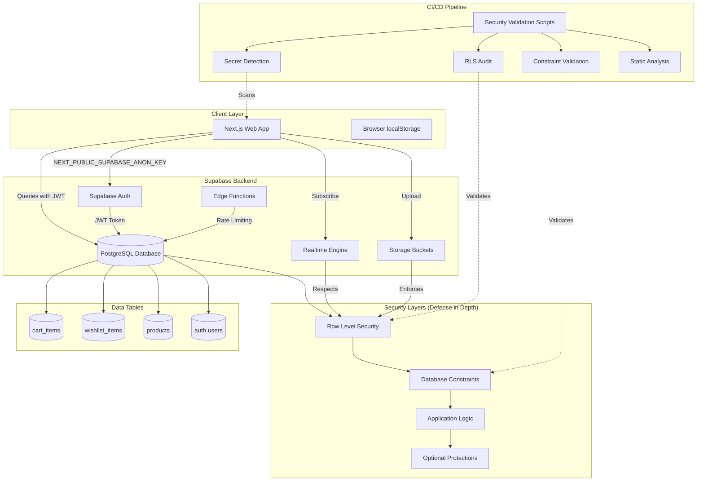
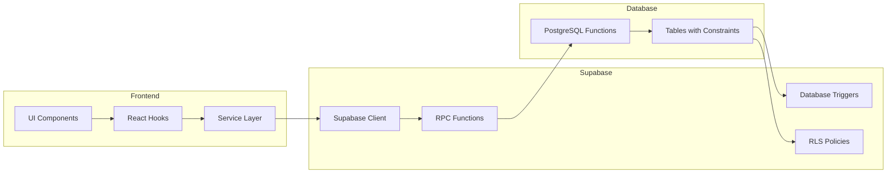
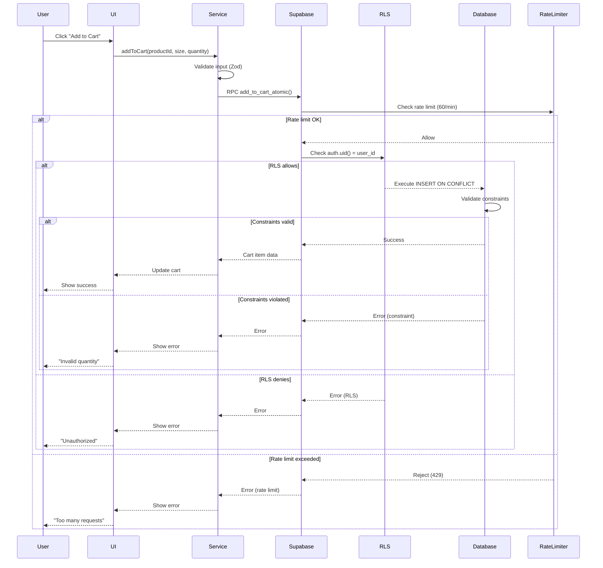
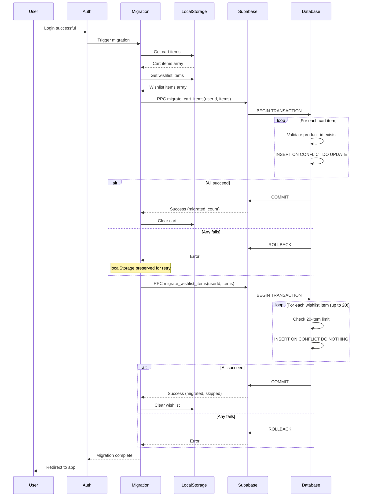

# Design Document: Supabase Security Validation

## Overview

The Supabase Security Validation feature implements comprehensive security controls and data validation for the Agon e-commerce platform's Supabase backend. This design follows a LEAN and PRODUCTION-SAFE approach: secure by default, operationally simple, and ready for gradual evolution.

### Purpose

This feature ensures that:
- User data is isolated through Row Level Security (RLS)
- Database integrity is enforced through constraints
- API keys are never exposed in client code
- Realtime synchronization respects security policies
- Concurrent operations are handled atomically
- Migration from localStorage to database is transactional
- Rate limiting prevents abuse
- CI/CD pipeline enforces security standards
- System is comprehensible by a single engineer

### Scope

**In Scope:**
- RLS policies for cart_items and wishlist_items tables
- Database constraints (unique, check, foreign keys)
- Atomic operations via RPC functions
- Transactional migration logic
- Rate limiting (60 req/min per user)
- Environment variable validation
- Storage security (private buckets, file validation)
- Auth configuration (JWT expiration, provider management)
- Structured logging without sensitive data
- SQL injection prevention
- Automated backup strategy
- CI/CD security enforcement scripts
- Operational simplicity guidelines

**Out of Scope (Future Evolution):**
- Multi-dimensional rate limiting
- Anomaly detection with ML
- Advanced monitoring (SLA/SLO tracking)
- Malware scanning for uploads
- Active audit with auto-blocking
- Multi-tenancy isolation
- RPC versioning and governance
- Anti-enumeration timing obfuscation
- Log sampling and aggregation
- Email-specific rate limiting

### Key Design Principles

1. **Secure by Default**: All tables have RLS enabled, all buckets are private
2. **Defense in Depth**: RLS → Constraints → App Logic → Optional Protections
3. **Fail-Safe for Security**: RLS failures reject requests
4. **Fail-Open for Non-Critical**: Rate limiting failures allow requests
5. **Atomic Operations**: Use PostgreSQL transactions for consistency
6. **Idempotent Migrations**: Safe to retry without duplication
7. **Single Source of Truth**: Database after auth, localStorage before auth
8. **Operational Simplicity**: One engineer can understand and maintain
9. **Gradual Evolution**: Advanced features can be added incrementally
10. **CI/CD Enforcement**: Security is validated automatically

### Key Design Decisions

1. **RLS as Primary Security**: All user data isolation enforced at database level
2. **PostgreSQL Constraints**: Data integrity enforced at database level, not application
3. **RPC Functions for Atomicity**: Complex operations use SECURITY DEFINER functions
4. **Transactional Migration**: All-or-nothing migration with automatic rollback
5. **Simple Rate Limiting**: 60 req/min per user_id via database trigger or Edge Function
6. **Anon Key Only in Frontend**: Service Role Key never exposed to client
7. **Email/Password Only**: Disable unused auth providers to reduce attack surface
8. **Structured JSON Logs**: Consistent format without sensitive data
9. **Prepared Statements**: All queries use parameterized queries
10. **Daily Automated Backups**: 30-day retention via Supabase
11. **CI/CD as Gatekeeper**: Build fails if security standards not met
12. **No Hidden Systems**: All security logic is explicit and documented


## Architecture

### High-Level Architecture



### Security Layer Priority

The system implements defense in depth with clear priority:

1. **RLS (Row Level Security)** - CRITICAL
   - Primary security boundary
   - Enforced at database level
   - Failure mode: REJECT (fail-safe)
   - Cannot be bypassed by application code

2. **Database Constraints** - CRITICAL
   - Data integrity enforcement
   - Unique, check, foreign key constraints
   - Failure mode: REJECT (fail-safe)
   - Prevents invalid data at source

3. **Application Logic** - IMPORTANT
   - Business rules and validation
   - Zod schemas, input sanitization
   - Failure mode: REJECT with user feedback
   - Provides better error messages

4. **Optional Protections** - NICE-TO-HAVE
   - Rate limiting, logging, monitoring
   - Failure mode: ALLOW (fail-open)
   - Should not block critical operations

### Component Architecture



### Data Flow: Add to Cart (Authenticated)



### Migration Flow




## Components and Interfaces

### 1. RLS Policy System

**Purpose**: Enforce user data isolation at database level

**Components**:
- `cart_items_select_own`: Allow users to SELECT only their cart items
- `cart_items_insert_own`: Allow users to INSERT only with their user_id
- `cart_items_update_own`: Allow users to UPDATE only their cart items
- `cart_items_delete_own`: Allow users to DELETE only their cart items
- `wishlist_items_select_own`: Allow users to SELECT only their wishlist items
- `wishlist_items_insert_own`: Allow users to INSERT only with their user_id
- `wishlist_items_delete_own`: Allow users to DELETE only their wishlist items

**Policy Pattern**:
```sql
-- Standard pattern for all policies
CREATE POLICY "table_operation_own"
  ON table_name FOR OPERATION
  USING (auth.uid() = user_id)
  WITH CHECK (auth.uid() = user_id);
```

**Audit Requirements**:
- No policies with `USING (true)` or `WITH CHECK (true)`
- All policies must use `auth.uid()` for user isolation
- All CRUD operations must have corresponding policies
- Automated validation in CI/CD

### 2. Database Constraint System

**Purpose**: Enforce data integrity at database level

**Cart Items Constraints**:
```sql
-- Quantity validation
CHECK (quantity >= 1 AND quantity <= 99)

-- Size validation
CHECK (char_length(size) > 0 AND char_length(size) <= 10)

-- Unique constraint
UNIQUE (user_id, product_id, size)

-- Foreign keys with cascade
FOREIGN KEY (user_id) REFERENCES auth.users(id) ON DELETE CASCADE
FOREIGN KEY (product_id) REFERENCES products(id) ON DELETE CASCADE

-- Cross-field validation
CHECK (price_snapshot > 0)
CHECK (product_name_snapshot != '')
CHECK (quantity * price_snapshot <= 999999)
CHECK (created_at <= updated_at)
```

**Wishlist Items Constraints**:
```sql
-- Unique constraint
UNIQUE (user_id, product_id)

-- Foreign keys with cascade
FOREIGN KEY (user_id) REFERENCES auth.users(id) ON DELETE CASCADE
FOREIGN KEY (product_id) REFERENCES products(id) ON DELETE CASCADE

-- 20-item limit (enforced via trigger)
CREATE TRIGGER enforce_wishlist_limit
  BEFORE INSERT ON wishlist_items
  FOR EACH ROW
  EXECUTE FUNCTION check_wishlist_limit();
```

### 3. Atomic Operation RPC Functions

**Purpose**: Provide transactional, race-free operations

**Interface**:
```typescript
// Add to cart atomically
interface AddToCartAtomicParams {
  p_user_id: string;
  p_product_id: string;
  p_quantity: number;
  p_size: string;
}

interface AddToCartAtomicResult {
  success: boolean;
  item?: CartItem;
  error?: string;
}

// Migrate cart items
interface MigrateCartItemsParams {
  p_user_id: string;
  p_items: Array<{
    productId: string;
    quantity: number;
    size: string;
  }>;
}

interface MigrateCartItemsResult {
  success: boolean;
  migrated_count: number;
  error?: string;
}

// Migrate wishlist items
interface MigrateWishlistItemsParams {
  p_user_id: string;
  p_items: Array<{
    productId: string;
  }>;
}

interface MigrateWishlistItemsResult {
  success: boolean;
  migrated_count: number;
  skipped_count: number;
  error?: string;
}
```

**Implementation Pattern**:
```sql
CREATE OR REPLACE FUNCTION operation_name(params)
RETURNS JSONB AS $$
DECLARE
  -- Variables
BEGIN
  -- BEGIN TRANSACTION (implicit)
  
  -- Validate inputs
  -- Perform operations
  -- Return success
  
  RETURN jsonb_build_object('success', true, ...);
EXCEPTION
  WHEN OTHERS THEN
    -- ROLLBACK (automatic)
    RETURN jsonb_build_object('success', false, 'error', SQLERRM);
END;
$$ LANGUAGE plpgsql SECURITY DEFINER;
```

### 4. Migration Service

**Purpose**: Transfer localStorage data to database on login

**Interface**:
```typescript
interface MigrationService {
  // Main migration function
  migrateUserData(userId: string): Promise<MigrationResult>;
  
  // Check if migration is needed
  needsMigration(): boolean;
  
  // Mark migration as complete
  markMigrationComplete(): void;
  
  // Get migration status
  getMigrationStatus(): 'pending' | 'in_progress' | 'complete' | 'failed';
}

interface MigrationResult {
  success: boolean;
  cart: {
    migrated: number;
    failed: number;
  };
  wishlist: {
    migrated: number;
    skipped: number;
    failed: number;
  };
  error?: string;
}
```

**Migration Strategy**:
1. Check localStorage for cart/wishlist data
2. If data exists, call RPC functions in parallel
3. Both migrations are transactional (all-or-nothing)
4. On success, clear localStorage and mark complete
5. On failure, preserve localStorage for retry
6. Show loading state during migration (max 10s timeout)
7. On timeout, show error and allow page reload

### 5. Rate Limiting System

**Purpose**: Prevent abuse of cart/wishlist operations

**Implementation Options**:

**Option A: Database Trigger (Simpler)**
```sql
CREATE TABLE rate_limit_log (
  user_id UUID NOT NULL,
  operation TEXT NOT NULL,
  timestamp TIMESTAMPTZ DEFAULT NOW(),
  PRIMARY KEY (user_id, operation, timestamp)
);

CREATE INDEX idx_rate_limit_log_user_time 
  ON rate_limit_log(user_id, timestamp DESC);

CREATE OR REPLACE FUNCTION check_rate_limit()
RETURNS TRIGGER AS $$
DECLARE
  request_count INTEGER;
BEGIN
  -- Count requests in last minute
  SELECT COUNT(*) INTO request_count
  FROM rate_limit_log
  WHERE user_id = NEW.user_id
    AND operation = TG_TABLE_NAME
    AND timestamp > NOW() - INTERVAL '1 minute';
  
  IF request_count >= 60 THEN
    RAISE EXCEPTION 'Rate limit exceeded: 60 requests per minute';
  END IF;
  
  -- Log this request
  INSERT INTO rate_limit_log (user_id, operation)
  VALUES (NEW.user_id, TG_TABLE_NAME);
  
  RETURN NEW;
END;
$$ LANGUAGE plpgsql;

CREATE TRIGGER cart_rate_limit
  BEFORE INSERT OR UPDATE ON cart_items
  FOR EACH ROW
  EXECUTE FUNCTION check_rate_limit();
```

**Option B: Edge Function (More Flexible)**
```typescript
// Edge Function: rate-limiter
import { createClient } from '@supabase/supabase-js';

const RATE_LIMIT = 60; // requests per minute
const WINDOW = 60; // seconds

export async function rateLimiter(req: Request) {
  const { userId, operation } = await req.json();
  
  const supabase = createClient(
    Deno.env.get('SUPABASE_URL')!,
    Deno.env.get('SUPABASE_SERVICE_ROLE_KEY')!
  );
  
  // Check rate limit
  const { count } = await supabase
    .from('rate_limit_log')
    .select('*', { count: 'exact', head: true })
    .eq('user_id', userId)
    .eq('operation', operation)
    .gte('timestamp', new Date(Date.now() - WINDOW * 1000).toISOString());
  
  if (count >= RATE_LIMIT) {
    return new Response(
      JSON.stringify({ error: 'Rate limit exceeded' }),
      { status: 429 }
    );
  }
  
  // Log request
  await supabase.from('rate_limit_log').insert({
    user_id: userId,
    operation: operation,
  });
  
  return new Response(JSON.stringify({ allowed: true }));
}
```

**Recommendation**: Start with Option A (database trigger) for simplicity. Migrate to Option B if more flexibility is needed (e.g., different limits per operation, burst handling).

### 6. Environment Variable Validation

**Purpose**: Ensure API keys are never exposed

**Validation Rules**:
```typescript
// Environment variable schema
const envSchema = z.object({
  // Public keys (safe to expose)
  NEXT_PUBLIC_SUPABASE_URL: z.string().url(),
  NEXT_PUBLIC_SUPABASE_ANON_KEY: z.string().min(1),
  
  // Private keys (never expose)
  SUPABASE_SERVICE_ROLE_KEY: z.string().min(1),
  
  // Optional
  SUPABASE_JWT_SECRET: z.string().optional(),
});

// Validation function
function validateEnvironment() {
  const env = envSchema.parse(process.env);
  
  // Check that Service Role Key is not in client code
  if (typeof window !== 'undefined' && process.env.SUPABASE_SERVICE_ROLE_KEY) {
    throw new Error('SUPABASE_SERVICE_ROLE_KEY exposed to client!');
  }
  
  return env;
}
```

**CI/CD Checks**:
```bash
#!/bin/bash
# check-secrets.sh

# Check for Service Role Key in client code
if grep -r "SUPABASE_SERVICE_ROLE_KEY" apps/web/src/; then
  echo "ERROR: Service Role Key found in client code!"
  exit 1
fi

# Check for .env files in git
if git ls-files | grep -E "\.env$|\.env\.local$"; then
  echo "ERROR: .env files should not be committed!"
  exit 1
fi

# Check for hardcoded keys
if grep -r "eyJ[a-zA-Z0-9_-]*\.[a-zA-Z0-9_-]*\.[a-zA-Z0-9_-]*" apps/web/src/; then
  echo "WARNING: Potential JWT token found in code!"
  exit 1
fi

echo "✓ No secrets exposed"
```

### 7. Storage Security System

**Purpose**: Secure file uploads with validation

**Configuration**:
```sql
-- Create private bucket
INSERT INTO storage.buckets (id, name, public)
VALUES ('user-uploads', 'user-uploads', false);

-- RLS policy for uploads
CREATE POLICY "users_upload_own"
  ON storage.objects FOR INSERT
  WITH CHECK (
    bucket_id = 'user-uploads' AND
    auth.uid()::text = (storage.foldername(name))[1]
  );

-- RLS policy for downloads
CREATE POLICY "users_download_own"
  ON storage.objects FOR SELECT
  USING (
    bucket_id = 'user-uploads' AND
    auth.uid()::text = (storage.foldername(name))[1]
  );
```

**Client-Side Validation**:
```typescript
interface FileValidationConfig {
  maxSizeBytes: number; // 5MB
  allowedMimeTypes: string[]; // ['image/jpeg', 'image/png', 'image/webp']
}

async function validateFile(file: File, config: FileValidationConfig): Promise<void> {
  // Check file size
  if (file.size > config.maxSizeBytes) {
    throw new Error(`File too large. Max size: ${config.maxSizeBytes / 1024 / 1024}MB`);
  }
  
  // Check MIME type (magic bytes, not extension)
  const buffer = await file.arrayBuffer();
  const bytes = new Uint8Array(buffer);
  const actualMimeType = detectMimeType(bytes);
  
  if (!config.allowedMimeTypes.includes(actualMimeType)) {
    throw new Error(`Invalid file type. Allowed: ${config.allowedMimeTypes.join(', ')}`);
  }
}

function detectMimeType(bytes: Uint8Array): string {
  // JPEG: FF D8 FF
  if (bytes[0] === 0xFF && bytes[1] === 0xD8 && bytes[2] === 0xFF) {
    return 'image/jpeg';
  }
  
  // PNG: 89 50 4E 47
  if (bytes[0] === 0x89 && bytes[1] === 0x50 && bytes[2] === 0x4E && bytes[3] === 0x47) {
    return 'image/png';
  }
  
  // WebP: 52 49 46 46 ... 57 45 42 50
  if (bytes[0] === 0x52 && bytes[1] === 0x49 && bytes[2] === 0x46 && bytes[3] === 0x46 &&
      bytes[8] === 0x57 && bytes[9] === 0x45 && bytes[10] === 0x42 && bytes[11] === 0x50) {
    return 'image/webp';
  }
  
  return 'application/octet-stream';
}
```

### 8. Auth Configuration System

**Purpose**: Harden authentication security

**Supabase Auth Settings**:
```typescript
interface AuthConfig {
  // JWT settings
  jwt_expiry: number; // 3600 (1 hour)
  refresh_token_rotation_enabled: boolean; // true
  
  // Providers
  enable_email_password: boolean; // true
  enable_google: boolean; // false
  enable_github: boolean; // false
  
  // Email confirmation
  enable_email_confirmations: boolean; // true
  email_confirm_redirect_url: string; // https://agon.com/auth/callback
  
  // Password requirements
  password_min_length: number; // 8
  password_require_uppercase: boolean; // true
  password_require_lowercase: boolean; // true
  password_require_numbers: boolean; // true
  password_require_symbols: boolean; // false
  
  // Session management
  security_update_password_require_reauthentication: boolean; // true
  sessions_timebox: number; // 86400 (24 hours)
  sessions_inactivity_timeout: number; // 3600 (1 hour)
}
```

**Session Invalidation**:
```sql
-- Function to invalidate all sessions except current
CREATE OR REPLACE FUNCTION invalidate_other_sessions()
RETURNS TRIGGER AS $$
BEGIN
  -- When password changes, invalidate all other sessions
  IF NEW.encrypted_password != OLD.encrypted_password THEN
    DELETE FROM auth.sessions
    WHERE user_id = NEW.id
      AND id != current_setting('request.jwt.claim.session_id', true)::uuid;
  END IF;
  
  RETURN NEW;
END;
$$ LANGUAGE plpgsql SECURITY DEFINER;

CREATE TRIGGER on_password_change
  AFTER UPDATE ON auth.users
  FOR EACH ROW
  EXECUTE FUNCTION invalidate_other_sessions();
```

### 9. Logging System

**Purpose**: Structured logging without sensitive data

**Log Levels**:
- `info`: Normal operations (cart add, wishlist add)
- `warn`: Recoverable errors (rate limit hit, validation failed)
- `error`: Unrecoverable errors (database down, RLS denied)

**Log Format**:
```typescript
interface LogEntry {
  level: 'info' | 'warn' | 'error';
  timestamp: string; // ISO 8601
  user_id?: string; // Hashed or UUID only
  operation: string; // 'cart.add', 'wishlist.remove'
  duration_ms?: number;
  error?: {
    code: string;
    message: string; // Sanitized, no sensitive data
  };
  metadata?: Record<string, unknown>; // No PII
}

// Example usage
logger.info({
  operation: 'cart.add',
  user_id: userId, // UUID is safe
  duration_ms: 45,
  metadata: {
    product_id: productId, // UUID is safe
    quantity: 2,
    // NO: email, password, tokens, Service_Role_Key
  },
});
```

**Redaction Rules**:
```typescript
const SENSITIVE_FIELDS = [
  'password',
  'token',
  'secret',
  'key',
  'authorization',
  'cookie',
  'session',
  'email', // Redact in logs, use user_id instead
  'cpf',
  'credit_card',
];

function redactSensitiveData(obj: any): any {
  if (typeof obj !== 'object' || obj === null) return obj;
  
  const redacted = { ...obj };
  
  for (const key of Object.keys(redacted)) {
    const lowerKey = key.toLowerCase();
    
    if (SENSITIVE_FIELDS.some(field => lowerKey.includes(field))) {
      redacted[key] = '[REDACTED]';
    } else if (typeof redacted[key] === 'object') {
      redacted[key] = redactSensitiveData(redacted[key]);
    }
  }
  
  return redacted;
}
```

### 10. SQL Injection Prevention

**Purpose**: Ensure all queries use prepared statements

**Safe Patterns**:
```typescript
// ✅ SAFE: Parameterized query
const { data } = await supabase
  .from('cart_items')
  .select('*')
  .eq('user_id', userId)
  .eq('product_id', productId);

// ✅ SAFE: RPC with parameters
const { data } = await supabase.rpc('add_to_cart_atomic', {
  p_user_id: userId,
  p_product_id: productId,
  p_quantity: quantity,
  p_size: size,
});

// ❌ UNSAFE: String concatenation
const query = `SELECT * FROM cart_items WHERE user_id = '${userId}'`;
// NEVER DO THIS!
```

**RPC Function Security Checklist**:
```sql
-- ✅ Use parameters, not dynamic SQL
CREATE OR REPLACE FUNCTION safe_function(p_user_id UUID)
RETURNS TABLE(...) AS $$
BEGIN
  RETURN QUERY
  SELECT * FROM cart_items
  WHERE user_id = p_user_id; -- Parameter, not concatenation
END;
$$ LANGUAGE plpgsql SECURITY DEFINER;

-- ❌ UNSAFE: Dynamic SQL
CREATE OR REPLACE FUNCTION unsafe_function(p_table_name TEXT)
RETURNS TABLE(...) AS $$
BEGIN
  RETURN QUERY EXECUTE 'SELECT * FROM ' || p_table_name; -- SQL injection!
END;
$$ LANGUAGE plpgsql SECURITY DEFINER;
```

**Static Analysis Rules**:
```javascript
// ESLint rule: no-string-concatenation-in-queries
module.exports = {
  rules: {
    'no-sql-string-concat': {
      create(context) {
        return {
          CallExpression(node) {
            if (node.callee.property?.name === 'rpc') {
              // Check for template literals or string concatenation
              const args = node.arguments;
              if (args.some(arg => arg.type === 'TemplateLiteral' || arg.type === 'BinaryExpression')) {
                context.report({
                  node,
                  message: 'Potential SQL injection: use parameterized queries',
                });
              }
            }
          },
        };
      },
    },
  },
};
```


## Data Models

### Cart Items Table Schema

```sql
CREATE TABLE cart_items (
  -- Primary key
  id UUID PRIMARY KEY DEFAULT gen_random_uuid(),
  
  -- Foreign keys with cascade delete
  user_id UUID NOT NULL REFERENCES auth.users(id) ON DELETE CASCADE,
  product_id UUID NOT NULL REFERENCES products(id) ON DELETE CASCADE,
  
  -- Cart data
  quantity INTEGER NOT NULL CHECK (quantity >= 1 AND quantity <= 99),
  size TEXT NOT NULL CHECK (char_length(size) > 0 AND char_length(size) <= 10),
  
  -- Price snapshot for historical accuracy
  price_snapshot DECIMAL(10, 2) NOT NULL CHECK (price_snapshot > 0),
  product_name_snapshot TEXT NOT NULL CHECK (product_name_snapshot != ''),
  
  -- Timestamps
  created_at TIMESTAMPTZ DEFAULT NOW() NOT NULL,
  updated_at TIMESTAMPTZ DEFAULT NOW() NOT NULL,
  
  -- Constraints
  CONSTRAINT unique_cart_item UNIQUE (user_id, product_id, size),
  CONSTRAINT valid_total CHECK (quantity * price_snapshot <= 999999),
  CONSTRAINT valid_timestamps CHECK (created_at <= updated_at)
);

-- Indexes for performance
CREATE INDEX idx_cart_items_user_id ON cart_items(user_id);
CREATE INDEX idx_cart_items_product_id ON cart_items(product_id);
CREATE INDEX idx_cart_items_updated_at ON cart_items(updated_at DESC);

-- Trigger to update updated_at
CREATE TRIGGER update_cart_items_updated_at
  BEFORE UPDATE ON cart_items
  FOR EACH ROW
  EXECUTE FUNCTION update_updated_at_column();

-- Enable RLS
ALTER TABLE cart_items ENABLE ROW LEVEL SECURITY;
```

**TypeScript Interface**:
```typescript
interface CartItem {
  id: string;
  user_id: string;
  product_id: string;
  quantity: number; // 1-99
  size: string; // max 10 chars
  price_snapshot: number; // > 0
  product_name_snapshot: string; // not empty
  created_at: string; // ISO 8601
  updated_at: string; // ISO 8601
}

// Zod schema for validation
const cartItemSchema = z.object({
  user_id: z.string().uuid(),
  product_id: z.string().uuid(),
  quantity: z.number().int().min(1).max(99),
  size: z.string().min(1).max(10),
  price_snapshot: z.number().positive(),
  product_name_snapshot: z.string().min(1),
});
```

### Wishlist Items Table Schema

```sql
CREATE TABLE wishlist_items (
  -- Primary key
  id UUID PRIMARY KEY DEFAULT gen_random_uuid(),
  
  -- Foreign keys with cascade delete
  user_id UUID NOT NULL REFERENCES auth.users(id) ON DELETE CASCADE,
  product_id UUID NOT NULL REFERENCES products(id) ON DELETE CASCADE,
  
  -- Timestamp
  created_at TIMESTAMPTZ DEFAULT NOW() NOT NULL,
  
  -- Constraints
  CONSTRAINT unique_wishlist_item UNIQUE (user_id, product_id)
);

-- Indexes for performance
CREATE INDEX idx_wishlist_items_user_id ON wishlist_items(user_id);
CREATE INDEX idx_wishlist_items_product_id ON wishlist_items(product_id);
CREATE INDEX idx_wishlist_items_created_at ON wishlist_items(created_at DESC);

-- Trigger to enforce 20-item limit
CREATE TRIGGER enforce_wishlist_limit
  BEFORE INSERT ON wishlist_items
  FOR EACH ROW
  EXECUTE FUNCTION check_wishlist_limit();

-- Enable RLS
ALTER TABLE wishlist_items ENABLE ROW LEVEL SECURITY;
```

**TypeScript Interface**:
```typescript
interface WishlistItem {
  id: string;
  user_id: string;
  product_id: string;
  created_at: string; // ISO 8601
}

// Zod schema for validation
const wishlistItemSchema = z.object({
  user_id: z.string().uuid(),
  product_id: z.string().uuid(),
});
```

### Rate Limit Log Table Schema

```sql
CREATE TABLE rate_limit_log (
  user_id UUID NOT NULL,
  operation TEXT NOT NULL,
  timestamp TIMESTAMPTZ DEFAULT NOW() NOT NULL,
  
  PRIMARY KEY (user_id, operation, timestamp)
);

-- Index for rate limit queries
CREATE INDEX idx_rate_limit_log_user_time 
  ON rate_limit_log(user_id, timestamp DESC);

-- Cleanup old logs (keep last 24 hours)
CREATE OR REPLACE FUNCTION cleanup_rate_limit_logs()
RETURNS INTEGER AS $$
DECLARE
  deleted_count INTEGER;
BEGIN
  DELETE FROM rate_limit_log
  WHERE timestamp < NOW() - INTERVAL '24 hours';
  
  GET DIAGNOSTICS deleted_count = ROW_COUNT;
  RETURN deleted_count;
END;
$$ LANGUAGE plpgsql;

-- Schedule cleanup (using pg_cron or Edge Function)
-- SELECT cron.schedule('cleanup-rate-limits', '0 * * * *', 'SELECT cleanup_rate_limit_logs()');
```

### RLS Policies Data Model

```sql
-- Cart Items RLS Policies
CREATE POLICY "cart_items_select_own"
  ON cart_items FOR SELECT
  USING (auth.uid() = user_id);

CREATE POLICY "cart_items_insert_own"
  ON cart_items FOR INSERT
  WITH CHECK (auth.uid() = user_id);

CREATE POLICY "cart_items_update_own"
  ON cart_items FOR UPDATE
  USING (auth.uid() = user_id)
  WITH CHECK (auth.uid() = user_id);

CREATE POLICY "cart_items_delete_own"
  ON cart_items FOR DELETE
  USING (auth.uid() = user_id);

-- Wishlist Items RLS Policies
CREATE POLICY "wishlist_items_select_own"
  ON wishlist_items FOR SELECT
  USING (auth.uid() = user_id);

CREATE POLICY "wishlist_items_insert_own"
  ON wishlist_items FOR INSERT
  WITH CHECK (auth.uid() = user_id);

CREATE POLICY "wishlist_items_delete_own"
  ON wishlist_items FOR DELETE
  USING (auth.uid() = user_id);
```

### Migration Data Structures

**localStorage Format**:
```typescript
interface LocalStorageCart {
  items: Array<{
    productId: string;
    quantity: number;
    size: string;
  }>;
  version: number; // Schema version for future migrations
}

interface LocalStorageWishlist {
  items: Array<{
    productId: string;
  }>;
  version: number;
}

// Keys
const CART_KEY = 'agon_cart';
const WISHLIST_KEY = 'agon_wishlist';
const MIGRATION_KEY = 'agon_migrated';
```

**Migration RPC Parameters**:
```typescript
// Cart migration
interface MigrateCartParams {
  p_user_id: string;
  p_items: Array<{
    productId: string;
    quantity: number;
    size: string;
  }>;
}

// Wishlist migration
interface MigrateWishlistParams {
  p_user_id: string;
  p_items: Array<{
    productId: string;
  }>;
}
```

### Environment Variables Schema

```typescript
// .env.local (development)
interface DevelopmentEnv {
  NEXT_PUBLIC_SUPABASE_URL: string;
  NEXT_PUBLIC_SUPABASE_ANON_KEY: string;
  SUPABASE_SERVICE_ROLE_KEY: string; // NEVER expose to client
  SUPABASE_JWT_SECRET?: string;
}

// .env.production (production)
interface ProductionEnv {
  NEXT_PUBLIC_SUPABASE_URL: string;
  NEXT_PUBLIC_SUPABASE_ANON_KEY: string;
  SUPABASE_SERVICE_ROLE_KEY: string; // Server-side only
  SUPABASE_JWT_SECRET?: string;
}

// Validation
const envSchema = z.object({
  NEXT_PUBLIC_SUPABASE_URL: z.string().url(),
  NEXT_PUBLIC_SUPABASE_ANON_KEY: z.string().startsWith('eyJ'),
  SUPABASE_SERVICE_ROLE_KEY: z.string().startsWith('eyJ'),
  SUPABASE_JWT_SECRET: z.string().optional(),
});
```

### Constraint Summary Table

| Table | Constraint Type | Constraint Name | Purpose |
|-------|----------------|-----------------|---------|
| cart_items | UNIQUE | unique_cart_item | Prevent duplicate (user_id, product_id, size) |
| cart_items | CHECK | quantity_range | Ensure quantity between 1-99 |
| cart_items | CHECK | size_length | Ensure size is 1-10 chars |
| cart_items | CHECK | price_positive | Ensure price_snapshot > 0 |
| cart_items | CHECK | name_not_empty | Ensure product_name_snapshot not empty |
| cart_items | CHECK | valid_total | Prevent overflow (quantity * price <= 999999) |
| cart_items | CHECK | valid_timestamps | Ensure created_at <= updated_at |
| cart_items | FK CASCADE | user_id_fk | Auto-delete when user deleted |
| cart_items | FK CASCADE | product_id_fk | Auto-delete when product deleted |
| wishlist_items | UNIQUE | unique_wishlist_item | Prevent duplicate (user_id, product_id) |
| wishlist_items | FK CASCADE | user_id_fk | Auto-delete when user deleted |
| wishlist_items | FK CASCADE | product_id_fk | Auto-delete when product deleted |
| wishlist_items | TRIGGER | enforce_wishlist_limit | Enforce 20-item limit |


## Property-Based Testing Applicability Assessment

### Is PBT Appropriate for This Feature?

**Answer: NO - Property-based testing is NOT appropriate for this feature.**

**Reasoning**:

This feature is primarily **Infrastructure as Code (IaC)** and **security configuration**, not application logic with pure functions. The feature consists of:

1. **Database Schema Definitions** (DDL statements)
   - CREATE TABLE, ALTER TABLE, CREATE INDEX
   - These are declarative configurations, not functions with inputs/outputs
   - Cannot be tested with property-based testing

2. **RLS Policies** (PostgreSQL security rules)
   - Declarative security policies, not functions
   - Best tested with **integration tests** (attempt unauthorized access, verify rejection)
   - Cannot generate "random RLS policies" meaningfully

3. **Database Constraints** (CHECK, UNIQUE, FK)
   - Declarative data integrity rules
   - Best tested with **example-based tests** (insert invalid data, verify rejection)
   - Property tests would just duplicate constraint logic

4. **Environment Variable Configuration**
   - Static configuration validation
   - Best tested with **schema validation** (Zod) and **static analysis**
   - No meaningful input space to generate

5. **CI/CD Scripts** (Bash/Node validation scripts)
   - One-shot validation scripts
   - Best tested with **example-based tests** (run script, verify output)
   - No universal properties to test

6. **Auth Configuration** (Supabase dashboard settings)
   - Static configuration
   - Best tested with **integration tests** (verify JWT expiration, session invalidation)
   - No input variation to test

### Alternative Testing Strategies

Since PBT is not applicable, this feature will use:

1. **Integration Tests**
   - Test RLS policies by attempting unauthorized access
   - Test constraints by inserting invalid data
   - Test rate limiting by exceeding limits
   - Test migration by running actual migrations

2. **Example-Based Unit Tests**
   - Test validation functions (Zod schemas)
   - Test logging redaction
   - Test file MIME type detection
   - Test environment variable parsing

3. **Static Analysis**
   - ESLint rules for SQL injection patterns
   - Secret scanning for exposed keys
   - TypeScript type checking

4. **CI/CD Validation Scripts**
   - RLS audit script (verify all policies exist)
   - Constraint validation script (verify all constraints exist)
   - Secret detection script (verify no keys in code)
   - Policy pattern validation (verify auth.uid() usage)

5. **Manual Testing**
   - Test auth flows (login, logout, session expiration)
   - Test storage uploads (file validation, RLS)
   - Test Realtime (verify user isolation)

### Why Not PBT?

Property-based testing requires:
- **Pure functions** with clear input/output behavior
- **Universal properties** that hold across all inputs
- **Meaningful input variation** that reveals edge cases

This feature has:
- **Declarative configurations** (not functions)
- **Infrastructure setup** (not algorithms)
- **One-time validations** (not repeated operations)
- **External service behavior** (Supabase, PostgreSQL)

**Conclusion**: Skip the Correctness Properties section. Use integration tests, example-based tests, and CI/CD validation instead.


## Error Handling

### Error Handling Strategy

The system follows a **fail-safe for security, fail-open for non-critical** strategy:

| Component | Failure Mode | Behavior | Rationale |
|-----------|-------------|----------|-----------|
| RLS Policies | REJECT | Deny access, return 403 | Security-critical, must fail-safe |
| Database Constraints | REJECT | Deny operation, return 400 | Data integrity, must fail-safe |
| Rate Limiting | ALLOW | Log warning, allow request | Non-critical, fail-open to avoid blocking users |
| Logging | CONTINUE | Log error, continue operation | Non-critical, don't block operations |
| Migration | ROLLBACK | Rollback transaction, preserve localStorage | Data safety, allow retry |
| Environment Validation | FAIL BUILD | Stop deployment | Security-critical, prevent misconfiguration |
| CI/CD Checks | FAIL BUILD | Stop deployment | Security-critical, prevent insecure code |

### Error Types and Handling

#### 1. RLS Policy Violations

**Error**: User attempts to access another user's data

**Detection**: PostgreSQL RLS denies query

**Response**:
```typescript
// Supabase client error
{
  code: 'PGRST301',
  message: 'Row level security policy violation',
  details: null,
  hint: null
}

// Application handling
try {
  const { data, error } = await supabase
    .from('cart_items')
    .select('*')
    .eq('user_id', otherUserId); // Attempt to access other user's data
  
  if (error) {
    if (error.code === 'PGRST301') {
      // RLS violation - log as security event
      logger.warn({
        operation: 'cart.select',
        user_id: currentUserId,
        error: 'RLS_VIOLATION',
        attempted_user_id: otherUserId,
      });
      
      // Return empty result (don't expose that data exists)
      return { data: [], error: null };
    }
  }
} catch (error) {
  // Unexpected error
  logger.error({
    operation: 'cart.select',
    error: error.message,
  });
  throw error;
}
```

#### 2. Constraint Violations

**Error**: User attempts to insert invalid data

**Detection**: PostgreSQL constraint check fails

**Response**:
```typescript
// Supabase client error
{
  code: '23514', // CHECK constraint violation
  message: 'new row for relation "cart_items" violates check constraint "cart_items_quantity_check"',
  details: 'Failing row contains (...)',
  hint: null
}

// Application handling
try {
  const { data, error } = await supabase
    .from('cart_items')
    .insert({
      user_id: userId,
      product_id: productId,
      quantity: 150, // Exceeds max of 99
      size: 'M',
    });
  
  if (error) {
    if (error.code === '23514') {
      // Constraint violation - return user-friendly message
      return {
        success: false,
        error: 'Quantidade inválida. Máximo: 99 unidades.',
      };
    }
    
    if (error.code === '23505') {
      // Unique constraint violation
      return {
        success: false,
        error: 'Item já existe no carrinho.',
      };
    }
  }
} catch (error) {
  logger.error({
    operation: 'cart.insert',
    error: error.message,
  });
  throw error;
}
```

**PostgreSQL Error Codes**:
- `23505`: Unique constraint violation
- `23514`: Check constraint violation
- `23503`: Foreign key violation
- `23502`: Not null violation

#### 3. Rate Limit Exceeded

**Error**: User exceeds 60 requests per minute

**Detection**: Rate limit trigger or Edge Function

**Response**:
```typescript
// Rate limit error
{
  code: 'RATE_LIMIT_EXCEEDED',
  message: 'Too many requests. Please try again later.',
  retry_after: 30, // seconds
}

// Application handling
try {
  const { data, error } = await supabase
    .from('cart_items')
    .insert(item);
  
  if (error) {
    if (error.message?.includes('Rate limit exceeded')) {
      // Show user-friendly message
      toast.error('Muitas requisições. Aguarde 30 segundos.');
      
      // Log for monitoring
      logger.warn({
        operation: 'cart.insert',
        user_id: userId,
        error: 'RATE_LIMIT_EXCEEDED',
      });
      
      return { success: false, error: 'RATE_LIMIT_EXCEEDED' };
    }
  }
} catch (error) {
  // Unexpected error
  logger.error({
    operation: 'cart.insert',
    error: error.message,
  });
  throw error;
}
```

#### 4. Migration Failures

**Error**: Migration transaction fails mid-process

**Detection**: RPC function returns error

**Response**:
```typescript
// Migration error
{
  success: false,
  error: 'Product not found: abc-123',
  migrated_count: 0,
}

// Application handling
async function migrateUserData(userId: string): Promise<MigrationResult> {
  try {
    // Attempt cart migration
    const { data: cartResult, error: cartError } = await supabase.rpc(
      'migrate_cart_items',
      {
        p_user_id: userId,
        p_items: getLocalCart(),
      }
    );
    
    if (cartError || !cartResult.success) {
      // Migration failed - preserve localStorage
      logger.error({
        operation: 'migration.cart',
        user_id: userId,
        error: cartError?.message || cartResult.error,
      });
      
      // Show user-friendly error
      toast.error('Erro ao migrar carrinho. Recarregue a página.');
      
      // Don't clear localStorage - allow retry
      return {
        success: false,
        error: 'MIGRATION_FAILED',
      };
    }
    
    // Success - clear localStorage
    clearLocalCart();
    markMigrationComplete();
    
    return {
      success: true,
      cart: { migrated: cartResult.migrated_count, failed: 0 },
    };
  } catch (error) {
    logger.error({
      operation: 'migration',
      user_id: userId,
      error: error.message,
    });
    
    // Preserve localStorage for retry
    return {
      success: false,
      error: 'MIGRATION_ERROR',
    };
  }
}
```

#### 5. Environment Variable Errors

**Error**: Required environment variable missing or invalid

**Detection**: Zod validation at build time

**Response**:
```typescript
// Validation error
try {
  const env = envSchema.parse(process.env);
} catch (error) {
  if (error instanceof z.ZodError) {
    console.error('Environment validation failed:');
    error.errors.forEach(err => {
      console.error(`  - ${err.path.join('.')}: ${err.message}`);
    });
    
    // Fail build
    process.exit(1);
  }
}

// Example output:
// Environment validation failed:
//   - NEXT_PUBLIC_SUPABASE_URL: Required
//   - SUPABASE_SERVICE_ROLE_KEY: Required
```

#### 6. Storage Upload Errors

**Error**: File too large or invalid MIME type

**Detection**: Client-side validation before upload

**Response**:
```typescript
async function uploadFile(file: File): Promise<UploadResult> {
  try {
    // Validate file
    await validateFile(file, {
      maxSizeBytes: 5 * 1024 * 1024, // 5MB
      allowedMimeTypes: ['image/jpeg', 'image/png', 'image/webp'],
    });
    
    // Upload to Supabase
    const { data, error } = await supabase.storage
      .from('user-uploads')
      .upload(`${userId}/${file.name}`, file);
    
    if (error) {
      logger.error({
        operation: 'storage.upload',
        user_id: userId,
        error: error.message,
      });
      
      return {
        success: false,
        error: 'Erro ao fazer upload. Tente novamente.',
      };
    }
    
    return { success: true, path: data.path };
  } catch (error) {
    if (error.message.includes('File too large')) {
      return {
        success: false,
        error: 'Arquivo muito grande. Máximo: 5MB.',
      };
    }
    
    if (error.message.includes('Invalid file type')) {
      return {
        success: false,
        error: 'Tipo de arquivo inválido. Use JPEG, PNG ou WebP.',
      };
    }
    
    logger.error({
      operation: 'storage.upload',
      user_id: userId,
      error: error.message,
    });
    
    return {
      success: false,
      error: 'Erro ao fazer upload.',
    };
  }
}
```

#### 7. CI/CD Validation Errors

**Error**: Security check fails in CI/CD pipeline

**Detection**: Validation script exits with non-zero code

**Response**:
```bash
#!/bin/bash
# ci-security-check.sh

set -e # Exit on first error

echo "Running security checks..."

# Check RLS policies
echo "Checking RLS policies..."
node scripts/validate-rls.js || {
  echo "❌ RLS validation failed"
  exit 1
}

# Check constraints
echo "Checking database constraints..."
node scripts/validate-constraints.js || {
  echo "❌ Constraint validation failed"
  exit 1
}

# Check for secrets
echo "Checking for exposed secrets..."
./scripts/check-secrets.sh || {
  echo "❌ Secret detection failed"
  exit 1
}

# Check SQL injection patterns
echo "Checking for SQL injection patterns..."
npm run lint:security || {
  echo "❌ Security lint failed"
  exit 1
}

echo "✅ All security checks passed"
```

### Error Logging

All errors are logged with structured format:

```typescript
interface ErrorLog {
  level: 'error';
  timestamp: string;
  operation: string;
  user_id?: string;
  error: {
    code: string;
    message: string;
    stack?: string; // Only in development
  };
  metadata?: Record<string, unknown>;
}

// Example
logger.error({
  operation: 'cart.add',
  user_id: userId,
  error: {
    code: '23514',
    message: 'Constraint violation: quantity out of range',
  },
  metadata: {
    product_id: productId,
    attempted_quantity: 150,
  },
});
```

### Retry Strategy

**Transient Errors** (network, timeout):
- Retry up to 2 times with 500ms delay
- Use exponential backoff for subsequent retries
- Log retry attempts

**Permanent Errors** (RLS, constraints):
- Do not retry
- Return error to user immediately
- Log for monitoring

```typescript
async function withRetry<T>(
  operation: () => Promise<T>,
  maxRetries: number = 2,
  delayMs: number = 500
): Promise<T> {
  let lastError: Error;
  
  for (let attempt = 0; attempt <= maxRetries; attempt++) {
    try {
      return await operation();
    } catch (error) {
      lastError = error;
      
      // Don't retry permanent errors
      if (isPermanentError(error)) {
        throw error;
      }
      
      // Don't retry on last attempt
      if (attempt < maxRetries) {
        logger.warn({
          operation: 'retry',
          attempt: attempt + 1,
          max_retries: maxRetries,
          error: error.message,
        });
        
        await sleep(delayMs * Math.pow(2, attempt));
      }
    }
  }
  
  throw lastError;
}

function isPermanentError(error: any): boolean {
  const permanentCodes = [
    'PGRST301', // RLS violation
    '23505', // Unique constraint
    '23514', // Check constraint
    '23503', // Foreign key
    '23502', // Not null
  ];
  
  return permanentCodes.includes(error.code);
}
```


## Testing Strategy

Since Property-Based Testing is not applicable to this infrastructure and configuration feature, the testing strategy focuses on integration tests, example-based unit tests, static analysis, and CI/CD validation.

### Testing Approach

1. **Integration Tests** (Primary)
   - Test RLS policies with real database
   - Test constraints with invalid data
   - Test rate limiting with rapid requests
   - Test migration with real localStorage data
   - Test Realtime with multiple clients

2. **Example-Based Unit Tests**
   - Test validation functions (Zod schemas)
   - Test logging redaction
   - Test file MIME type detection
   - Test environment variable parsing
   - Test error handling logic

3. **Static Analysis**
   - ESLint security rules
   - TypeScript type checking
   - Secret scanning
   - SQL injection pattern detection

4. **CI/CD Validation Scripts**
   - RLS audit automation
   - Constraint validation
   - Policy pattern validation
   - Environment security check

5. **Manual Testing**
   - Auth flows (login, logout, session expiration)
   - Storage uploads (file validation, RLS)
   - Realtime synchronization
   - Multi-device scenarios

### Integration Tests

#### RLS Policy Tests

```typescript
describe('RLS Policies - Cart Items', () => {
  let supabase: SupabaseClient;
  let user1: User;
  let user2: User;
  
  beforeEach(async () => {
    // Create test users
    user1 = await createTestUser();
    user2 = await createTestUser();
  });
  
  test('User can only SELECT their own cart items', async () => {
    // User 1 adds item
    const supabase1 = createClient(user1.token);
    await supabase1.from('cart_items').insert({
      user_id: user1.id,
      product_id: 'product-1',
      quantity: 2,
      size: 'M',
    });
    
    // User 2 tries to SELECT user 1's items
    const supabase2 = createClient(user2.token);
    const { data, error } = await supabase2
      .from('cart_items')
      .select('*')
      .eq('user_id', user1.id);
    
    // Should return empty (RLS filters out)
    expect(data).toEqual([]);
    expect(error).toBeNull();
  });
  
  test('User cannot INSERT with another user_id', async () => {
    const supabase1 = createClient(user1.token);
    
    const { data, error } = await supabase1.from('cart_items').insert({
      user_id: user2.id, // Attempt to insert for user 2
      product_id: 'product-1',
      quantity: 2,
      size: 'M',
    });
    
    // Should be rejected by RLS
    expect(error).not.toBeNull();
    expect(error.code).toBe('PGRST301'); // RLS violation
  });
  
  test('User cannot UPDATE another user\'s cart items', async () => {
    // User 2 adds item
    const supabase2 = createClient(user2.token);
    const { data: item } = await supabase2.from('cart_items').insert({
      user_id: user2.id,
      product_id: 'product-1',
      quantity: 2,
      size: 'M',
    }).select().single();
    
    // User 1 tries to UPDATE user 2's item
    const supabase1 = createClient(user1.token);
    const { data, error } = await supabase1
      .from('cart_items')
      .update({ quantity: 10 })
      .eq('id', item.id);
    
    // Should be rejected by RLS
    expect(error).not.toBeNull();
  });
  
  test('User cannot DELETE another user\'s cart items', async () => {
    // User 2 adds item
    const supabase2 = createClient(user2.token);
    const { data: item } = await supabase2.from('cart_items').insert({
      user_id: user2.id,
      product_id: 'product-1',
      quantity: 2,
      size: 'M',
    }).select().single();
    
    // User 1 tries to DELETE user 2's item
    const supabase1 = createClient(user1.token);
    const { data, error } = await supabase1
      .from('cart_items')
      .delete()
      .eq('id', item.id);
    
    // Should be rejected by RLS
    expect(error).not.toBeNull();
  });
});
```

#### Constraint Tests

```typescript
describe('Database Constraints - Cart Items', () => {
  let supabase: SupabaseClient;
  let user: User;
  
  beforeEach(async () => {
    user = await createTestUser();
    supabase = createClient(user.token);
  });
  
  test('Quantity must be between 1 and 99', async () => {
    // Test quantity < 1
    const { error: error1 } = await supabase.from('cart_items').insert({
      user_id: user.id,
      product_id: 'product-1',
      quantity: 0,
      size: 'M',
    });
    expect(error1).not.toBeNull();
    expect(error1.code).toBe('23514'); // CHECK constraint
    
    // Test quantity > 99
    const { error: error2 } = await supabase.from('cart_items').insert({
      user_id: user.id,
      product_id: 'product-1',
      quantity: 100,
      size: 'M',
    });
    expect(error2).not.toBeNull();
    expect(error2.code).toBe('23514');
    
    // Test valid quantity
    const { error: error3 } = await supabase.from('cart_items').insert({
      user_id: user.id,
      product_id: 'product-1',
      quantity: 50,
      size: 'M',
    });
    expect(error3).toBeNull();
  });
  
  test('Size must be 1-10 characters', async () => {
    // Test empty size
    const { error: error1 } = await supabase.from('cart_items').insert({
      user_id: user.id,
      product_id: 'product-1',
      quantity: 2,
      size: '',
    });
    expect(error1).not.toBeNull();
    
    // Test size > 10 chars
    const { error: error2 } = await supabase.from('cart_items').insert({
      user_id: user.id,
      product_id: 'product-1',
      quantity: 2,
      size: 'EXTRA-LARGE-SIZE',
    });
    expect(error2).not.toBeNull();
    
    // Test valid size
    const { error: error3 } = await supabase.from('cart_items').insert({
      user_id: user.id,
      product_id: 'product-1',
      quantity: 2,
      size: 'M',
    });
    expect(error3).toBeNull();
  });
  
  test('Unique constraint prevents duplicates', async () => {
    // Insert item
    await supabase.from('cart_items').insert({
      user_id: user.id,
      product_id: 'product-1',
      quantity: 2,
      size: 'M',
    });
    
    // Try to insert duplicate
    const { error } = await supabase.from('cart_items').insert({
      user_id: user.id,
      product_id: 'product-1',
      quantity: 3,
      size: 'M',
    });
    
    expect(error).not.toBeNull();
    expect(error.code).toBe('23505'); // UNIQUE constraint
  });
  
  test('Foreign key cascade deletes cart items when product deleted', async () => {
    // Create product
    const { data: product } = await supabase.from('products').insert({
      name: 'Test Product',
      price: 100,
    }).select().single();
    
    // Add to cart
    await supabase.from('cart_items').insert({
      user_id: user.id,
      product_id: product.id,
      quantity: 2,
      size: 'M',
    });
    
    // Delete product
    await supabase.from('products').delete().eq('id', product.id);
    
    // Cart item should be deleted automatically
    const { data: cartItems } = await supabase
      .from('cart_items')
      .select('*')
      .eq('product_id', product.id);
    
    expect(cartItems).toEqual([]);
  });
});
```

#### Rate Limiting Tests

```typescript
describe('Rate Limiting', () => {
  let supabase: SupabaseClient;
  let user: User;
  
  beforeEach(async () => {
    user = await createTestUser();
    supabase = createClient(user.token);
  });
  
  test('Allows up to 60 requests per minute', async () => {
    const requests = [];
    
    // Send 60 requests
    for (let i = 0; i < 60; i++) {
      requests.push(
        supabase.from('cart_items').insert({
          user_id: user.id,
          product_id: `product-${i}`,
          quantity: 1,
          size: 'M',
        })
      );
    }
    
    const results = await Promise.all(requests);
    
    // All should succeed
    const errors = results.filter(r => r.error !== null);
    expect(errors.length).toBe(0);
  });
  
  test('Rejects requests exceeding 60 per minute', async () => {
    // Send 61 requests rapidly
    const requests = [];
    for (let i = 0; i < 61; i++) {
      requests.push(
        supabase.from('cart_items').insert({
          user_id: user.id,
          product_id: `product-${i}`,
          quantity: 1,
          size: 'M',
        })
      );
    }
    
    const results = await Promise.all(requests);
    
    // At least one should be rate limited
    const rateLimitErrors = results.filter(r => 
      r.error?.message?.includes('Rate limit exceeded')
    );
    expect(rateLimitErrors.length).toBeGreaterThan(0);
  });
});
```

#### Migration Tests

```typescript
describe('Migration', () => {
  let supabase: SupabaseClient;
  let user: User;
  
  beforeEach(async () => {
    user = await createTestUser();
    supabase = createClient(user.token);
    
    // Clear localStorage
    localStorage.clear();
  });
  
  test('Migrates cart items from localStorage to database', async () => {
    // Set up localStorage cart
    const localCart = {
      items: [
        { productId: 'product-1', quantity: 2, size: 'M' },
        { productId: 'product-2', quantity: 1, size: 'L' },
      ],
      version: 1,
    };
    localStorage.setItem('agon_cart', JSON.stringify(localCart));
    
    // Run migration
    const { data, error } = await supabase.rpc('migrate_cart_items', {
      p_user_id: user.id,
      p_items: localCart.items,
    });
    
    expect(error).toBeNull();
    expect(data.success).toBe(true);
    expect(data.migrated_count).toBe(2);
    
    // Verify items in database
    const { data: cartItems } = await supabase
      .from('cart_items')
      .select('*')
      .eq('user_id', user.id);
    
    expect(cartItems.length).toBe(2);
  });
  
  test('Migration is idempotent', async () => {
    const localCart = {
      items: [
        { productId: 'product-1', quantity: 2, size: 'M' },
      ],
      version: 1,
    };
    
    // Run migration twice
    await supabase.rpc('migrate_cart_items', {
      p_user_id: user.id,
      p_items: localCart.items,
    });
    
    await supabase.rpc('migrate_cart_items', {
      p_user_id: user.id,
      p_items: localCart.items,
    });
    
    // Should still have only 1 item (not duplicated)
    const { data: cartItems } = await supabase
      .from('cart_items')
      .select('*')
      .eq('user_id', user.id);
    
    expect(cartItems.length).toBe(1);
  });
  
  test('Migration rolls back on error', async () => {
    const localCart = {
      items: [
        { productId: 'product-1', quantity: 2, size: 'M' },
        { productId: 'invalid-product', quantity: 1, size: 'L' }, // Invalid
      ],
      version: 1,
    };
    
    // Run migration
    const { data, error } = await supabase.rpc('migrate_cart_items', {
      p_user_id: user.id,
      p_items: localCart.items,
    });
    
    expect(data.success).toBe(false);
    
    // No items should be in database (rollback)
    const { data: cartItems } = await supabase
      .from('cart_items')
      .select('*')
      .eq('user_id', user.id);
    
    expect(cartItems.length).toBe(0);
  });
});
```

### Unit Tests

#### Validation Tests

```typescript
describe('Validation', () => {
  test('Cart item schema validates correctly', () => {
    const validItem = {
      user_id: '123e4567-e89b-12d3-a456-426614174000',
      product_id: '123e4567-e89b-12d3-a456-426614174001',
      quantity: 5,
      size: 'M',
      price_snapshot: 99.99,
      product_name_snapshot: 'Test Product',
    };
    
    expect(() => cartItemSchema.parse(validItem)).not.toThrow();
  });
  
  test('Cart item schema rejects invalid quantity', () => {
    const invalidItem = {
      user_id: '123e4567-e89b-12d3-a456-426614174000',
      product_id: '123e4567-e89b-12d3-a456-426614174001',
      quantity: 0, // Invalid
      size: 'M',
      price_snapshot: 99.99,
      product_name_snapshot: 'Test Product',
    };
    
    expect(() => cartItemSchema.parse(invalidItem)).toThrow();
  });
});
```

#### Logging Redaction Tests

```typescript
describe('Logging Redaction', () => {
  test('Redacts sensitive fields', () => {
    const logData = {
      user_id: 'user-123',
      email: 'user@example.com',
      password: 'secret123',
      token: 'eyJhbGciOiJIUzI1NiIsInR5cCI6IkpXVCJ9...',
      product_id: 'product-456',
    };
    
    const redacted = redactSensitiveData(logData);
    
    expect(redacted.user_id).toBe('user-123');
    expect(redacted.product_id).toBe('product-456');
    expect(redacted.email).toBe('[REDACTED]');
    expect(redacted.password).toBe('[REDACTED]');
    expect(redacted.token).toBe('[REDACTED]');
  });
});
```

#### File Validation Tests

```typescript
describe('File Validation', () => {
  test('Detects JPEG MIME type from magic bytes', () => {
    const jpegBytes = new Uint8Array([0xFF, 0xD8, 0xFF, 0xE0]);
    expect(detectMimeType(jpegBytes)).toBe('image/jpeg');
  });
  
  test('Detects PNG MIME type from magic bytes', () => {
    const pngBytes = new Uint8Array([0x89, 0x50, 0x4E, 0x47]);
    expect(detectMimeType(pngBytes)).toBe('image/png');
  });
  
  test('Rejects file exceeding size limit', async () => {
    const largeFile = new File(['x'.repeat(6 * 1024 * 1024)], 'large.jpg', {
      type: 'image/jpeg',
    });
    
    await expect(
      validateFile(largeFile, {
        maxSizeBytes: 5 * 1024 * 1024,
        allowedMimeTypes: ['image/jpeg'],
      })
    ).rejects.toThrow('File too large');
  });
});
```

### CI/CD Validation Scripts

#### RLS Audit Script

```typescript
// scripts/validate-rls.ts
import { createClient } from '@supabase/supabase-js';

const supabase = createClient(
  process.env.SUPABASE_URL!,
  process.env.SUPABASE_SERVICE_ROLE_KEY!
);

async function validateRLS() {
  const sensitiveTables = ['cart_items', 'wishlist_items'];
  
  for (const table of sensitiveTables) {
    // Check if RLS is enabled
    const { data: rlsEnabled } = await supabase.rpc('check_rls_enabled', {
      table_name: table,
    });
    
    if (!rlsEnabled) {
      console.error(`❌ RLS not enabled on ${table}`);
      process.exit(1);
    }
    
    // Check policies exist
    const { data: policies } = await supabase.rpc('list_policies', {
      table_name: table,
    });
    
    const requiredPolicies = ['select_own', 'insert_own', 'update_own', 'delete_own'];
    for (const policy of requiredPolicies) {
      if (!policies.some(p => p.name.includes(policy))) {
        console.error(`❌ Missing policy ${policy} on ${table}`);
        process.exit(1);
      }
    }
    
    // Check for open policies
    const openPolicies = policies.filter(p => 
      p.definition.includes('true') && !p.definition.includes('auth.uid()')
    );
    
    if (openPolicies.length > 0) {
      console.error(`❌ Open policies found on ${table}:`, openPolicies);
      process.exit(1);
    }
  }
  
  console.log('✅ RLS validation passed');
}

validateRLS();
```

#### Constraint Validation Script

```typescript
// scripts/validate-constraints.ts
import { createClient } from '@supabase/supabase-js';

const supabase = createClient(
  process.env.SUPABASE_URL!,
  process.env.SUPABASE_SERVICE_ROLE_KEY!
);

async function validateConstraints() {
  // Check cart_items constraints
  const { data: cartConstraints } = await supabase.rpc('list_constraints', {
    table_name: 'cart_items',
  });
  
  const requiredCartConstraints = [
    'unique_cart_item',
    'cart_items_quantity_check',
    'cart_items_size_check',
    'cart_items_user_id_fkey',
    'cart_items_product_id_fkey',
  ];
  
  for (const constraint of requiredCartConstraints) {
    if (!cartConstraints.some(c => c.name === constraint)) {
      console.error(`❌ Missing constraint ${constraint} on cart_items`);
      process.exit(1);
    }
  }
  
  // Check wishlist_items constraints
  const { data: wishlistConstraints } = await supabase.rpc('list_constraints', {
    table_name: 'wishlist_items',
  });
  
  const requiredWishlistConstraints = [
    'unique_wishlist_item',
    'wishlist_items_user_id_fkey',
    'wishlist_items_product_id_fkey',
  ];
  
  for (const constraint of requiredWishlistConstraints) {
    if (!wishlistConstraints.some(c => c.name === constraint)) {
      console.error(`❌ Missing constraint ${constraint} on wishlist_items`);
      process.exit(1);
    }
  }
  
  console.log('✅ Constraint validation passed');
}

validateConstraints();
```

#### Secret Detection Script

```bash
#!/bin/bash
# scripts/check-secrets.sh

set -e

echo "Checking for exposed secrets..."

# Check for Service Role Key in client code
if grep -r "SUPABASE_SERVICE_ROLE_KEY" apps/web/src/; then
  echo "❌ Service Role Key found in client code!"
  exit 1
fi

# Check for .env files in git
if git ls-files | grep -E "\.env$|\.env\.local$"; then
  echo "❌ .env files should not be committed!"
  exit 1
fi

# Check for hardcoded JWT tokens
if grep -rE "eyJ[a-zA-Z0-9_-]*\.[a-zA-Z0-9_-]*\.[a-zA-Z0-9_-]*" apps/web/src/; then
  echo "⚠️  Potential JWT token found in code!"
  exit 1
fi

# Check .gitignore contains sensitive files
if ! grep -q "\.env\.local" .gitignore; then
  echo "❌ .env.local not in .gitignore!"
  exit 1
fi

echo "✅ No secrets exposed"
```

### Test Coverage Goals

| Component | Coverage Target | Test Type |
|-----------|----------------|-----------|
| RLS Policies | 100% | Integration |
| Database Constraints | 100% | Integration |
| RPC Functions | 100% | Integration |
| Migration Logic | 100% | Integration |
| Rate Limiting | 90% | Integration |
| Validation Functions | 100% | Unit |
| Logging Redaction | 100% | Unit |
| File Validation | 100% | Unit |
| Error Handling | 90% | Unit + Integration |
| CI/CD Scripts | 100% | Integration |

### Testing Tools

- **Integration Tests**: Vitest + Supabase Test Client
- **Unit Tests**: Vitest + Zod
- **Static Analysis**: ESLint + TypeScript + Semgrep
- **CI/CD**: GitHub Actions + Custom Scripts
- **Secret Scanning**: git-secrets + custom bash scripts
- **Database Testing**: Supabase local development + pg_prove


## Implementation Details

### Database Migration Files

#### Migration 001: Create Cart Items Table

```sql
-- migrations/001_create_cart_items.sql

-- Create cart_items table
CREATE TABLE cart_items (
  id UUID PRIMARY KEY DEFAULT gen_random_uuid(),
  user_id UUID NOT NULL REFERENCES auth.users(id) ON DELETE CASCADE,
  product_id UUID NOT NULL REFERENCES products(id) ON DELETE CASCADE,
  quantity INTEGER NOT NULL CHECK (quantity >= 1 AND quantity <= 99),
  size TEXT NOT NULL CHECK (char_length(size) > 0 AND char_length(size) <= 10),
  price_snapshot DECIMAL(10, 2) NOT NULL CHECK (price_snapshot > 0),
  product_name_snapshot TEXT NOT NULL CHECK (product_name_snapshot != ''),
  created_at TIMESTAMPTZ DEFAULT NOW() NOT NULL,
  updated_at TIMESTAMPTZ DEFAULT NOW() NOT NULL,
  CONSTRAINT unique_cart_item UNIQUE (user_id, product_id, size),
  CONSTRAINT valid_total CHECK (quantity * price_snapshot <= 999999),
  CONSTRAINT valid_timestamps CHECK (created_at <= updated_at)
);

-- Create indexes
CREATE INDEX idx_cart_items_user_id ON cart_items(user_id);
CREATE INDEX idx_cart_items_product_id ON cart_items(product_id);
CREATE INDEX idx_cart_items_updated_at ON cart_items(updated_at DESC);

-- Create trigger for updated_at
CREATE OR REPLACE FUNCTION update_updated_at_column()
RETURNS TRIGGER AS $$
BEGIN
  NEW.updated_at = NOW();
  RETURN NEW;
END;
$$ LANGUAGE plpgsql;

CREATE TRIGGER update_cart_items_updated_at
  BEFORE UPDATE ON cart_items
  FOR EACH ROW
  EXECUTE FUNCTION update_updated_at_column();

-- Enable RLS
ALTER TABLE cart_items ENABLE ROW LEVEL SECURITY;

-- Create RLS policies
CREATE POLICY "cart_items_select_own"
  ON cart_items FOR SELECT
  USING (auth.uid() = user_id);

CREATE POLICY "cart_items_insert_own"
  ON cart_items FOR INSERT
  WITH CHECK (auth.uid() = user_id);

CREATE POLICY "cart_items_update_own"
  ON cart_items FOR UPDATE
  USING (auth.uid() = user_id)
  WITH CHECK (auth.uid() = user_id);

CREATE POLICY "cart_items_delete_own"
  ON cart_items FOR DELETE
  USING (auth.uid() = user_id);
```

#### Migration 002: Create Wishlist Items Table

```sql
-- migrations/002_create_wishlist_items.sql

-- Create wishlist_items table
CREATE TABLE wishlist_items (
  id UUID PRIMARY KEY DEFAULT gen_random_uuid(),
  user_id UUID NOT NULL REFERENCES auth.users(id) ON DELETE CASCADE,
  product_id UUID NOT NULL REFERENCES products(id) ON DELETE CASCADE,
  created_at TIMESTAMPTZ DEFAULT NOW() NOT NULL,
  CONSTRAINT unique_wishlist_item UNIQUE (user_id, product_id)
);

-- Create indexes
CREATE INDEX idx_wishlist_items_user_id ON wishlist_items(user_id);
CREATE INDEX idx_wishlist_items_product_id ON wishlist_items(product_id);
CREATE INDEX idx_wishlist_items_created_at ON wishlist_items(created_at DESC);

-- Create function to enforce 20-item limit
CREATE OR REPLACE FUNCTION check_wishlist_limit()
RETURNS TRIGGER AS $$
BEGIN
  IF (SELECT COUNT(*) FROM wishlist_items WHERE user_id = NEW.user_id) >= 20 THEN
    RAISE EXCEPTION 'Limite de 20 itens na wishlist atingido';
  END IF;
  RETURN NEW;
END;
$$ LANGUAGE plpgsql;

-- Create trigger
CREATE TRIGGER enforce_wishlist_limit
  BEFORE INSERT ON wishlist_items
  FOR EACH ROW
  EXECUTE FUNCTION check_wishlist_limit();

-- Enable RLS
ALTER TABLE wishlist_items ENABLE ROW LEVEL SECURITY;

-- Create RLS policies
CREATE POLICY "wishlist_items_select_own"
  ON wishlist_items FOR SELECT
  USING (auth.uid() = user_id);

CREATE POLICY "wishlist_items_insert_own"
  ON wishlist_items FOR INSERT
  WITH CHECK (auth.uid() = user_id);

CREATE POLICY "wishlist_items_delete_own"
  ON wishlist_items FOR DELETE
  USING (auth.uid() = user_id);
```

#### Migration 003: Create RPC Functions

```sql
-- migrations/003_create_rpc_functions.sql

-- Atomic add to cart function
CREATE OR REPLACE FUNCTION add_to_cart_atomic(
  p_user_id UUID,
  p_product_id UUID,
  p_quantity INTEGER,
  p_size TEXT
)
RETURNS JSONB AS $$
DECLARE
  v_product RECORD;
  v_result RECORD;
BEGIN
  -- Fetch product details
  SELECT price, name, stock INTO v_product
  FROM products
  WHERE id = p_product_id AND deleted_at IS NULL;
  
  IF NOT FOUND THEN
    RETURN jsonb_build_object(
      'success', false,
      'error', 'Product not found'
    );
  END IF;
  
  -- Atomic upsert
  INSERT INTO cart_items (
    user_id,
    product_id,
    quantity,
    size,
    price_snapshot,
    product_name_snapshot
  )
  VALUES (
    p_user_id,
    p_product_id,
    p_quantity,
    p_size,
    v_product.price,
    v_product.name
  )
  ON CONFLICT (user_id, product_id, size)
  DO UPDATE SET
    quantity = LEAST(cart_items.quantity + EXCLUDED.quantity, 99),
    updated_at = NOW()
  RETURNING * INTO v_result;
  
  RETURN jsonb_build_object(
    'success', true,
    'item', row_to_json(v_result)
  );
EXCEPTION
  WHEN OTHERS THEN
    RETURN jsonb_build_object(
      'success', false,
      'error', SQLERRM
    );
END;
$$ LANGUAGE plpgsql SECURITY DEFINER;

-- Migrate cart items function
CREATE OR REPLACE FUNCTION migrate_cart_items(
  p_user_id UUID,
  p_items JSONB
)
RETURNS JSONB AS $$
DECLARE
  v_item JSONB;
  v_migrated_count INTEGER := 0;
  v_product RECORD;
BEGIN
  FOR v_item IN SELECT * FROM jsonb_array_elements(p_items)
  LOOP
    -- Fetch product details for snapshot
    SELECT price, name INTO v_product
    FROM products
    WHERE id = (v_item->>'productId')::UUID AND deleted_at IS NULL;
    
    IF NOT FOUND THEN
      CONTINUE;
    END IF;
    
    -- Atomic upsert
    INSERT INTO cart_items (
      user_id,
      product_id,
      quantity,
      size,
      price_snapshot,
      product_name_snapshot
    )
    VALUES (
      p_user_id,
      (v_item->>'productId')::UUID,
      (v_item->>'quantity')::INTEGER,
      v_item->>'size',
      v_product.price,
      v_product.name
    )
    ON CONFLICT (user_id, product_id, size)
    DO UPDATE SET
      quantity = LEAST(cart_items.quantity + EXCLUDED.quantity, 99),
      updated_at = NOW();
    
    v_migrated_count := v_migrated_count + 1;
  END LOOP;
  
  RETURN jsonb_build_object(
    'success', true,
    'migrated_count', v_migrated_count
  );
EXCEPTION
  WHEN OTHERS THEN
    RETURN jsonb_build_object(
      'success', false,
      'error', SQLERRM
    );
END;
$$ LANGUAGE plpgsql SECURITY DEFINER;

-- Migrate wishlist items function
CREATE OR REPLACE FUNCTION migrate_wishlist_items(
  p_user_id UUID,
  p_items JSONB
)
RETURNS JSONB AS $$
DECLARE
  v_item JSONB;
  v_migrated_count INTEGER := 0;
  v_skipped_count INTEGER := 0;
  v_current_count INTEGER;
BEGIN
  -- Check current wishlist count
  SELECT COUNT(*) INTO v_current_count
  FROM wishlist_items
  WHERE user_id = p_user_id;
  
  FOR v_item IN SELECT * FROM jsonb_array_elements(p_items)
  LOOP
    -- Stop if we've reached the limit
    IF v_current_count >= 20 THEN
      v_skipped_count := v_skipped_count + 1;
      CONTINUE;
    END IF;
    
    -- Insert if not exists
    INSERT INTO wishlist_items (user_id, product_id)
    VALUES (p_user_id, (v_item->>'productId')::UUID)
    ON CONFLICT (user_id, product_id) DO NOTHING;
    
    IF FOUND THEN
      v_migrated_count := v_migrated_count + 1;
      v_current_count := v_current_count + 1;
    END IF;
  END LOOP;
  
  RETURN jsonb_build_object(
    'success', true,
    'migrated_count', v_migrated_count,
    'skipped_count', v_skipped_count
  );
EXCEPTION
  WHEN OTHERS THEN
    RETURN jsonb_build_object(
      'success', false,
      'error', SQLERRM
    );
END;
$$ LANGUAGE plpgsql SECURITY DEFINER;
```

#### Migration 004: Create Rate Limiting

```sql
-- migrations/004_create_rate_limiting.sql

-- Create rate limit log table
CREATE TABLE rate_limit_log (
  user_id UUID NOT NULL,
  operation TEXT NOT NULL,
  timestamp TIMESTAMPTZ DEFAULT NOW() NOT NULL,
  PRIMARY KEY (user_id, operation, timestamp)
);

-- Create index
CREATE INDEX idx_rate_limit_log_user_time 
  ON rate_limit_log(user_id, timestamp DESC);

-- Create rate limit check function
CREATE OR REPLACE FUNCTION check_rate_limit()
RETURNS TRIGGER AS $$
DECLARE
  request_count INTEGER;
BEGIN
  -- Count requests in last minute
  SELECT COUNT(*) INTO request_count
  FROM rate_limit_log
  WHERE user_id = NEW.user_id
    AND operation = TG_TABLE_NAME
    AND timestamp > NOW() - INTERVAL '1 minute';
  
  IF request_count >= 60 THEN
    RAISE EXCEPTION 'Rate limit exceeded: 60 requests per minute';
  END IF;
  
  -- Log this request
  INSERT INTO rate_limit_log (user_id, operation)
  VALUES (NEW.user_id, TG_TABLE_NAME);
  
  RETURN NEW;
END;
$$ LANGUAGE plpgsql;

-- Create triggers
CREATE TRIGGER cart_rate_limit
  BEFORE INSERT OR UPDATE ON cart_items
  FOR EACH ROW
  EXECUTE FUNCTION check_rate_limit();

CREATE TRIGGER wishlist_rate_limit
  BEFORE INSERT ON wishlist_items
  FOR EACH ROW
  EXECUTE FUNCTION check_rate_limit();

-- Create cleanup function
CREATE OR REPLACE FUNCTION cleanup_rate_limit_logs()
RETURNS INTEGER AS $$
DECLARE
  deleted_count INTEGER;
BEGIN
  DELETE FROM rate_limit_log
  WHERE timestamp < NOW() - INTERVAL '24 hours';
  
  GET DIAGNOSTICS deleted_count = ROW_COUNT;
  RETURN deleted_count;
END;
$$ LANGUAGE plpgsql;
```

### Environment Configuration

#### .env.example

```bash
# Supabase Configuration
NEXT_PUBLIC_SUPABASE_URL=https://your-project.supabase.co
NEXT_PUBLIC_SUPABASE_ANON_KEY=eyJhbGciOiJIUzI1NiIsInR5cCI6IkpXVCJ9...

# Server-side only (NEVER expose to client)
SUPABASE_SERVICE_ROLE_KEY=eyJhbGciOiJIUzI1NiIsInR5cCI6IkpXVCJ9...

# Optional
SUPABASE_JWT_SECRET=your-jwt-secret
```

#### .gitignore

```
# Environment variables
.env
.env.local
.env.production
.env.development

# Supabase
.supabase/

# Logs
*.log
npm-debug.log*
```

### CI/CD Configuration

#### GitHub Actions Workflow

```yaml
# .github/workflows/security-check.yml
name: Security Validation

on:
  push:
    branches: [main, develop]
  pull_request:
    branches: [main, develop]

jobs:
  security-check:
    runs-on: ubuntu-latest
    
    steps:
      - uses: actions/checkout@v3
      
      - name: Setup Node.js
        uses: actions/setup-node@v3
        with:
          node-version: '18'
      
      - name: Install dependencies
        run: npm ci
      
      - name: Check for exposed secrets
        run: ./scripts/check-secrets.sh
      
      - name: Validate RLS policies
        run: npm run validate:rls
        env:
          SUPABASE_URL: ${{ secrets.SUPABASE_URL }}
          SUPABASE_SERVICE_ROLE_KEY: ${{ secrets.SUPABASE_SERVICE_ROLE_KEY }}
      
      - name: Validate database constraints
        run: npm run validate:constraints
        env:
          SUPABASE_URL: ${{ secrets.SUPABASE_URL }}
          SUPABASE_SERVICE_ROLE_KEY: ${{ secrets.SUPABASE_SERVICE_ROLE_KEY }}
      
      - name: Run security linter
        run: npm run lint:security
      
      - name: Run static analysis
        run: npm run analyze:security
      
      - name: Run integration tests
        run: npm run test:integration
        env:
          SUPABASE_URL: ${{ secrets.SUPABASE_TEST_URL }}
          SUPABASE_SERVICE_ROLE_KEY: ${{ secrets.SUPABASE_TEST_SERVICE_ROLE_KEY }}
```

### Deployment Checklist

#### Pre-Deployment

- [ ] All migrations tested in staging
- [ ] RLS policies validated
- [ ] Constraints validated
- [ ] Environment variables configured
- [ ] Service Role Key secured (not in code)
- [ ] .env files not committed
- [ ] CI/CD checks passing
- [ ] Integration tests passing
- [ ] Rate limiting configured
- [ ] Backup strategy configured

#### Post-Deployment

- [ ] Verify RLS is enabled on all tables
- [ ] Verify policies are active
- [ ] Test unauthorized access (should be denied)
- [ ] Test rate limiting (should reject after 60 req/min)
- [ ] Verify Realtime respects RLS
- [ ] Verify storage RLS policies
- [ ] Test migration flow
- [ ] Monitor logs for errors
- [ ] Verify backup schedule

### Monitoring and Alerting

#### Key Metrics to Monitor

1. **RLS Violations**
   - Alert if > 10 violations per hour
   - Indicates potential attack or bug

2. **Rate Limit Hits**
   - Alert if > 100 hits per hour
   - Indicates potential abuse

3. **Migration Failures**
   - Alert on any migration failure
   - Indicates data integrity issue

4. **Constraint Violations**
   - Monitor frequency
   - High rate indicates client validation issues

5. **Auth Failures**
   - Alert if > 50 failures per hour
   - Indicates potential brute force attack

#### Logging Queries

```sql
-- RLS violations in last hour
SELECT COUNT(*) as violation_count
FROM logs
WHERE level = 'warn'
  AND error = 'RLS_VIOLATION'
  AND timestamp > NOW() - INTERVAL '1 hour';

-- Rate limit hits in last hour
SELECT COUNT(*) as rate_limit_hits
FROM rate_limit_log
WHERE timestamp > NOW() - INTERVAL '1 hour';

-- Migration failures in last 24 hours
SELECT COUNT(*) as migration_failures
FROM logs
WHERE level = 'error'
  AND operation LIKE 'migration.%'
  AND timestamp > NOW() - INTERVAL '24 hours';
```

### Operational Runbooks

#### Runbook: Regenerate API Keys

**When**: Service Role Key is exposed or suspected compromise

**Steps**:
1. Go to Supabase Dashboard → Settings → API
2. Click "Regenerate" for Service Role Key
3. Copy new key immediately
4. Update environment variables:
   - Production: Update in hosting platform (Vercel, etc.)
   - Development: Update .env.local
   - CI/CD: Update GitHub Secrets
5. Verify old key is revoked (test with old key, should fail)
6. Deploy updated environment variables
7. Monitor logs for auth errors (indicates missed update)
8. Document incident and update key rotation date

**Estimated Time**: 15 minutes

#### Runbook: Respond to RLS Violation Alert

**When**: Alert triggered for > 10 RLS violations per hour

**Steps**:
1. Query logs for violation details:
   ```sql
   SELECT user_id, operation, attempted_user_id, timestamp
   FROM logs
   WHERE error = 'RLS_VIOLATION'
     AND timestamp > NOW() - INTERVAL '1 hour'
   ORDER BY timestamp DESC;
   ```
2. Identify pattern:
   - Single user? Possible bug in client code
   - Multiple users? Possible attack or widespread bug
3. If attack suspected:
   - Temporarily block user_id if single user
   - Review recent code changes
   - Check for client-side bypass attempts
4. If bug suspected:
   - Review recent deployments
   - Check client code for incorrect user_id usage
   - Deploy hotfix if needed
5. Document incident and root cause
6. Update monitoring thresholds if needed

**Estimated Time**: 30 minutes

#### Runbook: Database Restore from Backup

**When**: Data corruption or accidental deletion

**Steps**:
1. Go to Supabase Dashboard → Database → Backups
2. Identify backup to restore (check timestamp)
3. Download backup or use Supabase restore feature
4. If manual restore:
   ```bash
   # Download backup
   supabase db dump -f backup.sql
   
   # Restore to new database
   psql -h db.xxx.supabase.co -U postgres -d postgres -f backup.sql
   ```
5. Verify data integrity after restore
6. Update application to point to restored database
7. Monitor for errors
8. Document incident and prevention measures

**Estimated Time**: 1-2 hours


## Operational Simplicity Guidelines

### Single Engineer Comprehensibility

This system is designed to be fully understood and maintained by a single engineer. All security logic is explicit and documented in this design document.

**Core Principles**:
1. **No Hidden Systems**: All security logic is visible in RLS policies, constraints, and RPC functions
2. **Direct Debugging**: Logs are structured and searchable
3. **Clear Failure Modes**: Each component has documented failure behavior
4. **No Constant Tuning**: Rate limits and thresholds are fixed and reasonable
5. **Gradual Evolution**: Advanced features can be added incrementally without refactoring

### System Comprehension Map

```
Security System
├── RLS Policies (PostgreSQL)
│   ├── cart_items: 4 policies (SELECT, INSERT, UPDATE, DELETE)
│   └── wishlist_items: 3 policies (SELECT, INSERT, DELETE)
├── Database Constraints (PostgreSQL)
│   ├── Unique constraints (prevent duplicates)
│   ├── Check constraints (validate data)
│   └── Foreign keys (referential integrity)
├── RPC Functions (PostgreSQL)
│   ├── add_to_cart_atomic (atomic upsert)
│   ├── migrate_cart_items (transactional migration)
│   └── migrate_wishlist_items (transactional migration)
├── Rate Limiting (PostgreSQL Trigger)
│   ├── 60 requests per minute per user
│   └── Logged in rate_limit_log table
├── Environment Variables (Zod Validation)
│   ├── NEXT_PUBLIC_SUPABASE_ANON_KEY (client-safe)
│   └── SUPABASE_SERVICE_ROLE_KEY (server-only)
├── Storage Security (Supabase RLS)
│   ├── Private buckets by default
│   └── User-scoped access policies
├── Auth Configuration (Supabase Dashboard)
│   ├── JWT expiration: 1 hour
│   ├── Email/Password only
│   └── Session invalidation on password change
├── Logging (Structured JSON)
│   ├── Levels: info, warn, error
│   └── Redaction: passwords, tokens, keys
└── CI/CD Validation (GitHub Actions)
    ├── RLS audit script
    ├── Constraint validation script
    ├── Secret detection script
    └── Static analysis
```

### Debugging Guide

#### Problem: User cannot access their cart

**Diagnosis Steps**:
1. Check if user is authenticated:
   ```typescript
   const { data: { user } } = await supabase.auth.getUser();
   console.log('User:', user?.id);
   ```

2. Check RLS policies:
   ```sql
   SELECT * FROM cart_items WHERE user_id = '<user_id>';
   -- If empty, check if RLS is blocking
   ```

3. Check logs for RLS violations:
   ```sql
   SELECT * FROM logs
   WHERE user_id = '<user_id>'
     AND error = 'RLS_VIOLATION'
   ORDER BY timestamp DESC
   LIMIT 10;
   ```

4. Verify JWT token:
   ```typescript
   const { data: { session } } = await supabase.auth.getSession();
   console.log('Session:', session);
   // Check if token is expired
   ```

**Common Causes**:
- User not authenticated (session expired)
- RLS policy misconfigured
- Wrong user_id in query
- JWT token expired

#### Problem: Rate limit triggered unexpectedly

**Diagnosis Steps**:
1. Check rate limit log:
   ```sql
   SELECT COUNT(*) as request_count
   FROM rate_limit_log
   WHERE user_id = '<user_id>'
     AND operation = 'cart_items'
     AND timestamp > NOW() - INTERVAL '1 minute';
   ```

2. Check for rapid requests:
   ```sql
   SELECT timestamp
   FROM rate_limit_log
   WHERE user_id = '<user_id>'
     AND operation = 'cart_items'
   ORDER BY timestamp DESC
   LIMIT 100;
   ```

3. Check client code for loops or rapid clicks

**Common Causes**:
- User clicking button rapidly
- Client code in infinite loop
- Multiple tabs open
- Realtime event loop

#### Problem: Migration fails

**Diagnosis Steps**:
1. Check migration logs:
   ```sql
   SELECT * FROM logs
   WHERE operation LIKE 'migration.%'
     AND user_id = '<user_id>'
   ORDER BY timestamp DESC;
   ```

2. Check localStorage data:
   ```typescript
   const cart = localStorage.getItem('agon_cart');
   console.log('Local cart:', JSON.parse(cart));
   ```

3. Verify product_ids exist:
   ```sql
   SELECT id FROM products WHERE id IN ('<product_id_1>', '<product_id_2>');
   ```

4. Check for constraint violations:
   ```sql
   -- Try manual insert to see error
   INSERT INTO cart_items (user_id, product_id, quantity, size, price_snapshot, product_name_snapshot)
   VALUES ('<user_id>', '<product_id>', 2, 'M', 99.99, 'Test');
   ```

**Common Causes**:
- Invalid product_id in localStorage
- Constraint violation (quantity, size)
- Network timeout
- Database connection issue

### Maintenance Tasks

#### Daily
- Monitor RLS violation count
- Monitor rate limit hit count
- Check error logs for anomalies

#### Weekly
- Review migration failure rate
- Check constraint violation patterns
- Verify backup completion

#### Monthly
- Audit RLS policies (run validation script)
- Audit database constraints (run validation script)
- Review and rotate API keys if needed
- Clean up old rate limit logs
- Review and update monitoring thresholds

#### Quarterly
- Review security incident log
- Update security documentation
- Conduct security audit
- Review and update runbooks

### Gradual Evolution Path

This system is designed to start simple and evolve gradually. Here's how to add advanced features incrementally:

#### Phase 1: LEAN (Current)
- RLS policies for user isolation
- Database constraints for data integrity
- Simple rate limiting (60 req/min)
- Basic logging (info, warn, error)
- CI/CD validation scripts
- Daily backups

#### Phase 2: Enhanced Monitoring (Optional)
- Add Prometheus metrics
- Add Grafana dashboards
- Add alerting (PagerDuty, Slack)
- Add SLA/SLO tracking
- Add latency percentiles (p50, p95, p99)

#### Phase 3: Advanced Rate Limiting (Optional)
- Multi-dimensional rate limiting (user + IP + session)
- Configurable limits per environment
- Burst handling
- Whitelist/blacklist

#### Phase 4: Anomaly Detection (Optional)
- Baseline learning
- Statistical models
- Rolling windows
- Dynamic thresholds
- Auto-blocking with captcha

#### Phase 5: Advanced Storage (Optional)
- Malware scanning (ClamAV)
- Compression bomb detection
- Quarantine system
- CDN integration

#### Phase 6: Multi-Tenancy (Optional)
- Add tenant_id to all tables
- Tenant-scoped RLS policies
- Tenant-specific rate limits
- Tenant isolation validation

**Key Principle**: Each phase is optional and can be added when the pain of not having it exceeds the pain of maintaining it.

### Decision Framework

When deciding whether to add a feature, ask:

1. **Is it solving a real problem?**
   - Do we have evidence of the problem (logs, metrics, incidents)?
   - How often does the problem occur?
   - What is the impact of the problem?

2. **Is the solution proportional?**
   - Does the complexity match the problem severity?
   - Can we solve it with existing tools?
   - Will it require constant tuning?

3. **Can one engineer maintain it?**
   - Is the solution understandable?
   - Is debugging straightforward?
   - Are failure modes clear?

4. **Does it fit the architecture?**
   - Does it follow defense-in-depth?
   - Does it respect fail-safe/fail-open principles?
   - Can it be added without refactoring?

**Example Decision**:
- **Problem**: 5 RLS violations per day
- **Proposed Solution**: Add anomaly detection with ML
- **Decision**: NO - Problem is too small, solution is too complex
- **Alternative**: Add better logging and manual review

**Example Decision**:
- **Problem**: 1000 RLS violations per hour
- **Proposed Solution**: Add auto-blocking with captcha
- **Decision**: YES - Problem is severe, solution is proportional
- **Implementation**: Add to Phase 4 roadmap

### Documentation Standards

All security features must be documented with:

1. **Purpose**: Why does this feature exist?
2. **Behavior**: What does it do?
3. **Failure Mode**: What happens when it fails?
4. **Debugging**: How to diagnose issues?
5. **Maintenance**: What ongoing tasks are required?

**Example**:
```markdown
## Feature: Rate Limiting

**Purpose**: Prevent abuse of cart/wishlist operations

**Behavior**: Limits operations to 60 requests per minute per user_id

**Failure Mode**: ALLOW (fail-open) - If rate limiting fails, allow request

**Debugging**:
- Check rate_limit_log table for request count
- Check logs for rate limit errors
- Verify trigger is active on tables

**Maintenance**:
- Clean up old logs daily (automated)
- Monitor hit rate weekly
- Adjust threshold if needed (rare)
```

### Security Incident Response

#### Severity Levels

**P0 - Critical** (Response: Immediate)
- Service Role Key exposed
- RLS completely bypassed
- Mass data breach
- Database compromised

**P1 - High** (Response: < 1 hour)
- RLS policy misconfigured
- Constraint missing
- Rate limiting disabled
- Backup failure

**P2 - Medium** (Response: < 4 hours)
- High rate of RLS violations
- High rate of constraint violations
- Migration failures
- Logging failures

**P3 - Low** (Response: < 24 hours)
- Individual RLS violations
- Individual constraint violations
- Rate limit hits
- Minor configuration issues

#### Incident Response Checklist

1. **Identify**
   - What is the issue?
   - What is the severity?
   - What is the impact?

2. **Contain**
   - Stop the bleeding (block user, disable feature, rollback)
   - Prevent further damage

3. **Investigate**
   - Review logs
   - Identify root cause
   - Determine scope

4. **Remediate**
   - Fix the issue
   - Deploy fix
   - Verify fix

5. **Document**
   - Write incident report
   - Update runbooks
   - Update monitoring

6. **Learn**
   - Conduct post-mortem
   - Identify prevention measures
   - Update processes

### Success Metrics

The security system is successful if:

1. **Zero RLS Bypasses**: No unauthorized data access
2. **Zero Data Breaches**: No exposed sensitive data
3. **< 1% Migration Failures**: Migrations are reliable
4. **< 0.1% Rate Limit False Positives**: Rate limiting doesn't block legitimate users
5. **< 5 minutes MTTR**: Issues are resolved quickly
6. **Single Engineer Maintainable**: One person can understand and maintain the system

### Conclusion

This design provides a LEAN, PRODUCTION-SAFE security foundation that:
- Secures user data through RLS and constraints
- Prevents abuse through rate limiting
- Ensures data integrity through atomic operations
- Enables safe migration from localStorage to database
- Enforces security standards through CI/CD
- Remains operationally simple and maintainable

The system is designed to start simple and evolve gradually as needs grow, always maintaining the principle that complexity should only be added when the pain of not having it exceeds the pain of maintaining it.

