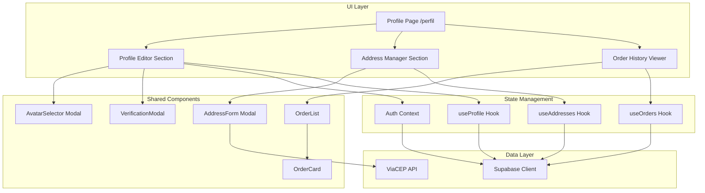

# Design Document: User Profile Page

## Overview

The User Profile Page is a comprehensive dashboard at `/perfil` that provides authenticated users with a unified interface to manage their personal information, delivery addresses, and view order history. This feature integrates existing profile components into a cohesive, feature-based architecture with clear separation of concerns.

The design follows a three-layer architecture:
- **UI Layer**: React components for presentation and user interaction
- **State Management Layer**: React hooks and context for data flow and optimistic updates
- **Data Access Layer**: Supabase client for database operations with RLS enforcement

Key design principles:
- **Optimistic UI updates** with rollback on failure for responsive user experience
- **Explicit state management** for loading, error, empty, and success states
- **Component reusability** leveraging existing AddressForm, AvatarSelector, OrderCard, OrderList, and VerificationModal
- **Security-first** approach with verification flows for sensitive data changes
- **Responsive design** adapting to mobile, tablet, and desktop viewports

## Architecture

### High-Level Architecture



### Feature-Based Architecture

The profile page is organized into three main feature sections:

1. **Profile Information Feature**
   - Display and edit user personal data (name, email, phone, CPF)
   - Avatar selection and upload
   - Verification flow for sensitive changes (email, CPF)

2. **Address Management Feature**
   - CRUD operations for delivery addresses
   - CEP lookup integration
   - Default address management
   - 5-address limit enforcement

3. **Order History Feature**
   - Read-only display of past orders
   - Order status visualization
   - Order details expansion
   - Tracking code display

### Data Flow

**Profile Update Flow (Optimistic)**:
```
User Edit → Optimistic UI Update → updateUser() → Supabase Update
                                                    ↓
                                              Success/Failure
                                                    ↓
                                    Success: Keep UI | Failure: Rollback UI
```

**Address CRUD Flow (Optimistic)**:
```
User Action → Optimistic UI Update → Supabase Operation → Success/Failure
                                                              ↓
                                              Success: Keep UI | Failure: Rollback + Error Toast
```

**Order History Flow (Read-Only)**:
```
Page Load → Loading State → Fetch Orders → Display OrderList
                                              ↓
                                    Empty State | Order Cards
```

## Components and Interfaces

### 1. ProfilePage Component

**Location**: `apps/web/src/app/perfil/page.tsx`

**Responsibilities**:
- Route protection (redirect unauthenticated users)
- Layout orchestration for three feature sections
- Responsive grid management

**Interface**:
```typescript
export default function ProfilePage(): JSX.Element
```

**State**:
- No local state (delegates to child components)

**Props**: None (server component with client children)

### 2. ProfileEditor Component

**Location**: `apps/web/src/components/profile/ProfileEditor.tsx` (new)

**Responsibilities**:
- Display user profile information
- Handle profile editing (name, phone, CPF)
- Trigger avatar selection modal
- Trigger verification modal for sensitive changes
- Optimistic UI updates with rollback

**Interface**:
```typescript
interface ProfileEditorProps {
  user: UserAuth;
  onUpdate: (data: Partial<UserAuth>) => Promise<void>;
}

export function ProfileEditor({ user, onUpdate }: ProfileEditorProps): JSX.Element
```

**State**:
```typescript
const [isEditing, setIsEditing] = useState(false);
const [formData, setFormData] = useState<Partial<UserAuth>>(user);
const [isAvatarModalOpen, setIsAvatarModalOpen] = useState(false);
const [isVerificationModalOpen, setIsVerificationModalOpen] = useState(false);
const [verificationType, setVerificationType] = useState<"EMAIL_UPDATE" | "TAXID_UPDATE" | null>(null);
const [isLoading, setIsLoading] = useState(false);
```

**Validation**:
- Phone: 10-11 digits, Brazilian format `(XX) XXXXX-XXXX`
- CPF: 11 digits with valid checksum algorithm

### 3. AddressManager Component

**Location**: `apps/web/src/components/profile/AddressManager.tsx` (new)

**Responsibilities**:
- Display list of user addresses
- Handle CRUD operations (Create, Read, Update, Delete)
- Manage default address selection
- Enforce 5-address limit
- Optimistic UI updates

**Interface**:
```typescript
interface AddressManagerProps {
  userId: string;
}

export function AddressManager({ userId }: AddressManagerProps): JSX.Element
```

**State**:
```typescript
const [addresses, setAddresses] = useState<Address[]>([]);
const [isLoading, setIsLoading] = useState(true);
const [isFormOpen, setIsFormOpen] = useState(false);
const [editingAddress, setEditingAddress] = useState<Address | null>(null);
const [isSubmitting, setIsSubmitting] = useState(false);
```

**Operations**:
- `handleCreate(data: AddressFormValues): Promise<void>`
- `handleUpdate(id: string, data: AddressFormValues): Promise<void>`
- `handleDelete(id: string): Promise<void>`
- `handleSetDefault(id: string): Promise<void>`

### 4. OrderHistoryViewer Component

**Location**: `apps/web/src/components/profile/OrderHistoryViewer.tsx` (new)

**Responsibilities**:
- Fetch and display user orders
- Handle loading and empty states
- Sort orders by creation date (newest first)

**Interface**:
```typescript
interface OrderHistoryViewerProps {
  userId: string;
}

export function OrderHistoryViewer({ userId }: OrderHistoryViewerProps): JSX.Element
```

**State**:
```typescript
const [orders, setOrders] = useState<Order[]>([]);
const [isLoading, setIsLoading] = useState(true);
```

### 5. Existing Components (Reused)

**AddressForm** (`apps/web/src/components/profile/AddressForm.tsx`):
- Already implements CEP lookup via ViaCEP
- Already has validation for all address fields
- Used for both create and edit modes

**AvatarSelector** (`apps/web/src/components/profile/AvatarSelector.tsx`):
- Already implements classic avatar selection
- Already implements custom image upload with compression
- Already validates image MIME types

**VerificationModal** (`apps/web/src/components/profile/VerificationModal.tsx`):
- Already implements 6-digit OTP input
- Already handles verification flow
- Needs integration with actual OTP sending service

**OrderCard** (`apps/web/src/components/profile/OrderCard.tsx`):
- Already implements expandable order details
- Already implements status badges and icons
- Already implements tracking code display

**OrderList** (`apps/web/src/components/profile/OrderList.tsx`):
- Already implements loading and empty states
- Already renders OrderCard components

## Data Models

### Database Schema

#### profiles Table
```sql
CREATE TABLE profiles (
  id UUID PRIMARY KEY REFERENCES auth.users(id) ON DELETE CASCADE,
  name TEXT,
  avatar_url TEXT,
  phone TEXT,
  tax_id TEXT,
  role TEXT DEFAULT 'customer',
  created_at TIMESTAMPTZ DEFAULT NOW(),
  updated_at TIMESTAMPTZ DEFAULT NOW()
);

-- RLS Policies
ALTER TABLE profiles ENABLE ROW LEVEL SECURITY;

CREATE POLICY "Users can read own profile"
  ON profiles FOR SELECT
  USING (auth.uid() = id);

CREATE POLICY "Users can update own profile"
  ON profiles FOR UPDATE
  USING (auth.uid() = id);
```

#### addresses Table
```sql
CREATE TABLE addresses (
  id UUID PRIMARY KEY DEFAULT gen_random_uuid(),
  user_id UUID NOT NULL REFERENCES auth.users(id) ON DELETE CASCADE,
  zip_code TEXT NOT NULL,
  street TEXT NOT NULL,
  number TEXT NOT NULL,
  complement TEXT,
  neighborhood TEXT NOT NULL,
  city TEXT NOT NULL,
  state TEXT NOT NULL,
  is_default BOOLEAN DEFAULT FALSE,
  created_at TIMESTAMPTZ DEFAULT NOW(),
  updated_at TIMESTAMPTZ DEFAULT NOW()
);

-- RLS Policies
ALTER TABLE addresses ENABLE ROW LEVEL SECURITY;

CREATE POLICY "Users can read own addresses"
  ON addresses FOR SELECT
  USING (auth.uid() = user_id);

CREATE POLICY "Users can create own addresses"
  ON addresses FOR INSERT
  WITH CHECK (auth.uid() = user_id);

CREATE POLICY "Users can update own addresses"
  ON addresses FOR UPDATE
  USING (auth.uid() = user_id);

CREATE POLICY "Users can delete own addresses"
  ON addresses FOR DELETE
  USING (auth.uid() = user_id);

-- Constraint: Only one default address per user
CREATE UNIQUE INDEX unique_default_address_per_user
  ON addresses (user_id)
  WHERE is_default = TRUE;
```

#### orders Table
```sql
CREATE TABLE orders (
  id UUID PRIMARY KEY DEFAULT gen_random_uuid(),
  user_id UUID NOT NULL REFERENCES auth.users(id) ON DELETE CASCADE,
  status TEXT NOT NULL CHECK (status IN ('PENDING', 'PAID', 'FAILED', 'SHIPPED', 'DELIVERED', 'CANCELLED')),
  total DECIMAL(10, 2) NOT NULL,
  payment_method TEXT,
  shipping_address_id UUID REFERENCES addresses(id),
  tracking_code TEXT,
  created_at TIMESTAMPTZ DEFAULT NOW(),
  updated_at TIMESTAMPTZ DEFAULT NOW()
);

-- RLS Policies
ALTER TABLE orders ENABLE ROW LEVEL SECURITY;

CREATE POLICY "Users can read own orders"
  ON orders FOR SELECT
  USING (auth.uid() = user_id);
```

#### order_items Table
```sql
CREATE TABLE order_items (
  id UUID PRIMARY KEY DEFAULT gen_random_uuid(),
  order_id UUID NOT NULL REFERENCES orders(id) ON DELETE CASCADE,
  product_id UUID NOT NULL REFERENCES products(id),
  quantity INTEGER NOT NULL CHECK (quantity > 0),
  unit_price DECIMAL(10, 2) NOT NULL,
  size TEXT,
  created_at TIMESTAMPTZ DEFAULT NOW()
);

-- RLS Policies
ALTER TABLE order_items ENABLE ROW LEVEL SECURITY;

CREATE POLICY "Users can read own order items"
  ON order_items FOR SELECT
  USING (
    EXISTS (
      SELECT 1 FROM orders
      WHERE orders.id = order_items.order_id
      AND orders.user_id = auth.uid()
    )
  );
```

### TypeScript Interfaces

```typescript
// User Profile
interface UserAuth {
  id: string;
  name: string;
  email: string;
  role?: string;
  avatarUrl?: string;
  taxId?: string;
  phone?: string;
}

// Address
interface Address {
  id: string;
  userId: string;
  zipCode: string;
  street: string;
  number: string;
  complement?: string;
  neighborhood: string;
  city: string;
  state: string;
  isDefault: boolean;
  createdAt: string;
  updatedAt: string;
}

// Order
type OrderStatus = 'PENDING' | 'PAID' | 'FAILED' | 'SHIPPED' | 'DELIVERED' | 'CANCELLED';

interface Order {
  id: string;
  userId: string;
  status: OrderStatus;
  total: number;
  paymentMethod?: string;
  shippingAddressId?: string;
  trackingCode?: string;
  createdAt: string;
  updatedAt: string;
  items?: OrderItem[];
}

// Order Item
interface OrderItem {
  id: string;
  orderId: string;
  productId: string;
  quantity: number;
  unitPrice: number;
  size?: string;
  createdAt: string;
  product?: {
    name: string;
    imageUrl?: string;
  };
}

// Address Form Values
interface AddressFormValues {
  zipCode: string;
  street: string;
  number: string;
  complement?: string;
  neighborhood: string;
  city: string;
  state: string;
  isDefault: boolean;
}

// ViaCEP Response
interface ViaCEPResponse {
  cep: string;
  logradouro: string;
  complemento: string;
  bairro: string;
  localidade: string;
  uf: string;
  erro?: boolean;
}
```

### External API Integration

**ViaCEP API**:
- Endpoint: `https://viacep.com.br/ws/{cep}/json/`
- Method: GET
- Response: JSON with address data
- Error handling: `{ erro: true }` when CEP not found
- Already integrated in AddressForm component


## Correctness Properties

*A property is a characteristic or behavior that should hold true across all valid executions of a system—essentially, a formal statement about what the system should do. Properties serve as the bridge between human-readable specifications and machine-verifiable correctness guarantees.*

### Property 1: Profile Data Placeholder Display

*For any* user profile with missing fields (name, phone, taxId, avatarUrl), the Profile_Page SHALL display placeholder text for each missing field.

**Validates: Requirements 1.5**

### Property 2: Phone Validation Correctness

*For any* string input, the phone validation SHALL accept strings with 10-11 digits in Brazilian format and reject all other formats.

**Validates: Requirements 2.6, 2.9**

### Property 3: CPF Validation Correctness

*For any* string input, the CPF validation SHALL accept strings with 11 digits and valid checksum and reject all other inputs.

**Validates: Requirements 2.7, 2.8**

### Property 4: Image Compression Application

*For any* uploaded image file, the Avatar_Upload SHALL apply compression using `compressImage()` before storing the avatar URL.

**Validates: Requirements 3.5**

### Property 5: File Type Validation

*For any* uploaded file, the Avatar_Upload SHALL accept only files with image MIME types (image/*) and reject all non-image files.

**Validates: Requirements 3.6**

### Property 6: Default Address Uniqueness

*For any* user, at most one address SHALL have `is_default = true` after any address operation (create, update, delete, set default).

**Validates: Requirements 4.6, 4.7**

### Property 7: Address Count Limit Enforcement

*For any* user, the Address_Manager SHALL prevent creating more than 5 addresses and display an error when the limit is reached.

**Validates: Requirements 4.8, 4.9**

### Property 8: ZIP Code Validation

*For any* string input, the zipCode validation SHALL accept only strings with exactly 8 digits and reject all other inputs.

**Validates: Requirements 5.4**

### Property 9: State Code Validation

*For any* string input, the state validation SHALL accept only strings with exactly 2 characters and reject all other inputs.

**Validates: Requirements 5.5**

### Property 10: Required Address Fields Validation

*For any* address form submission, the validation SHALL reject submissions where street, number, neighborhood, or city are empty or whitespace-only.

**Validates: Requirements 5.6**

### Property 11: Order Sorting Consistency

*For any* list of orders, the Order_History_Viewer SHALL sort them by creation date in descending order (newest first).

**Validates: Requirements 6.5**

### Property 12: Order Status Display Mapping

*For any* order with a valid Order_Status value (PENDING, PAID, FAILED, SHIPPED, DELIVERED, CANCELLED), the OrderCard SHALL display the correct status label, badge variant, icon, and description according to the status configuration.

**Validates: Requirements 6.9, 7.1, 7.8, 7.9**

## Error Handling

### Client-Side Error Handling

**Network Errors**:
- All Supabase operations wrapped in try-catch blocks
- Display user-friendly error toasts using `sonner`
- Provide retry buttons for failed operations
- Log errors to console for debugging

**Validation Errors**:
- Display inline error messages below form fields
- Prevent form submission until validation passes
- Use red border styling for invalid fields
- Show validation errors in real-time (on blur or change)

**Session Expiry**:
- Detect 401 Unauthorized responses from Supabase
- Redirect to `/login?redirect=/perfil` with session expired message
- Clear local state on session expiry
- Preserve form data in sessionStorage for recovery after re-login

**API Errors (ViaCEP)**:
- Timeout after 5 seconds
- Fallback to manual address entry if API fails
- Display warning toast: "CEP lookup unavailable, please enter address manually"
- Don't block form submission if API fails

### Optimistic Update Rollback

**Profile Updates**:
```typescript
const handleProfileUpdate = async (newData: Partial<UserAuth>) => {
  const previousData = { ...user };
  
  // Optimistic update
  setUser({ ...user, ...newData });
  
  try {
    await updateUser(newData);
    toast.success("Perfil atualizado com sucesso!");
  } catch (error) {
    // Rollback on failure
    setUser(previousData);
    toast.error("Erro ao atualizar perfil. Tente novamente.");
    console.error(error);
  }
};
```

**Address Operations**:
```typescript
const handleAddressCreate = async (data: AddressFormValues) => {
  const tempId = `temp-${Date.now()}`;
  const optimisticAddress = { ...data, id: tempId, userId: user.id };
  
  // Optimistic add
  setAddresses([...addresses, optimisticAddress]);
  
  try {
    const { data: newAddress } = await supabase
      .from('addresses')
      .insert(data)
      .select()
      .single();
    
    // Replace temp with real
    setAddresses(prev => 
      prev.map(addr => addr.id === tempId ? newAddress : addr)
    );
  } catch (error) {
    // Rollback on failure
    setAddresses(prev => prev.filter(addr => addr.id !== tempId));
    toast.error("Erro ao adicionar endereço.");
  }
};
```

### Edge Cases

**Empty States**:
- No addresses: Display empty state with "Add Address" CTA
- No orders: Display empty state with "Browse Products" CTA
- Missing profile fields: Display placeholder text (e.g., "Não informado")

**Boundary Conditions**:
- Exactly 5 addresses: Disable "Add Address" button, show limit message
- Single address: Allow deletion (no minimum requirement)
- Default address deletion: If deleted address was default, don't auto-assign new default

**Data Integrity**:
- Concurrent updates: Use Supabase's built-in optimistic locking
- Stale data: Refresh data after successful operations
- Orphaned references: Cascade deletes handled by database foreign keys

**File Upload Limits**:
- Max file size: 5MB (enforced client-side)
- Supported formats: JPEG, PNG, GIF, WebP
- Compression: Reduce to 400x400px at 80% quality
- Error message: "Imagem muito grande. Máximo 5MB."

## Testing Strategy

### Unit Testing

**Component Tests** (React Testing Library + Vitest):
- ProfileEditor: Form rendering, validation, edit mode toggle
- AddressManager: CRUD operations, modal state, empty states
- OrderHistoryViewer: Order display, sorting, empty states
- AddressForm: CEP lookup, validation, form submission
- AvatarSelector: Classic avatar selection, file upload, compression

**Hook Tests**:
- useProfile: Profile fetching, updating, error handling
- useAddresses: Address CRUD, default management, limit enforcement
- useOrders: Order fetching, sorting, loading states

**Validation Tests**:
- Phone validation: Valid/invalid formats
- CPF validation: Valid/invalid checksums
- Address validation: Required fields, format checks

### Property-Based Testing

**Library**: fast-check (TypeScript property-based testing)

**Configuration**: Minimum 100 iterations per property test

**Property Tests**:

1. **Profile Placeholder Display** (Property 1)
   ```typescript
   // Feature: user-profile-page, Property 1: Profile Data Placeholder Display
   fc.assert(
     fc.property(
       fc.record({
         id: fc.uuid(),
         email: fc.emailAddress(),
         name: fc.option(fc.string(), { nil: undefined }),
         phone: fc.option(fc.string(), { nil: undefined }),
         taxId: fc.option(fc.string(), { nil: undefined }),
         avatarUrl: fc.option(fc.webUrl(), { nil: undefined }),
       }),
       (profile) => {
         const { container } = render(<ProfileEditor user={profile} />);
         // Verify placeholders for missing fields
         if (!profile.name) expect(container).toHaveTextContent("Não informado");
         if (!profile.phone) expect(container).toHaveTextContent("Não informado");
         if (!profile.taxId) expect(container).toHaveTextContent("Não informado");
       }
     ),
     { numRuns: 100 }
   );
   ```

2. **Phone Validation** (Property 2)
   ```typescript
   // Feature: user-profile-page, Property 2: Phone Validation Correctness
   fc.assert(
     fc.property(
       fc.string(),
       (phoneInput) => {
         const isValid = validatePhone(phoneInput);
         const digitsOnly = phoneInput.replace(/\D/g, '');
         const expectedValid = digitsOnly.length >= 10 && digitsOnly.length <= 11;
         expect(isValid).toBe(expectedValid);
       }
     ),
     { numRuns: 100 }
   );
   ```

3. **CPF Validation** (Property 3)
   ```typescript
   // Feature: user-profile-page, Property 3: CPF Validation Correctness
   fc.assert(
     fc.property(
       fc.string(),
       (cpfInput) => {
         const isValid = validateCPF(cpfInput);
         // If valid, must have 11 digits and pass checksum
         if (isValid) {
           const digitsOnly = cpfInput.replace(/\D/g, '');
           expect(digitsOnly.length).toBe(11);
           expect(calculateCPFChecksum(digitsOnly)).toBe(true);
         }
       }
     ),
     { numRuns: 100 }
   );
   ```

4. **Image Compression** (Property 5)
   ```typescript
   // Feature: user-profile-page, Property 4: Image Compression Application
   fc.assert(
     fc.property(
       fc.record({
         name: fc.string(),
         size: fc.integer({ min: 1000, max: 10000000 }),
         type: fc.constantFrom('image/jpeg', 'image/png', 'image/gif'),
       }),
       async (fileProps) => {
         const file = new File([''], fileProps.name, { type: fileProps.type });
         const compressed = await compressImage(file);
         // Verify compression was applied (base64 data URL)
         expect(compressed).toMatch(/^data:image\/jpeg;base64,/);
       }
     ),
     { numRuns: 100 }
   );
   ```

5. **File Type Validation** (Property 5)
   ```typescript
   // Feature: user-profile-page, Property 5: File Type Validation
   fc.assert(
     fc.property(
       fc.record({
         name: fc.string(),
         type: fc.string(),
       }),
       (fileProps) => {
         const file = new File([''], fileProps.name, { type: fileProps.type });
         const isValid = validateImageFile(file);
         const expectedValid = fileProps.type.startsWith('image/');
         expect(isValid).toBe(expectedValid);
       }
     ),
     { numRuns: 100 }
   );
   ```

6. **Default Address Uniqueness** (Property 6)
   ```typescript
   // Feature: user-profile-page, Property 6: Default Address Uniqueness
   fc.assert(
     fc.property(
       fc.array(
         fc.record({
           id: fc.uuid(),
           userId: fc.uuid(),
           zipCode: fc.string({ minLength: 8, maxLength: 8 }),
           street: fc.string(),
           number: fc.string(),
           neighborhood: fc.string(),
           city: fc.string(),
           state: fc.string({ minLength: 2, maxLength: 2 }),
           isDefault: fc.boolean(),
         }),
         { minLength: 1, maxLength: 5 }
       ),
       async (addresses) => {
         // Simulate setting one as default
         const result = await setDefaultAddress(addresses, addresses[0].id);
         const defaultCount = result.filter(a => a.isDefault).length;
         expect(defaultCount).toBeLessThanOrEqual(1);
       }
     ),
     { numRuns: 100 }
   );
   ```

7. **Address Count Limit** (Property 7)
   ```typescript
   // Feature: user-profile-page, Property 7: Address Count Limit Enforcement
   fc.assert(
     fc.property(
       fc.array(
         fc.record({
           zipCode: fc.string({ minLength: 8, maxLength: 8 }),
           street: fc.string(),
           number: fc.string(),
           neighborhood: fc.string(),
           city: fc.string(),
           state: fc.string({ minLength: 2, maxLength: 2 }),
         }),
         { minLength: 5, maxLength: 10 }
       ),
       async (addressesToCreate) => {
         const userId = 'test-user';
         let createdCount = 0;
         let errorThrown = false;
         
         for (const addr of addressesToCreate) {
           try {
             await createAddress(userId, addr);
             createdCount++;
           } catch (error) {
             if (createdCount >= 5) {
               errorThrown = true;
               break;
             }
           }
         }
         
         expect(createdCount).toBeLessThanOrEqual(5);
         if (addressesToCreate.length > 5) {
           expect(errorThrown).toBe(true);
         }
       }
     ),
     { numRuns: 100 }
   );
   ```

8. **ZIP Code Validation** (Property 8)
   ```typescript
   // Feature: user-profile-page, Property 8: ZIP Code Validation
   fc.assert(
     fc.property(
       fc.string(),
       (zipInput) => {
         const isValid = validateZipCode(zipInput);
         const digitsOnly = zipInput.replace(/\D/g, '');
         const expectedValid = digitsOnly.length === 8;
         expect(isValid).toBe(expectedValid);
       }
     ),
     { numRuns: 100 }
   );
   ```

9. **State Code Validation** (Property 9)
   ```typescript
   // Feature: user-profile-page, Property 9: State Code Validation
   fc.assert(
     fc.property(
       fc.string(),
       (stateInput) => {
         const isValid = validateState(stateInput);
         const expectedValid = stateInput.length === 2;
         expect(isValid).toBe(expectedValid);
       }
     ),
     { numRuns: 100 }
   );
   ```

10. **Required Fields Validation** (Property 10)
    ```typescript
    // Feature: user-profile-page, Property 10: Required Address Fields Validation
    fc.assert(
      fc.property(
        fc.record({
          street: fc.option(fc.string(), { nil: '' }),
          number: fc.option(fc.string(), { nil: '' }),
          neighborhood: fc.option(fc.string(), { nil: '' }),
          city: fc.option(fc.string(), { nil: '' }),
        }),
        (addressData) => {
          const isValid = validateRequiredFields(addressData);
          const allFieldsFilled = 
            addressData.street?.trim() &&
            addressData.number?.trim() &&
            addressData.neighborhood?.trim() &&
            addressData.city?.trim();
          expect(isValid).toBe(!!allFieldsFilled);
        }
      ),
      { numRuns: 100 }
    );
    ```

11. **Order Sorting** (Property 11)
    ```typescript
    // Feature: user-profile-page, Property 11: Order Sorting Consistency
    fc.assert(
      fc.property(
        fc.array(
          fc.record({
            id: fc.uuid(),
            createdAt: fc.date(),
            total: fc.float({ min: 0, max: 10000 }),
            status: fc.constantFrom('PENDING', 'PAID', 'FAILED', 'SHIPPED', 'DELIVERED', 'CANCELLED'),
          }),
          { minLength: 2, maxLength: 20 }
        ),
        (orders) => {
          const sorted = sortOrdersByDate(orders);
          // Verify descending order (newest first)
          for (let i = 0; i < sorted.length - 1; i++) {
            expect(new Date(sorted[i].createdAt).getTime())
              .toBeGreaterThanOrEqual(new Date(sorted[i + 1].createdAt).getTime());
          }
        }
      ),
      { numRuns: 100 }
    );
    ```

12. **Order Status Display** (Property 12)
    ```typescript
    // Feature: user-profile-page, Property 12: Order Status Display Mapping
    fc.assert(
      fc.property(
        fc.constantFrom('PENDING', 'PAID', 'FAILED', 'SHIPPED', 'DELIVERED', 'CANCELLED'),
        (status) => {
          const order = { id: '1', status, total: 100, createdAt: new Date() };
          const { container } = render(<OrderCard order={order} />);
          
          const config = statusConfig[status];
          expect(container).toHaveTextContent(config.label);
          expect(container).toHaveTextContent(config.description);
          // Verify icon is rendered (check for icon class or test-id)
        }
      ),
      { numRuns: 100 }
    );
    ```

### Integration Testing

**Database Operations**:
- Profile CRUD with real Supabase client (test database)
- Address CRUD with RLS policy enforcement
- Order fetching with joins to order_items and products
- Default address switching with constraint validation

**Authentication Flow**:
- Redirect to login when unauthenticated
- Session expiry handling
- Profile data loading after login

**External API**:
- ViaCEP integration with real API (rate-limited)
- Fallback to manual entry on API failure
- Timeout handling

**RLS Policy Tests**:
- Verify users can only access their own data
- Attempt cross-user access and verify blocking
- Test all CRUD operations with RLS enabled

### End-to-End Testing

**User Flows** (Playwright or Cypress):
1. Login → Navigate to /perfil → View profile data
2. Edit profile → Update name and phone → Verify success toast
3. Add address → Fill form with CEP lookup → Save → Verify in list
4. Set default address → Verify previous default is unset
5. Delete address → Confirm → Verify removed from list
6. Upload avatar → Select file → Verify compression and update
7. View order history → Expand order → View details

### Performance Testing

**Metrics**:
- Page load time: < 2 seconds
- Profile update response: < 500ms
- Address list rendering: < 100ms for 5 addresses
- Order history rendering: < 200ms for 20 orders
- Image compression: < 1 second for 5MB image

**Optimization**:
- Lazy load OrderCard details (only render when expanded)
- Debounce CEP lookup (300ms delay)
- Memoize order sorting and status config lookups
- Use React.memo for OrderCard to prevent unnecessary re-renders

